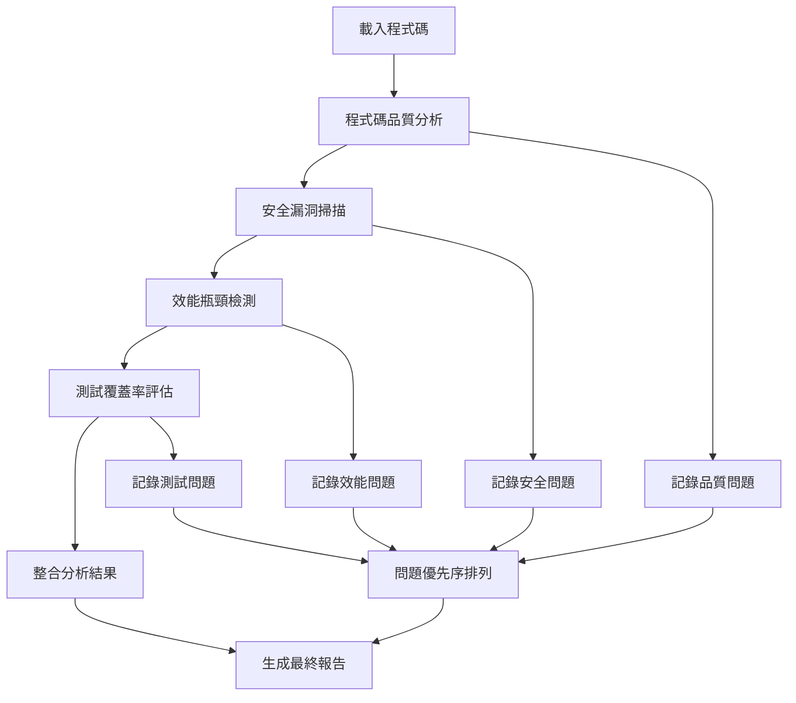

# 練習 1：多 Agent 協作流程設計與實作

## 🎯 練習目標

透過設計和實作一個完整的多 Agent 協作流程，深度理解：
- Agent 之間的協作模式和資料傳遞
- 不同專家 Agent 的最佳使用時機
- 複雜任務的分解與編排策略
- 錯誤處理和流程恢復機制

## 📊 練習概覽

- **練習類型**：實作導向
- **預計時間**：3-4 小時
- **難度等級**：進階
- **前置要求**：完成基礎級 B01-B05 情境

## 🎮 核心任務

### 主任務：設計「智能程式碼審查流程」

你需要設計一個智能程式碼審查流程，整合多個 Agent 協作完成：

1. **程式碼品質分析** (code-reviewer)
2. **安全漏洞掃描** (security-auditor)
3. **效能瓶頸檢測** (performance-analyzer)
4. **測試覆蓋率評估** (test-generator)
5. **最終報告整合** (general-purpose)

### 協作流程設計要求



## 📁 練習結構

```
練習1_多Agent協作流程/
├── README.md                    # 本練習說明
├── 起始專案/                     # 練習用的範例專案
│   ├── sample-nodejs-app/       # Node.js 範例專案
│   ├── sample-python-app/       # Python 範例專案
│   └── sample-react-app/        # React 範例專案
├── 參考解答/                     # 完整的實作範例
│   ├── agent-workflow.md        # Agent 協作流程文件
│   ├── execution-script.sh      # 執行腳本
│   └── output-samples/          # 輸出範例
└── 評量標準/                     # 自我評量清單
    ├── workflow-checklist.md    # 流程設計檢查清單
    └── quality-rubric.md        # 品質評量標準
```

## 🚀 練習步驟

### 第一階段：流程設計（60-90 分鐘）

#### 步驟 1：分析任務需求
選擇一個起始專案（建議從 Node.js 開始），分析需要什麼樣的 Agent 協作：

**思考問題**：
- 每個 Agent 負責什麼特定任務？
- Agent 之間如何傳遞資訊？
- 如何確保分析的完整性？
- 出現錯誤時如何處理？

#### 步驟 2：設計協作序列
```bash
claude
```

**設計提示詞**：
```
我要設計一個多 Agent 協作的程式碼審查流程。請幫我設計：

1. Agent 執行順序與依賴關係
2. 每個階段的輸入輸出定義
3. 錯誤處理和重試機制
4. 結果整合和報告生成策略
5. 流程的可配置參數

請提供具體的執行步驟和 Agent 切換時機。
```

#### 步驟 3：建立流程控制腳本
設計一個可重複執行的流程控制機制（可以是 shell script 或手動步驟清單）。

### 第二階段：實際執行（90-120 分鐘）

#### 步驟 4：載入測試專案
```bash
cd 起始專案/sample-nodejs-app
claude --add-dir ./src
claude --add-dir ./test
claude /context
```

#### 步驟 5：執行 Agent 協作流程

**階段 1：程式碼品質分析**
```bash
claude /agents:code-reviewer
```

**提示詞範本**：
```
請對這個 Node.js 專案進行程式碼品質分析：

分析重點：
1. 程式碼結構和架構問題
2. 命名規範和可讀性
3. 程式碼複雜度評估
4. 重複程式碼識別
5. 程式碼風格一致性

請提供：
- 具體問題列表（附檔案位置和行號）
- 嚴重程度分級（Critical/High/Medium/Low）
- 修復建議和優先序
- 整體品質評分（1-10分）

格式化輸出，便於後續 Agent 參考。
```

**階段 2：安全漏洞掃描**
```bash
claude /agents:security-auditor
```

**提示詞範本**：
```
基於前面程式碼品質分析的結果，請進行安全漏洞掃描：

掃描範圍：
1. 依賴套件安全性檢查
2. 輸入驗證和資料清理
3. 認證和授權機制
4. 敏感資料處理
5. SQL 注入和 XSS 風險

請提供：
- 安全問題清單（附 CVE 編號如適用）
- 風險等級評估（Critical/High/Medium/Low）
- 具體修復方案
- 安全評分（1-10分）

輸出格式要與程式碼品質分析保持一致。
```

**階段 3：效能瓶頸檢測**
```bash
claude /agents:performance-analyzer
```

**提示詞範本**：
```
基於前面的分析結果，請進行效能瓶頸檢測：

檢測重點：
1. 資料庫查詢優化機會
2. 記憶體使用和洩漏風險
3. 非同步處理改善點
4. 演算法複雜度分析
5. 快取機制改善建議

請提供：
- 效能問題列表（附預期改善幅度）
- 優化優先序建議
- 具體實作指引
- 效能評分（1-10分）

保持輸出格式一致性。
```

**階段 4：測試覆蓋率評估**
```bash
claude /agents:test-generator
```

**提示詞範本**：
```
基於前面三個階段的分析，請評估測試覆蓋率並提供測試建議：

評估範圍：
1. 現有測試案例分析
2. 測試覆蓋率評估
3. 關鍵路徑測試缺口
4. 邊界條件測試建議
5. 整合測試需求

請提供：
- 測試覆蓋率報告
- 缺失測試案例清單
- 具體測試程式碼範例
- 測試策略建議
- 測試品質評分（1-10分）

維持一致的輸出格式。
```

**階段 5：結果整合與報告生成**
```bash
claude /agents:general-purpose
```

**提示詞範本**：
```
請整合前面四個 Agent 的分析結果，生成綜合程式碼審查報告：

整合要求：
1. 問題優先序統一排列
2. 修復建議的相互影響分析
3. 整體改善路線圖
4. 資源需求和時程估算
5. 風險評估和緩解策略

報告結構：
- 執行摘要（包含總體評分）
- 各領域詳細分析
- 整合問題清單（按優先序）
- 改善建議和實作路線圖
- 後續追蹤建議

請使用專業的報告格式。
```

#### 步驟 6：流程記錄與改善
```bash
claude /memory
```

**提示詞**：
```
請記錄這次多 Agent 協作流程的經驗：

記錄重點：
1. 每個 Agent 的表現和適用性
2. Agent 切換時機的最佳實踐
3. 資訊傳遞的有效方法
4. 遇到的問題和解決方案
5. 流程改善建議

請總結為可重複使用的協作流程模板。
```

### 第三階段：流程優化（60 分鐘）

#### 步驟 7：錯誤處理機制設計
分析可能的失敗點並設計恢復機制：
- Agent 回應不完整時的處理
- 上下文超載的應對策略
- 分析結果衝突的解決方案

#### 步驟 8：流程自動化腳本
建立可重複執行的自動化腳本或詳細的操作手冊。

#### 步驟 9：品質驗證測試
在另一個起始專案上測試你的流程，驗證其可重複性和有效性。

## ✅ 成果檢核

### 必備產出
- [ ] **協作流程設計文件**（包含 Agent 序列和依賴）
- [ ] **完整的審查報告**（整合所有 Agent 分析結果）
- [ ] **執行腳本或操作手冊**（可重複執行）
- [ ] **錯誤處理機制**（異常情況應對方案）
- [ ] **流程改善建議**（基於實際執行經驗）

### 品質標準
- [ ] 流程涵蓋程式碼品質、安全、效能、測試四個面向
- [ ] Agent 協作順序邏輯合理，資訊傳遞有效
- [ ] 最終報告整合度高，優先序清晰
- [ ] 流程具備可重複性和可擴展性
- [ ] 執行時間在合理範圍內（3-4小時包含學習時間）

### 進階指標
- [ ] **創新協作模式**：設計出獨特的 Agent 協作方式
- [ ] **自動化程度**：減少手動操作，提高執行效率
- [ ] **錯誤恢復能力**：能處理常見的執行問題
- [ ] **可配置性**：能根據不同專案調整流程參數

## 🚀 進階挑戰

### 挑戰 1：並行協作設計
設計能並行執行的 Agent 協作流程：
- 識別可並行執行的分析任務
- 設計結果同步和整合機制
- 處理並行執行的複雜度

### 挑戰 2：自適應流程
設計能根據專案特性自動調整的流程：
- 根據程式語言選擇不同的分析重點
- 根據專案規模調整分析深度
- 根據歷史結果優化 Agent 選擇

### 挑戰 3：企業級整合
將流程整合到 CI/CD 管線：
- 設計自動觸發機制
- 整合現有開發工具
- 建立品質門檻和自動決策

## 💡 實戰技巧

### Agent 協作最佳實踐
1. **清晰的角色定義**：確保每個 Agent 有明確的責任邊界
2. **結構化的資訊傳遞**：使用一致的格式便於後續 Agent 理解
3. **漸進式的複雜度**：從簡單協作開始，逐步增加複雜度

### 流程設計原則
1. **容錯設計**：假設某些步驟可能失敗，準備備選方案
2. **可觀測性**：確保每個步驟的進度和結果都能被追蹤
3. **可維護性**：設計易於修改和擴展的流程結構

### 效率優化策略
1. **上下文管理**：適時使用 /compact 避免上下文超載
2. **批次處理**：將相似的任務合併處理提高效率
3. **結果快取**：對不變的分析結果進行快取避免重複計算

## 🔗 學習資源

### 延伸閱讀
- [Agent Design Patterns](../參考解答/agent-patterns.md)
- [Workflow Orchestration Best Practices](../參考解答/workflow-best-practices.md)

### 相關情境
- **B01-B05**：單一 Agent 使用（前置基礎）
- **C01, C03**：複雜任務的 Agent 應用
- **E02**：企業級 Agent 系統設計

---

**練習設計者**：AI 編程課程開發團隊
**最後更新**：2025年1月
**預估完成時間**：3-4 小時
**適用程度**：進階學習者