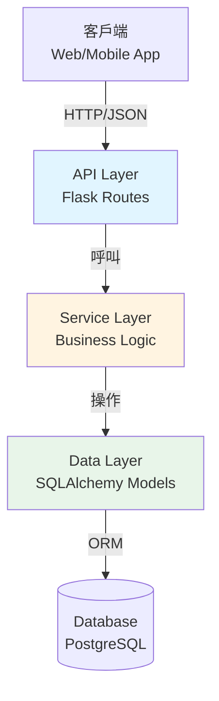
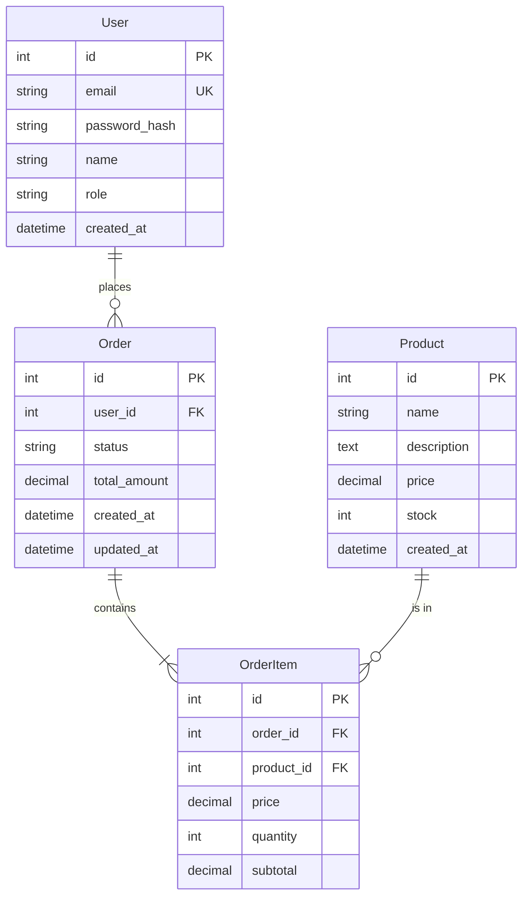
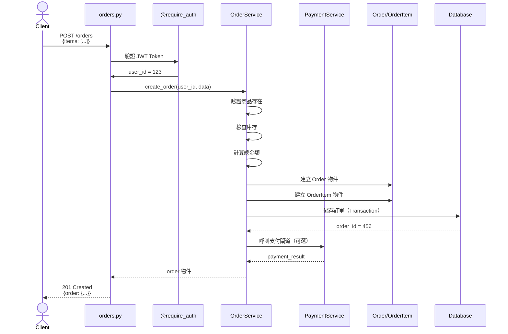
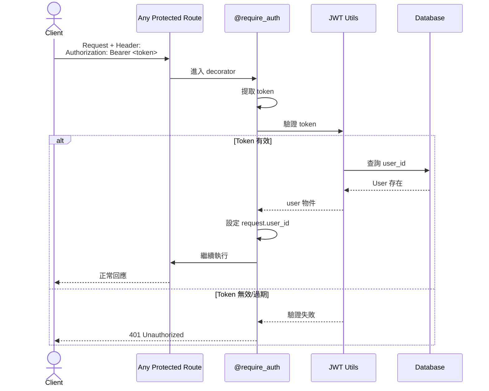
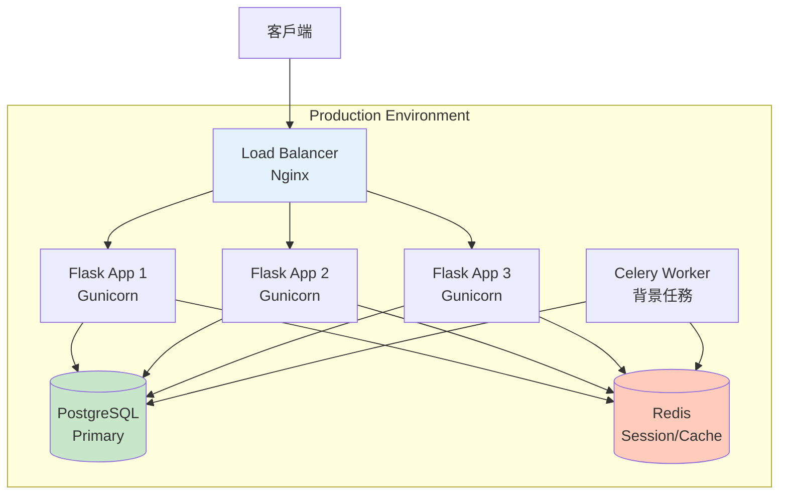

# C03：自動化文檔生成（組合級）

## 情境資訊

**編號**：C03
**難度**：⭐⭐⭐☆☆（組合級）
**預計時間**：2 小時
**學習目標**：
- 掌握從代碼自動生成多類型文檔的流程
- 學會使用 /glob 與 /grep 系統化探索代碼庫
- 理解 technical-writer agent 的深度應用
- 建立文檔生成的可復用工作流

**適用對象**：
- 需要為無文檔或文檔不全的專案補充文檔
- 負責維護開源專案文檔
- 需要產出多種格式文檔（API docs, 架構圖, 使用手冊）

---

## 情境描述

### 背景

你剛加入一家新創公司，被分配維護一個關鍵的內部服務。問題是：前任開發者離職時沒有留下任何文檔。你手上只有程式碼，但需要快速產出完整文檔給新加入的團隊成員。

### 專案概況

一個 Python Flask API 服務，處理用戶資料與訂單管理。專案結構：

```
order-service/
├── app/
│   ├── __init__.py
│   ├── models/
│   │   ├── user.py
│   │   ├── order.py
│   │   └── product.py
│   ├── routes/
│   │   ├── auth.py
│   │   ├── orders.py
│   │   └── users.py
│   ├── services/
│   │   ├── auth_service.py
│   │   ├── order_service.py
│   │   └── payment_service.py
│   └── utils/
│       ├── validators.py
│       └── decorators.py
├── tests/
│   └── test_orders.py
├── config.py
├── requirements.txt
└── README.md  # 只有一行："Order Service"
```

### 代碼範例（部分）

```python
# app/routes/orders.py
from flask import Blueprint, request, jsonify
from app.services.order_service import OrderService
from app.utils.decorators import require_auth, require_role

orders_bp = Blueprint('orders', __name__)
order_service = OrderService()

@orders_bp.route('/orders', methods=['GET'])
@require_auth
def get_orders():
    """Get user orders"""
    user_id = request.user_id
    page = request.args.get('page', 1, type=int)
    limit = request.args.get('limit', 10, type=int)

    orders = order_service.get_user_orders(user_id, page, limit)
    return jsonify({
        'orders': [o.to_dict() for o in orders],
        'page': page,
        'total': order_service.count_user_orders(user_id)
    })

@orders_bp.route('/orders', methods=['POST'])
@require_auth
def create_order():
    """Create a new order"""
    data = request.get_json()
    user_id = request.user_id

    try:
        order = order_service.create_order(user_id, data)
        return jsonify(order.to_dict()), 201
    except ValueError as e:
        return jsonify({'error': str(e)}), 400

@orders_bp.route('/orders/<int:order_id>', methods=['GET'])
@require_auth
def get_order(order_id):
    """Get order details"""
    order = order_service.get_order(order_id)
    if not order:
        return jsonify({'error': 'Order not found'}), 404

    # Check ownership
    if order.user_id != request.user_id:
        return jsonify({'error': 'Forbidden'}), 403

    return jsonify(order.to_dict())

@orders_bp.route('/orders/<int:order_id>/cancel', methods=['POST'])
@require_auth
@require_role('customer', 'admin')
def cancel_order(order_id):
    """Cancel an order"""
    try:
        order = order_service.cancel_order(order_id, request.user_id)
        return jsonify(order.to_dict())
    except PermissionError as e:
        return jsonify({'error': str(e)}), 403
    except ValueError as e:
        return jsonify({'error': str(e)}), 400

# app/models/order.py
from datetime import datetime
from app import db

class Order(db.Model):
    __tablename__ = 'orders'

    id = db.Column(db.Integer, primary_key=True)
    user_id = db.Column(db.Integer, db.ForeignKey('users.id'), nullable=False)
    status = db.Column(db.String(20), default='pending')  # pending, confirmed, shipping, delivered, cancelled
    total_amount = db.Column(db.Numeric(10, 2), nullable=False)
    created_at = db.Column(db.DateTime, default=datetime.utcnow)
    updated_at = db.Column(db.DateTime, default=datetime.utcnow, onupdate=datetime.utcnow)

    items = db.relationship('OrderItem', backref='order', lazy=True)
    user = db.relationship('User', backref='orders')

    def to_dict(self):
        return {
            'id': self.id,
            'user_id': self.user_id,
            'status': self.status,
            'total_amount': float(self.total_amount),
            'items': [item.to_dict() for item in self.items],
            'created_at': self.created_at.isoformat(),
            'updated_at': self.updated_at.isoformat()
        }

    def can_cancel(self):
        """Check if order can be cancelled"""
        return self.status in ['pending', 'confirmed']
```

### 你的任務

使用 Claude Code AI Agent 平台，為這個專案生成完整文檔，包含：

1. **API 文檔**：所有端點的完整說明（OpenAPI/Swagger 格式）
2. **架構文檔**：系統架構圖、資料模型、流程圖
3. **使用手冊**：給新開發者的快速上手指南
4. **部署文檔**：環境設定、部署步驟

---

## 學習重點

### 目標 1：系統化代碼探索

學會使用 `/glob` 與 `/grep` 組合，快速理解未知代碼庫：
- 找出所有路由檔案
- 識別所有 API 端點
- 發現資料模型關聯
- 理解業務流程

### 目標 2：多層次文檔生成

理解不同文檔的目標受眾與撰寫方式：
- **API 文檔**：給前端/第三方開發者，需精確
- **架構文檔**：給技術主管/架構師，需高層次視角
- **使用手冊**：給新人，需逐步引導
- **部署文檔**：給 DevOps，需操作步驟

### 目標 3：利用 technical-writer agent

學會提供正確的 context 讓 AI 生成高品質文檔：
- 提供代碼結構
- 說明業務背景
- 指定目標讀者
- 定義文檔格式

### 目標 4：建立可復用流程

沉澱成可應用到任何專案的文檔生成 SOP。

---

## 建議解決流程

### 階段一：代碼庫結構分析（30 分鐘）

**目標**：全面理解專案結構與關鍵組件

#### 步驟 1：探索專案結構

```bash
# 列出所有 Python 檔案
/glob **/*.py

# 找出所有路由定義
/grep "Blueprint\(" --type py -n

# 找出所有資料模型
/grep "class.*\(db\.Model\)" --type py -n

# 找出所有 API 端點
/grep "@.*\.route\(" --type py -n -A 2
```

**預期輸出**：

```
# /glob 輸出
app/__init__.py
app/models/user.py
app/models/order.py
app/models/product.py
app/routes/auth.py
app/routes/orders.py
app/routes/users.py
...

# Blueprint 搜尋結果
app/routes/auth.py:5:auth_bp = Blueprint('auth', __name__)
app/routes/orders.py:5:orders_bp = Blueprint('orders', __name__)
app/routes/users.py:5:users_bp = Blueprint('users', __name__)

# 資料模型
app/models/user.py:6:class User(db.Model):
app/models/order.py:8:class Order(db.Model):
app/models/product.py:5:class Product(db.Model):
app/models/order.py:25:class OrderItem(db.Model):

# API 端點（部分）
app/routes/orders.py:8:@orders_bp.route('/orders', methods=['GET'])
app/routes/orders.py:9:@require_auth
app/routes/orders.py:10:def get_orders():
--
app/routes/orders.py:20:@orders_bp.route('/orders', methods=['POST'])
app/routes/orders.py:21:@require_auth
app/routes/orders.py:22:def create_order():
```

**自然學到的技巧**：
- `/glob` 用於找檔案，`/grep` 用於找內容
- 使用 `-A 2` 可以看到裝飾器與函數的關聯
- 組合多次搜尋可以建立專案的心智地圖

#### 步驟 2：深入理解關鍵模組

```bash
# 讀取所有模型定義
/read app/models/user.py
/read app/models/order.py
/read app/models/product.py

# 讀取所有路由
/read app/routes/orders.py
/read app/routes/users.py
/read app/routes/auth.py

# 理解業務邏輯
/read app/services/order_service.py
```

**記憶點**：
```bash
/memory save

主題：快速理解未知代碼庫的探索流程

Step 1: 結構探索
- /glob **/*.py → 列出所有檔案
- /glob **/test_*.py → 找出測試檔案
- 理解目錄組織：models, routes, services 分層

Step 2: 關鍵組件識別
- /grep "class.*\(db.Model\)" → 找資料模型
- /grep "Blueprint\(" → 找路由模組
- /grep "@.*\.route\(" → 找 API 端點

Step 3: 關聯分析
- /grep "ForeignKey" → 理解資料關聯
- /grep "import.*from app" → 理解模組依賴
- /read 關鍵檔案 → 深入理解邏輯

輸出：專案結構心智地圖

相關指令：/glob, /grep, /read
```

---

### 階段二：生成 API 文檔（30 分鐘）

**目標**：產出符合 OpenAPI 3.0 規範的 API 文檔

```bash
# 切換到技術寫作專家
/agents:technical-writer

# 提供撰寫指令
請基於 app/routes/orders.py 中的路由定義，生成 OpenAPI 3.0 格式的 API 文檔。

背景資訊：
- 這是一個訂單管理服務
- 需要 JWT token 認證（透過 @require_auth）
- 資料模型見 app/models/order.py

要求：
1. 包含所有端點（GET/POST 等）
2. 詳細的請求/回應範例
3. 錯誤碼說明
4. 認證方式說明
5. 使用 YAML 格式

目標讀者：前端開發者與第三方 API 使用者
```

**預期輸出**：

```yaml
# docs/api/orders.yaml

openapi: 3.0.0
info:
  title: Order Service API
  description: |
    訂單管理服務 API 文檔

    ## 認證
    所有端點都需要 JWT Token 認證。在請求標頭中包含：
    ```
    Authorization: Bearer <your-jwt-token>
    ```

  version: 1.0.0
  contact:
    name: API Support
    email: api@example.com

servers:
  - url: https://api.example.com/v1
    description: Production
  - url: https://staging-api.example.com/v1
    description: Staging

tags:
  - name: Orders
    description: 訂單管理相關操作

paths:
  /orders:
    get:
      summary: 取得使用者訂單列表
      description: |
        取得當前登入使用者的訂單列表，支援分頁。

        **權限要求**：已認證使用者
      tags:
        - Orders
      security:
        - BearerAuth: []
      parameters:
        - name: page
          in: query
          description: 頁碼（從 1 開始）
          required: false
          schema:
            type: integer
            default: 1
            minimum: 1
        - name: limit
          in: query
          description: 每頁筆數
          required: false
          schema:
            type: integer
            default: 10
            minimum: 1
            maximum: 100
      responses:
        '200':
          description: 成功取得訂單列表
          content:
            application/json:
              schema:
                type: object
                properties:
                  orders:
                    type: array
                    items:
                      $ref: '#/components/schemas/Order'
                  page:
                    type: integer
                    example: 1
                  total:
                    type: integer
                    description: 總訂單數
                    example: 42
              example:
                orders:
                  - id: 123
                    user_id: 456
                    status: "confirmed"
                    total_amount: 1599.99
                    items:
                      - product_id: 1
                        name: "MacBook Pro"
                        price: 1599.99
                        quantity: 1
                    created_at: "2025-01-15T10:30:00Z"
                    updated_at: "2025-01-15T10:30:00Z"
                page: 1
                total: 42
        '401':
          $ref: '#/components/responses/Unauthorized'

    post:
      summary: 建立新訂單
      description: |
        為當前使用者建立新訂單。

        **權限要求**：已認證使用者

        **業務規則**：
        - 訂單金額必須 > 0
        - 商品必須存在且有庫存
        - 自動計算總金額
      tags:
        - Orders
      security:
        - BearerAuth: []
      requestBody:
        required: true
        content:
          application/json:
            schema:
              type: object
              required:
                - items
              properties:
                items:
                  type: array
                  items:
                    type: object
                    required:
                      - product_id
                      - quantity
                    properties:
                      product_id:
                        type: integer
                        example: 1
                      quantity:
                        type: integer
                        minimum: 1
                        example: 2
                shipping_address:
                  type: string
                  example: "台北市信義區信義路五段7號"
            example:
              items:
                - product_id: 1
                  quantity: 2
                - product_id: 5
                  quantity: 1
              shipping_address: "台北市信義區信義路五段7號"
      responses:
        '201':
          description: 訂單建立成功
          content:
            application/json:
              schema:
                $ref: '#/components/schemas/Order'
        '400':
          description: 請求資料無效
          content:
            application/json:
              schema:
                $ref: '#/components/schemas/Error'
              examples:
                invalid_product:
                  summary: 商品不存在
                  value:
                    error: "Product not found: 999"
                insufficient_stock:
                  summary: 庫存不足
                  value:
                    error: "Insufficient stock for product: MacBook Pro"
        '401':
          $ref: '#/components/responses/Unauthorized'

  /orders/{order_id}:
    get:
      summary: 取得訂單詳情
      description: |
        取得指定訂單的詳細資訊。

        **權限要求**：
        - 訂單擁有者
        - 或管理員
      tags:
        - Orders
      security:
        - BearerAuth: []
      parameters:
        - name: order_id
          in: path
          required: true
          description: 訂單 ID
          schema:
            type: integer
            example: 123
      responses:
        '200':
          description: 成功取得訂單
          content:
            application/json:
              schema:
                $ref: '#/components/schemas/Order'
        '403':
          description: 無權限存取此訂單
          content:
            application/json:
              schema:
                $ref: '#/components/schemas/Error'
              example:
                error: "Forbidden"
        '404':
          description: 訂單不存在
          content:
            application/json:
              schema:
                $ref: '#/components/schemas/Error'
              example:
                error: "Order not found"
        '401':
          $ref: '#/components/responses/Unauthorized'

  /orders/{order_id}/cancel:
    post:
      summary: 取消訂單
      description: |
        取消指定的訂單。

        **權限要求**：customer 或 admin 角色

        **業務規則**：
        - 只有狀態為 pending 或 confirmed 的訂單可以取消
        - 已出貨或已完成的訂單無法取消
      tags:
        - Orders
      security:
        - BearerAuth: []
      parameters:
        - name: order_id
          in: path
          required: true
          description: 訂單 ID
          schema:
            type: integer
      responses:
        '200':
          description: 訂單已取消
          content:
            application/json:
              schema:
                $ref: '#/components/schemas/Order'
              example:
                id: 123
                status: "cancelled"
                total_amount: 1599.99
        '400':
          description: 訂單狀態不允許取消
          content:
            application/json:
              schema:
                $ref: '#/components/schemas/Error'
              example:
                error: "Cannot cancel order in 'delivered' status"
        '403':
          $ref: '#/components/responses/Forbidden'
        '401':
          $ref: '#/components/responses/Unauthorized'

components:
  securitySchemes:
    BearerAuth:
      type: http
      scheme: bearer
      bearerFormat: JWT
      description: |
        使用 JWT Token 進行認證。
        取得方式：POST /auth/login

  schemas:
    Order:
      type: object
      properties:
        id:
          type: integer
          description: 訂單 ID
          example: 123
        user_id:
          type: integer
          description: 使用者 ID
          example: 456
        status:
          type: string
          enum: [pending, confirmed, shipping, delivered, cancelled]
          description: 訂單狀態
          example: "confirmed"
        total_amount:
          type: number
          format: float
          description: 訂單總金額
          example: 1599.99
        items:
          type: array
          description: 訂單商品項目
          items:
            $ref: '#/components/schemas/OrderItem'
        created_at:
          type: string
          format: date-time
          description: 建立時間
        updated_at:
          type: string
          format: date-time
          description: 最後更新時間

    OrderItem:
      type: object
      properties:
        product_id:
          type: integer
          example: 1
        name:
          type: string
          example: "MacBook Pro"
        price:
          type: number
          format: float
          example: 1599.99
        quantity:
          type: integer
          minimum: 1
          example: 1

    Error:
      type: object
      properties:
        error:
          type: string
          description: 錯誤訊息

  responses:
    Unauthorized:
      description: 未認證或 Token 無效
      content:
        application/json:
          schema:
            $ref: '#/components/schemas/Error'
          example:
            error: "Authentication required"

    Forbidden:
      description: 無權限執行此操作
      content:
        application/json:
          schema:
            $ref: '#/components/schemas/Error'
          example:
            error: "Permission denied"
```

**指定輸出格式**：
```bash
# 將文檔儲存為檔案
請將以上 OpenAPI 文檔寫入 docs/api/orders.yaml
```

**自然學到的文檔技巧**：
- OpenAPI 格式的結構（info, paths, components）
- 如何撰寫清晰的 description
- 錯誤情境的完整涵蓋
- 範例資料的重要性

---

### 階段三：生成架構文檔（30 分鐘）

**目標**：產出系統架構圖與資料模型文檔

```bash
# 繼續使用 technical-writer，加上 architect 協助
/agents:architect

請基於以下資訊，生成系統架構文檔：

**專案結構**：
- models/: 資料模型（User, Order, Product, OrderItem）
- routes/: API 路由（auth, orders, users）
- services/: 業務邏輯（order_service, payment_service）
- utils/: 工具（decorators, validators）

**資料模型關聯**：
- User 1:N Order
- Order 1:N OrderItem
- OrderItem N:1 Product

**認證機制**：
- JWT Token（透過 @require_auth decorator）
- 角色權限（@require_role decorator）

要求：
1. 系統架構圖（使用 Mermaid 語法）
2. 資料模型 ER 圖（Mermaid）
3. API 請求流程圖（以訂單建立為例）
4. 分層架構說明

格式：Markdown + Mermaid diagrams
```

**預期輸出**：

````markdown
# 系統架構文檔

## 1. 總體架構

### 1.1 分層架構

本系統採用三層架構設計：



**各層職責**：

- **API Layer（routes/）**
  - 處理 HTTP 請求/回應
  - 參數驗證
  - 認證授權（透過 decorators）
  - 回傳 JSON 格式資料

- **Service Layer（services/）**
  - 業務邏輯實作
  - 跨模型操作協調
  - 第三方服務整合（如支付閘道）
  - 異常處理

- **Data Layer（models/）**
  - 資料模型定義
  - 資料庫關聯
  - 資料驗證
  - 序列化/反序列化

### 1.2 關鍵組件

```mermaid
graph LR
    subgraph "Routes"
        AuthR[auth.py]
        OrderR[orders.py]
        UserR[users.py]
    end

    subgraph "Services"
        AuthS[auth_service.py]
        OrderS[order_service.py]
        PaymentS[payment_service.py]
    end

    subgraph "Models"
        UserM[User]
        OrderM[Order]
        ProductM[Product]
        OrderItemM[OrderItem]
    end

    subgraph "Utils"
        Dec[decorators.py<br/>@require_auth<br/>@require_role]
        Val[validators.py]
    end

    OrderR --> OrderS
    OrderS --> OrderM
    OrderS --> OrderItemM
    OrderS --> PaymentS

    OrderR -.使用.-> Dec
    OrderR -.使用.-> Val

    style OrderR fill:#ffcdd2
    style OrderS fill:#fff9c4
    style OrderM fill:#c8e6c9
```

## 2. 資料模型

### 2.1 ER 圖



### 2.2 資料模型說明

#### User（使用者）
- **職責**：儲存使用者基本資訊與認證資料
- **關聯**：一個使用者可以有多個訂單
- **關鍵欄位**：
  - `role`: 'customer', 'admin'（用於權限控制）
  - `password_hash`: bcrypt 加密後的密碼

#### Order（訂單）
- **職責**：訂單主記錄
- **狀態流轉**：
  ```
  pending → confirmed → shipping → delivered
                ↓
            cancelled
  ```
- **業務規則**：
  - 只有 `pending` 和 `confirmed` 狀態可以取消
  - `total_amount` 由所有 OrderItem 的 subtotal 加總

#### OrderItem（訂單項目）
- **職責**：訂單的商品明細
- **關鍵欄位**：
  - `price`: 下單時的商品價格（快照）
  - `subtotal`: price × quantity

#### Product（商品）
- **職責**：商品資訊與庫存管理
- **業務規則**：
  - 下單時需檢查 `stock >= quantity`
  - 訂單確認後扣減庫存

## 3. API 請求流程

### 3.1 訂單建立流程



### 3.2 認證流程



## 4. 部署架構



## 5. 技術棧

### 後端框架
- **Flask 2.3+**: Web 框架
- **SQLAlchemy 2.0+**: ORM
- **Flask-JWT-Extended**: JWT 認證
- **Marshmallow**: 資料驗證與序列化

### 資料庫
- **PostgreSQL 14+**: 主資料庫
- **Redis 7+**: Session 儲存與快取

### 部署
- **Gunicorn**: WSGI Server
- **Nginx**: 反向代理與負載平衡
- **Docker**: 容器化部署
- **Docker Compose**: 本地開發環境

## 6. 安全機制

### 認證與授權
```python
# 認證流程
@require_auth  # 檢查 JWT Token
def protected_route():
    user_id = request.user_id  # 從 token 解析

# 角色權限
@require_role('admin')  # 只允許 admin 存取
def admin_only_route():
    pass
```

### 資料驗證
- 所有輸入經過 validators 驗證
- SQLAlchemy 模型層驗證
- 業務邏輯層二次驗證

### 資料庫安全
- 使用 ORM 防止 SQL Injection
- 最小權限原則（資料庫帳號）
- 密碼使用 bcrypt 加密

---

**文檔版本**: 1.0
**最後更新**: 2025-01-15
````

**記憶沉澱**：
```bash
/memory save

主題：架構文檔生成最佳實踐

Mermaid 圖表類型選擇：
- graph TD/LR: 系統架構圖、組件關係圖
- sequenceDiagram: API 請求流程、認證流程
- erDiagram: 資料模型關聯
- flowchart: 狀態機、決策流程

架構文檔必備內容：
1. 總體架構圖（分層）
2. 資料模型 ER 圖
3. 關鍵流程的 Sequence Diagram
4. 部署架構圖
5. 技術棧清單
6. 安全機制說明

撰寫技巧：
- 使用圖表 > 純文字描述
- 每個圖表附上文字說明
- 標註關鍵決策點
- 說明「為什麼」而非只有「是什麼」

相關 Agent: architect, technical-writer
相關工具: Mermaid, PlantUML
```

---

### 階段四：生成使用手冊與部署文檔（30 分鐘）

**目標**：給新開發者的完整上手指南

```bash
# 切換回 technical-writer
/agents:technical-writer

# 設定輸出風格為教學文檔
/output-style:tutorial

請生成兩份文檔：

1. **開發者快速上手指南**（GETTING_STARTED.md）
   - 環境設定
   - 本地開發流程
   - 常見開發任務（新增 API、新增資料模型）
   - 測試與除錯
   - 目標讀者：剛加入的後端開發者

2. **部署文檔**（DEPLOYMENT.md）
   - 環境需求
   - 設定檔說明
   - 部署步驟（Docker）
   - 常見問題排除
   - 目標讀者：DevOps 工程師

要求：
- 逐步引導，包含可執行的指令
- 每個步驟說明「為什麼」
- 包含常見錯誤與解決方案
```

**預期輸出（部分）**：

```markdown
# 開發者快速上手指南

## 歡迎加入！

本指南將協助你在 30 分鐘內完成環境設定，並開始開發。

## 前置需求

確認你的開發環境已安裝：
- Python 3.10+
- Docker Desktop
- Git
- IDE（推薦 VS Code）

## 步驟一：Clone 專案（2 分鐘）

```bash
# Clone 專案
git clone https://github.com/your-org/order-service.git
cd order-service

# 建立 Python 虛擬環境
python -m venv venv

# 啟動虛擬環境
# macOS/Linux:
source venv/bin/activate
# Windows:
venv\Scripts\activate

# 安裝依賴
pip install -r requirements.txt
pip install -r requirements-dev.txt  # 開發工具
```

**為什麼使用虛擬環境？**
避免不同專案的套件版本衝突，保持環境乾淨。

## 步驟二：啟動資料庫（5 分鐘）

```bash
# 使用 Docker Compose 啟動 PostgreSQL 和 Redis
docker-compose up -d postgres redis

# 驗證資料庫已啟動
docker-compose ps

# 應該看到：
# order-service_postgres_1   Up   5432/tcp
# order-service_redis_1      Up   6379/tcp
```

**常見問題**：
- 如果 port 5432 已被占用，修改 `docker-compose.yml` 中的 port mapping
- Windows 使用者需確保 Docker Desktop 已啟動

## 步驟三：初始化資料庫（3 分鐘）

```bash
# 執行 migration（建立資料表）
flask db upgrade

# 載入測試資料
python scripts/seed_data.py

# 驗證資料
flask shell
>>> from app.models import User, Product
>>> User.query.count()
5  # 應該有 5 個測試使用者
>>> Product.query.count()
10  # 應該有 10 個測試商品
```

**這些指令做了什麼？**
- `flask db upgrade`: 執行 Alembic migrations，建立資料表
- `seed_data.py`: 插入測試用的使用者與商品資料

## 步驟四：啟動開發伺服器（2 分鐘）

```bash
# 設定環境變數
export FLASK_APP=app
export FLASK_ENV=development

# 啟動伺服器
flask run

# 應該看到：
#  * Running on http://127.0.0.1:5000
```

## 步驟五：驗證安裝（5 分鐘）

### 5.1 測試 API

```bash
# 測試健康檢查端點
curl http://localhost:5000/health

# 應該回傳：
# {"status": "healthy"}

# 登入取得 JWT Token
curl -X POST http://localhost:5000/auth/login \
  -H "Content-Type: application/json" \
  -d '{"email": "test@example.com", "password": "password123"}'

# 複製回傳的 token
# {"access_token": "eyJ0eXAiOiJKV1QiLCJhbGc..."}
```

### 5.2 呼叫受保護的 API

```bash
# 設定 token（替換為你的 token）
export TOKEN="eyJ0eXAiOiJKV1QiLCJhbGc..."

# 取得訂單列表
curl http://localhost:5000/orders \
  -H "Authorization: Bearer $TOKEN"
```

### 5.3 執行測試

```bash
# 執行所有測試
pytest

# 執行特定測試檔案
pytest tests/test_orders.py

# 檢查測試覆蓋率
pytest --cov=app --cov-report=html
# 開啟 htmlcov/index.html 查看詳細報告
```

## 常見開發任務

### 任務 1：新增一個 API 端點

假設要新增「取得訂單統計」端點：

**Step 1**: 在 `app/services/order_service.py` 新增業務邏輯

```python
def get_order_stats(self, user_id):
    """取得使用者的訂單統計"""
    orders = Order.query.filter_by(user_id=user_id).all()

    return {
        'total_orders': len(orders),
        'total_spent': sum(o.total_amount for o in orders),
        'status_breakdown': self._count_by_status(orders)
    }
```

**Step 2**: 在 `app/routes/orders.py` 新增路由

```python
@orders_bp.route('/orders/stats', methods=['GET'])
@require_auth
def get_stats():
    """取得訂單統計"""
    user_id = request.user_id
    stats = order_service.get_order_stats(user_id)
    return jsonify(stats)
```

**Step 3**: 撰寫測試

```python
# tests/test_orders.py
def test_get_order_stats(client, auth_header):
    response = client.get('/orders/stats', headers=auth_header)
    assert response.status_code == 200
    data = response.get_json()
    assert 'total_orders' in data
```

**Step 4**: 更新 API 文檔（`docs/api/orders.yaml`）

---

（繼續其他常見任務...）

## 除錯技巧

### 使用 Flask Shell

```bash
flask shell

# 直接操作資料庫
>>> from app.models import Order
>>> order = Order.query.get(1)
>>> order.status
'pending'

# 測試 service 邏輯
>>> from app.services.order_service import OrderService
>>> service = OrderService()
>>> service.get_order(1)
```

### 查看日誌

```bash
# 開發模式已自動啟用 debug logging
# 查看即時日誌
tail -f logs/app.log
```

### 常見錯誤

#### 錯誤 1: `ImportError: No module named 'app'`
**原因**: 未設定 `FLASK_APP` 環境變數
**解決**: `export FLASK_APP=app`

#### 錯誤 2: `sqlalchemy.exc.OperationalError: could not connect to server`
**原因**: PostgreSQL 未啟動
**解決**: `docker-compose up -d postgres`

---

## 下一步

- 閱讀 [架構文檔](docs/ARCHITECTURE.md) 理解系統設計
- 查看 [API 文檔](docs/api/orders.yaml) 了解完整 API
- 加入團隊 Slack 頻道 #backend-dev

**有問題？** 聯絡 backend-team@example.com
```

**輸出部署文檔**（概要）：

```markdown
# 部署文檔

## 生產環境需求

- Ubuntu 20.04 LTS
- Docker 20.10+
- Docker Compose 2.0+
- 最低 2 CPU, 4GB RAM

## 環境變數設定

創建 `.env.production`：

```env
# Database
DATABASE_URL=postgresql://user:password@db:5432/orders
REDIS_URL=redis://redis:6379/0

# Security
SECRET_KEY=<generate-a-strong-secret-key>
JWT_SECRET_KEY=<generate-another-secret-key>

# API
API_VERSION=v1
ALLOWED_ORIGINS=https://yourdomain.com

# 第三方服務
STRIPE_SECRET_KEY=sk_live_...
SENTRY_DSN=https://...
```

## 部署步驟

### 方式一：Docker Compose（推薦用於中小型專案）

```bash
# 1. Clone 專案
git clone https://github.com/your-org/order-service.git
cd order-service

# 2. 建立環境變數檔案
cp .env.example .env.production
# 編輯 .env.production，填入生產環境變數

# 3. 使用生產版 docker-compose
docker-compose -f docker-compose.prod.yml up -d

# 4. 執行 migration
docker-compose exec api flask db upgrade

# 5. 驗證部署
curl https://yourdomain.com/health
```

### 方式二：Kubernetes（推薦用於大型專案）

（詳細 K8s deployment 範例...）

## 監控與日誌

- **日誌**: 使用 ELK Stack 或 CloudWatch
- **監控**: Prometheus + Grafana
- **錯誤追蹤**: Sentry
- **效能監控**: New Relic / DataDog

---
```

**最終記憶沉澱**：
```bash
/memory save

主題：完整文檔生成工作流程（四階段）

階段一：代碼探索（30分鐘）
- /glob 找檔案 → /grep 找內容 → /read 深入理解
- 建立專案心智地圖
- 識別：models, routes, services, utils

階段二：API 文檔（30分鐘）
- Agent: technical-writer
- 格式: OpenAPI 3.0 YAML
- 包含: 端點、請求/回應範例、錯誤碼、認證

階段三：架構文檔（30分鐘）
- Agent: architect + technical-writer
- 工具: Mermaid diagrams
- 包含: 分層架構圖、ER圖、Sequence diagram、部署圖

階段四：使用手冊與部署文檔（30分鐘）
- Agent: technical-writer
- Output-style: tutorial
- 包含: 環境設定、開發流程、部署步驟、常見問題

關鍵技巧：
1. 不同文檔使用不同 agent（architect vs technical-writer）
2. 用 output-style 控制文檔風格（API規範 vs 教學）
3. Mermaid 圖表比純文字更清晰
4. 包含可執行的指令範例

總時間：2小時（可生成完整文檔套件）

可復用性：此流程適用於任何 Web API 專案
```

---

## 驗證標準

### ✅ 必須達成

- [ ] 成功使用 `/glob` 和 `/grep` 探索代碼庫
- [ ] 生成符合 OpenAPI 3.0 的 API 文檔
- [ ] 產出至少 3 種 Mermaid 圖表（架構圖、ER圖、流程圖）
- [ ] 撰寫可執行的快速上手指南
- [ ] 使用 `/memory` 沉澱至少 2 個工作流程

### ⭐ 額外成就

- [ ] 生成 Swagger UI 可用的 API 文檔
- [ ] 產出影片腳本（教學如何使用此 API）
- [ ] 建立 Postman Collection
- [ ] 撰寫自動化文檔更新腳本
- [ ] 生成多語言版本文檔（中英對照）

---

## 學習反思

### 反思問題

1. **探索策略**：
   - 如何在最短時間內理解未知代碼庫？
   - `/glob` 和 `/grep` 的組合使用有何訣竅？

2. **文檔分層**：
   - API 文檔和架構文檔的目標讀者有何不同？
   - 如何調整語言風格以符合不同讀者？

3. **自動化潛力**：
   - 哪些部分可以完全自動化？
   - 哪些部分還需要人工判斷？

4. **維護成本**：
   - 如何確保文檔與代碼同步？
   - 是否應該在 CI/CD 中自動檢查文檔更新？

### 延伸練習

1. **自動化整合**：
   - 撰寫 GitHub Action，在 PR 時自動檢查 API 變更是否更新文檔
   - 自動生成 Swagger UI 頁面

2. **多格式輸出**：
   - 將 Markdown 文檔轉為 PDF（使用 Pandoc）
   - 生成 HTML 靜態網站（使用 MkDocs）

3. **國際化**：
   - 生成英文版文檔
   - 建立文檔翻譯工作流

---

## 相關資源

### 下一步學習

- **C11**：企業級開發環境搭建 - 整合文檔生成到 CI/CD
- **C19**：技術部落格完整流程 - 將技術文檔轉為對外文章
- **E03**：技術部落格自動化平台 - 建立完整文檔網站

### 工具參考

- **Swagger UI**: 視覺化 OpenAPI 文檔
- **MkDocs**: Markdown 轉靜態網站
- **Mermaid Live Editor**: 線上編輯 Mermaid 圖表
- **Pandoc**: 文檔格式轉換（Markdown → PDF/DOCX）

### 學習資源

- **OpenAPI 3.0 規範**: https://swagger.io/specification/
- **Mermaid 官方文檔**: https://mermaid.js.org/
- **Technical Writing Guide**: Google Technical Writing Courses

---

**建議完成時間**：2-3 小時
**難度評估**：3/5
**重要度**：5/5（文檔是專案的生命線）
**可復用性**：5/5（此流程可應用於任何專案）
