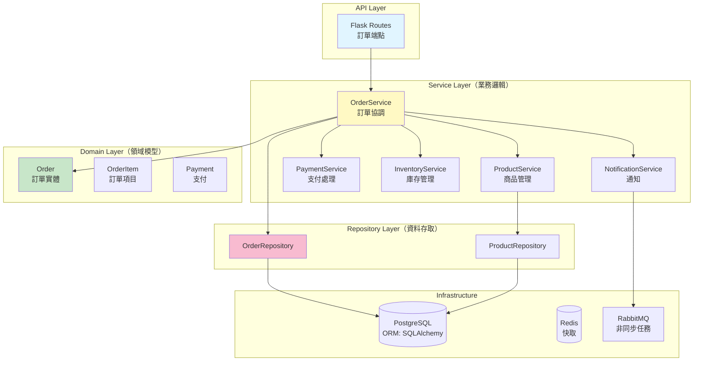
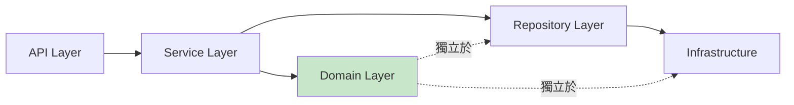
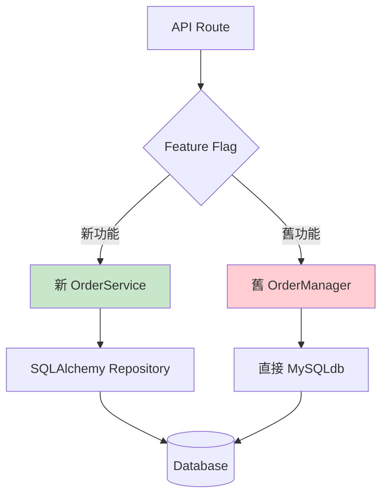

# C19：技術債務重構計畫（組合級）

## 情境資訊

**編號**：C19
**難度**：⭐⭐⭐⭐☆（組合級偏難）
**預計時間**：2.5 小時
**學習目標**：
- 掌握使用 AI 系統化識別技術債務
- 學會設計大規模重構計畫
- 理解風險評估與優先級排序
- 建立可追蹤的重構執行流程

**適用對象**：
- 技術主管或架構師
- 負責維護 legacy 系統的開發者
- 需要規劃重構專案的團隊

---

## 情境描述

### 背景

你接手了一個運行 3 年的電商後台系統。系統雖然功能正常，但技術債務嚴重：代碼混亂、測試不足、效能問題頻繁。管理層給你 3 個月時間進行重構，但不能影響業務運作。

### 系統現況

**專案規模**：
- 代碼量：約 50,000 行 Python
- 核心模組：10 個（用戶、商品、訂單、支付、物流...）
- 依賴套件：68 個（部分已過時）
- 測試覆蓋率：< 30%
- 日活躍用戶：10,000+

**已知問題**（來自團隊反饋）：
- 程式碼重複率高（約 40%）
- God Object 模式（單一類別 > 2000 行）
- 缺乏抽象層（直接操作資料庫）
- 錯誤處理不完整
- 文檔幾乎沒有
- 效能瓶頸（某些 API 回應 > 3 秒）
- 安全隱患（SQL Injection 可能性）

### 代碼範例（部分）

```python
# app/services/order_manager.py（簡化版，實際更混亂）

class OrderManager:
    """訂單管理器（God Object - 所有功能都塞在這裡）"""

    def __init__(self):
        self.db = MySQLdb.connect(
            host="localhost",
            user="root",
            passwd="password123",  # ❌ 硬編碼密碼
            db="ecommerce"
        )

    def create_order(self, user_id, items, address, payment_method):
        """建立訂單（混雜太多職責）"""
        cursor = self.db.cursor()

        # 1. 驗證使用者（應該是獨立的 service）
        query = f"SELECT * FROM users WHERE id = {user_id}"  # ❌ SQL Injection
        cursor.execute(query)
        user = cursor.fetchone()
        if not user:
            return {"error": "User not found"}

        # 2. 檢查商品庫存（應該是 ProductService）
        total_price = 0
        for item in items:
            query = f"SELECT price, stock FROM products WHERE id = {item['product_id']}"
            cursor.execute(query)
            product = cursor.fetchone()

            if product[1] < item['quantity']:  # ❌ 魔術數字
                return {"error": f"Insufficient stock for {item['product_id']}"}

            total_price += product[0] * item['quantity']

        # 3. 計算運費（硬編碼業務邏輯）
        if address['city'] == 'Taipei':
            shipping_fee = 60
        elif address['city'] == 'Kaohsiung':
            shipping_fee = 80
        else:
            shipping_fee = 100  # ❌ 應該從設定檔讀取

        total_price += shipping_fee

        # 4. 處理折扣（複雜邏輯混在一起）
        if user[5] == 'VIP':  # ❌ 魔術數字
            total_price *= 0.9
        if total_price > 1000:
            total_price *= 0.95

        # 5. 建立訂單（應該用 ORM）
        query = f"""
            INSERT INTO orders (user_id, total_price, address, status, created_at)
            VALUES ({user_id}, {total_price}, '{address}', 'pending', NOW())
        """  # ❌ SQL Injection + 沒有 transaction
        cursor.execute(query)
        order_id = cursor.lastrowid

        # 6. 建立訂單項目
        for item in items:
            query = f"""
                INSERT INTO order_items (order_id, product_id, quantity, price)
                VALUES ({order_id}, {item['product_id']}, {item['quantity']}, {item['price']})
            """
            cursor.execute(query)  # ❌ 沒有錯誤處理

            # 7. 扣減庫存
            query = f"""
                UPDATE products SET stock = stock - {item['quantity']}
                WHERE id = {item['product_id']}
            """
            cursor.execute(query)

        # 8. 呼叫支付（應該是 PaymentService）
        if payment_method == 'credit_card':
            # TODO: 實作信用卡支付
            pass
        elif payment_method == 'cash':
            pass

        # 9. 發送通知（應該是 NotificationService）
        # TODO: 發送 email

        self.db.commit()
        return {"order_id": order_id, "total": total_price}

    def get_order_details(self, order_id):
        """取得訂單詳情（又是一大坨 SQL）"""
        cursor = self.db.cursor()
        query = f"""
            SELECT o.*, u.name, u.email
            FROM orders o
            JOIN users u ON o.user_id = u.id
            WHERE o.id = {order_id}
        """  # ❌ SQL Injection
        cursor.execute(query)
        order = cursor.fetchone()

        if not order:
            return None

        # 取得訂單項目
        query = f"SELECT * FROM order_items WHERE order_id = {order_id}"
        cursor.execute(query)
        items = cursor.fetchall()

        # ❌ 手動組合資料（應該用 ORM）
        return {
            'id': order[0],
            'user_id': order[1],
            'total_price': order[2],
            'status': order[3],
            'created_at': order[4],
            'user_name': order[10],
            'items': items
        }

    def cancel_order(self, order_id, user_id):
        """取消訂單"""
        cursor = self.db.cursor()

        # ❌ 沒有驗證權限
        # ❌ 沒有檢查訂單狀態
        query = f"UPDATE orders SET status = 'cancelled' WHERE id = {order_id}"
        cursor.execute(query)

        # ❌ 忘記恢復庫存
        # ❌ 忘記退款

        self.db.commit()
        return True

    # ... 還有 30 個類似的方法
```

```python
# app/utils/helpers.py（各種雜七雜八的函數）

def calculate_discount(user_type, total):
    """計算折扣（業務邏輯散落各處）"""
    if user_type == 'VIP':
        return total * 0.9
    elif user_type == 'SVIP':
        return total * 0.8
    else:
        return total

def validate_email(email):
    """Email 驗證（應該用 library）"""
    if '@' in email and '.' in email:
        return True
    return False

def generate_order_number():
    """生成訂單編號（不夠唯一）"""
    import random
    return f"ORD{random.randint(10000, 99999)}"  # ❌ 可能重複

# ... 還有 50 個這種函數
```

### 你的任務

使用 Claude Code AI Agent 平台，制定一份完整的技術債務重構計畫，包含：

1. **技術債務識別**：系統化掃描所有問題
2. **風險評估**：評估每個問題的影響與修復成本
3. **優先級排序**：決定重構順序
4. **重構方案設計**：提供具體的改進方案
5. **執行計畫**：分階段、可追蹤的執行路線圖
6. **驗證機制**：如何確保重構不破壞現有功能

---

## 學習重點

### 目標 1：多維度債務分析

學會從不同角度識別技術債務：
- **安全性**：SQL Injection, 硬編碼密碼
- **架構**：God Object, 缺乏分層
- **程式碼品質**：重複代碼、魔術數字、缺乏錯誤處理
- **效能**：N+1 查詢、缺乏快取
- **可維護性**：文檔不足、測試覆蓋率低

### 目標 2：AI Agent 協作模式

理解不同 Agent 在重構計畫中的角色：
- **code-reviewer**: 識別代碼異味
- **security-auditor**: 發現安全漏洞
- **architect**: 設計新架構
- **refactoring-specialist**: 提供重構步驟

### 目標 3：風險管理

掌握如何在不停機的情況下重構：
- Strangler Fig Pattern（絞殺者模式）
- Feature Flag 控制新舊切換
- 並行運作驗證
- Rollback 機制

### 目標 4：可執行的計畫

產出的計畫必須包含：
- 具體的工作項目（可分配給團隊）
- 時間估算（realistic）
- 檢查點（milestones）
- 成功標準（如何驗證）

---

## 建議解決流程

### 階段一：技術債務全面掃描（40 分鐘）

**目標**：系統化識別所有問題

#### 步驟 1：自動化代碼掃描

```bash
# 使用 /grep 找出所有潛在問題

# 1. SQL Injection 風險
/grep "f\".*SELECT.*FROM" --type py -n

# 2. 硬編碼密碼/API Key
/grep "password.*=.*['\"]" --type py -n
/grep "api_key.*=.*['\"]" --type py -n

# 3. God Object（超大類別）
/bash wc -l app/**/*.py | sort -rn | head -20

# 4. 重複代碼
/bash find app -name "*.py" -exec grep -l "calculate_discount" {} \;

# 5. 魔術數字
/grep "\b(0\.9|0\.8|100|60|80)\b" --type py app/services/
```

**預期發現**：

```
SQL Injection 風險：27 處
硬編碼機敏資料：12 處
超過 500 行的類別：8 個
重複代碼模式：45+ 處
魔術數字：200+ 個
```

#### 步驟 2：使用 code-reviewer 深度分析

```bash
# 切換到代碼審查專家
/agents:code-reviewer

# 提供分析任務
請對 app/services/order_manager.py 進行全面審查。

關注點：
1. 設計模式問題（God Object, 職責混亂）
2. 代碼異味（重複代碼、長方法、魔術數字）
3. 錯誤處理（缺失、不完整）
4. 可測試性（依賴注入、耦合度）
5. 效能問題（N+1 查詢、缺乏快取）

請分類問題嚴重程度：
- Critical（必須立即修復）
- High（短期內修復）
- Medium（中期計畫）
- Low（有時間再處理）

產出格式：Markdown 表格
```

**預期輸出**：

```markdown
# 代碼審查報告：OrderManager

## 總體評級：🔴 需要重大重構（3/10）

### 問題分類統計

| 嚴重程度 | 問題數量 | 主要類型 |
|---------|---------|---------|
| Critical | 8 | SQL Injection, 硬編碼密碼, 缺乏 Transaction |
| High | 15 | God Object, 缺乏抽象, 錯誤處理不足 |
| Medium | 23 | 重複代碼, 魔術數字, 文檔不足 |
| Low | 12 | 命名不佳, 註解過少 |

---

## Critical 問題清單

### C-1: SQL Injection 漏洞（8 處）

**位置**：
- Line 18: `create_order()` - user_id 未參數化
- Line 28: `create_order()` - product_id 未參數化
- Line 72: `get_order_details()` - order_id 未參數化
- ...

**風險**：
- 攻擊者可竊取所有訂單資料
- 可能刪除或修改資料庫
- 違反 OWASP Top 10

**修復方案**：
```python
# ❌ 現況
query = f"SELECT * FROM users WHERE id = {user_id}"
cursor.execute(query)

# ✅ 修復
cursor.execute("SELECT * FROM users WHERE id = %s", (user_id,))
```

**影響範圍**：8 個方法
**預估修復時間**：4 小時
**優先級**：🔴 P0（立即修復）

---

### C-2: 硬編碼資料庫密碼

**位置**：Line 8
**問題**：
```python
self.db = MySQLdb.connect(
    host="localhost",
    user="root",
    passwd="password123",  # ❌ 明文密碼
    db="ecommerce"
)
```

**風險**：
- 密碼可能被推送到 Git
- 無法在不同環境使用不同密碼
- 違反 12-Factor App 原則

**修復方案**：
```python
import os
from urllib.parse import urlparse

DATABASE_URL = os.getenv('DATABASE_URL')
db_config = urlparse(DATABASE_URL)

self.db = MySQLdb.connect(
    host=db_config.hostname,
    user=db_config.username,
    passwd=db_config.password,
    db=db_config.path[1:]
)
```

**預估修復時間**：2 小時
**優先級**：🔴 P0

---

## High 問題清單

### H-1: God Object 反模式

**問題**：OrderManager 類別承擔過多職責

**當前職責**（應該分離）：
1. 使用者驗證 → 應該是 AuthService
2. 商品管理 → 應該是 ProductService
3. 訂單建立 → OrderService
4. 支付處理 → PaymentService
5. 庫存管理 → InventoryService
6. 通知發送 → NotificationService
7. 資料庫操作 → Repository Layer

**重構方案**（分層架構）：

```python
# 新架構

# Domain Layer
class Order:
    """訂單領域模型"""
    def __init__(self, user_id, items, address):
        self.user_id = user_id
        self.items = items
        self.address = address
        self.status = 'pending'

    def calculate_total(self, pricing_service):
        """計算總金額（依賴注入）"""
        return pricing_service.calculate(self.items, self.address)

    def can_cancel(self):
        """業務規則：哪些狀態可以取消"""
        return self.status in ['pending', 'confirmed']

# Service Layer
class OrderService:
    """訂單應用服務（協調各種 services）"""

    def __init__(
        self,
        order_repo: OrderRepository,
        product_service: ProductService,
        payment_service: PaymentService,
        inventory_service: InventoryService
    ):
        self.order_repo = order_repo
        self.product_service = product_service
        self.payment_service = payment_service
        self.inventory_service = inventory_service

    def create_order(self, user_id, items, address, payment_method):
        """建立訂單（職責清晰）"""
        # 1. 驗證商品存在且有庫存
        self.product_service.validate_items(items)

        # 2. 建立訂單物件
        order = Order(user_id, items, address)

        # 3. 保留庫存（還未扣減）
        reservation = self.inventory_service.reserve(items)

        try:
            # 4. 處理支付
            payment = self.payment_service.charge(
                amount=order.total,
                method=payment_method
            )

            # 5. 確認訂單並扣減庫存
            order.confirm(payment.transaction_id)
            self.inventory_service.commit(reservation)

            # 6. 儲存訂單
            saved_order = self.order_repo.save(order)

            return Result.success(saved_order)

        except PaymentError as e:
            # 釋放庫存保留
            self.inventory_service.release(reservation)
            return Result.failure(f"Payment failed: {e}")

# Repository Layer
class OrderRepository:
    """資料存取層（使用 ORM）"""

    def save(self, order: Order) -> Order:
        """儲存訂單（使用 SQLAlchemy）"""
        order_model = OrderModel(
            user_id=order.user_id,
            total_price=order.total,
            status=order.status
        )
        db.session.add(order_model)
        db.session.commit()
        return order
```

**預估重構時間**：40 小時（分 4 週執行）
**優先級**：🟠 P1

---

### H-2: 缺乏 Transaction 管理

**問題**：訂單建立過程沒有使用 transaction，可能導致資料不一致

**風險場景**：
```
1. 建立訂單記錄 ✅
2. 建立訂單項目 ✅
3. 扣減庫存 ✅
4. 呼叫支付 ❌ 失敗！

結果：訂單已建立、庫存已扣減，但支付失敗
→ 資料不一致！
```

**修復方案**（使用 SQLAlchemy）：
```python
from sqlalchemy import create_engine
from sqlalchemy.orm import sessionmaker

def create_order_with_transaction(self, ...):
    session = Session()
    try:
        # 所有操作在同一 transaction
        order = Order(...)
        session.add(order)

        for item in items:
            order_item = OrderItem(...)
            session.add(order_item)

            # 扣減庫存
            product = session.query(Product).get(item.product_id)
            product.stock -= item.quantity

        # 全部成功才 commit
        session.commit()
        return order

    except Exception as e:
        # 任何錯誤都 rollback
        session.rollback()
        raise
    finally:
        session.close()
```

**預估修復時間**：8 小時
**優先級**：🟠 P1

---

（繼續列出其他 High/Medium/Low 問題...）
```

**記憶沉澱**：
```bash
/memory save

主題：技術債務系統化識別流程

Step 1: 自動化掃描（使用 grep + bash）
- SQL Injection: /grep "f\".*SELECT.*FROM"
- 機敏資料: /grep "password.*=.*['\"]"
- 超大類別: wc -l *.py | sort -rn
- 重複代碼: grep -r "相同模式"
- 魔術數字: /grep "\b(0\.9|100)\b"

Step 2: AI Agent 深度分析
- code-reviewer: 識別設計問題、代碼異味
- security-auditor: 發現安全漏洞
- architect: 評估架構問題

Step 3: 問題分類
- Critical: 安全漏洞、資料一致性
- High: God Object、缺乏抽象
- Medium: 重複代碼、魔術數字
- Low: 命名、註解

Step 4: 量化評估
- 問題數量統計
- 影響範圍分析
- 修復時間估算
- 風險評級

輸出：結構化的問題清單（Markdown 表格）

相關 Agent: code-reviewer, security-auditor, architect
```

---

### 階段二：架構重構設計（40 分鐘）

**目標**：設計新的系統架構

```bash
# 切換到架構師
/agents:architect

# 提供重構需求
基於以上識別的問題，請設計改進後的系統架構。

## 現有問題
- God Object（OrderManager 2000+ 行）
- 缺乏分層（業務邏輯與資料庫操作混雜）
- 直接使用 MySQLdb（應該用 ORM）
- 缺乏依賴注入（難以測試）
- 缺乏 Transaction 管理

## 設計目標
1. 清晰的分層架構（Domain, Service, Repository）
2. 使用 SQLAlchemy ORM
3. 依賴注入（方便測試）
4. 完整的錯誤處理
5. Transaction 管理
6. 可擴展性（未來支援多種支付方式）

## 需求
1. 重構後的架構圖（Mermaid）
2. 核心類別設計（Python 程式碼）
3. 從舊架構遷移到新架構的策略（Strangler Fig Pattern）
4. 驗證方案（如何確保重構不破壞功能）

產出格式：Markdown + Mermaid + Python code
```

**預期輸出**：

````markdown
# 訂單系統重構架構設計

## 1. 新架構總覽

### 1.1 分層架構



**職責清晰**：
- API Layer: HTTP 處理、驗證、序列化
- Service Layer: 業務邏輯、流程協調
- Domain Layer: 業務規則、實體
- Repository Layer: 資料庫操作（抽象化）
- Infrastructure: 技術細節

### 1.2 依賴關係



**關鍵原則**：
- Domain Layer 不依賴任何外部層（Pure Python）
- Service Layer 依賴 Domain 和 Repository 介面
- Repository 實作依賴 Infrastructure

## 2. 核心類別設計

### 2.1 Domain Layer（領域模型）

```python
# domain/models.py

from dataclasses import dataclass
from decimal import Decimal
from datetime import datetime
from typing import List, Optional

@dataclass
class OrderItem:
    """訂單項目（值物件）"""
    product_id: int
    product_name: str
    price: Decimal
    quantity: int

    @property
    def subtotal(self) -> Decimal:
        """小計"""
        return self.price * self.quantity

    def validate(self):
        """驗證"""
        if self.quantity < 1:
            raise ValueError("Quantity must be positive")
        if self.price < 0:
            raise ValueError("Price cannot be negative")

@dataclass
class Address:
    """地址（值物件）"""
    city: str
    district: str
    street: str
    postal_code: str

    def __str__(self):
        return f"{self.postal_code} {self.city}{self.district}{self.street}"

class Order:
    """訂單實體（聚合根）"""

    def __init__(
        self,
        user_id: int,
        items: List[OrderItem],
        shipping_address: Address
    ):
        self.id: Optional[int] = None
        self.user_id = user_id
        self.items = items
        self.shipping_address = shipping_address
        self.status = OrderStatus.PENDING
        self.payment_id: Optional[str] = None
        self.created_at = datetime.utcnow()
        self.updated_at = datetime.utcnow()

        # 驗證
        self._validate()

    def _validate(self):
        """驗證訂單"""
        if not self.items:
            raise ValueError("Order must have at least one item")

        for item in self.items:
            item.validate()

    @property
    def total(self) -> Decimal:
        """訂單總金額"""
        return sum(item.subtotal for item in self.items)

    def confirm(self, payment_id: str):
        """確認訂單（業務規則）"""
        if self.status != OrderStatus.PENDING:
            raise InvalidOrderStateError(
                f"Cannot confirm order in {self.status} status"
            )

        self.status = OrderStatus.CONFIRMED
        self.payment_id = payment_id
        self.updated_at = datetime.utcnow()

    def cancel(self):
        """取消訂單（業務規則）"""
        if not self.can_cancel():
            raise InvalidOrderStateError(
                f"Cannot cancel order in {self.status} status"
            )

        self.status = OrderStatus.CANCELLED
        self.updated_at = datetime.utcnow()

    def can_cancel(self) -> bool:
        """業務規則：哪些狀態可以取消"""
        return self.status in [OrderStatus.PENDING, OrderStatus.CONFIRMED]

class OrderStatus:
    """訂單狀態（枚舉）"""
    PENDING = 'pending'
    CONFIRMED = 'confirmed'
    SHIPPING = 'shipping'
    DELIVERED = 'delivered'
    CANCELLED = 'cancelled'
```

### 2.2 Repository Layer（資料存取抽象）

```python
# repositories/interfaces.py

from abc import ABC, abstractmethod
from typing import Optional, List
from domain.models import Order

class OrderRepository(ABC):
    """訂單倉儲介面（抽象）"""

    @abstractmethod
    def save(self, order: Order) -> Order:
        """儲存訂單"""
        pass

    @abstractmethod
    def find_by_id(self, order_id: int) -> Optional[Order]:
        """根據 ID 查詢"""
        pass

    @abstractmethod
    def find_by_user_id(self, user_id: int) -> List[Order]:
        """根據使用者 ID 查詢"""
        pass

    @abstractmethod
    def update(self, order: Order) -> Order:
        """更新訂單"""
        pass

# repositories/sqlalchemy_order_repository.py

from sqlalchemy.orm import Session
from domain.models import Order, OrderItem, Address
from .interfaces import OrderRepository
from .models import OrderModel, OrderItemModel  # SQLAlchemy models

class SQLAlchemyOrderRepository(OrderRepository):
    """使用 SQLAlchemy 的訂單倉儲實作"""

    def __init__(self, session: Session):
        self.session = session

    def save(self, order: Order) -> Order:
        """儲存訂單（ORM）"""
        order_model = OrderModel(
            user_id=order.user_id,
            total_price=order.total,
            shipping_address=str(order.shipping_address),
            status=order.status,
            payment_id=order.payment_id
        )

        self.session.add(order_model)

        # 儲存訂單項目
        for item in order.items:
            item_model = OrderItemModel(
                order=order_model,
                product_id=item.product_id,
                product_name=item.product_name,
                price=item.price,
                quantity=item.quantity
            )
            self.session.add(item_model)

        self.session.commit()

        # 更新 domain 物件的 ID
        order.id = order_model.id
        return order

    def find_by_id(self, order_id: int) -> Optional[Order]:
        """查詢訂單（自動 JOIN）"""
        order_model = self.session.query(OrderModel).get(order_id)

        if not order_model:
            return None

        # 從 ORM model 轉換為 domain model
        return self._to_domain(order_model)

    def _to_domain(self, order_model: OrderModel) -> Order:
        """ORM model → Domain model"""
        items = [
            OrderItem(
                product_id=item.product_id,
                product_name=item.product_name,
                price=item.price,
                quantity=item.quantity
            )
            for item in order_model.items
        ]

        order = Order(
            user_id=order_model.user_id,
            items=items,
            shipping_address=Address.parse(order_model.shipping_address)
        )
        order.id = order_model.id
        order.status = order_model.status
        order.payment_id = order_model.payment_id
        order.created_at = order_model.created_at

        return order
```

### 2.3 Service Layer（業務邏輯）

```python
# services/order_service.py

from typing import List
from domain.models import Order, OrderItem, Address
from repositories.interfaces import OrderRepository
from .product_service import ProductService
from .payment_service import PaymentService
from .inventory_service import InventoryService

class OrderService:
    """訂單應用服務（職責：協調各種 services）"""

    def __init__(
        self,
        order_repo: OrderRepository,
        product_service: ProductService,
        payment_service: PaymentService,
        inventory_service: InventoryService
    ):
        self.order_repo = order_repo
        self.product_service = product_service
        self.payment_service = payment_service
        self.inventory_service = inventory_service

    def create_order(
        self,
        user_id: int,
        items_data: List[dict],
        address_data: dict,
        payment_method: str
    ) -> Result[Order]:
        """建立訂單（完整流程）"""

        try:
            # 1. 驗證商品存在且有庫存
            items = self._build_order_items(items_data)
            self.product_service.validate_items(items)

            # 2. 建立訂單領域物件
            address = Address(**address_data)
            order = Order(user_id, items, address)

            # 3. 保留庫存（樂觀鎖）
            reservation_id = self.inventory_service.reserve(items)

            try:
                # 4. 處理支付
                payment_result = self.payment_service.charge(
                    amount=order.total,
                    method=payment_method,
                    metadata={'order_items': items}
                )

                if not payment_result.success:
                    raise PaymentFailedError(payment_result.error)

                # 5. 確認訂單
                order.confirm(payment_result.transaction_id)

                # 6. 確認扣減庫存
                self.inventory_service.commit(reservation_id)

                # 7. 儲存訂單（使用 repository）
                saved_order = self.order_repo.save(order)

                # 8. 發送通知（非同步）
                self._send_order_confirmation(saved_order)

                return Result.success(saved_order)

            except (PaymentFailedError, InventoryError) as e:
                # 釋放庫存保留
                self.inventory_service.release(reservation_id)
                return Result.failure(str(e))

        except ValidationError as e:
            return Result.failure(f"Validation error: {e}")
        except Exception as e:
            logger.error(f"Unexpected error in create_order: {e}")
            return Result.failure("Internal server error")

    def cancel_order(self, order_id: int, user_id: int) -> Result[Order]:
        """取消訂單"""
        # 1. 查詢訂單
        order = self.order_repo.find_by_id(order_id)

        if not order:
            return Result.failure("Order not found")

        # 2. 驗證權限
        if order.user_id != user_id:
            return Result.failure("Permission denied")

        # 3. 執行業務邏輯（在 domain model 中）
        try:
            order.cancel()
        except InvalidOrderStateError as e:
            return Result.failure(str(e))

        # 4. 恢復庫存
        self.inventory_service.restore(order.items)

        # 5. 退款
        if order.payment_id:
            self.payment_service.refund(order.payment_id)

        # 6. 儲存變更
        updated_order = self.order_repo.update(order)

        return Result.success(updated_order)

    def _build_order_items(self, items_data: List[dict]) -> List[OrderItem]:
        """從請求資料建立 OrderItem"""
        items = []
        for data in items_data:
            # 從 ProductService 取得價格（不信任客戶端）
            product = self.product_service.get_product(data['product_id'])

            item = OrderItem(
                product_id=product.id,
                product_name=product.name,
                price=product.price,  # 使用伺服器端價格
                quantity=data['quantity']
            )
            items.append(item)

        return items

    def _send_order_confirmation(self, order: Order):
        """發送訂單確認通知（非同步）"""
        # 使用訊息佇列（Celery task）
        from tasks import send_order_email
        send_order_email.delay(order.id)
```

## 3. 遷移策略（Strangler Fig Pattern）

### 3.1 並行運作階段



**實作範例**：

```python
# routes/orders.py

from flask import Blueprint, request
from services.order_service import OrderService  # 新
from app.services.order_manager import OrderManager  # 舊
from utils.feature_flags import is_enabled

orders_bp = Blueprint('orders', __name__)

@orders_bp.route('/orders', methods=['POST'])
@require_auth
def create_order():
    """建立訂單（支援新舊實作切換）"""
    data = request.get_json()
    user_id = request.user_id

    # Feature Flag 控制使用新或舊實作
    if is_enabled('new_order_service', user_id):
        # 使用新實作
        result = order_service.create_order(
            user_id=user_id,
            items_data=data['items'],
            address_data=data['address'],
            payment_method=data['payment_method']
        )

        if result.is_success:
            return jsonify(result.value.to_dict()), 201
        else:
            return jsonify({'error': result.error}), 400
    else:
        # 使用舊實作
        order_manager = OrderManager()
        order = order_manager.create_order(
            user_id, data['items'], data['address'], data['payment_method']
        )

        if 'error' in order:
            return jsonify(order), 400
        return jsonify(order), 201
```

### 3.2 遷移階段

**Week 1-2: 建立新架構（不影響現有系統）**
- 實作 Domain Models
- 實作 Repository 介面與 SQLAlchemy 實作
- 實作 Service Layer
- 寫單元測試（覆蓋率 > 90%）

**Week 3-4: 並行運作（小範圍測試）**
- Feature Flag 開放給 5% 使用者
- 監控錯誤率、效能
- 比對新舊實作的結果（Dual Write, Verify）

**Week 5-6: 逐步擴大**
- 擴大到 25% 使用者
- 擴大到 50% 使用者
- 擴大到 100% 使用者

**Week 7-8: 移除舊程式碼**
- 確認新實作穩定
- 移除 Feature Flag
- 刪除舊 OrderManager 程式碼

### 3.3 驗證機制

**Dual Write & Verify Pattern**:

```python
def create_order_with_verification(user_id, items, address, payment_method):
    """同時執行新舊實作，比對結果"""

    # 執行舊實作
    old_result = old_order_manager.create_order(...)

    # 執行新實作
    new_result = new_order_service.create_order(...)

    # 比對結果
    if old_result['order_id'] != new_result.value.id:
        logger.warning("Mismatch detected!", extra={
            'old': old_result,
            'new': new_result.value.to_dict()
        })

        # 通知開發團隊
        alert_team("Order creation mismatch")

    # 回傳舊實作的結果（安全）
    return old_result
```

## 4. 測試策略

### 4.1 單元測試（Domain Layer）

```python
# tests/domain/test_order.py

import pytest
from domain.models import Order, OrderItem, Address

def test_order_total_calculation():
    """測試訂單總金額計算"""
    items = [
        OrderItem(1, "Product A", Decimal("100"), 2),  # 200
        OrderItem(2, "Product B", Decimal("50"), 1),   # 50
    ]
    address = Address("Taipei", "Xinyi", "Road", "110")

    order = Order(user_id=123, items=items, shipping_address=address)

    assert order.total == Decimal("250")

def test_cannot_cancel_delivered_order():
    """測試業務規則：已送達的訂單不能取消"""
    order = Order(...)
    order.status = OrderStatus.DELIVERED

    with pytest.raises(InvalidOrderStateError):
        order.cancel()
```

### 4.2 整合測試（Service Layer）

```python
# tests/services/test_order_service.py

import pytest
from services.order_service import OrderService

@pytest.fixture
def order_service(db_session):
    """準備測試用的 service（使用測試資料庫）"""
    order_repo = SQLAlchemyOrderRepository(db_session)
    product_service = MockProductService()
    payment_service = MockPaymentService()
    inventory_service = MockInventoryService()

    return OrderService(
        order_repo, product_service, payment_service, inventory_service
    )

def test_create_order_success(order_service):
    """測試成功建立訂單"""
    result = order_service.create_order(
        user_id=123,
        items_data=[{'product_id': 1, 'quantity': 2}],
        address_data={'city': 'Taipei', ...},
        payment_method='credit_card'
    )

    assert result.is_success
    assert result.value.id is not None
    assert result.value.status == OrderStatus.CONFIRMED

def test_create_order_payment_failed(order_service):
    """測試支付失敗時的處理"""
    # 設定 mock 使支付失敗
    order_service.payment_service.set_fail(True)

    result = order_service.create_order(...)

    assert result.is_failure
    assert "Payment failed" in result.error

    # 驗證庫存已釋放
    assert order_service.inventory_service.reservations == []
```

---

**重構完成標準**：
1. ✅ 所有單元測試通過（覆蓋率 > 90%）
2. ✅ 整合測試通過
3. ✅ 效能測試（回應時間 < 200ms）
4. ✅ 壓力測試（1000 req/s）
5. ✅ 100% 使用者使用新實作 7 天無重大問題
````

**記憶沉澱**：
```bash
/memory save

主題：大規模重構的架構設計模式

分層架構（Clean Architecture）:
1. Domain Layer: 業務規則、實體（純 Python）
2. Service Layer: 流程協調、應用邏輯
3. Repository Layer: 資料存取抽象
4. Infrastructure: 技術實作（SQLAlchemy, Redis）

關鍵設計模式：
- Repository Pattern: 抽象資料存取
- Dependency Injection: 注入依賴（易測試）
- Domain Model: 將業務規則封裝在實體中
- Result Pattern: 明確的成功/失敗處理

遷移策略（Strangler Fig Pattern）：
1. 建立新架構（不影響舊系統）
2. Feature Flag 控制切換
3. Dual Write & Verify（驗證正確性）
4. 逐步擴大使用範圍
5. 移除舊程式碼

測試金字塔：
- 單元測試（Domain Layer）: 大量、快速
- 整合測試（Service Layer）: 中等
- E2E 測試: 少量、關鍵流程

重構成功指標：
- 測試覆蓋率 > 90%
- 效能不劣化（甚至改善）
- 零停機遷移
- 程式碼行數減少 30%+

相關 Agent: architect, refactoring-specialist
相關模式: Clean Architecture, DDD, Strangler Fig
```

---

### 階段三：執行計畫與追蹤（30 分鐘）

**目標**：產出可執行的專案計畫

```bash
# 使用 technical-writer + architect
請基於以上分析與設計，生成：

1. **重構執行計畫**（REFACTORING_PLAN.md）
   - 3 個月的詳細時間表
   - 每週的工作項目
   - 責任分配建議
   - 里程碑與檢查點

2. **風險管理計畫**（RISK_MANAGEMENT.md）
   - 識別潛在風險
   - 緩解措施
   - Rollback 計畫

3. **進度追蹤模板**（PROGRESS_TRACKING.md）
   - 每週進度報告範本
   - 關鍵指標（測試覆蓋率、效能、錯誤率）
   - 決策記錄（ADR）

格式：Markdown，包含檢查清單
```

**預期輸出**（執行計畫範例）：

```markdown
# 重構執行計畫（12 週）

## 總覽

**目標**：將 OrderManager God Object 重構為 Clean Architecture
**時間**：2025/02/01 - 2025/04/30（12 週）
**團隊**：3 位後端開發者 + 1 位 QA
**風險等級**：🟠 中高（涉及核心業務邏輯）

---

## Phase 1: 準備與設計（Week 1-2）

### Week 1: 技術債務全面掃描

**工作項目**：
- [ ] 執行自動化掃描（SQL Injection, 硬編碼, God Object）
- [ ] 使用 AI Agent 深度分析（code-reviewer, security-auditor）
- [ ] 產出完整問題清單（分類：Critical/High/Medium/Low）
- [ ] 量化評估（問題數量、影響範圍、修復時間）

**產出**：
- 技術債務報告（50+ 頁）
- 問題優先級清單

**責任人**：全員
**驗收標準**：管理層批准重構計畫

---

### Week 2: 架構設計與原型

**工作項目**：
- [ ] 設計新架構（Domain, Service, Repository）
- [ ] 建立 POC（Proof of Concept）
- [ ] 設計遷移策略（Strangler Fig Pattern）
- [ ] 設定開發環境（測試資料庫、Feature Flag）

**產出**：
- 架構設計文檔
- POC 程式碼（可運行的訂單建立流程）

**責任人**：Tech Lead + Senior Developer
**驗收標準**：POC 測試通過、團隊 code review 通過

---

## Phase 2: 建立新架構（Week 3-6）

### Week 3: Domain Layer

**工作項目**：
- [ ] 實作 Order, OrderItem, Address 領域模型
- [ ] 實作業務規則（can_cancel, confirm 等）
- [ ] 撰寫單元測試（覆蓋率 > 95%）
- [ ] Code review

**產出**：
- domain/models.py（300 行）
- tests/domain/test_models.py（500 行測試）

**責任人**：Developer A
**時間估算**：30 小時
**驗收標準**：所有測試通過、coverage > 95%

---

### Week 4: Repository Layer

**工作項目**：
- [ ] 定義 OrderRepository 介面
- [ ] 實作 SQLAlchemy models
- [ ] 實作 SQLAlchemyOrderRepository
- [ ] 撰寫整合測試（使用測試資料庫）

**產出**：
- repositories/interfaces.py
- repositories/sqlalchemy_order_repository.py
- tests/repositories/test_order_repository.py

**責任人**：Developer B
**時間估算**：35 小時
**驗收標準**：整合測試通過、可正確 CRUD

---

### Week 5: Service Layer（Part 1 - OrderService）

**工作項目**：
- [ ] 實作 OrderService.create_order()
- [ ] 整合 ProductService, PaymentService, InventoryService（使用 Mock）
- [ ] 實作錯誤處理與 Transaction 管理
- [ ] 撰寫測試

**產出**：
- services/order_service.py
- tests/services/test_order_service.py

**責任人**：Developer A
**時間估算**：40 小時
**驗收標準**：單元測試 + 整合測試通過

---

### Week 6: Service Layer（Part 2 - 其他方法）

**工作項目**：
- [ ] 實作 cancel_order, get_order_details, update_order
- [ ] 整合所有 services
- [ ] 完整的測試套件
- [ ] 效能測試（Benchmark）

**產出**：
- 完整的 OrderService
- 效能測試報告

**責任人**：Developer B
**時間估算**：35 小時
**驗收標準**：
- 測試覆蓋率 > 90%
- 訂單建立 < 200ms
- 併發測試通過（100 req/s）

---

## Phase 3: 並行運作（Week 7-9）

### Week 7: Feature Flag 與監控

**工作項目**：
- [ ] 實作 Feature Flag 系統（LaunchDarkly 或自建）
- [ ] 整合監控（Sentry, Prometheus）
- [ ] 實作 Dual Write & Verify（新舊實作比對）
- [ ] 設定告警規則

**產出**：
- Feature Flag 系統
- 監控 Dashboard

**責任人**：Tech Lead + DevOps
**驗收標準**：可動態切換新舊實作、監控正常

---

### Week 8: 灰度發布（5% → 25%）

**工作項目**：
- [ ] 開放新實作給 5% 使用者（內部測試帳號）
- [ ] 監控錯誤率、效能、業務指標
- [ ] 修復發現的 bug
- [ ] 擴大到 25% 使用者

**關鍵指標**：
- 錯誤率 < 0.1%
- P95 回應時間 < 300ms
- 新舊實作結果一致性 > 99.9%

**責任人**：全員
**驗收標準**：指標達標、無重大 bug

---

### Week 9: 擴大發布（50% → 100%）

**工作項目**：
- [ ] 擴大到 50% 使用者
- [ ] 監控 3 天無異常
- [ ] 擴大到 100% 使用者
- [ ] 持續監控 7 天

**關鍵指標**：
- 訂單成功率 > 99.5%
- 客訴數量不增加
- 效能改善 20%+

**責任人**：全員
**驗收標準**：100% 使用者切換成功、穩定運行 7 天

---

## Phase 4: 清理與優化（Week 10-12）

### Week 10: 移除舊程式碼

**工作項目**：
- [ ] 確認 100% 使用者使用新實作
- [ ] 移除 Feature Flag
- [ ] 刪除舊 OrderManager 程式碼
- [ ] 更新文檔

**產出**：
- 乾淨的程式碼庫（減少 40% 程式碼）

**責任人**：Developer A + B
**驗收標準**：所有測試通過、舊程式碼完全移除

---

### Week 11: Critical 問題修復

**工作項目**：
- [ ] 修復所有 Critical 問題（SQL Injection, 硬編碼密碼）
- [ ] 安全掃描（Bandit, SQLMap）
- [ ] 滲透測試

**產出**：
- 安全審計報告

**責任人**：全員 + 安全團隊
**驗收標準**：安全掃描 0 Critical issues

---

### Week 12: 文檔與知識傳承

**工作項目**：
- [ ] 撰寫架構文檔
- [ ] 撰寫 API 文檔（OpenAPI）
- [ ] 撰寫開發者指南
- [ ] 團隊分享會（Knowledge Sharing）

**產出**：
- 完整文檔套件
- 分享會錄影

**責任人**：Tech Lead
**驗收標準**：新人可根據文檔快速上手

---

## 里程碑與檢查點

| 里程碑 | 週次 | 檢查點 | 成功標準 |
|-------|------|--------|---------|
| M1: 設計完成 | Week 2 | 架構設計 review | 團隊一致通過 |
| M2: Domain 完成 | Week 3 | 單元測試 | Coverage > 95% |
| M3: 基礎設施完成 | Week 6 | 整合測試 | 所有測試通過 |
| M4: 首批使用者 | Week 8 | 5% 使用者 | 錯誤率 < 0.1% |
| M5: 全面切換 | Week 9 | 100% 使用者 | 穩定運行 7 天 |
| M6: 專案完成 | Week 12 | 文檔完成 | 管理層驗收 |

---

## 資源需求

### 人力
- Tech Lead: 50% 時間（設計、review）
- Senior Developer A: 100% 時間（Domain, Service）
- Senior Developer B: 100% 時間（Repository, Testing）
- QA Engineer: 50% 時間（測試、驗證）

### 工具
- Feature Flag: LaunchDarkly（$200/月）
- 監控: Sentry（$29/月）
- 測試環境: AWS t3.medium（$30/月）

**總成本估算**：約 $5,000（人力不計）

---

## 風險與緩解

| 風險 | 機率 | 影響 | 緩解措施 |
|------|------|------|---------|
| 新實作有 bug 導致訂單失敗 | Medium | High | Feature Flag 快速 rollback |
| 效能劣化 | Low | High | 效能測試、併發測試 |
| 團隊成員離職 | Low | High | 知識文檔化、Pair Programming |
| 時間延誤 | Medium | Medium | 每週 review、及時調整 |

---

## 每週進度會議

**時間**：每週五下午 3:00
**參與者**：Tech Lead + 開發團隊 + PM
**議程**：
1. 本週完成項目（Demo）
2. 下週計畫
3. 遇到的阻礙
4. 風險識別

**產出**：進度報告（發送給管理層）

---

## 成功標準

### 技術指標
- ✅ 測試覆蓋率 > 90%
- ✅ 代碼行數減少 30%
- ✅ 效能改善 20%
- ✅ 安全掃描 0 Critical issues

### 業務指標
- ✅ 訂單成功率 > 99.5%
- ✅ 客訴數量不增加
- ✅ 零停機遷移

### 團隊指標
- ✅ 新人 onboarding 時間縮短 50%
- ✅ Bug 修復時間縮短 40%
- ✅ 新功能開發速度提升 30%

---

**計畫版本**：v1.0
**最後更新**：2025-01-15
**下次 review**：每 2 週
```

---

## 驗證標準

### ✅ 必須達成

- [ ] 完整掃描並分類所有技術債務
- [ ] 產出可執行的重構計畫（含時間表）
- [ ] 設計清晰的新架構（Mermaid 圖表）
- [ ] 提供具體的遷移策略（Strangler Fig Pattern）
- [ ] 使用 `/memory` 沉澱至少 3 個重構模式

### ⭐ 額外成就

- [ ] 實際實作 POC 並測試通過
- [ ] 建立自動化債務掃描腳本
- [ ] 產出可復用的重構計畫範本
- [ ] 設計完整的監控與告警系統
- [ ] 撰寫重構 case study 文章

---

## 學習反思

### 反思問題

1. **債務識別**：
   - AI 能識別哪些類型的技術債務？哪些還需要人工判斷？
   - 如何量化技術債務的影響？

2. **架構設計**：
   - 為什麼選擇 Clean Architecture？
   - Domain Layer 為什麼要獨立於 Infrastructure？

3. **遷移策略**：
   - Strangler Fig Pattern 的核心是什麼？
   - Feature Flag 如何實作？

4. **風險管理**：
   - 如何確保重構不破壞現有功能？
   - 什麼情況下應該 rollback？

### 延伸練習

1. **實際執行**：
   - 選擇一個真實專案的模組進行重構
   - 實作 POC 並測試

2. **工具整合**：
   - 整合 SonarQube 自動檢測技術債務
   - 設定 GitHub Action 自動執行安全掃描

3. **模式擴展**：
   - 研究其他重構模式（Branch by Abstraction）
   - 學習 DDD（Domain-Driven Design）

---

## 相關資源

### 下一步學習

- **C01**：智能代碼審查系統 - 自動化審查流程
- **C11**：企業級開發環境搭建 - 整合測試基礎設施
- **E02**：AI Code Review 系統 - 建立持續審查機制

### 工具參考

- **SonarQube**: 代碼品質持續檢測
- **LaunchDarkly**: Feature Flag 服務
- **Sentry**: 錯誤追蹤與監控
- **SQLAlchemy**: Python ORM

### 學習資源

- **Refactoring (Martin Fowler)**: 重構經典書籍
- **Clean Architecture (Robert C. Martin)**: 架構設計原則
- **Working Effectively with Legacy Code**: 處理 legacy 系統
- **Strangler Fig Pattern**: Microsoft 架構模式

---

**建議完成時間**：2.5-3 小時
**難度評估**：4/5
**重要度**：5/5（大型專案必經之路）
**可復用性**：5/5（此流程適用於任何 legacy 系統重構）
