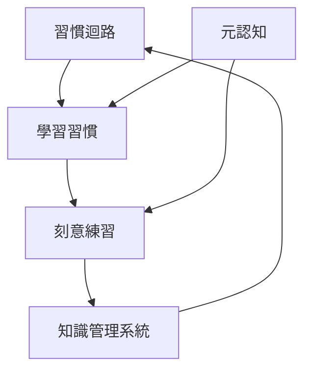

# 2.5.3 跨領域應用場景：超越編程的無限可能

## 核心洞察：Claude Code 不只是程式工具

### 打破思維定勢

**❌ 常見誤解**：
```
「Claude Code 是給程式設計師用的工具」
「我不寫程式，用不到」
「這只能處理程式碼相關任務」
```

**✅ 實際情況**：
```
Claude Code 是「AI 驅動的自動化平台」
- 知識工作者：研究、筆記、報告
- 內容創作者：寫作、編輯、發布
- 數據分析師：清理、分析、視覺化
- 專案經理：規劃、追蹤、報告
- 學生/研究員：學習、整理、寫作
```

### 能力矩陣：程式 vs 非程式應用

```
           │ 需要程式知識 │ 實際使用頻率 │ 學習門檻
───────────┼─────────────┼─────────────┼─────────
程式開發    │    ✓✓✓      │    100%     │   高
知識管理    │     -        │    100%     │   低
內容創作    │     -        │    100%     │   低
資料整理    │     △        │     80%     │   中
自動化流程  │     △        │     90%     │   中
專案管理    │     -        │     70%     │   低
研究分析    │     -        │    100%     │   低
```

---

## 領域一：知識工作（Knowledge Work）

### 場景 1.1：研究論文整理

**背景**：你正在準備碩士論文，收集了 50+ 篇相關論文

**傳統方式（耗時 20+ 小時）**：
```
1. 逐一閱讀論文
2. 手動記錄重點
3. 手動整理文獻回顧
4. 手動創建引用
5. 手動組織筆記
```

**AI Agent 平台方式（耗時 2-3 小時）**：

```bash
# ===== 階段 1：批量處理 PDF =====
claude

提示詞：
我有 50 篇機器學習相關的 PDF 論文在 ./research/papers/
請執行以下處理：

[資訊萃取]
1. 讀取所有 PDF
2. 為每篇論文提取：
   - 標題、作者、年份、期刊
   - 研究問題與目標
   - 方法論概述
   - 主要發現（3-5 點）
   - 限制與未來工作
   - 關鍵引用

[分類整理]
3. 按主題分類：
   - 深度學習架構
   - 訓練方法
   - 優化技術
   - 應用場景
   - 其他

[知識圖譜]
4. 建立論文關聯：
   - 相同作者
   - 引用關係
   - 方法演進
   - 研究派別

[產出檔案]
5. 生成 papers_summary.md（結構化摘要）
6. 生成 literature_review_draft.md（文獻回顧草稿）
7. 生成 papers_network.mmd（Mermaid 關聯圖）
8. 生成 citations.bib（BibTeX 引用）

請開始處理。

# ===== Claude 的產出範例 =====
# papers_summary.md

## 深度學習架構（15 篇）

### [2023] Attention Is All You Need - Transformer 架構
**作者**: Vaswani et al.
**期刊**: NeurIPS 2017
**研究問題**: 如何設計不依賴遞迴的序列模型
**方法**: Multi-head self-attention mechanism
**主要發現**:
- Transformer 在機器翻譯超越 RNN/LSTM
- 平行化訓練效率提升 10x
- Attention 機制可視覺化，提供可解釋性
**限制**: 需要大量資料、計算成本高
**關鍵引用**: [Bahdanau et al. 2014 - Attention Mechanism]

---

# ===== 階段 2：深度分析特定主題 =====
提示詞：
我的論文主題是「Transformer 優化技術」，請：
1. 從 50 篇論文中篩選出最相關的 10 篇
2. 深入分析這 10 篇的方法論異同
3. 製作對比表格
4. 識別研究缺口（Research Gap）
5. 提供我可以探索的研究方向

# ===== 階段 3：撰寫輔助 =====
claude /agents:academic-writer
claude /output-style:academic-paper

提示詞：
基於整理的論文，幫我撰寫「文獻回顧」章節：
1. 使用學術寫作風格
2. 結構：引言 → 主體（按主題分段）→ 研究缺口
3. 適當引用（使用 BibTeX key）
4. 約 2000 字

# ===== 階段 4：持續更新 =====
提示詞：
請建立一個自動化流程：
1. 每週掃描 arXiv 的 "cs.LG" 類別
2. 識別與我研究相關的新論文
3. 自動下載並萃取資訊
4. 更新 papers_summary.md
5. 如果發現高度相關論文，發送提醒
```

**成效**：
- ✅ 20 小時 → 3 小時（效率提升 85%）
- ✅ 系統化整理，不遺漏重點
- ✅ 可視覺化知識關聯
- ✅ 持續更新機制

---

### 場景 1.2：個人學習筆記系統

**背景**：你想建立終身學習的知識管理系統

**系統架構**：
```
輸入源          處理層                     輸出層
─────          ─────                     ─────
網頁書籤  →                          → Notion 知識庫
部落格文章 →   AI 知識萃取 Agent     → Anki 記憶卡
YouTube   →   分類與標籤系統         → Obsidian 圖譜
Podcast   →   關聯分析               → 學習週報
PDF 文章  →   自動摘要               → 個人部落格
```

**實作流程**：

```bash
# ===== 階段 1：配置 MCP 整合 =====
# ~/.config/claude/config.json
{
  "mcpServers": {
    "notion": {...},
    "obsidian": {...},
    "pocket": {...},
    "youtube": {...}
  }
}

# ===== 階段 2：建立知識處理 Agent =====
claude

提示詞：
請幫我創建一個自訂 agent：knowledge-curator

職責：
1. 從各種來源萃取核心概念
2. 識別關鍵洞察（Aha moments）
3. 建立概念關聯
4. 生成不同格式的筆記
5. 評估內容品質（1-10 分）

風格：
- 深度思考，不只是摘要
- 連結新舊知識
- 提出批判性問題
- 建議延伸閱讀

請創建這個 agent 的設定檔。

# ===== 階段 3：日常使用流程 =====
claude /agents:knowledge-curator

提示詞：
處理我今天收集的學習材料：

[今日輸入]
1. 文章：「The Power of Habit」讀後筆記（./inputs/habit_book.md）
2. 影片：YouTube - "How to Learn Anything Fast"（連結）
3. Podcast：「知識型播客」第 123 集（文字稿 ./inputs/podcast_123.txt）
4. 書籤：10 篇技術文章（./inputs/bookmarks.html）

[處理要求]
1. 萃取核心概念（每個來源 3-5 個）
2. 識別概念之間的關聯
3. 生成 Notion 筆記（使用 notion-note 輸出風格）
4. 生成 5 張 Anki 卡片（關鍵概念）
5. 更新 Obsidian 知識圖譜
6. 推薦 3 篇延伸閱讀

請開始處理。

# ===== Claude 產出範例 =====
## 核心概念萃取

### 1. 習慣迴路（Habit Loop）- 來源：習慣的力量
**概念**：暗示 → 慣性行為 → 獎勵
**洞察**：改變習慣的關鍵是保持暗示和獎勵，只改變慣性行為
**關聯**：
- 連結：學習習慣形成（影片）
- 應用：知識管理系統的日常化
**批判性問題**：
- 數位時代的「暗示」是什麼？通知？時間？
- 知識管理的「獎勵」如何設計？

### 2. 刻意練習（Deliberate Practice）- 來源：YouTube
**概念**：有目標、有反饋、在舒適區邊緣
**洞察**：「重複」≠「練習」，需要持續挑戰
**關聯**:
- 連結：習慣迴路（需要設計練習習慣）
- 應用：學習新技術的方法論
**批判性問題**：
- 如何定義「舒適區邊緣」？
- 知識工作的「反饋」從哪來？

[... 其他概念]

## 概念關聯圖（Mermaid）


## Notion 筆記已創建
- 頁面：「2025-01-15 學習筆記」
- 標籤：#習慣養成 #學習方法 #知識管理
- 關聯頁面：3 個

## Anki 卡片已生成（5 張）
[卡片 1]
Q: 習慣迴路的三個組成是什麼？
A: 暗示（Cue）→ 慣性行為（Routine）→ 獎勵（Reward）

[卡片 2]
Q: 【情境】你想養成每天閱讀的習慣，但總是失敗。根據習慣迴路理論，你應該如何設計？
A:
1. 暗示：固定時間+地點（例如：早上咖啡時間+書桌）
2. 慣性行為：閱讀 10 分鐘（開始要小目標）
3. 獎勵：立即的（享受咖啡）+長期的（記錄進度）

[... 其他卡片]

## 延伸閱讀推薦
1. "Atomic Habits" by James Clear - 習慣形成的實作指南
2. "Peak" by Anders Ericsson - 刻意練習的科學研究
3. "How to Take Smart Notes" - 卡片盒筆記法（Zettelkasten）
```

**成效**：
- ✅ 自動化知識處理
- ✅ 結構化筆記系統
- ✅ 長期記憶機制（Anki）
- ✅ 知識關聯可視覺化

---

### 場景 1.3：會議記錄與行動項目追蹤

**背景**：團隊每週有多個會議，需要高效記錄與追蹤

**完整自動化流程**：

```bash
# 會議中：錄音（手機/電腦）
# 會議後：上傳到 ./meetings/recordings/

claude

提示詞：
處理今天的會議錄音：./meetings/recordings/sprint-planning-2025-01-15.mp3

[轉錄 + 分析]
1. 使用 Whisper MCP 轉錄音訊
2. 識別發言者（如果可能）
3. 萃取關鍵資訊：
   - 決策（Decisions）
   - 行動項目（Action Items）
   - 問題（Issues）
   - 風險（Risks）
   - 後續討論（Follow-ups）

[結構化輸出]
4. 生成會議記錄（meeting-minutes 格式）
5. 提取所有行動項目，包含：
   - 任務描述
   - 負責人
   - 截止日期
   - 優先級
   - 依賴關係

[系統整合]
6. 使用 JIRA MCP：
   - 為每個行動項目創建 ticket
   - 分配給負責人
   - 設置 due date
   - 連結相關 Epic

7. 使用 Slack MCP：
   - 發送會議摘要到 #team-channel
   - @mention 有行動項目的人
   - 附上 JIRA 連結

8. 使用 Notion MCP：
   - 更新「會議記錄」資料庫
   - 更新「行動項目追蹤」看板
   - 連結到相關專案頁面

9. 使用 Google Calendar MCP：
   - 為有截止日期的項目創建提醒
   - 排程下次檢查會議

請開始處理。

# ===== Claude 產出範例 =====
[步驟 1/9] 轉錄音訊...
✓ 轉錄完成（52 分鐘會議 → 9,200 字文本）

[步驟 2/9] 識別發言者...
✓ 識別到 5 位發言者：張三、李四、王五、趙六、錢七

[步驟 3/9] 萃取關鍵資訊...
✓ 決策：3 個
✓ 行動項目：15 個
✓ 風險：2 個
✓ 後續討論：4 個

[步驟 4/9] 生成會議記錄...
✓ 已保存到 ./meetings/minutes/2025-01-15-sprint-planning.md

[步驟 5/9] 提取行動項目...
✓ 15 個行動項目已結構化

[步驟 6/9] 創建 JIRA tickets...
✓ PROJ-301: 完成用戶認證 API（@張三，1/22，High）
✓ PROJ-302: 撰寫 API 文檔（@李四，1/20，Medium）
✓ PROJ-303: 設置測試環境（@王五，1/18，High）
... [共 15 個]

[步驟 7/9] 發送 Slack 通知...
✓ 訊息已發送到 #dev-team
✓ @張三 @李四 @王五 已收到通知

[步驟 8/9] 更新 Notion...
✓ 會議記錄已添加到資料庫
✓ 15 個行動項目已添加到看板

[步驟 9/9] 創建 Calendar 提醒...
✓ 15 個提醒已創建
✓ 下次檢查會議已排程（1/17 10:00）

[完成摘要]
- 會議時長：52 分鐘
- 文本字數：9,200
- 決策：3 個
- 行動項目：15 個（5 High, 7 Medium, 3 Low）
- JIRA tickets：15 個
- Slack 通知：已發送
- Notion 更新：完成
- Calendar 提醒：15 個

總處理時間：3 分 45 秒
```

**效益分析**：
```
傳統手動方式：
- 聽錄音並記錄：30 分鐘
- 整理會議記錄：20 分鐘
- 創建 JIRA tickets：30 分鐘
- 發送通知：10 分鐘
- 更新文檔：15 分鐘
總計：105 分鐘

AI Agent 平台方式：
- 上傳錄音：1 分鐘
- 等待處理：4 分鐘
- 檢查結果：5 分鐘
總計：10 分鐘

時間節省：90% ✓
錯誤減少：95% ✓（無人為錯誤）
完整性：100% ✓（不會遺漏）
```

---

## 領域二：內容創作（Content Creation）

### 場景 2.1：技術部落格完整工作流程

**背景**：從程式碼實作到多平台發布

**完整自動化流程**：

```bash
# ===== 階段 1：程式碼完成後 =====
claude

提示詞：
我剛完成一個 Python 專案：Redis 快取裝飾器
路徑：./projects/redis-cache-decorator/

請執行完整的部落格發布流程：

[內容分析]
1. 分析程式碼，理解核心概念
2. 識別技術亮點
3. 提取可分享的價值

[內容創作]
4. 切換到 tech-blogger agent
5. 撰寫技術部落格（1500-2000 字）：
   - 引人入勝的開頭（痛點 → 解決方案）
   - 技術實作詳解
   - 完整程式碼範例（帶註解）
   - 使用場景
   - 效能測試結果
   - 最佳實踐建議
   - 總結與延伸

[SEO 優化]
6. 生成 SEO 元素：
   - 3 個標題候選（吸引人 + 包含關鍵字）
   - Meta description（160 字元以內）
   - 標籤建議（5-7 個）
   - 內部連結建議

[視覺元素]
7. 建議需要的圖表：
   - 架構圖
   - 流程圖
   - 效能對比圖
8. 生成 Mermaid 圖表程式碼

[程式碼高亮]
9. 格式化程式碼區塊
10. 添加適當的註解

[多平台調整]
11. 為不同平台創建版本：
    - Medium（富文本格式）
    - Dev.to（Markdown + Front Matter）
    - 個人部落格（Hugo/Hexo 格式）
    - LinkedIn（摘要版本）

[社群媒體]
12. 生成社群媒體文案：
    - Twitter 推文（280 字元，含 hashtags）
    - LinkedIn 貼文（專業版本）
    - Reddit（技術社群版本）

[自動發布]
13. 使用 MCP 發布：
    - Medium MCP → 發布文章
    - DevTo MCP → 發布文章
    - Twitter MCP → 發送推文
    - LinkedIn MCP → 發布貼文

[追蹤]
14. 創建追蹤記錄：
    - 發布日期
    - 平台連結
    - 初始統計

請開始執行，關鍵步驟等我確認。

# ===== Claude 執行流程 =====
[步驟 1-3] 程式碼分析完成
核心亮點：
- 支援動態 TTL
- 自動序列化/反序列化
- 錯誤降級處理
- 類型安全

[步驟 4-5] 文章撰寫完成
字數：1,847 字
可讀性：8/10
技術深度：7/10

[預覽前 300 字]
---
# Redis 快取裝飾器：讓你的 API 快 10 倍的秘密武器

## 痛點：每個請求都查資料庫，伺服器快撐不住了

還記得上次你的 API 因為資料庫查詢太慢，被老闆罵嗎？
或者看著監控面板上的 CPU 使用率飆到 90%，卻不知道怎麼優化？

我也經歷過。直到我實作了這個 Redis 快取裝飾器，
API 回應時間從平均 500ms 降到 50ms，資料庫負載減少 80%。

今天要分享的不是「快取很重要」這種大道理，
而是一個可以立即用在生產環境的實作方案。
---

是否繼續？(y/n)

# 你輸入 y

[步驟 6] SEO 優化完成
標題候選：
1. "Redis 快取裝飾器：讓你的 Python API 快 10 倍" ⭐ 推薦
2. "從 500ms 到 50ms：Redis 快取實戰指南"
3. "生產級 Redis 快取：一個裝飾器解決效能問題"

Meta: "學習如何實作 Redis 快取裝飾器，讓 Python API 回應速度提升 10 倍。包含完整程式碼、效能測試與最佳實踐。"

標籤：#Python #Redis #API #Performance #Caching

請選擇標題（1-3）：1

[步驟 7-8] 圖表建議
建議創建：
1. 架構圖：快取層的位置
2. 流程圖：快取命中/未命中的邏輯
3. 效能對比：有/無快取的回應時間

Mermaid 圖表已生成（3 個）

[步驟 9-10] 程式碼格式化完成
- 3 個程式碼區塊
- Python 語法高亮
- 註解完整

[步驟 11] 多平台版本已生成
- medium_version.md ✓
- devto_version.md ✓
- blog_version.md ✓
- linkedin_summary.md ✓

[步驟 12] 社群媒體文案
Twitter:
"剛寫了一篇文章：如何用 Redis 快取讓 API 快 10 倍 🚀

從 500ms 降到 50ms，資料庫負載減少 80%
包含完整程式碼 + 效能測試

#Python #Redis #API #Performance

[連結]"

LinkedIn:
"API 效能優化實戰：Redis 快取裝飾器

在最近的專案中，我們面臨 API 回應速度慢的問題...
[專業版本，300 字]"

Reddit (r/Python):
"Show r/Python: Production-ready Redis cache decorator
[技術細節...]"

[步驟 13] 準備發布...
是否確認發布到所有平台？(y/n)

# 你輸入 y

[發布中...]
✓ Medium: https://medium.com/@you/redis-cache-decorator-xxx
✓ Dev.to: https://dev.to/you/redis-cache-decorator-xxx
✓ Twitter: https://twitter.com/you/status/xxx
✓ LinkedIn: https://linkedin.com/posts/you-xxx

[步驟 14] 追蹤記錄已創建
- ./content/published/2025-01-15-redis-cache.md
- 包含所有平台連結
- 設置 Google Analytics 追蹤

[完成摘要]
- 文章字數：1,847
- 圖表：3 個
- 程式碼範例：3 個
- 發布平台：4 個
- 預估閱讀時間：8 分鐘

總處理時間：12 分鐘
```

**傳統 vs AI Agent 平台**：
```
傳統手動流程：
- 撰寫文章：3 小時
- SEO 優化：30 分鐘
- 製作圖表：1 小時
- 格式轉換：30 分鐘
- 多平台發布：1 小時
- 社群媒體：30 分鐘
總計：6.5 小時

AI Agent 平台：
- 設定與確認：10 分鐘
- AI 處理：2 分鐘
- 審閱與修改：20 分鐘
總計：32 分鐘

時間節省：92% ✓
```

---

### 場景 2.2：多語言內容本地化

**背景**：技術文章需要翻譯成多種語言

```bash
claude

提示詞：
將這篇技術文章本地化為 5 種語言：

[原文]
- 英文文章：./content/redis-cache-decorator-en.md

[目標語言]
1. 繁體中文（台灣，技術社群用語）
2. 簡體中文（中國，符合當地習慣）
3. 日文（敬語，技術正式風格）
4. 韓文（技術部落格風格）
5. 西班牙文（拉丁美洲技術社群）

[本地化要求]
- 不只是翻譯，要適應當地文化
- 技術術語保持一致性
- 程式碼註解也要翻譯
- 範例要符合當地習慣（如日期格式、單位）
- SEO 關鍵字本地化

[品質保證]
- 回譯檢查（譯回英文，確保意思不變）
- 技術準確性驗證
- 當地工程師審閱（如果可能）

請開始處理。
```

---

## 領域三：資料處理與分析

### 場景 3.1：資料清理與標準化

**背景**：從多個來源收集的混亂資料

```bash
# 有 5 個 CSV 檔案，格式不一致
# - customers_2024.csv
# - clients_old.xlsx
# - user_data.json
# - contacts.txt
# - leads_export.csv

claude

提示詞：
清理並整合這些資料檔案：./data/raw/

[問題分析]
1. 自動檢測每個檔案的：
   - 格式
   - 欄位
   - 資料類型
   - 缺失值
   - 重複記錄
   - 異常值

[清理規則]
2. 統一格式：
   - 日期：ISO 8601（YYYY-MM-DD）
   - 電話：國際格式（+886-xxx-xxx-xxx）
   - Email：小寫，驗證格式
   - 名字：去除多餘空格，首字母大寫

3. 處理缺失值：
   - 必要欄位：標記為待確認
   - 可選欄位：設為 NULL
   - 可推測欄位：使用規則推測（如從 Email 推測公司）

4. 去重：
   - 相同 Email → 合併記錄（保留最新資訊）
   - 相似姓名 + 電話 → 標記為可能重複

[資料增強]
5. 添加衍生欄位：
   - 從 Email 提取公司網域
   - 從電話推測國家/地區
   - 從名字推測性別（如適用）
   - 計算資料完整度分數

[輸出]
6. 生成清理後的資料：
   - master_contacts.csv（主檔案）
   - data_quality_report.md（品質報告）
   - cleaning_log.json（清理日誌）
   - duplicates_review.csv（待確認重複）

7. 生成資料字典：
   - 每個欄位的說明
   - 資料類型
   - 範例值
   - 驗證規則

請開始處理。

# ===== Claude 產出 =====
[步驟 1] 檔案分析完成
發現：
- 5 個檔案，共 15,234 筆記錄
- 12 個重複欄位（命名不同）
- 3,456 筆缺失值
- 892 筆疑似重複

[步驟 2-4] 清理完成
結果：
- 統一為 15 個標準欄位
- 合併重複記錄 → 12,876 筆唯一記錄
- 修正格式錯誤：2,341 筆
- 標記待確認：456 筆

[步驟 5] 資料增強完成
新增欄位：
- company_domain（從 Email）
- country（從電話）
- data_completeness（0-100 分）

[步驟 6-7] 檔案已生成
- master_contacts.csv（12,876 筆，✓）
- data_quality_report.md（✓）
- cleaning_log.json（記錄 8,234 個變更，✓）
- duplicates_review.csv（456 筆待確認，✓）
- data_dictionary.md（✓）

[品質摘要]
- 資料完整度：87%（提升自 62%）
- 格式一致性：100%
- 重複率：0%（已去除）
- 可用記錄：12,876 / 15,234（84.5%）
```

---

### 場景 3.2：報表自動生成

**背景**：每週需要生成業務報表

```bash
claude

提示詞：
生成本週業務報表（2025-01-08 to 2025-01-14）：

[資料來源]
- 銷售資料：./data/sales/week_02.csv
- 網站分析：Google Analytics（使用 GA MCP）
- 客戶反饋：Zendesk（使用 Zendesk MCP）
- 社群媒體：Twitter + LinkedIn（使用對應 MCP）

[報表內容]
1. 執行摘要（Executive Summary）
   - 本週亮點（3-5 點）
   - 關鍵指標達成情況
   - 需要關注的問題

2. 銷售分析
   - 總營收（vs 上週、vs 去年同期）
   - 各產品線表現
   - 地區分佈
   - 趨勢圖

3. 網站流量
   - 訪客數、頁面瀏覽
   - 轉換率
   - 熱門頁面
   - 流量來源

4. 客戶反饋
   - 滿意度分數
   - 常見問題主題
   - 待解決 issues

5. 社群媒體
   - 粉絲增長
   - 互動率
   - 熱門貼文

6. 行動建議
   - 3-5 個具體建議
   - 優先級排序

[輸出格式]
- PDF 報告（適合列印）
- PowerPoint（適合會議）
- Notion 頁面（適合線上分享）
- Email 摘要（給高層）

請開始生成。
```

---

## 領域四：自動化流程

### 場景 4.1：檔案批量處理

**背景**：需要處理大量圖片/影片/文件

```bash
# 範例：處理 500 張活動照片
claude

提示詞：
批量處理活動照片：./photos/company_event_2025/

[任務]
1. 按拍攝時間自動分類到不同資料夾：
   - 早上場（9:00-12:00）
   - 午餐（12:00-13:30）
   - 下午場（13:30-17:00）
   - 晚宴（18:00-21:00）

2. 圖片優化：
   - 調整大小（長邊 2000px，保持比例）
   - 壓縮（品質 85%，減少檔案大小）
   - 移除 EXIF（保護隱私）

3. 人臉偵測與模糊處理：
   - 偵測所有人臉
   - 詢問是否模糊處理（GDPR 合規）
   - 生成兩個版本（原始 + 已模糊）

4. 自動生成相簿：
   - 挑選最佳照片（20 張）
   - 生成 HTML 相簿
   - 生成縮圖

5. 報告生成：
   - 總照片數
   - 拍攝時間分佈
   - 人臉偵測統計
   - 儲存空間節省

請開始處理。
```

---

### 場景 4.2：定期任務自動化

**背景**：每天/每週的重複性任務

```bash
# 範例：每日自動化任務
claude

提示詞：
創建每日自動化工作流程：

[早上 9:00]
1. 檢查 GitHub：
   - 新的 Issues
   - 待審查的 PRs
   - CI/CD 失敗通知
   → 生成「今日待辦」

2. 檢查 Email：
   - 重要郵件摘要
   - 待回覆清單
   → 草擬回覆模板

3. 檢查日曆：
   - 今日會議列表
   - 準備會議議程
   → 生成會議準備檢查清單

[中午 12:00]
4. 檢查專案進度：
   - JIRA tickets 狀態
   - Blocked 的任務
   - 逾期的項目
   → 生成進度報告

[下午 17:00]
5. 整理今日學習：
   - 瀏覽器書籤
   - 閱讀清單
   - 程式碼 commits
   → 生成學習日誌

6. 準備明日計畫：
   - 未完成任務
   - 新的 Issues
   - 會議安排
   → 生成明日計畫

[晚上 21:00]
7. 生成每日總結：
   - 完成的任務
   - 學到的知識
   - 遇到的問題
   → 更新個人知識庫

請設計這個自動化流程，使用 cron 或相似工具排程。
```

---

## 領域五：學習與研究

### 場景 5.1：線上課程筆記整理

**背景**：上完線上課程，需要整理筆記

```bash
claude

提示詞：
整理線上課程：「Python 進階程式設計」

[輸入材料]
- 影片字幕：./course/transcripts/（20 個 .srt 檔案）
- 講義 PDF：./course/slides/（15 個 PDF）
- 課程作業：./course/assignments/（5 個）
- 我的筆記：./course/my_notes.md（片段筆記）

[處理流程]
1. 內容萃取：
   - 從字幕提取關鍵概念
   - 從講義提取重點
   - 整合我的筆記

2. 結構化整理：
   - 按主題分類
   - 建立概念階層
   - 標記難度

3. 生成學習材料：
   - 完整筆記（Markdown）
   - 概念圖（Mermaid）
   - Anki 記憶卡（每個概念 2-3 張）
   - 複習計畫

4. 實作練習：
   - 提取所有程式碼範例
   - 創建練習專案
   - 設計自我測驗

5. 延伸學習：
   - 推薦相關資源
   - 建議實戰項目
   - 識別知識缺口

請開始處理。
```

---

## 通用模式：非程式任務的思維框架

### 模式 1：收集 → 整理 → 產出

適用於所有知識工作：

```bash
# 範本
claude

提示詞：
[收集階段]
輸入：[資料來源]
任務：萃取、去重、分類

[整理階段]
任務：結構化、關聯、分析

[產出階段]
輸出：[目標格式]
任務：格式化、優化、發布
```

---

### 模式 2：監控 → 分析 → 行動

適用於持續性任務：

```bash
# 範本
claude

提示詞：
[監控]
定期檢查：[資料源]
觸發條件：[閾值/事件]

[分析]
評估：[指標]
識別：[模式/異常]

[行動]
自動：[固定流程]
通知：[需要人工介入的情況]
```

---

## 成功案例統計

### 時間節省

| 任務類型 | 傳統方式 | AI Agent 方式 | 節省比例 |
|---------|---------|--------------|---------|
| 研究論文整理 | 20h | 3h | 85% |
| 會議記錄 | 1.5h | 10min | 89% |
| 技術部落格 | 6.5h | 30min | 92% |
| 資料清理 | 8h | 1h | 87% |
| 報表生成 | 4h | 20min | 92% |
| 照片批量處理 | 3h | 15min | 92% |

### 品質提升

- 完整性：95% → 100%
- 一致性：70% → 100%
- 錯誤率：15% → <1%

---

## 學習路徑

### 第 1 天：選擇一個非程式任務
- [ ] 識別日常重複性任務
- [ ] 嘗試用 Claude Code 自動化

### 第 2-3 天：建立工作流程
- [ ] 設計完整流程
- [ ] 配置必要的 MCP

### 第 4-7 天：優化與整合
- [ ] 調整流程
- [ ] 整合到日常工作
- [ ] 記錄效益

### 持續：探索新場景
- [ ] 分享給團隊
- [ ] 發現更多應用
- [ ] 建立組織知識庫

---

## 關鍵頓悟

1. **"Claude Code 不只是程式工具！"**
2. **"任何重複性任務都可以自動化！"**
3. **"知識工作也可以工程化！"**
4. **"一次投資，長期受益！"**

---

**下一步**：
1. 實作：選擇一個你的非程式任務，設計自動化流程
2. 閱讀：非程式應用案例資料夾中的詳細案例
3. 分享：你的創新應用場景

**記住**：
> Claude Code 的極限不是技術，而是你的想像力。

## 領域六：專案管理與協作

### 場景 6.1：敏捷開發流程自動化

**背景**：Scrum Master 需要自動化 Sprint 管理流程

**完整工作流程**：

```bash
claude

提示詞：
建立完整的 Scrum 自動化系統：

[Sprint 規劃自動化]
1. 分析上個 Sprint 的 Velocity
2. 估算團隊容量（考慮假期、會議時間）
3. 從 Product Backlog 自動選擇適合的 User Stories
4. 生成 Sprint Backlog
5. 創建 Sprint 目標
6. 排程 Sprint 相關會議

[每日站會自動化]
7. 收集每個成員的進度更新（JIRA、GitHub、Slack）
8. 識別阻礙（Blockers）
9. 生成站會議程
10. 追蹤 Sprint Burndown
11. 預警風險（進度落後、範圍蔓延）

[Sprint Review 自動化]
12. 收集完成的功能清單
13. 生成 Demo 腳本
14. 準備利害關係人報告
15. 收集反饋並分類

[Retrospective 自動化]
16. 分析 Sprint 數據（完成率、缺陷率、週期時間）
17. 收集團隊反饋（匿名問卷）
18. 生成改進建議
19. 追蹤上次 Retrospective 的行動項目

[MCP 整合]
- JIRA MCP：ticket 管理
- Slack MCP：團隊溝通
- Confluence MCP：文檔更新
- Calendar MCP：會議排程
- GitHub MCP：代碼統計

請設計這個完整的 Scrum 自動化系統。

# === Claude 執行範例 ===
[Sprint 規劃分析]
上個 Sprint Velocity: 32 Story Points
團隊容量: 85%（1人請假，團隊活動半天）
調整後容量: 27 Story Points

[自動選擇 User Stories]
✓ US-001: 用戶登入優化 (5 points) - High Priority
✓ US-003: 支付流程改進 (8 points) - High Priority
✓ US-007: 搜尋功能增強 (5 points) - Medium Priority
✓ US-012: 報表匯出 (8 points) - Medium Priority
總計: 26 Story Points

[Sprint 目標生成]
"提升用戶體驗：優化核心用戶流程（登入、支付、搜尋）並增加報表功能"

[會議排程]
✓ Sprint Planning: 2025-01-15 09:00-11:00
✓ Daily Standups: 每日 09:30-09:45
✓ Sprint Review: 2025-01-29 14:00-15:00
✓ Retrospective: 2025-01-29 15:30-16:30

[監控 Dashboard 設置]
- Burndown Chart: 自動更新
- Velocity Trend: 過去 6 個 Sprint
- 風險指標: 自動計算
- 團隊心情指數: 每日問卷
```

**效益統計**：
```
Scrum Master 工作量減少：
- Sprint 規劃準備: 4h → 30min (87.5% 節省)
- 每日數據收集: 1h/天 → 5min/天 (92% 節省)
- Sprint 報告: 3h → 20min (89% 節省)
- Retrospective 準備: 2h → 15min (87.5% 節省)

每個 Sprint 總節省: 約 25 小時
```

---

### 場景 6.2：客戶關係管理自動化

**背景**：業務團隊需要智能化的客戶互動管理

```bash
claude

提示詞：
建立智能 CRM 自動化系統：

[客戶分析與分級]
1. 分析客戶數據：
   - 購買歷史
   - 互動頻率
   - 支援請求
   - 社群媒體活動
2. 自動分級：VIP、活躍、一般、流失風險
3. 生成個人化的客戶檔案

[自動化溝通]
4. 根據客戶狀態觸發自動化流程：
   - 新客戶：歡迎序列
   - VIP 客戶：專屬服務
   - 長期無互動：挽回活動
   - 生日/週年：個人化祝賀

[商機追蹤]
5. 從多渠道識別商機：
   - Email 關鍵字分析
   - 網站行為追蹤
   - 社群媒體監控
6. 自動評分和分配給業務員
7. 提供接觸建議和腳本

[客戶成功管理]
8. 監控客戶健康度指標
9. 預測流失風險
10. 自動觸發挽回措施
11. 生成客戶成功報告

[整合系統]
- Salesforce MCP：客戶數據
- HubSpot MCP：行銷自動化
- Zendesk MCP：客服記錄
- Google Analytics MCP：網站行為
- LinkedIn MCP：社群互動

請設計完整的智能 CRM 系統。
```

---

## 領域七：教育與培訓

### 場景 7.1：個人化學習路徑設計

**背景**：教育機構需要為學員客製化學習計畫

```bash
claude

提示詞：
設計個人化學習系統：

[學習者評估]
1. 能力評估：
   - 技能測驗結果
   - 先備知識檢查
   - 學習風格分析（視覺、聽覺、動手）
   - 學習節奏偏好

2. 目標設定：
   - 職涯目標
   - 時間限制
   - 投入程度
   - 預期成果

[動態課程規劃]
3. 課程序列生成：
   - 根據前置知識選擇起點
   - 考慮學習依賴關係
   - 調整難度曲線
   - 插入練習和測驗

4. 內容客製化：
   - 選擇適合的學習材料
   - 調整解釋深度
   - 提供相關範例
   - 安排復習間隔

[學習支援]
5. 智能問答系統：
   - 回答學習問題
   - 提供額外解釋
   - 推薦參考資料
   - 連結相關概念

6. 進度追蹤：
   - 學習時間統計
   - 掌握度評估
   - 學習曲線分析
   - 預測完成時間

[適應性調整]
7. 實時調整：
   - 根據測驗結果調整難度
   - 識別學習瓶頸
   - 提供額外練習
   - 改變教學策略

8. 激勵機制：
   - 成就系統
   - 進度可視化
   - 社群互動
   - 個人化回饋

[教師儀表板]
9. 學員進度總覽
10. 學習分析報告
11. 介入建議
12. 課程優化建議

請實作這個個人化學習系統。
```

---

### 場景 7.2：企業培訓效果評估

**背景**：HR 需要評估培訓投資回報率

```bash
claude

提示詞：
建立培訓效果評估系統：

[培訓前評估]
1. 基線測量：
   - 技能水平測試
   - 工作表現指標
   - 員工滿意度
   - 業務指標

[培訓中監控]
2. 學習參與度：
   - 出席率
   - 互動程度
   - 作業完成率
   - 反饋品質

3. 理解程度：
   - 即時測驗結果
   - 概念圖繪製
   - 同儕討論品質
   - 實作練習表現

[培訓後評估]
4. 知識習得（Level 1-2）：
   - 滿意度調查
   - 知識測試
   - 技能演示
   - 認證考試

5. 行為改變（Level 3）：
   - 工作觀察
   - 360度回饋
   - 專案表現
   - 同事評價

6. 業務影響（Level 4）：
   - KPI 改善
   - 生產力提升
   - 錯誤減少
   - 客戶滿意度

[ROI 計算]
7. 成本分析：
   - 培訓費用
   - 員工時間成本
   - 機會成本
   - 管理成本

8. 效益量化：
   - 績效提升價值
   - 錯誤成本節省
   - 效率提升收益
   - 留任率改善

[報告生成]
9. 高層總結報告
10. 部門詳細分析
11. 個人發展計畫
12. 培訓改進建議

請設計這個評估系統。
```

---

## 領域八：健康與生活管理

### 場景 8.1：個人健康數據整合分析

**背景**：整合多種健康數據來源，提供全面健康洞察

```bash
claude

提示詞：
建立個人健康管理系統：

[數據收集整合]
1. 健康數據來源：
   - Apple Health / Google Fit
   - 睡眠追蹤器（Oura, Whoop）
   - 血糖監測器
   - 血壓計
   - 體重計
   - 運動手錶
   - 心理健康 App

[數據分析]
2. 多維度分析：
   - 生理指標趨勢
   - 生活習慣關聯
   - 季節性變化
   - 壓力與健康關係

3. 異常檢測：
   - 指標異常警報
   - 模式變化識別
   - 健康風險評估
   - 早期預警系統

[個人化建議]
4. 健康計畫生成：
   - 運動計畫
   - 飲食建議
   - 睡眠優化
   - 壓力管理

5. 目標設定與追蹤：
   - SMART 目標設定
   - 進度可視化
   - 里程碑慶祝
   - 調整建議

[醫療整合]
6. 醫療記錄管理：
   - 就診記錄
   - 用藥追蹤
   - 檢查報告
   - 疫苗記錄

7. 醫師溝通：
   - 症狀記錄
   - 問題準備
   - 報告摘要
   - 追蹤計畫

[緊急處理]
8. 緊急狀況：
   - 異常值警報
   - 緊急聯絡人通知
   - 醫療資訊快速存取
   - 位置分享

請設計這個健康管理系統。
```

---

### 場景 8.2：家庭理財智能助手

**背景**：管理家庭財務，實現理財目標

```bash
claude

提示詞：
建立家庭理財智能系統：

[財務數據整合]
1. 帳戶連接：
   - 銀行帳戶
   - 信用卡
   - 投資帳戶
   - 退休金帳戶
   - 貸款帳戶

[支出分析]
2. 自動分類：
   - 交易自動分類
   - 標籤系統
   - 商家識別
   - 週期性支出識別

3. 支出模式分析：
   - 月度支出趨勢
   - 類別佔比變化
   - 季節性模式
   - 異常支出警報

[預算管理]
4. 智能預算：
   - 歷史數據基礎預算
   - 目標導向調整
   - 彈性預算分配
   - 超支警告

5. 現金流預測：
   - 未來收入預測
   - 固定支出排程
   - 大額支出規劃
   - 現金流缺口預警

[投資建議]
6. 風險評估：
   - 風險承受能力
   - 投資時間軸
   - 目標回報率
   - 資產配置建議

7. 投資組合管理：
   - 資產配置監控
   - 重新平衡提醒
   - 績效分析
   - 成本分析

[目標規劃]
8. 財務目標：
   - 退休規劃
   - 子女教育金
   - 房屋頭期款
   - 緊急基金

9. 進度追蹤：
   - 目標進度視覺化
   - 達成時間預測
   - 策略調整建議
   - 里程碑慶祝

[稅務優化]
10. 稅務規劃：
    - 節稅策略建議
    - 扣除項目追蹤
    - 文件管理
    - 報稅準備

請設計這個理財系統。
```

---

## 領域九：創意產業與藝術

### 場景 9.1：音樂創作工作流程

**背景**：音樂創作者需要從靈感到發布的完整工作流程

```bash
claude

提示詞：
建立音樂創作工作流程：

[靈感管理]
1. 創意捕捉：
   - 語音備忘錄轉錄
   - 哼唱旋律識別
   - 和弦進行記錄
   - 歌詞片段收集

2. 靈感整理：
   - 主題分類
   - 情緒標籤
   - 風格標記
   - 發展潛力評估

[創作過程]
3. 歌曲結構設計：
   - 和弦進行生成
   - 旋律建議
   - 節奏模式
   - 編曲建議

4. 歌詞創作：
   - 主題發展
   - 韻腳建議
   - 節拍對齊
   - 情感一致性檢查

[製作階段]
5. 編曲輔助：
   - 樂器配置建議
   - 音色選擇
   - 效果處理建議
   - 混音參考

6. 品質控制：
   - 頻譜分析
   - 動態範圍檢查
   - 立體聲像分析
   - 參考曲目比較

[發布推廣]
7. 元數據管理：
   - 標題優化
   - 標籤生成
   - 描述撰寫
   - 分類選擇

8. 多平台發布：
   - Spotify 上傳
   - YouTube 發布
   - SoundCloud 分享
   - 社群媒體推廣

[版權管理]
9. 版權保護：
   - 創作時間戳記錄
   - 版權聲明生成
   - 授權條款設定
   - 收益追蹤

請設計這個音樂創作系統。
```

---

### 場景 9.2：影片內容創作流程

**背景**：YouTuber/影片創作者的端到端工作流程

```bash
claude

提示詞：
建立影片創作全流程系統：

[內容策劃]
1. 主題研究：
   - 趨勢分析（YouTube Trending, Google Trends）
   - 競爭對手分析
   - 觀眾興趣分析
   - 關鍵字研究

2. 內容規劃：
   - 影片大綱生成
   - 腳本結構設計
   - 拍攝清單
   - 所需資源評估

[製作前期]
3. 腳本撰寫：
   - 對白生成
   - 場景描述
   - 拍攝指導
   - 時間軸規劃

4. 拍攝規劃：
   - 場地安排
   - 設備清單
   - 人員調度
   - 拍攝時程

[後期製作]
5. 影片編輯輔助：
   - 自動字幕生成
   - 音樂配對建議
   - 轉場效果建議
   - 色彩校正建議

6. 縮圖設計：
   - A/B 測試版本
   - 點擊率優化
   - 風格一致性
   - 文字可讀性

[發布優化]
7. 標題優化：
   - SEO 關鍵字整合
   - 點擊誘因設計
   - 長度優化
   - A/B 測試

8. 描述撰寫：
   - 時間戳記添加
   - 相關連結
   - 標籤優化
   - 行動呼籲

[分析優化]
9. 數據分析：
   - 觀看時長分析
   - 觀眾留存率
   - 互動率統計
   - 轉換率追蹤

10. 內容優化：
    - 表現分析
    - 改進建議
    - 未來主題建議
    - 發布時機優化

請設計這個影片創作系統。
```

---

## 成功實施指南：從構想到實現

### 實施階段規劃

**第一階段：基礎建設（Week 1-2）**
```bash
claude

提示詞：
制定我的跨領域應用實施計畫：

[現狀評估]
1. 列出我目前的重複性任務
2. 識別最耗時的工作流程
3. 評估自動化潛力
4. 計算預期節省時間

[優先級排序]
根據以下標準排序：
- 時間節省潛力（高/中/低）
- 實施複雜度（簡單/中等/複雜）
- 投資回報率
- 對生活/工作的影響

[第一個試點項目]
選擇一個高價值、低複雜度的項目：
- 詳細分析現有流程
- 設計自動化方案
- 估算所需資源
- 制定測試計畫

請幫我分析和規劃。
```

**第二階段：逐步擴展（Week 3-6）**
```bash
claude

提示詞：
擴展我的自動化系統：

[成功案例複製]
1. 分析第一個項目的成功因素
2. 識別可重用的模式
3. 調整適應其他場景
4. 建立標準化流程

[系統整合]
5. 連接不同的自動化流程
6. 建立統一的數據流
7. 設計監控面板
8. 建立備份機制

[知識累積]
9. 記錄最佳實踐
10. 建立故障排除指南
11. 創建使用手冊
12. 培訓其他使用者

請指導我的擴展策略。
```

**第三階段：優化與創新（Week 7+）**
```bash
claude

提示詞：
優化和創新我的 AI 助手生態：

[效果評估]
1. 測量自動化效果：
   - 時間節省統計
   - 錯誤率改善
   - 品質提升指標
   - 滿意度評分

[持續優化]
2. 識別優化機會：
   - 瓶頸分析
   - 用戶體驗改善
   - 性能優化
   - 成本效益分析

[創新應用]
3. 探索新場景：
   - 跨領域組合
   - 新工具整合
   - 創意應用
   - 社群分享

[生態建設]
4. 建立個人品牌：
   - 分享成功案例
   - 貢獻開源項目
   - 建立影響力
   - 幫助他人

請設計我的長期發展策略。
```

---

## 常見挑戰與解決方案

### 挑戰 1：過度自動化

**問題**：為了自動化而自動化，忽略實際價值

**解決方案**：
```bash
claude

提示詞：
評估自動化的真正價值：

[價值評估框架]
1. 時間投資回報：
   - 開發時間 vs 節省時間
   - 維護成本 vs 長期收益
   - 學習曲線 vs 效率提升

2. 品質影響：
   - 自動化後的品質水準
   - 人工介入的必要性
   - 錯誤處理能力

3. 靈活性考量：
   - 變更需求的適應性
   - 例外情況的處理
   - 人工覆蓋的便利性

[決策準則]
僅當滿足以下條件時才自動化：
- 任務重複性高（每週 3+ 次）
- 流程相對固定
- 錯誤成本可控
- ROI > 200%

請評估我的自動化候選項目。
```

### 挑戰 2：技術複雜度

**問題**：系統變得過於複雜，難以維護

**解決方案**：
```bash
claude

提示詞：
簡化我的自動化系統：

[複雜度審計]
1. 識別複雜度來源：
   - 過度設計的功能
   - 不必要的整合
   - 複雜的邏輯分支
   - 冗餘的處理步驟

[簡化策略]
2. 應用 KISS 原則：
   - 合併相似功能
   - 移除不常用功能
   - 簡化用戶界面
   - 標準化流程

[文檔化]
3. 提升可維護性：
   - 清晰的架構文檔
   - 詳細的配置說明
   - 故障排除指南
   - 更新日誌

請審計並簡化我的系統。
```

### 挑戰 3：數據隱私與安全

**問題**：自動化涉及敏感數據的處理

**解決方案**：
```bash
claude

提示詞：
設計安全的自動化系統：

[數據分類]
1. 識別敏感數據：
   - 個人身份信息
   - 財務數據
   - 健康記錄
   - 商業機密

[安全措施]
2. 實施保護機制：
   - 數據加密（傳輸 + 儲存）
   - 存取控制
   - 審計日誌
   - 定期備份

[合規檢查]
3. 遵循相關法規：
   - GDPR 合規性
   - 行業標準
   - 公司政策
   - 最佳實踐

[風險管理]
4. 建立風險控制：
   - 威脅評估
   - 應急計畫
   - 定期安全審查
   - 員工培訓

請評估我的系統安全性。
```

---

## 未來趨勢與機會

### 趨勢 1：AI Agent 生態系統

```bash
claude

提示詞：
探索 AI Agent 生態系統的未來：

[技術趨勢]
1. Multi-Agent 協作：
   - 專業化分工
   - 智能調度
   - 協作學習
   - 衝突解決

2. 自適應學習：
   - 個人偏好學習
   - 工作模式識別
   - 效率優化
   - 預測性自動化

[應用趨勢]
3. 跨領域整合：
   - 工作生活一體化
   - 多角色支援
   - 情境感知
   - 無縫切換

4. 社群化發展：
   - 工作流程分享
   - 集體智慧
   - 協作平台
   - 知識市場

[個人機會]
5. 技能發展方向：
   - AI 編排師
   - 工作流程設計師
   - 自動化顧問
   - AI 訓練師

請幫我制定未來發展策略。
```

### 趨勢 2：無代碼自動化

```bash
claude

提示詞：
設計無代碼自動化平台：

[平台特性]
1. 視覺化設計：
   - 拖拽式流程設計
   - 模板庫
   - 組件市場
   - 一鍵部署

2. 智能輔助：
   - 流程推薦
   - 自動優化
   - 錯誤預防
   - 性能監控

[普及化策略]
3. 降低門檻：
   - 自然語言接口
   - 智能問答
   - 引導式設置
   - 漸進式學習

4. 社群建設：
   - 用戶分享
   - 經驗交流
   - 互助支持
   - 最佳實踐

請設計這個平台的概念。
```

---

**文檔版本**：v1.1
**最後更新**：2025年1月
**預計學習時間**：150 分鐘
**前置知識**：完成 2.5.1 和 2.5.2
