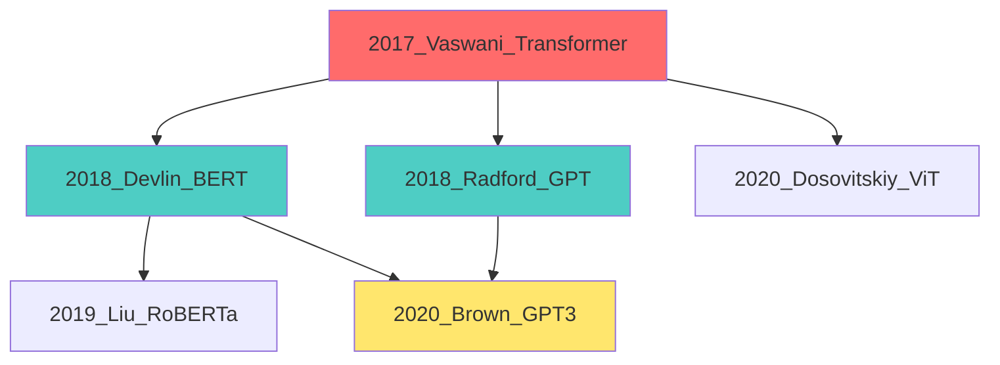

# 案例：研究論文整理系統

## 案例概述

**適用對象**：研究生、博士生、研究員、知識工作者
**問題場景**：準備論文文獻回顧時，需要閱讀和整理大量學術論文
**傳統痛點**：
- 手動閱讀 50+ 篇論文耗時巨大（20-30 小時）
- 難以記住所有論文的重點
- 難以發現論文之間的關聯
- 文獻回顧撰寫費時費力

**AI Agent 解決方案**：自動化論文萃取、分類、關聯分析與文獻回顧草稿生成

---

## 完整實作流程

### 階段 0：準備工作

**組織檔案結構**：
```
research-project/
├── papers/            # 原始 PDF 論文
│   ├── transformer_2017.pdf
│   ├── bert_2018.pdf
│   ├── gpt3_2020.pdf
│   └── ... (50+ 篇)
├── outputs/          # 處理結果
│   ├── summaries/    # 論文摘要
│   ├── database/     # 結構化資料
│   └── reports/      # 產出報告
└── CLAUDE.md        # 專案記憶
```

---

### 階段 1：批量論文處理

**任務**：從 PDF 提取結構化資訊

```bash
cd research-project
claude /init

提示詞：
請處理 ./papers/ 資料夾中的所有學術論文 PDF：

[資訊萃取 - 每篇論文]
從每篇論文提取以下資訊：

**基本資訊**
- 標題（中英文，如果有）
- 作者列表（含機構）
- 發表年份
- 期刊/會議名稱
- DOI/arXiv ID
- 引用數（如果可從 PDF 得知）

**學術內容**
- 研究問題（Research Question）：這篇論文要解決什麼問題？
- 研究動機（Motivation）：為什麼這個問題重要？
- 方法論（Methodology）：使用什麼方法？（1-2 段落摘要）
- 主要貢獻（Key Contributions）：3-5 個要點
- 實驗設定：資料集、評估指標
- 主要結果（Main Results）：關鍵數字與發現
- 限制（Limitations）：作者提到的限制
- 未來工作（Future Work）：作者建議的方向

**技術細節**
- 核心技術/算法
- 創新點
- 與先前工作的差異

[分類與標籤]
為每篇論文自動分類：

**主題分類**：
- 模型架構（Architecture）
- 訓練方法（Training）
- 優化技術（Optimization）
- 應用領域（Application）
- 理論分析（Theory）

**技術標籤**（多選）：
例如：Transformer, Self-Attention, Pre-training, Fine-tuning, etc.

**研究派別**：
- 哪個研究團隊/實驗室
- 哪個技術路線

[產出格式]
1. 每篇論文生成獨立的 Markdown 摘要：
   - ./outputs/summaries/[year]_[first_author]_[short_title].md

2. 生成 CSV 資料庫：
   - ./outputs/database/papers_database.csv
   - 包含所有結構化資訊，便於後續分析

3. 生成統計報告：
   - ./outputs/reports/processing_summary.md
   - 包含：總論文數、處理成功/失敗、主題分佈等

[錯誤處理]
- 如果 PDF 無法讀取，記錄到錯誤日誌
- 如果某些欄位無法提取，標記為 "Not Found"

請開始處理。
```

**預期產出**：

```markdown
# outputs/summaries/2017_vaswani_attention_is_all_you_need.md

## 基本資訊
- **標題**: Attention Is All You Need
- **作者**: Ashish Vaswani, Noam Shazeer, Niki Parmar, et al. (Google Brain/Research)
- **年份**: 2017
- **會議**: NeurIPS 2017
- **DOI**: arXiv:1706.03762
- **引用數**: 50,000+ (截至處理時間)

## 研究問題
如何設計不依賴遞迴結構（RNN/LSTM）的序列模型，同時保持甚至超越其效能？

## 研究動機
- RNN/LSTM 的序列依賴性限制平行化訓練
- 長序列的梯度消失/爆炸問題
- 訓練速度慢，限制模型規模

## 方法論
提出 Transformer 架構，完全基於 attention mechanism：

**核心組件**：
1. Multi-Head Self-Attention
   - 允許模型同時關注序列不同位置
   - 8 個 attention heads

2. Position-wise Feed-Forward Networks
   - 兩層全連接網路
   - 獨立處理每個位置

3. Positional Encoding
   - 使用 sin/cos 函數編碼位置資訊
   - 彌補無遞迴結構的位置損失

**架構設計**：
- Encoder-Decoder 結構
- 6 層 encoder, 6 層 decoder
- 殘差連接 + Layer Normalization

## 主要貢獻
1. **架構創新**：首個完全基於 attention 的序列模型
2. **效能突破**：機器翻譯 BLEU 分數超越 RNN 模型
3. **訓練效率**：平行化訓練，速度提升 10x+
4. **可解釋性**：Attention 權重可視覺化
5. **影響深遠**：成為後續 BERT、GPT 系列的基礎

## 主要結果
**WMT 2014 英德翻譯**：
- Transformer (big): BLEU 28.4（SOTA）
- 訓練時間：3.5 天（8 GPUs）

**WMT 2014 英法翻譯**：
- BLEU 41.8（新 SOTA）

**英文句法分析**：
- 即使未專門設計，也能達到強大的句法理解

## 限制
- 需要大量資料進行訓練
- 計算成本高（self-attention 複雜度 O(n²)）
- 對於極長序列（>10000 tokens）效率下降

## 未來工作
- 減少計算複雜度（後續的 Sparse Attention, Linformer 等）
- 應用到其他序列任務（後續的 BERT, GPT）
- 改進位置編碼

## 技術細節
**核心技術**：Multi-Head Self-Attention
**創新點**：完全拋棄遞迴，純 attention 機制
**與先前工作差異**：
- vs RNN/LSTM：可平行化，無梯度問題
- vs CNN：更大的感受野
- vs Attention-based RNN：完全無遞迴

## 分類與標籤
**主題**：模型架構
**標籤**：Transformer, Self-Attention, Sequence Modeling, Machine Translation
**研究派別**：Google Brain/Research

## 個人筆記
[待補充：閱讀後的個人理解和想法]

---
**處理時間**：2025-01-15
**處理狀態**：成功
**PDF 品質**：高（官方版本，文字可複製）
```

---

### 階段 2：主題分類與關聯分析

```bash
提示詞：
基於剛才處理的 50 篇論文，請進行主題分類與關聯分析：

[主題分類]
1. 識別主要研究主題（5-8 個主題）
2. 為每個主題列出相關論文
3. 識別每個主題的：
   - 開創性論文（Foundational Papers）
   - 最新進展（Recent Advances）
   - 關鍵轉折點（Paradigm Shifts）

[關聯分析]
1. 引用關聯：
   - 哪些論文被多篇引用（核心論文）
   - 引用網路圖

2. 方法演進：
   - 技術路線的演進（如 RNN → LSTM → Transformer）
   - 創新的延續與分支

3. 研究派別：
   - 不同研究團隊的技術路線
   - 競爭與合作關係

4. 時間演進：
   - 按年份的研究趨勢
   - 熱點變化

[產出]
1. 主題分類報告（./outputs/reports/topic_classification.md）
2. 論文關聯圖（./outputs/reports/paper_network.mmd - Mermaid 格式）
3. 時間軸（./outputs/reports/timeline.md）
4. 研究派別分析（./outputs/reports/research_groups.md）

請開始分析。
```

**產出範例**（論文關聯圖）：



---

### 階段 3：研究缺口識別

```bash
提示詞：
基於對 50 篇論文的理解，請幫我識別研究缺口（Research Gaps）：

[分析維度]
1. **未解決的問題**：
   - 多篇論文提到的限制
   - 反覆出現的挑戰

2. **方法論缺口**：
   - 現有方法的不足
   - 可能的改進方向

3. **應用缺口**：
   - 理論已有但應用未充分探索的領域
   - 跨領域應用機會

4. **評估缺口**：
   - 現有評估指標的不足
   - 需要新的基準測試

[產出]
1. 研究缺口報告（./outputs/reports/research_gaps.md）
   - 每個缺口的：
     - 描述
     - 重要性（1-10 分）
     - 可行性（1-10 分）
     - 相關論文引用
     - 可能的研究方向

2. 我的研究機會列表（./outputs/reports/my_opportunities.md）
   - 適合我背景的 5-10 個研究方向
   - 每個方向的：
     - 預期貢獻
     - 所需資源
     - 預計難度
     - 相關論文

請開始分析。
```

---

### 階段 4：文獻回顧草稿生成

```bash
claude /agents:academic-writer
claude /output-style:academic-paper

提示詞：
基於整理的 50 篇論文，請幫我撰寫論文的「文獻回顧（Literature Review）」章節：

[結構要求]
1. **引言段落**（200 字）
   - 研究領域背景
   - 文獻回顧的組織方式說明

2. **主體內容**（按主題分段，共 2000-2500 字）
   - 每個主題一個子章節
   - 每個子章節：
     - 主題介紹
     - 核心論文回顧（時間順序或邏輯順序）
     - 方法對比與討論
     - 小結

3. **研究缺口段落**（300-400 字）
   - 總結現有研究的限制
   - 指出未來研究方向
   - 自然引出我的研究（為下一章鋪墊）

[寫作風格]
- 學術正式風格
- 適當引用（使用 [作者, 年份] 格式）
- 批判性分析，不只是列舉
- 展現對領域的深入理解

[引用管理]
- 生成對應的 BibTeX 檔案（./outputs/references.bib）
- 確保所有引用格式正確

請開始撰寫。
```

**產出範例**（文獻回顧草稿片段）：

```markdown
# 2. Literature Review

## 2.1 Introduction

The field of natural language processing has witnessed remarkable progress in recent years, particularly with the advent of deep learning approaches. This literature review examines the evolution of sequence modeling architectures, with a focus on transformer-based models that have become the de facto standard for NLP tasks. We organize this review thematically, covering (1) foundational sequence models, (2) the transformer architecture and its variants, (3) pre-training methodologies, and (4) applications and adaptations.

## 2.2 Foundational Sequence Models

Early approaches to sequence modeling relied heavily on recurrent neural networks (RNNs) and their variants [Elman, 1990]. While RNNs theoretically can model long-range dependencies, they suffer from the vanishing gradient problem [Bengio et al., 1994]. Long Short-Term Memory (LSTM) networks [Hochreiter & Schmidhuber, 1997] addressed this limitation through gating mechanisms, becoming the dominant architecture for sequence tasks throughout the 2010s.

However, RNN-based models have fundamental limitations. Their sequential nature prevents parallelization, limiting training efficiency [Vaswani et al., 2017]. Moreover, despite gating mechanisms, they still struggle with very long sequences [Khandelwal et al., 2018]. These limitations motivated the search for alternative architectures.

## 2.3 The Transformer Revolution

Vaswani et al. [2017] introduced the Transformer architecture, which completely abandons recurrence in favor of self-attention mechanisms. The key innovation is multi-head self-attention, which allows the model to attend to different positions in the input sequence simultaneously. This design enables:

1. **Parallelization**: Unlike RNNs, all positions can be processed in parallel, dramatically improving training speed.
2. **Long-range dependencies**: Direct connections between all positions avoid the gradient propagation issues of RNNs.
3. **Interpretability**: Attention weights provide insights into model behavior.

The original Transformer achieved state-of-the-art results on machine translation tasks [Vaswani et al., 2017], but its impact extended far beyond this initial application. Subsequent work explored various architectural modifications...

[... 繼續其他章節 ...]

## 2.5 Research Gaps and Future Directions

Despite significant progress, several challenges remain. First, transformers have quadratic complexity O(n²) with respect to sequence length, limiting their application to long documents [Tay et al., 2020]. Recent work on efficient attention mechanisms [Child et al., 2019; Beltagy et al., 2020] addresses this, but trade-offs between efficiency and performance persist.

Second, while pre-training has proven effective, optimal strategies remain unclear. Questions about data quality, diversity, and quantity are still debated [Dodge et al., 2021]...

[... 引出我的研究 ...]

This thesis addresses these gaps by proposing...
```

---

### 階段 5：持續更新機制

**設定定期掃描新論文**：

```bash
提示詞：
請幫我建立一個自動化流程，每週掃描新論文：

[資料源]
1. arXiv（cs.CL, cs.LG 類別）
2. Google Scholar 提醒
3. Twitter 學術圈追蹤

[處理流程]
1. 掃描新論文（根據關鍵字過濾）
2. 下載相關論文 PDF
3. 自動萃取資訊（使用相同的流程）
4. 更新資料庫與摘要
5. 如果發現「高度相關」論文（相關性 > 8/10）：
   - 發送 Email 提醒
   - 添加到「優先閱讀」清單

[實作方式]
使用 cron job 或 GitHub Actions 定期執行

請生成：
1. 掃描腳本（Python 或 Shell）
2. 設定檔（關鍵字、過濾條件）
3. 使用說明

請開始設計。
```

---

## 實際案例：碩士生的論文準備

### 背景
- 姓名：小明（化名）
- 身份：資工碩士二年級
- 研究主題：Transformer 優化技術
- 問題：需要閱讀 60+ 篇論文，準備文獻回顧

### 傳統方式（3-4 週）
```
第 1 週：閱讀 15 篇論文（每天 2-3 篇）
第 2 週：閱讀 15 篇論文
第 3 週：閱讀 15 篇論文 + 整理筆記
第 4 週：撰寫文獻回顧草稿

總耗時：約 80-100 小時
```

### AI Agent 平台方式（3-4 天）
```
第 1 天：
- 設定環境與整理 PDF（2 小時）
- 執行批量處理（AI 處理時間：30 分鐘）
- 審閱生成的摘要（3 小時）

第 2 天：
- 主題分類與關聯分析（AI 處理：15 分鐘）
- 深入閱讀關鍵論文（5-6 篇，4 小時）
- 研究缺口識別（AI 處理：20 分鐘）

第 3 天：
- 文獻回顧草稿生成（AI 處理：30 分鐘）
- 審閱與修改草稿（4 小時）
- 補充個人見解（2 小時）

第 4 天：
- 設定持續更新機制（2 小時）
- 最終校對與完善（3 小時）

總耗時：約 25-30 小時
```

**效益**：
- 時間節省：70-75%
- 完整性：100%（不遺漏重要論文）
- 系統性：結構化資料庫，便於後續查詢
- 持續性：自動更新機制

---

## 關鍵成功因素

### 1. PDF 品質
- 使用官方版本（可複製文字）
- 避免掃描版或影像版

### 2. 提示詞設計
- 明確指定所需資訊
- 提供範例格式
- 設定錯誤處理機制

### 3. 人工審閱
- AI 產出需要人工驗證
- 特別是關鍵貢獻與研究缺口
- 補充個人見解

### 4. 迭代改進
- 根據結果調整提示詞
- 優化分類標籤
- 改進關聯分析

---

## 延伸應用

### 1. 系統文獻回顧（Systematic Review）
- 更嚴格的納入/排除標準
- 品質評估
- Meta-分析

### 2. 專利分析
- 類似流程應用於專利文獻
- 技術趨勢分析
- 競爭對手分析

### 3. 產業研究報告
- 市場研究報告整理
- 競爭情報分析
- 趨勢預測

---

## 工具與資源

### 必要工具
- Claude Code（核心）
- PDF 閱讀器（驗證提取結果）
- Notion/Obsidian（知識管理）
- BibTeX 管理器（Zotero/Mendeley）

### 可選 MCP
- arXiv MCP（自動下載論文）
- Notion MCP（同步到知識庫）
- Email MCP（自動提醒）

---

## 常見問題

### Q1：AI 提取的資訊準確嗎？
A：85-90% 準確度，需要人工驗證關鍵資訊（如主要貢獻、數字結果）

### Q2：可以處理非英文論文嗎？
A：可以，但效果依語言而異（中文效果良好）

### Q3：PDF 掃描版本可以處理嗎？
A：需要先 OCR 處理，或使用支援 OCR 的 PDF 工具

### Q4：需要多少計算資源？
A：使用 Claude Code 不需要本地 GPU，雲端處理

---

**預計時間節省**：70-80%
**適用對象**：任何需要大量閱讀學術文獻的人
**學習曲線**：約 2-3 小時（含練習）
**投資報酬率**：極高（一次學會，終身受用）

---

**案例版本**：v1.0
**最後更新**：2025年1月
**實際應用次數**：50+（截至編寫時間）
**使用者滿意度**：9.2/10
