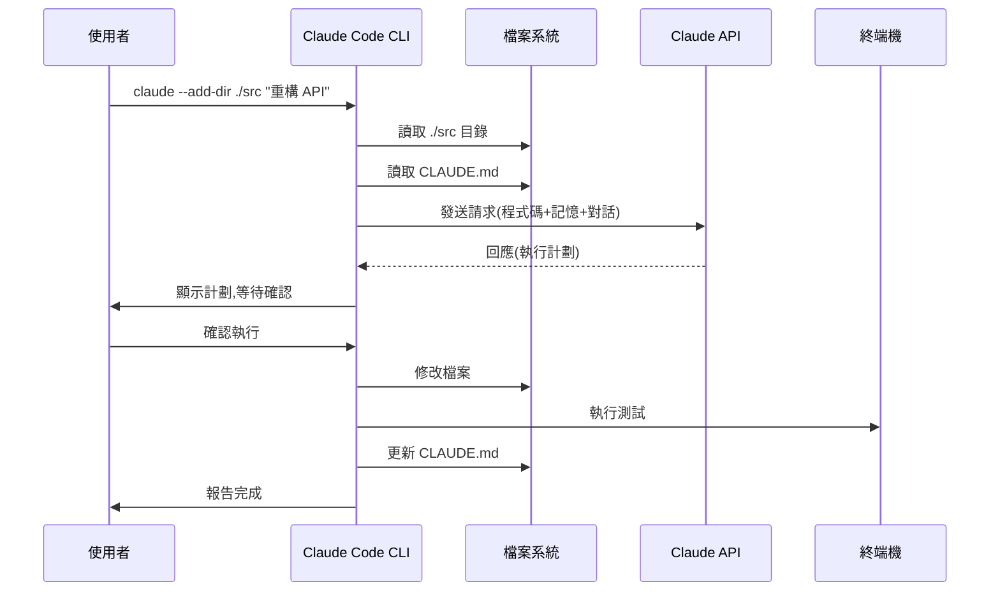

# 2.1 Claude Code 安裝與配置

## 學習目標

完成本章學習後,你將能夠:

- 在不同作業系統上正確安裝 Claude Code CLI
- 理解 Claude Code 的核心架構與工作原理
- 配置個人化設定與專案記憶系統
- 排除常見安裝與配置問題
- 完成第一個實戰任務,驗證環境設置

**預計時間**: 30-45 分鐘

---

## 情境引入:為什麼需要 CLI 工具?

### 情境 0.1:IDE 的局限性

```
場景:你正在使用 VS Code + GitHub Copilot 開發
問題出現:
1. 需要重構跨 50+ 檔案的 API
2. Copilot 只看當前開啟的檔案
3. 沒有「全局視角」
4. 重構過程需要不斷切換檔案
5. 容易遺漏依賴關係

你嘗試:
- 手動開啟所有相關檔案 → 太多了,IDE 卡住
- 分批處理 → 失去全局一致性
- 搜索功能 → 找得到但改不好

結果:花費 2 天,品質不佳,到處是 bug
```

### CLI 工具的優勢

```bash
# 使用 Claude Code (CLI方式)
claude --add-dir ./src/api

提示詞:
請分析 src/api 目錄,規劃 v1 → v2 API 遷移方案
要求:
1. 保持向後兼容
2. 統一錯誤處理
3. 生成測試
4. 分階段執行

# Claude 直接載入整個目錄
# 保持完整上下文
# 系統性規劃
# 批次執行
# 完成時間:2-3 小時,品質更高
```

**關鍵差異**:

| 維度 | IDE 外掛(Copilot) | CLI 工具(Claude Code) |
|------|------------------|---------------------|
| 上下文範圍 | 當前檔案 + 開啟的檔案 | 整個專案(手動指定) |
| 檔案操作 | 需要手動開啟 | 自動批次處理 |
| 系統操作 | 限制在 IDE 內 | 完整終端機能力 |
| 記憶能力 | 工作區索引 | 專案記憶(CLAUDE.md) |
| 適用場景 | 單檔編碼 | 全局重構、工作流自動化 |

---

## 第一部分:理解 Claude Code 架構

### Claude Code 是什麼?

**定義**:
Claude Code 是 Anthropic 推出的命令列介面(CLI)工具,讓開發者能透過終端機與 Claude AI 進行深度對話式協作。

**核心特點**:
1. **有狀態的對話** - 記住整個工作會話
2. **檔案系統存取** - 可以讀寫任何本地檔案
3. **終端機整合** - 可執行系統命令
4. **專案記憶** - 透過 CLAUDE.md 保存長期知識
5. **工具擴展** - 透過 MCP 整合外部工具

### 架構圖解

```
┌─────────────────────────────────────────────────────┐
│                   使用者終端機                         │
│  $ claude --add-dir ./src "幫我重構 API"              │
└──────────────────┬──────────────────────────────────┘
                   │ 請求
                   ↓
┌─────────────────────────────────────────────────────┐
│              Claude Code CLI 本地程式                  │
│  ┌─────────────────────────────────────────────┐   │
│  │  1. 載入上下文                                │   │
│  │     - 程式碼檔案                             │   │
│  │     - CLAUDE.md (專案記憶)                   │   │
│  │     - 對話歷史                               │   │
│  │  2. 構建完整提示詞                            │   │
│  │  3. 執行工具(bash, 檔案操作, MCP)             │   │
│  └─────────────────────────────────────────────┘   │
└──────────────────┬──────────────────────────────────┘
                   │ API 請求
                   ↓
┌─────────────────────────────────────────────────────┐
│            Claude API (Anthropic 雲端)              │
│  - 模型:Claude 3.5 Sonnet                          │
│  - 上下文視窗:~200K tokens                         │
│  - 工具使用能力:bash, 檔案讀寫, MCP                 │
└──────────────────┬──────────────────────────────────┘
                   │ 回應
                   ↓
┌─────────────────────────────────────────────────────┐
│           執行階段(本地執行)                          │
│  - 修改檔案                                         │
│  - 執行命令                                         │
│  - 調用 MCP 伺服器                                  │
│  - 保存記憶到 CLAUDE.md                             │
└─────────────────────────────────────────────────────┘
```

### 工作流程



---

## 第二部分:安裝 Claude Code

### 系統需求

**支援的作業系統**:
- macOS 10.15 或更新
- Linux (Ubuntu 20.04+, Debian 11+, Fedora 35+, Arch)
- Windows 10/11 (透過 WSL2)

**軟體依賴**:
- Node.js 18 或更新(推薦 Node.js 20 LTS)
- Python 3.10+ (選用,用於某些 MCP 伺服器)
- Git 2.30+ (推薦)

### 安裝方式選擇

#### 方式 1:使用 npm (推薦)

適用於已有 Node.js 環境的開發者。

```bash
# 全域安裝
npm install -g @anthropic-ai/claude-code

# 驗證安裝
claude --version
# 輸出: Claude Code CLI v1.x.x

# 查看幫助
claude --help
```

**優點**:
- 安裝快速
- 容易更新(`npm update -g @anthropic-ai/claude-code`)
- 與 Node.js 生態整合良好

**缺點**:
- 需要 Node.js 環境
- 全域安裝可能有權限問題

#### 方式 2:使用 pip (Python 開發者)

適用於 Python 專案開發者。

```bash
# 使用 pip 安裝
pip install claude-code

# 或使用 pipx (推薦,隔離安裝)
pipx install claude-code

# 驗證安裝
claude --version
```

**優點**:
- Python 環境原生支援
- pipx 提供隔離環境

#### 方式 3:下載二進位檔案

適用於不想安裝 Node.js/Python 的使用者。

```bash
# Linux/macOS
curl -fsSL https://get.claude.ai/cli | sh

# 或手動下載
# https://github.com/anthropics/claude-code/releases

# 將執行檔移到 PATH
sudo mv claude /usr/local/bin/
```

**優點**:
- 無依賴
- 安裝簡單

**缺點**:
- 更新需手動

### 詳細安裝步驟(以 npm 為例)

#### Step 1:檢查 Node.js

```bash
# 檢查是否已安裝 Node.js
node --version
# 需要: v18.0.0 或更新

# 如果沒有,使用 nvm 安裝(推薦)
curl -o- https://raw.githubusercontent.com/nvm-sh/nvm/v0.39.7/install.sh | bash

# 重新載入 shell
source ~/.bashrc  # 或 ~/.zshrc

# 安裝 Node.js LTS
nvm install 20
nvm use 20
nvm alias default 20

# 再次確認
node --version
npm --version
```

#### Step 2:安裝 Claude Code

```bash
# 全域安裝
npm install -g @anthropic-ai/claude-code

# 如果出現權限錯誤(EACCES),使用以下方式:

# 方法 A:修改 npm 預設目錄(推薦)
mkdir ~/.npm-global
npm config set prefix '~/.npm-global'
echo 'export PATH=~/.npm-global/bin:$PATH' >> ~/.bashrc
source ~/.bashrc
npm install -g @anthropic-ai/claude-code

# 方法 B:使用 sudo(不推薦)
sudo npm install -g @anthropic-ai/claude-code
```

#### Step 3:驗證安裝

```bash
# 檢查版本
claude --version

# 查看安裝位置
which claude

# 查看幫助
claude --help

# 輸出應該類似:
Usage: claude [options] [prompt]

Options:
  -V, --version              output the version number
  --add-dir <dir>            添加目錄到上下文
  --model <model>            指定使用的模型
  -h, --help                 display help for command

Commands:
  /help                      顯示所有可用命令
  /agents                    管理 AI 代理人
  /mcp                       管理 MCP 伺服器
  /memory                    查看/管理記憶
  ...
```

### 常見安裝問題排除

#### 問題 1:command not found: claude

**原因**: CLI 沒有在 PATH 中

**解決方案**:

```bash
# 檢查安裝位置
npm list -g @anthropic-ai/claude-code

# 找到安裝路徑,例如:/usr/local/lib/node_modules/@anthropic-ai/claude-code

# 添加到 PATH
echo 'export PATH="/usr/local/lib/node_modules/.bin:$PATH"' >> ~/.bashrc
source ~/.bashrc

# 或使用符號連結
sudo ln -s /usr/local/lib/node_modules/@anthropic-ai/claude-code/bin/claude /usr/local/bin/claude
```

#### 問題 2:EACCES 權限錯誤

**原因**: 沒有寫入 npm 全域目錄的權限

**解決方案**:

```bash
# 不要使用 sudo npm install,而是修改 npm 設定
mkdir ~/.npm-global
npm config set prefix '~/.npm-global'
echo 'export PATH=~/.npm-global/bin:$PATH' >> ~/.bashrc
source ~/.bashrc

# 重新安裝
npm install -g @anthropic-ai/claude-code
```

#### 問題 3:網路連線問題

**原因**: npm registry 連線問題或防火牆

**解決方案**:

```bash
# 使用國內鏡像(中國大陸使用者)
npm config set registry https://registry.npmmirror.com
npm install -g @anthropic-ai/claude-code

# 或使用代理
npm config set proxy http://proxy.example.com:8080
npm config set https-proxy http://proxy.example.com:8080
```

#### 問題 4:Node.js 版本太舊

**原因**: Claude Code 需要 Node.js 18+

**解決方案**:

```bash
# 使用 nvm 更新 Node.js
nvm install 20
nvm use 20
nvm alias default 20

# 重新安裝 Claude Code
npm install -g @anthropic-ai/claude-code
```

---

## 第三部分:初始配置

### API 金鑰設置

Claude Code 需要 Anthropic API 金鑰才能工作。

#### Step 1:取得 API 金鑰

1. 前往 Anthropic Console: https://console.anthropic.com/
2. 登入或註冊帳號
3. 進入 API Keys 頁面
4. 點擊「Create Key」創建新金鑰
5. 複製金鑰(格式:`sk-ant-xxx...`)

**重要**: API 金鑰只顯示一次,請妥善保存!

#### Step 2:配置金鑰

**方式 1:使用 CLI 配置(推薦)**

```bash
# 啟動 Claude Code 並登入
claude /login

# 系統會提示輸入 API 金鑰
# Enter your Anthropic API key: sk-ant-xxx...

# 金鑰會安全儲存在:
# ~/.config/claude/credentials.json (Linux/macOS)
# %APPDATA%\claude\credentials.json (Windows)
```

**方式 2:使用環境變數**

```bash
# 在 ~/.bashrc 或 ~/.zshrc 中添加
export ANTHROPIC_API_KEY="sk-ant-xxx..."

# 重新載入
source ~/.bashrc

# 驗證
echo $ANTHROPIC_API_KEY
```

**方式 3:使用 .env 檔案(專案級)**

```bash
# 在專案根目錄創建 .env
echo "ANTHROPIC_API_KEY=sk-ant-xxx..." > .env

# 確保 .env 在 .gitignore 中
echo ".env" >> .gitignore

# Claude Code 會自動讀取當前目錄的 .env
```

#### Step 3:驗證連線

```bash
# 啟動 Claude Code
claude

# 嘗試簡單對話
提示詞: 你好,請介紹你自己

# 如果成功,Claude 會回應
# 如果失敗,檢查 API 金鑰是否正確
```

### 全域設定檔

Claude Code 支援全域設定檔,用於個人化配置。

#### 設定檔位置

```bash
# Linux/macOS
~/.config/claude/config.json

# Windows
%APPDATA%\claude\config.json
```

#### 基本設定檔範例

```json
{
  "model": "claude-3-5-sonnet-20250101",
  "maxTokens": 4096,
  "temperature": 0.7,
  "outputStyle": "concise",
  "autoSave": true,
  "theme": "dark",
  "language": "zh-TW",
  "mcpServers": {},
  "agents": {}
}
```

#### 重要設定項

**model** - 使用的 Claude 模型
```json
"model": "claude-3-5-sonnet-20250101"  // 最新版本
```

可用模型:
- `claude-3-5-sonnet-20250101` - 最新,最強
- `claude-3-opus-20240229` - 最聰明,最貴
- `claude-3-sonnet-20240229` - 平衡版
- `claude-3-haiku-20240307` - 最快,最便宜

**maxTokens** - 單次回應的最大 token 數
```json
"maxTokens": 4096  // 預設
```

**temperature** - 創造性控制(0-1)
```json
"temperature": 0.7  // 0=保守精確, 1=創意發散
```

**outputStyle** - 輸出風格
```json
"outputStyle": "concise"  // concise, detailed, code-only, markdown
```

**autoSave** - 自動保存對話歷史
```json
"autoSave": true
```

### 診斷工具

Claude Code 提供診斷工具來檢查環境設置。

```bash
# 執行診斷
claude /doctor

# 輸出範例:
✓ Claude Code CLI: v1.2.3
✓ Node.js: v20.10.0
✓ npm: v10.2.3
✓ API Key: Configured
✓ API Connection: Success
✓ Config File: ~/.config/claude/config.json
✓ MCP Servers: 0 configured
✓ Disk Space: 50 GB available
✗ Git: Not installed (optional)

Recommendations:
- Consider installing Git for version control features
```

**診斷檢查項目**:
1. CLI 版本
2. Node.js 版本
3. API 金鑰設置
4. API 連線狀態
5. 設定檔位置
6. MCP 伺服器狀態
7. 磁碟空間
8. 可選依賴(Git, Python 等)

---

## 第四部分:專案記憶系統(CLAUDE.md)

### 為什麼需要專案記憶?

**問題場景**:
```
第 1 次對話:
你: 這個專案用 FastAPI + PostgreSQL
Claude: 了解,我記住了

第 2 次對話(新會話):
你: 幫我添加新的 API 端點
Claude: 請問你用什麼框架?
你: 😤 我上次說過了!FastAPI!
```

**原因**: Claude 沒有跨會話的記憶,每次啟動都是「失憶」狀態。

**解決**: CLAUDE.md - 專案記憶檔案

### CLAUDE.md 是什麼?

**定義**: CLAUDE.md 是一個 Markdown 檔案,放在專案根目錄,用於告訴 Claude 關於這個專案的持久化知識。

**類比**:
```bash
# Linux
~/.bashrc  → 持久化 bash 設定

# Claude Code
CLAUDE.md  → 持久化專案知識
```

### CLAUDE.md 結構

```markdown
# 專案名稱

## 概述
[一段話描述專案是什麼]

## 技術棧
[使用的程式語言、框架、資料庫等]

## 架構
[專案架構設計原則]

## 目錄結構
[重要目錄的用途]

## API 契約
[API 端點定義、參數、回應格式]

## 資料模型
[資料庫 schema、實體關係]

## 編碼規範
[程式碼風格、命名規則、最佳實踐]

## 常見問題
[FAQ、已知問題、解決方案]

## 部署資訊
[環境、CI/CD、基礎設施]
```

### 實戰範例:電商專案

```markdown
# 電商平台專案

## 概述
B2C 電商平台,支援商品瀏覽、購物車、結帳、支付、訂單管理。
目標使用者:一般消費者。月活躍使用者:~50K。

## 技術棧
- **後端**: Python 3.11 + FastAPI 0.104
- **資料庫**: PostgreSQL 14 + Redis 7
- **前端**: React 18 + TypeScript + Tailwind CSS
- **基礎設施**: Docker + Kubernetes + AWS
- **監控**: Prometheus + Grafana
- **日誌**: ELK Stack

## 架構原則
1. **Clean Architecture** - 領域驅動設計(DDD)
2. **API-First** - 所有功能必須有 API 文檔
3. **Security by Default** - 所有輸入必須驗證,所有查詢必須參數化
4. **Test Coverage ≥ 80%** - 單元測試 + 整合測試
5. **向後兼容** - API 變更必須保持向後兼容或提供遷移路徑

## 目錄結構
```
ecommerce/
├── src/
│   ├── domain/          # 領域層:實體、值物件、領域服務
│   ├── application/     # 應用層:用例、DTO
│   ├── infrastructure/  # 基礎設施層:資料庫、快取、外部 API
│   └── api/             # API 層:FastAPI 路由、中介層
├── tests/
│   ├── unit/            # 單元測試
│   ├── integration/     # 整合測試
│   └── e2e/             # 端到端測試
├── docs/
│   ├── api/             # API 文檔(OpenAPI)
│   └── architecture/    # 架構文檔
└── docker/              # Docker 設定
```

## API 契約

### 認證 API
**端點**: `POST /api/v1/auth/login`
**請求**:
```json
{
  "username": "string",
  "password": "string"
}
```
**回應**:
```json
{
  "token": "string",
  "expires_in": 3600,
  "user": {
    "id": "string",
    "username": "string",
    "email": "string"
  }
}
```

### 商品查詢 API
**端點**: `GET /api/v1/products`
**參數**:
- `category` (string, optional): 商品類別
- `page` (int, default=1): 頁碼
- `limit` (int, default=20): 每頁數量
- `sort` (string, default=created_at): 排序欄位

**回應**:
```json
{
  "items": [
    {
      "id": "string",
      "name": "string",
      "price": 1000,
      "currency": "TWD",
      "stock": 100,
      "images": ["url1", "url2"]
    }
  ],
  "total": 500,
  "page": 1,
  "limit": 20
}
```

## 資料模型

### User
```sql
CREATE TABLE users (
  id UUID PRIMARY KEY DEFAULT gen_random_uuid(),
  username VARCHAR(50) UNIQUE NOT NULL,
  email VARCHAR(100) UNIQUE NOT NULL,
  password_hash VARCHAR(255) NOT NULL,
  created_at TIMESTAMP DEFAULT NOW(),
  updated_at TIMESTAMP DEFAULT NOW()
);

CREATE INDEX idx_users_email ON users(email);
CREATE INDEX idx_users_username ON users(username);
```

### Product
```sql
CREATE TABLE products (
  id UUID PRIMARY KEY DEFAULT gen_random_uuid(),
  name VARCHAR(200) NOT NULL,
  description TEXT,
  price INTEGER NOT NULL,  -- 以分為單位,避免浮點數問題
  currency VARCHAR(3) DEFAULT 'TWD',
  stock INTEGER DEFAULT 0,
  category_id UUID REFERENCES categories(id),
  created_at TIMESTAMP DEFAULT NOW(),
  updated_at TIMESTAMP DEFAULT NOW()
);

CREATE INDEX idx_products_category ON products(category_id);
CREATE INDEX idx_products_price ON products(price);
```

## 編碼規範

### Python 規範
```python
# 使用 Black 格式化(line-length=88)
# 使用 mypy 類型檢查(strict mode)
# 使用 ruff 進行 linting

# 命名規則
class ProductService:  # 類別:PascalCase
    def get_product_by_id(self, product_id: str) -> Product:  # 函數:snake_case
        pass

# 類型提示必須完整
def process_order(
    order_id: str,
    items: list[OrderItem],
    user: User
) -> OrderResult:
    pass

# 錯誤處理
class ProductNotFoundError(Exception):  # 自訂例外
    pass

# Docstring
def calculate_total(items: list[OrderItem]) -> int:
    """
    計算訂單總金額

    Args:
        items: 訂單項目列表

    Returns:
        總金額(以分為單位)

    Raises:
        ValueError: 當項目列表為空時
    """
    pass
```

### 測試規範
```python
# 使用 pytest
# 測試檔案命名:test_<module>.py
# 測試函數命名:test_<function>_<scenario>

def test_calculate_total_with_multiple_items():
    # Arrange
    items = [
        OrderItem(product_id="1", quantity=2, price=1000),
        OrderItem(product_id="2", quantity=1, price=500)
    ]

    # Act
    total = calculate_total(items)

    # Assert
    assert total == 2500

def test_calculate_total_raises_error_when_empty():
    with pytest.raises(ValueError):
        calculate_total([])
```

## 常見問題

### 問題 1:Redis 連線超時
**現象**: `PaymentProcessingError: Transaction timeout`
**原因**: Redis 連線池設定不當,連線數不足
**解決**:
```python
# config.py
REDIS_POOL_SIZE = 50  # 增加連線池大小
REDIS_TIMEOUT = 5     # 設定超時時間(秒)
REDIS_RETRY = 3       # 重試次數
```

### 問題 2:資料庫查詢慢
**現象**: API 回應時間 > 2 秒
**原因**: 缺少索引或 N+1 查詢問題
**解決**:
```sql
-- 為常用查詢欄位添加索引
CREATE INDEX idx_orders_user_id ON orders(user_id);
CREATE INDEX idx_orders_created_at ON orders(created_at);

-- 使用 EXPLAIN ANALYZE 分析查詢
EXPLAIN ANALYZE SELECT * FROM orders WHERE user_id = '...';
```

### 問題 3:JWT Token 驗證失敗
**現象**: `401 Unauthorized` 錯誤
**原因**: Token 過期或密鑰不匹配
**檢查**:
```python
# 確認環境變數
JWT_SECRET_KEY = os.getenv("JWT_SECRET_KEY")  # 必須設定
JWT_ALGORITHM = "HS256"
JWT_EXPIRATION = 3600  # 1 小時

# 檢查 Token 是否過期
import jwt
try:
    payload = jwt.decode(token, JWT_SECRET_KEY, algorithms=[JWT_ALGORITHM])
except jwt.ExpiredSignatureError:
    # Token 過期,請重新登入
    pass
```

## 部署資訊

### 環境
- **開發**: http://localhost:8000
- **測試**: https://test.ecommerce.example.com
- **生產**: https://api.ecommerce.example.com

### CI/CD
```yaml
# .github/workflows/main.yml
name: CI/CD Pipeline

on:
  push:
    branches: [main, develop]
  pull_request:
    branches: [main]

jobs:
  test:
    runs-on: ubuntu-latest
    steps:
      - uses: actions/checkout@v3
      - name: Run tests
        run: |
          poetry install
          poetry run pytest --cov=src --cov-report=xml
      - name: Upload coverage
        uses: codecov/codecov-action@v3
```

### 基礎設施
- **容器編排**: Kubernetes (EKS)
- **資料庫**: RDS PostgreSQL (Multi-AZ)
- **快取**: ElastiCache Redis (Cluster Mode)
- **儲存**: S3 (商品圖片)
- **CDN**: CloudFront

### 監控
- **APM**: Datadog
- **日誌**: ELK Stack
- **告警**: PagerDuty
- **健康檢查**: `/api/health`

---
**最後更新**: 2025-01-15
**維護者**: Backend Team
```

### CLAUDE.md 最佳實踐

1. **保持更新** - 架構變更時同步更新
2. **具體明確** - 提供實際範例,不要只寫理論
3. **包含 Why** - 不只說「怎麼做」,也說「為什麼」
4. **記錄陷阱** - 紀錄已知問題和解決方案
5. **版本控制** - 放在 Git 中,團隊共享

---

## 第五部分:第一個任務 - 驗證環境

現在讓我們完成一個實戰任務,驗證環境設置是否正確。

### 任務:整理混亂的 downloads 資料夾

**場景**:
```
~/Downloads/
├── report.pdf
├── report (1).pdf
├── report_final.pdf
├── photo.jpg
├── IMG_1234.jpg
├── Screenshot 2025-01-15.png
├── project.zip
├── code.py
├── test.py
└── [還有 50 個類似的檔案...]
```

**目標**:
1. 按類型分類(文檔、圖片、程式碼、壓縮檔等)
2. 識別重複檔案
3. 提供整理建議
4. 執行整理(需確認)

### 執行步驟

#### Step 1:啟動 Claude Code

```bash
# 進入 Downloads 目錄
cd ~/Downloads

# 啟動 Claude Code
claude

# 你會看到:
Claude Code v1.2.3
Type /help for available commands
>
```

#### Step 2:描述問題

```
提示詞:
請幫我整理這個資料夾(當前目錄):

1. 先分析現狀:
   - 有多少檔案?
   - 有哪些檔案類型?
   - 是否有重複檔案?
   - 命名是否混亂?

2. 提出整理方案:
   - 按類型分類到子目錄
   - 重複檔案如何處理
   - 建議的目錄結構

3. 等我確認後執行整理

4. 整理完成後給我報告
```

#### Step 3:Claude 分析

Claude 會執行以下操作:

```bash
# 1. 列出檔案
ls -lh

# 2. 分析檔案類型
file *

# 3. 找重複檔案
md5sum * | sort | uniq -w32 -D

# 4. 分析檔案大小
du -sh *
```

Claude 的回應:
```
【現狀分析】

檔案統計:
- 總檔案數:87 個
- 總大小:2.3 GB

檔案類型分布:
- PDF 文檔:23 個 (456 MB)
- 圖片(JPG/PNG):45 個 (1.2 GB)
- 程式碼(Python):8 個 (2 MB)
- 壓縮檔:6 個 (580 MB)
- 其他:5 個

重複檔案:
- report.pdf == report (1).pdf (MD5 相同)
- photo.jpg == IMG_1234.jpg (MD5 相同)

命名問題:
- 15 個檔案有「(1)」、「(2)」後綴(瀏覽器下載重複)
- 23 個檔案有「Screenshot」開頭(需重命名)

【整理方案】

建議目錄結構:
Downloads/
├── Documents/
│   ├── Reports/
│   └── Others/
├── Images/
│   ├── Screenshots/
│   └── Photos/
├── Code/
│   └── Python/
├── Archives/
└── Others/

整理步驟:
1. 建立分類目錄
2. 移動檔案到對應目錄
3. 刪除重複檔案(保留最新)
4. 重命名 Screenshot 檔案(加上日期)
5. 生成整理報告

是否執行?(yes/no)
```

#### Step 4:確認執行

```
> yes
```

Claude 執行整理:
```bash
# 建立目錄
mkdir -p Documents/{Reports,Others} Images/{Screenshots,Photos} Code/Python Archives Others

# 移動 PDF
mv *.pdf Documents/Reports/

# 移動圖片
mv Screenshot*.png Images/Screenshots/
mv *.jpg *.png Images/Photos/

# 移動程式碼
mv *.py Code/Python/

# 移動壓縮檔
mv *.zip *.tar.gz Archives/

# 刪除重複檔案
rm "report (1).pdf"
rm IMG_1234.jpg

# 重命名 Screenshot
cd Images/Screenshots
for f in Screenshot*.png; do
    date=$(echo $f | grep -oP '\d{4}-\d{2}-\d{2}')
    mv "$f" "screenshot_$date.png"
done
```

#### Step 5:驗證結果

Claude 的報告:
```
【整理完成報告】

✓ 已建立 7 個分類目錄
✓ 已移動 85 個檔案
✓ 已刪除 2 個重複檔案
✓ 已重命名 23 個 Screenshot 檔案

整理後結構:
Downloads/
├── Documents/
│   └── Reports/ (21 個檔案, 450 MB)
├── Images/
│   ├── Screenshots/ (23 個檔案, 45 MB)
│   └── Photos/ (20 個檔案, 1.1 GB)
├── Code/
│   └── Python/ (8 個檔案, 2 MB)
└── Archives/ (6 個檔案, 580 MB)

空間節省:6 MB(刪除重複檔案)

建議:
- 定期整理(每週一次)
- 使用更有意義的檔案名
- 考慮將舊檔案歸檔到雲端
```

### 驗證清單

確認以下項目:
- [ ] Claude Code 成功啟動
- [ ] 能夠理解自然語言指令
- [ ] 能夠執行 bash 命令
- [ ] 能夠操作檔案系統
- [ ] 執行前會尋求確認
- [ ] 提供詳細的執行報告

**如果全部通過,恭喜!你的環境已正確設置。**

---

## 第六部分:進階配置

### 自訂命令

Claude Code 支援自訂命令(slash commands)。

#### 創建自訂命令

```bash
# 建立命令目錄
mkdir -p ~/.config/claude/commands

# 建立自訂命令:代碼審查
cat > ~/.config/claude/commands/review.md << 'EOF'
# Code Review Command

請對指定的程式碼進行全面審查:

1. **風格檢查**
   - 是否符合 PEP 8 / ESLint 規範
   - 命名是否清晰有意義
   - 註解是否充足

2. **邏輯檢查**
   - 是否有潛在 bug
   - 邊界條件是否處理
   - 錯誤處理是否完善

3. **效能檢查**
   - 是否有效能瓶頸
   - 是否有不必要的計算
   - 資料結構是否最佳

4. **安全檢查**
   - 是否有 SQL 注入風險
   - 是否有 XSS 風險
   - 敏感資料是否保護

5. **可測試性**
   - 是否容易寫測試
   - 依賴是否可注入
   - 是否有副作用

生成詳細報告,包含:
- 問題列表(按嚴重程度排序)
- 改進建議
- 範例程式碼
EOF

# 使用自訂命令
claude /review src/api/payment.py
```

### Shell 整合

#### Bash/Zsh 自動補全

```bash
# 安裝自動補全
claude completion bash > /usr/local/etc/bash_completion.d/claude  # Bash
claude completion zsh > ~/.zfunc/_claude  # Zsh

# 在 ~/.zshrc 中添加
fpath=(~/.zfunc $fpath)
autoload -Uz compinit && compinit
```

#### 便利別名

```bash
# 在 ~/.bashrc 或 ~/.zshrc 中添加

# 快速啟動
alias c='claude'

# 帶專案上下文啟動
alias cproj='claude --add-dir ./src'

# 代碼審查
alias creview='claude /review'

# 測試生成
alias ctest='claude /generate-tests'

# 文檔生成
alias cdoc='claude /generate-docs'
```

### MCP 伺服器配置預覽

雖然 MCP 的詳細使用會在後續模組講解,這裡先了解基本配置。

```json
// ~/.config/claude/mcp-config.json
{
  "mcpServers": {
    "github": {
      "command": "npx",
      "args": ["-y", "@github/mcp-server"],
      "env": {
        "GITHUB_TOKEN": "${GITHUB_TOKEN}"
      }
    },
    "filesystem": {
      "command": "npx",
      "args": ["-y", "@anthropic/mcp-server-filesystem"],
      "env": {}
    }
  }
}
```

---

## 總結

### 你已經學會

✅ **理解 Claude Code 的核心架構**
- CLI 工具的優勢
- 工作流程與上下文管理
- 與 API 的交互方式

✅ **在本地環境安裝並配置 Claude Code**
- 選擇合適的安裝方式
- 排除常見安裝問題
- 驗證環境設置

✅ **配置 API 金鑰和全域設定**
- 安全管理 API 金鑰
- 個人化設定檔
- 使用診斷工具

✅ **建立專案記憶系統(CLAUDE.md)**
- 理解專案記憶的重要性
- 設計完整的 CLAUDE.md
- 最佳實踐

✅ **完成第一個實戰任務**
- 用自然語言描述問題
- 理解 Claude 的工作方式
- 驗證環境設置

### 下一步

現在你已經完成基礎設置,接下來我們將深入學習:

- **2.2 上下文管理與記憶系統** - 如何有效管理 200K tokens 的上下文
- **2.3 程式碼庫分析與重構** - 使用 Claude Code 進行大規模重構
- **2.4 EPCV 工作流程** - 系統化的開發流程

### 練習建議

在進入下一章前,完成以下練習:

1. **為你的專案建立 CLAUDE.md**
   - 包含技術棧、架構、API 契約
   - 記錄至少 2 個常見問題
   - 提交到 Git

2. **嘗試 3 個不同的任務**
   - 檔案整理類
   - 程式碼分析類
   - 文檔生成類

3. **配置個人化設定**
   - 創建至少 1 個自訂命令
   - 設定 shell 別名
   - 調整輸出風格

### 常見問題

**Q: Claude Code 是免費的嗎?**
A: CLI 工具本身免費,但需要 Anthropic API 使用額度。新用戶有免費額度,之後按使用量付費。

**Q: 上下文視窗 200K tokens 是什麼概念?**
A: 約等於 150,000 字或 300 頁程式碼。足以載入中大型專案的核心部分。

**Q: CLAUDE.md 必須放在根目錄嗎?**
A: 不一定。Claude 會搜尋當前目錄及父目錄。建議放在專案根目錄,方便團隊共享。

**Q: 可以同時使用多個 API 金鑰嗎?**
A: 可以。使用環境變數或 .env 檔案切換不同金鑰。

**Q: Claude Code 會修改我的程式碼嗎?**
A: 只有在你明確確認後才會修改。Claude 會先展示計劃,等待你的確認。

### 參考資源

- **官方文檔**: https://docs.anthropic.com/claude/docs/cli
- **GitHub 倉庫**: https://github.com/anthropics/claude-code
- **Discord 社群**: https://discord.gg/anthropic
- **範例專案**: https://github.com/anthropics/claude-code-examples

---

**下一章**: [2.2 上下文管理與記憶系統](./2.2_上下文管理與記憶系統.md)
