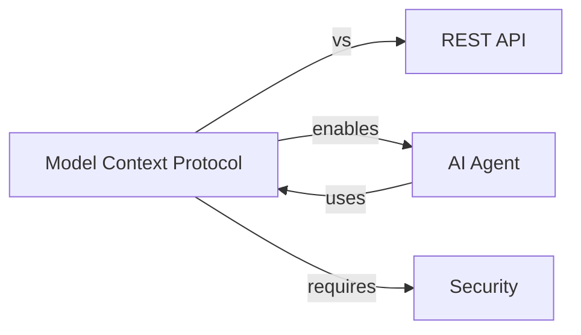

# C02: 知識萃取系統 - 從網路文章到結構化知識庫

## 📋 情境描述

### 你的痛點

作為技術學習者，你每天閱讀大量技術文章，但：

**手動整理的痛苦**：
1. 看完文章 → 複製到 Notion → 手動整理筆記
2. 想做 Anki 卡片 → 手動提取問答 → 逐一製作
3. 知識分散 → 難以建立連結 → 無法形成知識圖譜
4. **每篇文章整理耗時 30-60 分鐘**

### 你想要的

> "給我一個 URL，AI 自動萃取知識、整理成 Notion 頁面、生成 Anki 卡片、建立知識連結..."

**這就是本情境要實現的知識萃取管道！**

---

## 🎯 學習目標

- [ ] 設計知識萃取自動化流程
- [ ] 掌握 Web Scraping + Notion + File System MCP 協同
- [ ] 學會內容分析與知識結構化
- [ ] 實作 Anki 記憶卡自動生成
- [ ] 建立知識圖譜連結

**時間**：2.5 小時

---

## 系統架構

```
輸入：文章 URL

階段 1：內容獲取（串行）
├─ Web Scraping MCP：抓取網頁內容
├─ 解析 HTML → Markdown
└─ 提取元資訊（標題、作者、日期）

階段 2：內容分析（串行）
├─ Content Analyzer Agent
│   ├─ 識別文章類型（技術/理論/實戰）
│   ├─ 提取關鍵主題
│   └─ 評估重要性
└─ Knowledge Extractor Agent
    ├─ 提取核心概念（3-5 個）
    ├─ 識別關鍵論點
    ├─ 提取程式碼範例
    └─ 整理為結構化筆記

階段 3：多輸出生成（並行）
├─ Task 3.1: Notion 頁面
│   ├─ 使用知識筆記模板
│   ├─ 填入結構化內容
│   └─ 添加標籤與分類
└─ Task 3.2: Anki 記憶卡
    ├─ 生成概念定義卡片
    ├─ 生成情境應用卡片
    ├─ 生成對比辨析卡片
    └─ 儲存為 .apkg 檔案

階段 4：知識圖譜（條件）
if 相關主題已存在:
    ├─ 搜尋 Notion 中的相關頁面
    ├─ 建立雙向連結
    └─ 更新知識圖譜
else:
    └─ 創建新的知識節點

輸出：
- Notion 頁面連結
- Anki 卡片檔案
- 知識圖譜已更新
```

---

## 第一部分：準備工作（15 分鐘）

### 配置 MCP

需要：
- Web Scraping MCP (或使用 WebFetch tool)
- Notion MCP
- File System MCP

### Notion 準備

創建「知識庫」Database，欄位：
- 標題 (Title)
- 分類 (Select): 技術/理論/實戰
- 標籤 (Multi-select)
- 來源 URL (URL)
- 重要性 (Select): ⭐⭐⭐⭐⭐
- 日期 (Date)
- 相關連結 (Relation)

---

## 第二部分：實作萃取流程（90 分鐘）

### 測試 1：單篇文章萃取

```
You: "萃取這篇文章的知識：
https://example.com/article/understanding-mcp

流程：
1. 抓取內容並解析
2. 提取核心概念
3. 創建 Notion 頁面
4. 生成 Anki 卡片
5. 建立知識連結

開始執行"
```

**預期輸出**：

```
【階段 1：內容獲取】
✅ 已抓取文章內容
標題：Understanding MCP Protocol
作者：John Doe
日期：2025-10-15
字數：2,500 字

【階段 2：內容分析】
分類：技術
重要性：⭐⭐⭐⭐☆

核心概念（5 個）：
1. Model Context Protocol (MCP)
2. AI Agent Communication
3. Protocol vs API
4. Context Mounting
5. Security Best Practices

關鍵論點（3 個）：
1. MCP 讓 AI 主動調用外部系統
2. 類比 Linux mount 的設計理念
3. 權限最小化是核心原則

【階段 3：多輸出生成】
✅ Notion 頁面已創建：
   https://notion.so/Understanding-MCP-Protocol

✅ Anki 卡片已生成：
   檔案：knowledge_cards.apkg
   卡片數：15 張
   - 概念定義：5 張
   - 情境應用：5 張
   - 對比辨析：5 張

【階段 4：知識圖譜】
找到 3 個相關主題：
- AI Agent Architecture
- API Design Patterns
- Security Best Practices

已建立雙向連結 ✓

【完成！】
⏱️  執行時間：3 分鐘
📊 萃取效率：30 分鐘手動 → 3 分鐘自動（10x 提升）
```

---

### Notion 頁面範本

```markdown
# {文章標題}

## 📝 元資訊
- **來源**：{URL}
- **作者**：{作者}
- **日期**：{日期}
- **分類**：{技術/理論/實戰}
- **重要性**：⭐⭐⭐⭐☆

## 💡 核心概念

### 概念 1：{概念名稱}
{AI 生成的定義}

**關鍵點**：
- {要點 1}
- {要點 2}

### 概念 2：{概念名稱}
...

## 🎯 主要論點

1. **{論點 1}**
   - 支持論據：{論據}
   - 實例：{實例}

2. **{論點 2}**
   ...

## 💻 程式碼範例

```language
{AI 提取的程式碼}
```

**說明**：{AI 生成的說明}

## 🔗 相關主題
- [[相關主題 1]]
- [[相關主題 2]]

## 🤔 個人思考
{AI 生成的連結與洞察}

## 📚 延伸閱讀
- {相關文章 1}
- {相關文章 2}

---
*由 AI 自動萃取 • {時間戳記}*
```

---

### Anki 卡片範例

**卡片類型 1：概念定義**
```
正面：
【概念】什麼是 Model Context Protocol (MCP)？

背面：
【定義】MCP 是一個標準化協議，讓 AI 可以主動調用外部系統的 API。

【關鍵點】
- 類比 Linux 的 mount 指令
- AI 主動探索 vs 被動等待
- 支援動態多輪互動

【來源】Understanding MCP Protocol
```

**卡片類型 2：情境應用**
```
正面：
【情境】什麼時候應該使用 MCP 而非傳統 REST API？

背面：
【適用場景】
1. 需要 AI 主動決策調用哪些資料
2. 多輪對話式的資料探索
3. 動態組合多個資料來源
4. AI 輔助的自動化工作流程

【不適用】
- 傳統的前後端 API 調用
- 靜態的資料交換

【來源】Understanding MCP Protocol
```

---

### 測試 2：批次萃取

```
You: "批次萃取以下 5 篇文章：
1. {URL 1}
2. {URL 2}
3. {URL 3}
4. {URL 4}
5. {URL 5}

要求：
- 並行抓取（加速）
- 自動分類
- 建立文章間的連結
- 生成統一的 Anki 卡片組"
```

---

## 第三部分：進階功能（45 分鐘）

### 功能 1：知識圖譜視覺化

```
You: "分析知識庫中的所有筆記，
生成知識圖譜：
- 節點：概念
- 邊：概念之間的關聯
- 輸出：Mermaid diagram"
```

**輸出範例**：


### 功能 2：智能摘要

```
You: "為這個主題生成摘要：
主題：MCP 協議

包含：
- 從所有相關筆記提取資訊
- 生成綜合性摘要
- 突出關鍵要點
- 列出學習路徑"
```

### 功能 3：自動更新

```
You: "設定自動更新機制：
- 每週檢查來源 URL 是否更新
- 如果更新，重新萃取
- 標記變更並通知"
```

---

## 🎓 學習檢查點

- [ ] 能設計知識萃取自動化流程
- [ ] 掌握 Web Scraping + Notion + File System 協同
- [ ] 能實作內容分析與結構化
- [ ] 能生成 Anki 記憶卡
- [ ] 理解知識圖譜建立原理
- [ ] 能複製此模式到其他知識來源

---

## 📚 擴展方向

1. **多來源整合**
   - GitHub repositories
   - YouTube transcripts
   - Podcast 逐字稿
   - PDF 文檔

2. **AI 增強**
   - 使用 embedding 搜尋相似知識
   - 自動推薦延伸閱讀
   - 智能複習提醒

3. **團隊協作**
   - 共享知識庫
   - 協作標註
   - 知識貢獻排行

---

## 💡 關鍵收穫

**知識萃取系統 = 個人知識管理自動化**

1. **從手動到自動**
   - 30 分鐘 → 3 分鐘
   - 10x 效率提升

2. **知識結構化**
   - 從雜亂筆記到結構化知識
   - 自動建立連結
   - 形成知識圖譜

3. **多輸出格式**
   - Notion：長期保存
   - Anki：主動複習
   - 知識圖譜：全局視野

4. **可複製的模式**
   - 文章 → 書籍
   - 網頁 → 影片
   - 個人 → 團隊

**恭喜！你建立了屬於自己的知識萃取管道！** 🎉
