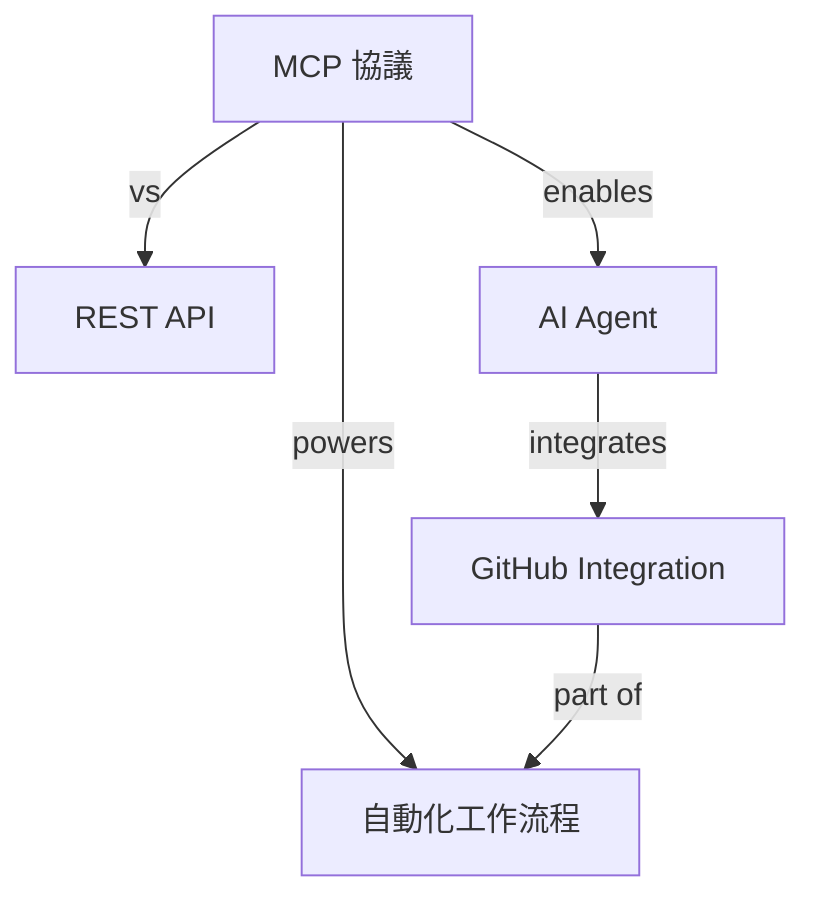

# E02: 跨平台知識管理系統 - 統一團隊知識入口

## 📋 專案概述

**目標**：建立統一的知識管理系統，自動收集、分類、連結分散在多個平台的知識。

**時間**：12-15 小時

**難度**：★★★★★

---

## 🎯 學習目標

- [ ] 設計跨平台知識管理系統
- [ ] 整合多個知識來源
- [ ] 實作智能知識分類與連結
- [ ] 建立知識圖譜
- [ ] 提供智能搜尋與推薦

---

## 系統架構

### 涉及的 MCP Servers (5+)

1. **GitHub MCP**：程式碼庫、Wiki、Discussions
2. **Notion MCP**：團隊文檔
3. **Slack MCP**：對話記錄、決策
4. **Email MCP**：重要郵件
5. **File System MCP**：本地文檔

### 涉及的 AI Agents

- `content-analyzer`：內容分析
- `knowledge-extractor`：知識萃取
- `data-analyst`：關聯分析
- `tech-writer`：內容整理
- `architect`：系統設計

---

## 完整工作流程

### 階段 1：知識收集 (並行)

```
定期執行（每天）

並行從多個來源收集：
├─ GitHub MCP
│   ├─ README 文檔
│   ├─ Wiki 頁面
│   ├─ Issue 討論
│   └─ PR 描述
│
├─ Notion MCP
│   ├─ 會議記錄
│   ├─ 專案文檔
│   └─ 個人筆記
│
├─ Slack MCP
│   ├─ 重要對話
│   ├─ 決策討論
│   └─ 知識分享
│
├─ Email MCP
│   ├─ 技術郵件
│   ├─ 客戶反饋
│   └─ 合作夥伴溝通
│
└─ File System MCP
    ├─ PDF 文檔
    ├─ Markdown 筆記
    └─ 簡報檔案

content-analyzer Agent：
    ├─ 過濾重複內容
    ├─ 識別知識類型
    └─ 評估重要性
```

### 階段 2：知識分析 (串行)

```
knowledge-extractor Agent：提取知識
    ├─ 提取核心概念
    ├─ 識別關鍵論點
    ├─ 提取程式碼範例
    └─ 提取最佳實踐

分類系統：
    ├─ 技術文檔（架構/API/配置）
    ├─ 業務知識（流程/規範/政策）
    ├─ 問題解決（Bug/FAQ/故障排除）
    └─ 團隊知識（決策/經驗/教訓）

標籤系統：
    ├─ 主題標籤（#Backend #Frontend #DevOps）
    ├─ 技術棧標籤（#Python #React #PostgreSQL）
    └─ 狀態標籤（#Current #Outdated #Archived）
```

### 階段 3：知識圖譜建立 (複雜)

```
data-analyst Agent：關聯分析
    ├─ 識別概念之間的關係
    │   ├─ 依賴關係（A requires B）
    │   ├─ 相關關係（A relates to B）
    │   ├─ 對比關係（A vs B）
    │   └─ 演進關係（A supersedes B）
    │
    ├─ 建立知識節點
    │   ├─ 節點：每個核心概念
    │   ├─ 邊：概念之間的關係
    │   └─ 權重：關係強度
    │
    └─ 生成知識圖譜
        ├─ 視覺化表示
        ├─ 可互動探索
        └─ 自動更新

範例圖譜：


### 階段 4：智能整理 (並行)

```
tech-writer Agent：內容整理
    ├─ 統一格式
    ├─ 添加索引
    ├─ 生成目錄
    └─ 補充說明

並行輸出到多個目標：
├─ Notion：主要知識庫
│   ├─ 創建/更新頁面
│   ├─ 建立雙向連結
│   └─ 維護 Database
│
├─ GitHub Wiki：開發者文檔
│   ├─ 技術文檔
│   └─ API 參考
│
└─ Local Search Index
    ├─ 建立全文搜尋索引
    └─ 向量 embedding（語義搜尋）
```

### 階段 5：智能搜尋與推薦 (實時)

```
用戶查詢
    ↓
多策略搜尋（並行）：
├─ 關鍵字搜尋（全文索引）
├─ 語義搜尋（embedding 相似度）
└─ 圖譜搜尋（關聯探索）

data-analyst Agent：結果排序
    ├─ 相關性評分
    ├─ 時效性評分
    ├─ 權威性評分
    └─ 綜合排序

推薦系統：
    ├─ 相關知識推薦
    ├─ 延伸閱讀建議
    ├─ 最新更新提醒
    └─ 學習路徑規劃
```

### 階段 6：持續維護 (循環)

```
每週執行維護流程：

Loop:
    ├─ 檢查過時內容
    │   ├─ 識別超過 6 個月未更新的文檔
    │   ├─ 標記為「需要審查」
    │   └─ 通知負責人
    │
    ├─ 合併重複內容
    │   ├─ 識別相似度 > 80% 的內容
    │   ├─ 建議合併
    │   └─ 保留最佳版本
    │
    ├─ 更新知識圖譜
    │   ├─ 重新計算關聯
    │   ├─ 優化圖譜結構
    │   └─ 識別孤立節點
    │
    └─ 生成維護報告
        ├─ 新增知識統計
        ├─ 更新知識統計
        ├─ 需要處理的問題
        └─ 知識庫健康度評分
```

---

## 核心挑戰

### 挑戰 1：多來源整合

不同平台的資料格式統一：
- GitHub：Markdown + Git metadata
- Notion：Block-based structure
- Slack：Message threads
- Email：MIME format
- 統一為結構化知識表示

### 挑戰 2：知識去重

識別並處理重複知識：
- 完全相同 → 保留最新版
- 高度相似 → 合併為一
- 部分重疊 → 建立連結
- 互補內容 → 保留兩者並連結

### 挑戰 3：知識圖譜

建立準確的關聯：
- 自動識別概念
- 判斷關係類型
- 計算關係強度
- 維護圖譜一致性

### 挑戰 4：語義理解

實現智能搜尋：
- 自然語言查詢理解
- 語義相似度計算
- 上下文相關推薦
- 多語言支援

---

## 實作階段

### Phase 1：資料收集管道（3-4 小時）
- 配置所有 MCP
- 實作收集邏輯
- 資料格式統一

### Phase 2：知識萃取與分類（3-4 小時）
- 內容分析
- 知識提取
- 自動分類與標籤

### Phase 3：知識圖譜（3-4 小時）
- 關聯分析
- 圖譜建立
- 視覺化實作

### Phase 4：搜尋與推薦（2-3 小時）
- 全文搜尋
- 語義搜尋
- 推薦系統

### Phase 5：維護與優化（1-2 小時）
- 自動化維護
- 效能優化
- 完整測試

---

## 評量標準

### 功能完整性 (40 分)
- [ ] 多來源整合 (10 分)
- [ ] 知識萃取與分類 (10 分)
- [ ] 知識圖譜 (10 分)
- [ ] 搜尋與推薦 (10 分)

### 智能程度 (30 分)
- [ ] 自動化程度 (10 分)
- [ ] 分類準確率 (10 分)
- [ ] 搜尋相關性 (10 分)

### 系統設計 (20 分)
- [ ] 架構合理性 (10 分)
- [ ] 可擴展性 (10 分)

### 用戶體驗 (10 分)
- [ ] 介面易用性 (5 分)
- [ ] 回應速度 (5 分)

**總分**：100 分
**及格**：70 分
**優秀**：85 分以上

---

## 📚 學習資源

### 必讀文檔
- `C02_知識萃取系統.md`（基礎版本）
- 知識圖譜理論
- 語義搜尋技術

### 參考系統
- Notion
- Obsidian
- Roam Research
- Logseq

### 技術參考
- Vector Embeddings (OpenAI / Sentence Transformers)
- Graph Databases (Neo4j)
- Full-Text Search (Elasticsearch)

---

## 💡 成功關鍵

1. **循序漸進**
   - 先實作單一來源
   - 再逐步加入其他來源
   - 最後整合為統一系統

2. **關注資料品質**
   - 去重機制要完善
   - 分類要準確
   - 關聯要有意義

3. **使用者導向**
   - 搜尋要快速準確
   - 介面要直觀
   - 推薦要有價值

4. **可持續性**
   - 自動化維護
   - 定期更新
   - 持續優化

**完整實作指南與參考解答將在後續擴充**

挑戰最高難度，成為知識管理大師！🚀
