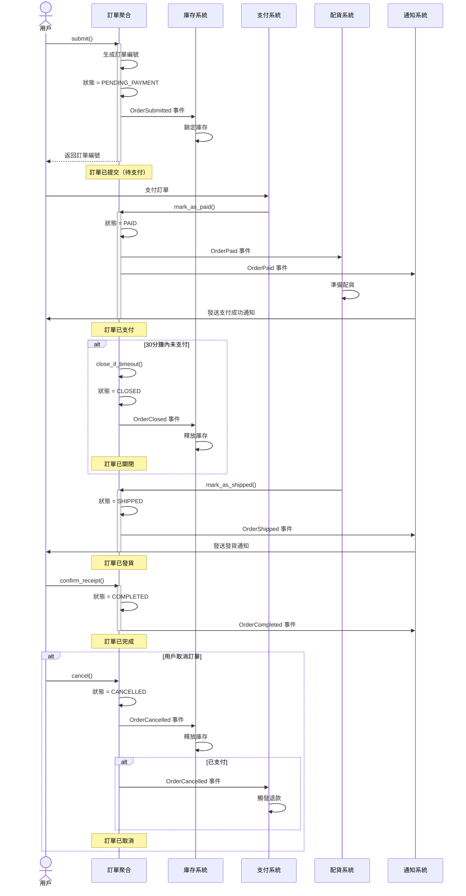
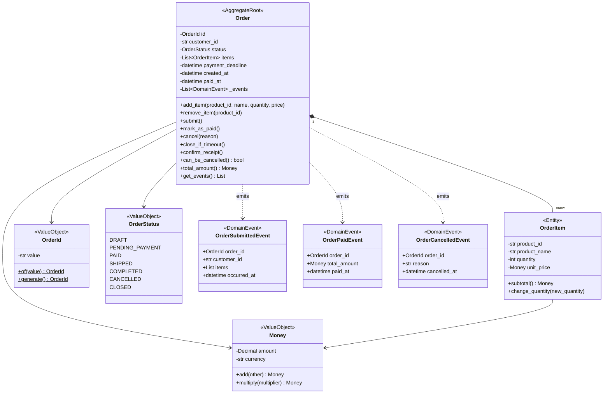

# B01：訂單系統 DDD 建模

## 📋 情境背景

**公司**：TechMart 科技電商
**角色**：後端開發工程師
**任務**：為公司的訂單系統建立 DDD 領域模型

**業務現狀**：
公司目前的訂單系統是一個典型的 CRUD 系統，隨著業務複雜度增加（多種支付方式、複雜的訂單狀態流轉、促銷活動），現有的貧血模型已經難以維護。業務邏輯散落在 Service 層的各處，經常出現狀態不一致的問題。

**業務目標**：
1. 重構訂單系統為 DDD 架構
2. 業務邏輯集中在領域模型
3. 為後續微服務拆分做準備

---

## 🎯 任務目標

使用 AI 輔助 DDD 工作流程，完成以下交付成果：

- [ ] **階段 1**：通用語言詞彙表（Markdown 表格）
- [ ] **階段 2**：事件風暴圖（Mermaid 流程圖）
- [ ] **階段 3**：限界上下文識別（文字描述 + 上下文地圖）
- [ ] **階段 4**：訂單聚合領域模型（Mermaid 類圖 + 程式碼骨架）
- [ ] **階段 5**：完整的 Python 程式碼實現與測試

**預估時間**：45-60 分鐘

---

## 📝 業務需求

### 使用者故事

**Story 1：購物車與訂單提交**
```
作為一個用戶
我想要將購物車的商品提交為訂單
以便我可以進行支付
```

**Story 2：訂單支付**
```
作為一個用戶
我想要在 30 分鐘內完成訂單支付
否則訂單會被自動關閉
```

**Story 3：訂單取消**
```
作為一個用戶
我想要取消待支付或已支付的訂單
已支付的訂單取消後會自動退款
```

**Story 4：訂單履約**
```
作為系統
訂單支付成功後會自動觸發配貨流程
配貨完成後訂單狀態變為「已發貨」
```

**Story 5：訂單完成**
```
作為一個用戶
我想要確認收貨
訂單狀態變為「已完成」後會獲得積分獎勵
```

### 業務流程

```
1. 用戶在購物車加入商品
2. 用戶提交訂單
   ├─ 生成訂單編號
   ├─ 鎖定庫存
   └─ 訂單狀態 = 待支付

3. 用戶支付訂單（30 分鐘內）
   ├─ 成功：
   │   ├─ 訂單狀態 = 已支付
   │   ├─ 觸發配貨
   │   └─ 發送支付成功通知
   └─ 超時：
       ├─ 訂單狀態 = 已關閉
       └─ 釋放庫存

4. 系統配貨
   ├─ 準備商品
   ├─ 訂單狀態 = 已發貨
   └─ 發送發貨通知

5. 用戶確認收貨
   ├─ 訂單狀態 = 已完成
   ├─ 增加用戶積分
   └─ 觸發評價提醒

異常流程：
6. 用戶取消訂單
   ├─ 如果是待支付：
   │   ├─ 訂單狀態 = 已取消
   │   └─ 釋放庫存
   └─ 如果是已支付：
       ├─ 訂單狀態 = 已取消
       ├─ 釋放庫存
       └─ 觸發退款流程
```

### 業務規則

| 規則 ID | 描述 |
|---------|------|
| BR-001 | 訂單提交後必須在 30 分鐘內支付，否則自動關閉 |
| BR-002 | 只有「待支付」和「已支付」狀態的訂單可以取消 |
| BR-003 | 取消「已支付」的訂單必須退款 |
| BR-004 | 訂單項的數量必須大於 0 |
| BR-005 | 訂單總金額必須大於 0 |
| BR-006 | 已發貨和已完成的訂單不能取消 |
| BR-007 | 訂單提交時必須包含至少一個商品 |

### 訂單狀態流轉

```
草稿（DRAFT）
    ↓ submit()
待支付（PENDING_PAYMENT）
    ↓ mark_as_paid()        ↓ close_if_timeout()    ↓ cancel()
已支付（PAID）              已關閉（CLOSED）          已取消（CANCELLED）
    ↓ mark_as_shipped()
已發貨（SHIPPED）
    ↓ confirm_receipt()
已完成（COMPLETED）
```

---

## 🔧 技術要求

- **語言**：Python 3.10+
- **圖表工具**：Mermaid
- **測試框架**：pytest
- **AI 工具**：Claude Code

**程式碼要求**：
- 使用 dataclass 定義值對象
- 值對象必須是不可變的（frozen=True）
- 聚合根封裝所有業務邏輯
- 使用類型標註（type hints）

---

## 📚 學習重點

本情境著重訓練以下技能：

1. **完整的 AI 輔助 DDD 流程**
   - 階段 1：通用語言提取
   - 階段 2：事件風暴
   - 階段 3：限界上下文識別
   - 階段 4：領域模型設計
   - 階段 5：程式碼生成

2. **聚合根設計**
   - 如何封裝業務邏輯
   - 如何保護資料一致性
   - 如何設計業務方法

3. **值對象設計**
   - 何時使用值對象
   - 如何設計不可變值對象
   - 值對象的優勢

4. **領域事件**
   - 如何設計領域事件
   - 如何發布與訂閱事件
   - 事件驅動的解耦作用

---

## ⏱️ 時間安排

| 階段 | 任務 | 預估時間 |
|------|------|---------|
| 階段 1 | 通用語言提取 | 10 分鐘 |
| 階段 2 | 事件風暴 | 10 分鐘 |
| 階段 3 | 限界上下文識別 | 5 分鐘 |
| 階段 4 | 領域模型設計 | 15 分鐘 |
| 階段 5 | 程式碼生成與測試 | 15 分鐘 |
| **總計** | | **55 分鐘** |

---

## ✅ 檢查點

### 階段 1：通用語言提取

完成後確認：
- [ ] 識別出核心領域概念（訂單、訂單項、訂單狀態...）
- [ ] 區分實體與值對象
- [ ] 列出所有命令（submit, cancel, mark_as_paid...）
- [ ] 列出所有領域事件（OrderSubmitted, OrderPaid...）
- [ ] 提取業務規則（30 分鐘支付超時...）

### 階段 2：事件風暴

完成後確認：
- [ ] 繪製完整的業務流程圖（包括異常流程）
- [ ] 標記每個步驟的觸發者（用戶/系統）
- [ ] 標記每個步驟產生的領域事件
- [ ] 識別副作用（鎖定庫存、發送通知...）

### 階段 3：限界上下文識別

完成後確認：
- [ ] 識別出核心上下文（訂單上下文）
- [ ] 識別支撐上下文（支付、庫存、配貨、通知）
- [ ] 說明上下文之間的關係（上游/下游）
- [ ] 確定整合方式（領域事件）

### 階段 4：領域模型設計

完成後確認：
- [ ] 設計 Order 聚合（聚合根 + 實體 + 值對象）
- [ ] 設計所有值對象（OrderId, OrderStatus, Money）
- [ ] 設計領域事件（OrderSubmitted, OrderPaid, OrderCancelled）
- [ ] 繪製領域模型類圖（Mermaid）

### 階段 5：程式碼生成與測試

完成後確認：
- [ ] 生成完整的 Python 程式碼
- [ ] 實現所有業務方法（submit, cancel, mark_as_paid...）
- [ ] 撰寫單元測試（至少 10 個測試用例）
- [ ] 測試通過

---

## 💡 提示

### 提示 1：如何開始？

**第一步**：準備 AI 提示詞
```
我需要為電商訂單系統建立 DDD 領域模型。
請從以下業務需求中提取通用語言（Ubiquitous Language）。

【業務需求】
[貼上上面的業務需求]

【要求】
1. 識別核心領域概念（名詞）
2. 識別關鍵業務行為（動詞）
3. 識別領域事件（過去式動詞）
4. 識別業務規則與約束
5. 用表格形式輸出
```

### 提示 2：如何繪製事件風暴圖？

**提示詞範例**：
```
基於上面的通用語言，請進行事件風暴分析。

【要求】
1. 繪製完整的業務流程（包括異常流程）
2. 標記觸發者（用戶/系統）
3. 標記領域事件
4. 用 Mermaid sequence diagram 表示
```

### 提示 3：如何設計聚合邊界？

**思考問題**：
- 哪些實體必須保持一致性？→ 應該在同一個聚合
- 哪些實體可以最終一致性？→ 可以分離到不同聚合
- 哪些操作需要原子性？→ 在聚合根上提供方法

**訂單系統的聚合設計**：
```
Order 聚合包含：
✅ Order（聚合根）
✅ OrderItem（內部實體）- 因為訂單項與訂單必須保持一致

Order 聚合不包含：
❌ Payment（支付）- 可以最終一致性，獨立聚合
❌ Shipment（配貨）- 可以最終一致性，獨立聚合
❌ Customer（用戶）- 引用用戶 ID，不直接包含
```

### 提示 4：如何設計值對象？

**判斷標準**：
```
問題：兩個屬性完全相同的物件，是同一個嗎？

如果是 → 值對象（例如：100 元就是 100 元）
如果不是 → 實體（例如：兩個訂單金額相同，但不是同一個訂單）
```

**訂單系統的值對象**：
- OrderId（訂單 ID）
- Money（金額）
- OrderStatus（訂單狀態）

### 提示 5：遇到困難怎麼辦？

1. **AI 輸出不理想**：
   - 補充更詳細的業務描述
   - 明確告訴 AI 哪裡不對
   - 要求 AI 生成多個方案

2. **不知道如何劃分聚合**：
   - 先全部放在一個聚合
   - 發現問題後再拆分
   - 參考參考解答

3. **程式碼有問題**：
   - 檢查是否實現了所有業務規則
   - 執行測試找出問題
   - 參考參考解答的實現

---

## 📖 參考解答

### 階段 1：通用語言詞彙表

#### 核心領域概念

| 術語 | 英文 | 類型 | 定義 |
|------|------|------|------|
| 訂單 | Order | 聚合根 | 用戶的購買請求 |
| 訂單項 | OrderItem | 實體 | 訂單內的單個商品項 |
| 訂單狀態 | OrderStatus | 值對象（枚舉） | 訂單當前狀態 |
| 訂單 ID | OrderId | 值對象 | 訂單唯一識別碼 |
| 金額 | Money | 值對象 | 金額與幣種 |
| 用戶 ID | CustomerId | 值對象 | 用戶引用 |
| 商品 ID | ProductId | 值對象 | 商品引用 |

#### 訂單狀態

| 狀態 | 英文 | 說明 |
|------|------|------|
| 草稿 | DRAFT | 訂單創建但未提交 |
| 待支付 | PENDING_PAYMENT | 訂單已提交，等待支付 |
| 已支付 | PAID | 訂單已支付成功 |
| 已發貨 | SHIPPED | 訂單已發貨 |
| 已完成 | COMPLETED | 用戶已確認收貨 |
| 已取消 | CANCELLED | 訂單已取消 |
| 已關閉 | CLOSED | 超時未支付自動關閉 |

#### 命令（業務行為）

| 命令 | 英文 | 觸發者 | 定義 |
|------|------|--------|------|
| 新增訂單項 | add_item | 用戶 | 將商品加入訂單 |
| 移除訂單項 | remove_item | 用戶 | 從訂單移除商品 |
| 提交訂單 | submit | 用戶 | 提交訂單進入待支付 |
| 標記已支付 | mark_as_paid | 系統 | 標記訂單為已支付 |
| 取消訂單 | cancel | 用戶 | 取消訂單 |
| 關閉訂單 | close_if_timeout | 系統 | 超時自動關閉 |
| 標記已發貨 | mark_as_shipped | 系統 | 標記訂單為已發貨 |
| 確認收貨 | confirm_receipt | 用戶 | 確認收到商品 |

#### 領域事件

| 事件 | 英文 | 觸發時機 | 訂閱者 |
|------|------|---------|--------|
| 訂單已提交 | OrderSubmitted | 用戶提交訂單 | 庫存系統 |
| 訂單已支付 | OrderPaid | 訂單支付成功 | 配貨系統、通知系統 |
| 訂單已取消 | OrderCancelled | 訂單被取消 | 庫存系統、支付系統 |
| 訂單已關閉 | OrderClosed | 訂單超時關閉 | 庫存系統 |
| 訂單已發貨 | OrderShipped | 訂單發貨 | 通知系統 |
| 訂單已完成 | OrderCompleted | 用戶確認收貨 | 積分系統、評價系統 |

---

### 階段 2：事件風暴圖



---

### 階段 3：限界上下文識別

#### 上下文劃分

本場景聚焦於**訂單上下文（Order Context）**，其他上下文在實際專案中是獨立的限界上下文：

- **訂單上下文**（本次建模重點）：管理訂單生命週期
- **支付上下文**：處理支付與退款（通過事件整合）
- **庫存上下文**：管理商品庫存（通過事件整合）
- **配貨上下文**：處理配貨與物流（通過事件整合）
- **通知上下文**：發送各類通知（通過事件整合）

#### 上下文關係

```
訂單上下文（核心域）
    ↓ 發布事件
├─ 支付上下文（訂閱 OrderPaid, OrderCancelled）
├─ 庫存上下文（訂閱 OrderSubmitted, OrderCancelled, OrderClosed）
├─ 配貨上下文（訂閱 OrderPaid）
└─ 通知上下文（訂閱所有事件）
```

---

### 階段 4：領域模型設計

#### 領域模型類圖



---

### 階段 5：Python 程式碼實現

由於篇幅限制，這裡提供核心程式碼片段。完整程式碼請參考 `範例模型/訂單系統/`。

**值對象**（value_objects.py）：
```python
from dataclasses import dataclass
from decimal import Decimal
from enum import Enum
import uuid

@dataclass(frozen=True)
class OrderId:
    value: str

    @staticmethod
    def generate() -> 'OrderId':
        return OrderId(f"ORD-{uuid.uuid4().hex[:12].upper()}")

@dataclass(frozen=True)
class Money:
    amount: Decimal
    currency: str = "USD"

    def __add__(self, other: 'Money') -> 'Money':
        if self.currency != other.currency:
            raise ValueError("幣種不一致")
        return Money(self.amount + other.amount, self.currency)

    def __mul__(self, multiplier: int) -> 'Money':
        return Money(self.amount * multiplier, self.currency)

class OrderStatus(Enum):
    DRAFT = "draft"
    PENDING_PAYMENT = "pending_payment"
    PAID = "paid"
    SHIPPED = "shipped"
    COMPLETED = "completed"
    CANCELLED = "cancelled"
    CLOSED = "closed"
```

**聚合根**（order.py）：
```python
from typing import List, Optional
from datetime import datetime, timedelta

class Order:
    """訂單聚合根"""

    def __init__(self, order_id: OrderId, customer_id: str):
        self.id = order_id
        self.customer_id = customer_id
        self.status = OrderStatus.DRAFT
        self.items: List[OrderItem] = []
        self.payment_deadline: Optional[datetime] = None
        self.created_at = datetime.now()
        self._events: List = []

    def submit(self):
        """提交訂單"""
        if self.status != OrderStatus.DRAFT:
            raise InvalidOrderStateError("只有草稿狀態才能提交")
        if not self.items:
            raise ValueError("訂單必須包含至少一個商品")

        self.status = OrderStatus.PENDING_PAYMENT
        self.payment_deadline = datetime.now() + timedelta(minutes=30)

        self._events.append(OrderSubmittedEvent(
            order_id=self.id,
            customer_id=self.customer_id,
            items=[{'product_id': i.product_id, 'quantity': i.quantity}
                   for i in self.items],
            occurred_at=datetime.now()
        ))

    def mark_as_paid(self):
        """標記為已支付"""
        if self.status != OrderStatus.PENDING_PAYMENT:
            raise InvalidOrderStateError("只有待支付訂單才能標記為已支付")

        self.status = OrderStatus.PAID
        self.paid_at = datetime.now()

        self._events.append(OrderPaidEvent(
            order_id=self.id,
            total_amount=self.total_amount,
            paid_at=self.paid_at
        ))

    @property
    def total_amount(self) -> Money:
        """計算總金額"""
        if not self.items:
            return Money(Decimal(0))
        return sum((item.subtotal for item in self.items), Money(Decimal(0)))
```

**測試**（test_order.py）：
```python
import pytest
from decimal import Decimal

def test_submit_order():
    order = Order(OrderId.generate(), "CUST001")
    order.add_item("PROD001", "iPhone", 1, Money(Decimal("999.99")))
    order.submit()

    assert order.status == OrderStatus.PENDING_PAYMENT
    assert len(order.get_events()) == 1

def test_mark_as_paid():
    order = create_pending_order()
    order.mark_as_paid()

    assert order.status == OrderStatus.PAID
    assert order.paid_at is not None
```

---

## 🤔 反思問題

完成練習後，思考以下問題：

1. **聚合邊界**：
   - 為什麼 OrderItem 應該在 Order 聚合內，而 Payment 應該是獨立聚合？
   - 如果業務需求變更，需要追蹤每次訂單項數量變更的歷史，聚合設計應該如何調整？

2. **值對象設計**：
   - Money 為什麼設計為不可變（frozen=True）？
   - 如果需要支援多幣種轉換，Money 應該如何設計？

3. **領域事件**：
   - 為什麼使用領域事件而不是直接調用其他系統的 API？
   - 如果事件處理失敗（如庫存扣減失敗），應該如何處理？

4. **業務規則**：
   - 30 分鐘支付超時的邏輯應該放在哪裡？（訂單聚合？定時任務？）
   - 如果業務規則頻繁變更（如 VIP 用戶 60 分鐘超時），如何設計更靈活的模型？

5. **AI 輔助**：
   - AI 在哪些階段幫助最大？哪些階段仍需要大量人工判斷？
   - 如果讓你向團隊推廣 AI 輔助 DDD，你會強調哪些優勢？

---

## 📝 總結

**完成本情境後，你應該能夠**：
- ✅ 獨立使用 AI 完成 DDD 建模的 5 個階段
- ✅ 設計合理的聚合邊界
- ✅ 實現充血的領域模型（業務邏輯封裝在聚合根）
- ✅ 使用領域事件解耦系統

**下一步**：
- 嘗試其他基礎級情境（B02-B04）
- 挑戰組合級情境（多個上下文）
- 將 DDD 應用到你自己的專案

---

**情境版本**：v1.0
**難度級別**：基礎級
**預估時間**：45-60 分鐘
