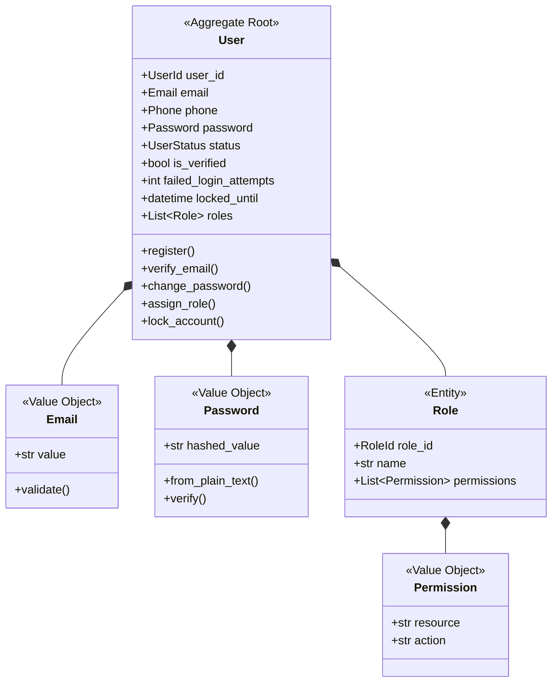

# B02：用戶身份限界上下文

## 📋 情境背景

**公司**: TechStart Inc.
**專案**: 企業級身份認證與授權系統（IAM - Identity and Access Management）
**團隊規模**: 5 人開發團隊
**當前階段**: 架構設計階段

### 業務背景

公司正在開發一個企業級 SaaS 平台，需要一個獨立的身份認證與授權系統，供多個業務系統（訂單系統、CRM、ERP 等）共用。

系統需要支援：
- 多種認證方式（密碼、OAuth、SAML）
- 細粒度的權限控制（RBAC - Role-Based Access Control）
- 多租戶隔離
- 審計日誌

**你的任務**：為用戶身份上下文（User Identity Context）建立 DDD 領域模型。

---

## 🎯 任務目標

使用 AI 輔助完成以下產出：

- [ ] 通用語言詞彙表
- [ ] 事件風暴圖（Mermaid）
- [ ] 聚合設計（重點：User 聚合的設計）
- [ ] 領域模型類圖（Mermaid）
- [ ] 核心聚合的 Python 程式碼實現

---

## 📝 業務需求

### 核心功能

#### 1. 用戶註冊與管理
- 用戶可以使用電子郵件或手機號註冊
- 用戶需要驗證電子郵件或手機號
- 用戶可以設定密碼（需符合複雜度要求）
- 用戶可以啟用/禁用帳號
- 用戶可以刪除帳號（軟刪除，保留審計記錄）

#### 2. 認證方式
- **密碼認證**: 使用電子郵件/手機號 + 密碼登入
- **OAuth 認證**: 支援 Google、GitHub、Microsoft 等第三方登入
- **SAML 認證**: 支援企業級 SSO（Single Sign-On）
- **MFA（多因素認證）**: 可選啟用 TOTP 或 SMS 驗證碼

#### 3. 角色與權限
- 用戶可以被分配多個角色（Role）
- 角色包含多個權限（Permission）
- 權限格式：`resource:action`（例如：`order:create`、`user:read`）
- 支援角色繼承（如：Admin 繼承 User 的所有權限）

#### 4. 密碼管理
- 密碼複雜度要求：至少 8 個字符，包含大小寫字母、數字、特殊符號
- 密碼需要雜湊存儲（bcrypt 或 argon2）
- 支援密碼重置（通過電子郵件發送重置連結）
- 密碼歷史記錄（不能使用最近 3 次的密碼）

#### 5. 會話管理
- 用戶登入後創建會話（Session）
- 會話有效期：30 分鐘無操作自動過期
- 支援單點登出（Logout）
- 支援強制登出所有會話

#### 6. 審計日誌
- 記錄用戶的關鍵操作：
  - 註冊、登入、登出
  - 密碼修改、密碼重置
  - 角色變更、權限變更
  - 帳號啟用/禁用/刪除

---

### 業務規則

| 規則 ID | 描述 |
|---------|------|
| BR-001 | 電子郵件和手機號在系統中必須唯一 |
| BR-002 | 未驗證的用戶不能登入系統 |
| BR-003 | 密碼錯誤次數超過 5 次，帳號鎖定 15 分鐘 |
| BR-004 | 禁用的帳號無法登入 |
| BR-005 | 密碼不能與最近 3 次的密碼相同 |
| BR-006 | 會話有效期為 30 分鐘，可通過活動延長 |
| BR-007 | MFA 啟用後，登入必須通過 MFA 驗證 |
| BR-008 | 刪除帳號不會真正刪除數據，只標記為已刪除（軟刪除）|

---

### 使用者故事

**Story 1: 用戶註冊**
```
作為一個新用戶
我想要使用電子郵件註冊帳號
並收到驗證郵件
以便我可以開始使用系統
```

**Story 2: 密碼登入**
```
作為一個已註冊用戶
我想要使用電子郵件和密碼登入
以便訪問系統資源
```

**Story 3: 啟用 MFA**
```
作為一個安全意識高的用戶
我想要啟用多因素認證
以便增強帳號安全性
```

**Story 4: 分配角色**
```
作為系統管理員
我想要為用戶分配角色
以便控制用戶的訪問權限
```

**Story 5: 查看審計日誌**
```
作為安全審計員
我想要查看用戶的操作日誌
以便追蹤可疑行為
```

---

## 🔧 技術要求

- **語言**: Python 3.11+
- **輸出格式**:
  - 通用語言詞彙表: Markdown
  - 事件風暴圖: Mermaid Flowchart
  - 領域模型類圖: Mermaid Class Diagram
  - 程式碼: Python（使用 dataclasses、type hints）

---

## 📚 學習重點

本情境重點學習：

### 1. 聚合設計
- **User 聚合**應該包含哪些內容？
- 密碼、角色、會話是否應該在 User 聚合內？
- 如何設計聚合邊界以保持一致性？

### 2. 值對象設計
- Email、Phone、Password 應該設計為值對象還是簡單字串？
- 值對象如何封裝業務規則（如密碼複雜度）？

### 3. 領域事件
- 用戶生命週期中有哪些關鍵事件？
- 哪些事件需要發布給其他上下文？

### 4. 安全性考量
- 密碼存儲（雜湊、加鹽）
- 會話管理（token、過期）
- 審計日誌（GDPR 合規）

---

## ⏱️ 時間安排

建議時間分配：

- **階段 1**: 通用語言提取（10 分鐘）
- **階段 2**: 事件風暴（10 分鐘）
- **階段 3**: 聚合設計（10 分鐘）
- **階段 4**: 領域模型設計（5 分鐘）
- **階段 5**: 程式碼實現（10 分鐘）

**總計**: 45 分鐘

---

## ✅ 檢查點

### 階段 1: 通用語言詞彙表
- [ ] 識別出核心領域概念（User, Role, Permission, Session, Credential 等）
- [ ] 區分實體與值對象
- [ ] 提取業務規則

### 階段 2: 事件風暴
- [ ] 識別用戶註冊流程的所有事件
- [ ] 識別登入/登出流程的所有事件
- [ ] 標記哪些事件需要發布給其他上下文

### 階段 3: 聚合設計
- [ ] 確定 User 聚合的邊界（是否包含 Session、Role？）
- [ ] 設計聚合根的不變式
- [ ] 確定聚合內的實體與值對象

### 階段 4: 領域模型設計
- [ ] 繪製 User 聚合的類圖
- [ ] 設計主要的值對象（Email, Password, Phone）
- [ ] 設計領域事件

### 階段 5: 程式碼實現
- [ ] 實現 User 聚合根
- [ ] 實現核心值對象
- [ ] 實現關鍵業務規則（密碼複雜度、帳號鎖定等）
- [ ] 實現領域事件

---

## 💡 提示

### 提示 1: 聚合邊界設計

**關鍵問題**: Session（會話）應該在 User 聚合內還是獨立聚合？

**方案 A**: Session 在 User 聚合內
```
User (聚合根)
  ├─ Email (值對象)
  ├─ Password (值對象)
  ├─ Roles (實體列表)
  └─ Sessions (實體列表)  ← 在聚合內
```

**優點**: 可以保證事務一致性（用戶禁用時，立即清除所有會話）
**缺點**: 聚合過大，高並發時性能問題

**方案 B**: Session 獨立聚合
```
User (聚合根)          Session (聚合根)
  ├─ Email               ├─ UserId (引用)
  ├─ Password            ├─ Token
  └─ Roles               └─ ExpiresAt
```

**優點**: 聚合職責單一，性能更好
**缺點**: 用戶禁用與會話清除不在同一事務，需要事件驅動處理

**推薦**: 方案 B（通過領域事件保證最終一致性）

---

### 提示 2: 值對象設計

**Email 值對象範例**:
```python
@dataclass(frozen=True)
class Email:
    value: str

    def __post_init__(self):
        if not self._is_valid_email(self.value):
            raise ValueError(f"無效的電子郵件: {self.value}")

    @staticmethod
    def _is_valid_email(email: str) -> bool:
        import re
        pattern = r'^[a-zA-Z0-9._%+-]+@[a-zA-Z0-9.-]+\.[a-zA-Z]{2,}$'
        return bool(re.match(pattern, email))
```

**Password 值對象範例**:
```python
@dataclass(frozen=True)
class Password:
    hashed_value: str  # 存儲雜湊後的值，不存儲明文

    @classmethod
    def from_plain_text(cls, plain_password: str) -> 'Password':
        cls._validate_complexity(plain_password)
        hashed = bcrypt.hashpw(plain_password.encode(), bcrypt.gensalt())
        return cls(hashed_value=hashed.decode())

    @staticmethod
    def _validate_complexity(password: str) -> None:
        if len(password) < 8:
            raise ValueError("密碼至少需要 8 個字符")
        # 其他複雜度檢查...

    def verify(self, plain_password: str) -> bool:
        return bcrypt.checkpw(plain_password.encode(),
                             self.hashed_value.encode())
```

---

### 提示 3: 關鍵業務規則

**帳號鎖定邏輯**:
```python
class User:
    def __init__(self):
        self.failed_login_attempts = 0
        self.locked_until: Optional[datetime] = None

    def record_login_failure(self) -> None:
        self.failed_login_attempts += 1
        if self.failed_login_attempts >= 5:
            self.locked_until = datetime.now() + timedelta(minutes=15)
            self._add_domain_event(UserAccountLocked(user_id=self.user_id))

    def is_locked(self) -> bool:
        if self.locked_until is None:
            return False
        if datetime.now() > self.locked_until:
            self.failed_login_attempts = 0  # 鎖定期過後重置
            self.locked_until = None
            return False
        return True
```

---

## 📖 參考解答

<details>
<summary>點擊查看參考解答（建議先獨立完成）</summary>

### 核心設計決策

1. **聚合劃分**:
   - `User` 聚合：用戶資訊、認證憑證、角色
   - `Session` 獨立聚合：會話管理
   - `AuditLog` 獨立聚合：審計日誌

2. **關鍵值對象**:
   - `Email`: 封裝電子郵件驗證
   - `Phone`: 封裝手機號驗證
   - `Password`: 封裝密碼雜湊與驗證
   - `UserId`: 用戶唯一標識

3. **領域事件**:
   - `UserRegistered`: 用戶註冊成功
   - `UserEmailVerified`: 電子郵件驗證成功
   - `UserLoggedIn`: 用戶登入
   - `UserAccountLocked`: 帳號被鎖定
   - `UserRolesChanged`: 用戶角色變更

### 聚合設計圖



### 完整程式碼實現

參考 `範例模型/訂單系統/domain-model.py` 的結構，實現 User 聚合。

</details>

---

## 🤔 反思問題

完成後思考：

1. **聚合邊界**:
   - 為什麼 Session 不應該在 User 聚合內？
   - 如果需求改為「用戶禁用時必須立即清除所有會話」，設計如何調整？

2. **值對象 vs 實體**:
   - Role 應該是實體還是值對象？為什麼？
   - 如果 Role 可以動態修改權限，設計如何調整？

3. **安全性**:
   - 密碼雜湊應該在領域層還是基礎設施層？
   - 如何防止時序攻擊（Timing Attack）？

4. **事件驅動**:
   - 哪些操作應該發布領域事件？
   - `UserLoggedIn` 事件應該包含哪些信息？

---

**情境版本**: v1.0
**難度**: 中等
**預估時間**: 30-45 分鐘
**核心技能**: 聚合設計、值對象設計、業務規則封裝
