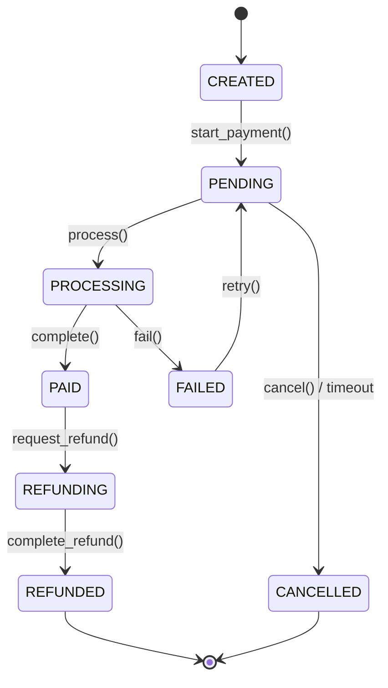
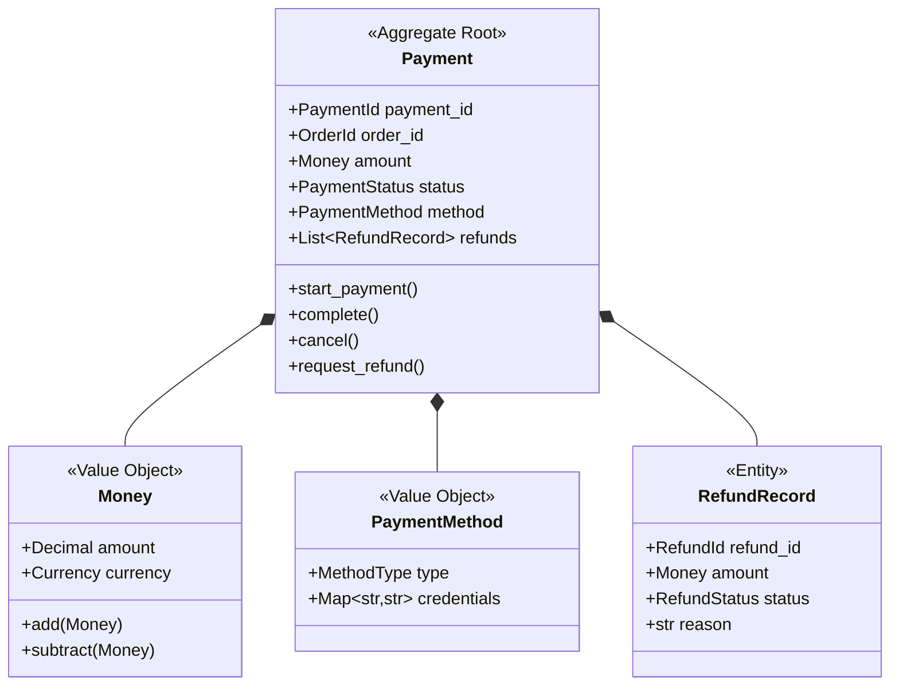

# B03：支付領域模型設計

## 📋 情境背景

**公司**: PayFast Technologies
**專案**: 統一支付網關系統（Payment Gateway）
**團隊規模**: 6 人開發團隊
**當前階段**: 領域建模階段

### 業務背景

公司正在開發一個統一支付網關，需要整合多種支付方式（信用卡、行動支付、銀行轉帳等），並為多個業務系統（電商、訂閱服務、線下零售）提供支付能力。

系統需要處理：
- 多種支付方式的統一抽象
- 支付狀態追蹤
- 退款處理
- 對帳與清算
- 支付安全（PCI DSS 合規）

**你的任務**：為支付上下文（Payment Context）建立 DDD 領域模型。

---

## 🎯 任務目標

使用 AI 輔助完成以下產出：

- [ ] 通用語言詞彙表
- [ ] 事件風暴圖（Mermaid）
- [ ] 聚合設計（重點：Payment 聚合與 Refund 聚合）
- [ ] 狀態機設計（支付狀態流轉）
- [ ] Python 程式碼實現

---

## 📝 業務需求

### 核心功能

#### 1. 支付方式管理
支援多種支付方式：
- **信用卡支付**（Visa、MasterCard、JCB）
- **行動支付**（Apple Pay、Google Pay、LINE Pay）
- **第三方支付**（支付寶、微信支付、PayPal）
- **銀行轉帳**（ATM 轉帳、網路銀行）
- **貨到付款**（COD - Cash on Delivery）

每種支付方式需要不同的憑證信息：
- 信用卡：卡號、到期日、CVV、持卡人姓名
- 行動支付：授權 Token
- 銀行轉帳：轉帳帳號、轉帳碼

#### 2. 支付流程
**標準支付流程**：
1. 創建支付訂單（關聯業務訂單 ID、金額、幣種）
2. 選擇支付方式
3. 發起支付請求（調用第三方支付 API）
4. 等待支付結果（同步或異步回調）
5. 更新支付狀態
6. 通知業務系統

**特殊情況**：
- 部分金額支付（如：訂單 100 元，先支付 50 元）
- 超額支付處理（如：訂單 100 元，支付 120 元）
- 支付超時自動取消（30 分鐘）

#### 3. 退款管理
- 全額退款
- 部分退款（多次部分退款，總額不超過支付金額）
- 退款原因記錄
- 退款狀態追蹤（退款中、退款成功、退款失敗）
- 退款到原支付方式

#### 4. 對帳與清算
- 每日對帳（系統記錄 vs 第三方平台記錄）
- 清算報表生成
- 異常交易標記
- 手續費計算（不同支付方式手續費不同）

#### 5. 安全與合規
- 信用卡資訊加密存儲（PCI DSS 合規）
- 支付密碼驗證（部分支付方式）
- 風險控制（如：單筆限額、日限額、異常交易檢測）
- 審計日誌

---

### 業務規則

| 規則 ID | 描述 |
|---------|------|
| BR-001 | 支付金額必須 > 0 |
| BR-002 | 退款總金額不能超過已支付金額 |
| BR-003 | 只有支付成功的訂單才能退款 |
| BR-004 | 支付訂單 30 分鐘未完成自動取消 |
| BR-005 | 信用卡支付需要 3D 驗證（金額 > 1000 元）|
| BR-006 | 同一筆業務訂單不能創建多個待支付的支付訂單 |
| BR-007 | 退款申請需要人工審核（金額 > 5000 元）|
| BR-008 | 貨到付款不支援線上退款 |

---

### 支付狀態機

```
CREATED (已創建)
    ↓
PENDING (待支付) ──────→ CANCELLED (已取消)
    ↓                      ↑
PROCESSING (處理中)        │
    ↓                      │
PAID (已支付) ────────────┘ (超時取消)
    ↓
REFUNDING (退款中)
    ↓
REFUNDED (已退款)
```

---

### 使用者故事

**Story 1: 創建支付訂單**
```
作為業務系統（如訂單系統）
我想要為訂單創建支付請求
以便客戶可以支付
```

**Story 2: 信用卡支付**
```
作為客戶
我想要使用信用卡支付訂單
並接收支付結果通知
```

**Story 3: 申請退款**
```
作為客戶服務人員
我想要為客戶申請退款
並追蹤退款狀態
```

**Story 4: 每日對帳**
```
作為財務人員
我需要每日自動對帳
並生成差異報表
```

**Story 5: 異常交易處理**
```
作為風控系統
我需要檢測異常交易（如：短時間內多次支付）
並自動凍結可疑支付
```

---

## 🔧 技術要求

- **語言**: Python 3.11+
- **輸出格式**:
  - 通用語言詞彙表: Markdown
  - 事件風暴圖: Mermaid Flowchart
  - 狀態機圖: Mermaid State Diagram
  - 領域模型類圖: Mermaid Class Diagram
  - 程式碼: Python（使用 dataclasses、type hints）

---

## 📚 學習重點

本情境重點學習：

### 1. 值對象的高級應用
- **Money（金額）**: 金額 + 幣種，支援運算
- **PaymentMethod（支付方式）**: 封裝不同支付方式的差異
- **CardNumber（卡號）**: 敏感信息的值對象設計

### 2. 聚合設計
- **Payment 聚合**: 支付訂單的完整生命週期
- **Refund 聚合**: 退款是否應該獨立聚合？還是 Payment 的一部分？

### 3. 狀態模式
- 支付狀態機的實現
- 狀態轉換的業務規則

### 4. 領域事件
- `PaymentCreated`: 支付訂單創建
- `PaymentCompleted`: 支付成功
- `PaymentFailed`: 支付失敗
- `RefundRequested`: 退款申請
- `RefundCompleted`: 退款完成

---

## ⏱️ 時間安排

建議時間分配：

- **階段 1**: 通用語言提取（10 分鐘）
- **階段 2**: 事件風暴（10 分鐘）
- **階段 3**: 聚合設計與狀態機（10 分鐘）
- **階段 4**: 領域模型設計（5 分鐘）
- **階段 5**: 程式碼實現（10 分鐘）

**總計**: 45 分鐘

---

## ✅ 檢查點

### 階段 1: 通用語言詞彙表
- [ ] 識別核心領域概念（Payment, Refund, PaymentMethod, Money）
- [ ] 區分實體與值對象
- [ ] 提取支付狀態與業務規則

### 階段 2: 事件風暴
- [ ] 識別支付完整流程的所有事件
- [ ] 識別退款流程的所有事件
- [ ] 標記異常情況（支付失敗、超時取消）

### 階段 3: 聚合設計
- [ ] 確定 Payment 聚合的邊界
- [ ] 決定 Refund 是否獨立聚合
- [ ] 設計支付狀態機

### 階段 4: 領域模型設計
- [ ] 繪製 Payment 聚合類圖
- [ ] 設計 Money、PaymentMethod 等值對象
- [ ] 設計領域事件

### 階段 5: 程式碼實現
- [ ] 實現 Payment 聚合根
- [ ] 實現 Money 值對象（含運算）
- [ ] 實現支付狀態機
- [ ] 實現領域事件

---

## 💡 提示

### 提示 1: Money 值對象設計

**為什麼需要 Money 值對象？**

❌ **錯誤做法**：
```python
class Payment:
    amount: Decimal  # 只有金額，沒有幣種

# 問題：100 TWD vs 100 USD 無法區分
```

✅ **正確做法**：
```python
@dataclass(frozen=True)
class Money:
    amount: Decimal
    currency: Currency

    def add(self, other: Money) -> Money:
        if self.currency != other.currency:
            raise ValueError("不同幣種無法相加")
        return Money(self.amount + other.amount, self.currency)

    def subtract(self, other: Money) -> Money:
        if self.currency != other.currency:
            raise ValueError("不同幣種無法相減")
        if self.amount < other.amount:
            raise ValueError("金額不足")
        return Money(self.amount - other.amount, self.currency)

# 使用範例
total = Money(Decimal('100'), Currency.TWD)
refund = Money(Decimal('30'), Currency.TWD)
remaining = total.subtract(refund)  # Money(70, TWD)
```

---

### 提示 2: Refund 應該是獨立聚合還是 Payment 的一部分？

**方案 A**: Refund 在 Payment 聚合內
```python
class Payment:
    payment_id: PaymentId
    amount: Money
    status: PaymentStatus
    refunds: List[RefundRecord]  # 退款記錄列表

    def request_refund(self, amount: Money) -> None:
        # 業務規則檢查
        total_refunded = sum(r.amount for r in self.refunds)
        if total_refunded + amount > self.amount:
            raise ValueError("退款總額超過支付金額")

        self.refunds.append(RefundRecord(...))
```

**優點**: 可以保證事務一致性（退款總額不超過支付金額）
**缺點**: 聚合職責過重，高並發退款可能有性能問題

---

**方案 B**: Refund 獨立聚合
```python
class Payment:
    payment_id: PaymentId
    amount: Money
    status: PaymentStatus

class Refund:
    refund_id: RefundId
    payment_id: PaymentId  # 引用 Payment
    amount: Money
    status: RefundStatus
```

**優點**: 職責分離，性能更好
**缺點**: 需要額外機制保證退款總額不超過支付金額

**推薦**: 方案 A（退款通常不會高並發，一致性更重要）

---

### 提示 3: 支付狀態機實現

**使用枚舉 + 狀態轉換方法**：

```python
class PaymentStatus(str, Enum):
    CREATED = "CREATED"
    PENDING = "PENDING"
    PROCESSING = "PROCESSING"
    PAID = "PAID"
    CANCELLED = "CANCELLED"
    REFUNDED = "REFUNDED"

class Payment:
    def __init__(self):
        self.status = PaymentStatus.CREATED

    def start_payment(self) -> None:
        """開始支付"""
        if self.status != PaymentStatus.CREATED:
            raise ValueError(f"只有已創建的支付可以開始，當前狀態: {self.status}")
        self.status = PaymentStatus.PENDING
        self._add_domain_event(PaymentStarted(...))

    def mark_as_processing(self) -> None:
        """標記為處理中"""
        if self.status != PaymentStatus.PENDING:
            raise ValueError(f"只有待支付的訂單可以處理，當前狀態: {self.status}")
        self.status = PaymentStatus.PROCESSING

    def complete(self, transaction_id: str) -> None:
        """支付成功"""
        if self.status != PaymentStatus.PROCESSING:
            raise ValueError(f"只有處理中的支付可以完成，當前狀態: {self.status}")
        self.status = PaymentStatus.PAID
        self.transaction_id = transaction_id
        self.paid_at = datetime.now()
        self._add_domain_event(PaymentCompleted(...))

    def cancel(self, reason: str) -> None:
        """取消支付"""
        if self.status not in [PaymentStatus.CREATED, PaymentStatus.PENDING]:
            raise ValueError(f"當前狀態無法取消: {self.status}")
        self.status = PaymentStatus.CANCELLED
        self._add_domain_event(PaymentCancelled(...))
```

---

### 提示 4: 敏感信息處理

**信用卡號的值對象設計**：

```python
@dataclass(frozen=True)
class CardNumber:
    """信用卡號（敏感信息）"""
    encrypted_value: str  # 加密後的值
    last_four_digits: str  # 最後4位（用於顯示）

    @classmethod
    def from_plain(cls, plain_number: str, encryption_service) -> 'CardNumber':
        """從明文卡號創建"""
        cls._validate(plain_number)
        encrypted = encryption_service.encrypt(plain_number)
        return cls(
            encrypted_value=encrypted,
            last_four_digits=plain_number[-4:]
        )

    @staticmethod
    def _validate(card_number: str) -> None:
        """驗證卡號（Luhn 算法）"""
        if not card_number.isdigit():
            raise ValueError("卡號必須全為數字")
        if len(card_number) not in [15, 16]:
            raise ValueError("卡號長度不正確")
        # Luhn 算法驗證...

    def masked_number(self) -> str:
        """脫敏顯示：**** **** **** 1234"""
        return f"**** **** **** {self.last_four_digits}"
```

---

## 📖 參考解答

<details>
<summary>點擊查看參考解答（建議先獨立完成）</summary>

### 核心設計決策

1. **聚合劃分**:
   - `Payment` 聚合：支付訂單 + 退款記錄（一起管理，保證一致性）
   - 不將 Refund 獨立，因為需要強一致性保證

2. **關鍵值對象**:
   - `Money`: 金額 + 幣種，支援運算
   - `PaymentMethod`: 支付方式抽象
   - `CardNumber`: 敏感信息封裝
   - `PaymentId`: 支付訂單唯一標識

3. **領域事件**:
   - `PaymentCreated`: 支付訂單創建
   - `PaymentCompleted`: 支付成功
   - `PaymentFailed`: 支付失敗
   - `PaymentCancelled`: 支付取消
   - `RefundRequested`: 退款申請
   - `RefundCompleted`: 退款完成

### 狀態機圖



### Payment 聚合設計



</details>

---

## 🤔 反思問題

完成後思考：

1. **Money 值對象**:
   - 為什麼 Money 必須是值對象而不能是簡單的 Decimal？
   - 如果需要支援匯率轉換，Money 如何設計？

2. **聚合邊界**:
   - Refund 為什麼建議放在 Payment 聚合內？
   - 如果退款流程非常複雜（需要審批流），設計如何調整？

3. **狀態機**:
   - 支付狀態機中哪些狀態轉換是可逆的？
   - 如何防止並發情況下的狀態不一致？

4. **安全性**:
   - 信用卡號應該存儲嗎？如何存儲？
   - PCI DSS 合規對領域模型有何影響？

---

**情境版本**: v1.0
**難度**: 中等
**預估時間**: 30-45 分鐘
**核心技能**: 值對象設計、狀態機、聚合邊界判斷
