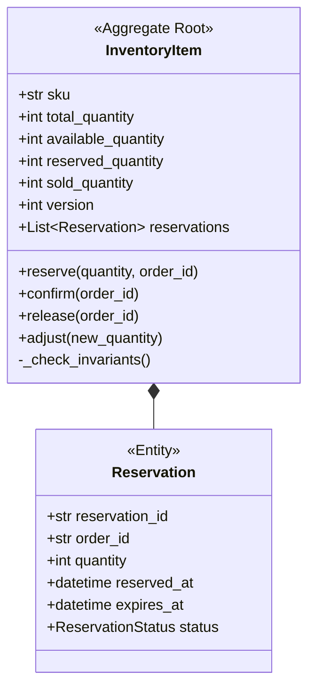

# B04：庫存管理聚合設計

## 📋 情境背景

**公司**: E-Commerce Giant Inc.
**專案**: 庫存管理系統（Inventory Management System）
**團隊規模**: 4 人開發團隊
**當前階段**: 核心領域建模階段

### 業務背景

公司電商平台在大促期間（如雙11、黑色星期五）經常出現超賣問題，導致客戶投訴和退款。技術團隊決定重構庫存管理系統，使用 DDD 設計一個可靠的庫存管理領域模型。

**核心挑戰**：
- 高並發場景下的庫存扣減（每秒上萬筆訂單）
- 防止超賣（庫存不足時拒絕訂單）
- 庫存預留機制（訂單創建時預留，支付成功時確認扣減）
- 多倉庫管理（同一商品在不同倉庫有庫存）

**你的任務**：為庫存上下文（Inventory Context）建立 DDD 領域模型，重點解決併發控制問題。

---

## 🎯 任務目標

使用 AI 輔助完成以下產出：

- [ ] 通用語言詞彙表
- [ ] 事件風暴圖（Mermaid）
- [ ] 聚合設計（重點：InventoryItem 聚合）
- [ ] 併發控制方案設計（樂觀鎖 vs 悲觀鎖）
- [ ] Python 程式碼實現

---

## 📝 業務需求

### 核心功能

#### 1. 庫存管理
- 商品入庫（增加庫存）
- 商品出庫（扣減庫存）
- 庫存盤點（修正實際庫存與系統庫存差異）
- 庫存調撥（倉庫之間轉移庫存）
- 安全庫存預警（庫存低於安全線時告警）

#### 2. 庫存預留機制
**業務流程**：
1. 客戶下單時，系統**預留**庫存（狀態：可用庫存減少，預留庫存增加）
2. 如果 30 分鐘內未支付，**釋放**預留庫存
3. 支付成功後，**確認扣減**庫存（預留庫存轉為已銷售）
4. 訂單取消時，**釋放**預留庫存

**關鍵概念**：
- **總庫存（Total）**: 倉庫實際擁有的商品數量
- **可用庫存（Available）**: 可以被預留的數量 = 總庫存 - 預留庫存 - 已銷售
- **預留庫存（Reserved）**: 已被訂單預留但未確認扣減的數量
- **已銷售（Sold）**: 已確認扣減的數量

**不變式**：
```
總庫存 = 可用庫存 + 預留庫存 + 已銷售
```

#### 3. 多倉庫管理
- 同一商品（SKU）在多個倉庫有庫存
- 下單時選擇就近倉庫
- 庫存不足時可以從其他倉庫調撥

#### 4. 併發控制
- 支援高並發的庫存扣減（秒殺場景）
- 防止超賣（樂觀鎖 or 悲觀鎖）
- 原子性操作（扣減操作不可分割）

---

### 業務規則

| 規則 ID | 描述 |
|---------|------|
| BR-001 | 可用庫存 >= 0（不能為負數）|
| BR-002 | 預留數量不能超過可用庫存 |
| BR-003 | 預留庫存 30 分鐘未確認自動釋放 |
| BR-004 | 總庫存 = 可用庫存 + 預留庫存 + 已銷售（不變式）|
| BR-005 | 庫存低於安全庫存時觸發補貨告警 |
| BR-006 | 同一訂單不能重複扣減庫存 |
| BR-007 | 盤點時需要鎖定庫存，禁止扣減 |

---

### 併發場景

**場景 1：秒殺場景**
```
時間軸：
T1: 商品庫存 100 件
T2: 1000 個請求同時到達，每個請求購買 1 件
T3: 系統應該只允許前 100 個請求成功，後 900 個請求失敗
```

**場景 2：預留超時釋放**
```
時間軸：
T1: 用戶 A 下單，預留 5 件（可用: 95, 預留: 5）
T2: 30 分鐘後未支付
T3: 系統自動釋放預留（可用: 100, 預留: 0）
```

**場景 3：並發預留同一商品**
```
用戶 A: 預留 3 件
用戶 B: 預留 5 件
當前庫存: 可用 6 件

正確結果: 用戶 A 成功，用戶 B 失敗（剩餘 3 件不足）
錯誤結果: 兩者都成功（超賣）
```

---

### 使用者故事

**Story 1: 下單預留庫存**
```
作為訂單系統
當用戶下單時，我需要預留庫存
以便防止超賣
```

**Story 2: 支付確認扣減**
```
作為訂單系統
當用戶支付成功時，我需要確認扣減預留的庫存
以便更新庫存狀態
```

**Story 3: 取消訂單釋放庫存**
```
作為訂單系統
當訂單取消時，我需要釋放預留的庫存
以便其他用戶可以購買
```

**Story 4: 庫存盤點**
```
作為倉庫管理員
我需要定期盤點庫存
並修正系統記錄與實際庫存的差異
```

---

## 🔧 技術要求

- **語言**: Python 3.11+
- **輸出格式**:
  - 通用語言詞彙表: Markdown
  - 事件風暴圖: Mermaid Flowchart
  - 領域模型類圖: Mermaid Class Diagram
  - 程式碼: Python（使用 dataclasses、type hints）
  - 併發控制: 說明樂觀鎖實現原理

---

## 📚 學習重點

本情境重點學習：

### 1. 聚合設計的併發考量
- InventoryItem 聚合如何設計以支援高並發？
- 聚合根的不變式如何在併發下保持？

### 2. 樂觀鎖 vs 悲觀鎖
- 什麼場景使用樂觀鎖？
- 什麼場景使用悲觀鎖？
- DDD 領域模型中如何實現樂觀鎖？

### 3. 領域事件
- `InventoryReserved`: 庫存已預留
- `InventoryDeducted`: 庫存已扣減
- `InventoryReleased`: 庫存已釋放
- `LowStockAlertTriggered`: 低庫存告警

### 4. 業務不變式
- 如何在程式碼中強制執行不變式？
- 並發情況下如何保證不變式？

---

## ⏱️ 時間安排

建議時間分配：

- **階段 1**: 通用語言提取（10 分鐘）
- **階段 2**: 事件風暴（10 分鐘）
- **階段 3**: 聚合設計與併發方案（15 分鐘）
- **階段 4**: 程式碼實現（10 分鐘）

**總計**: 45 分鐘

---

## ✅ 檢查點

### 階段 1: 通用語言詞彙表
- [ ] 識別核心領域概念（InventoryItem, Reservation, Stock）
- [ ] 定義總庫存、可用庫存、預留庫存的關係
- [ ] 提取業務不變式

### 階段 2: 事件風暴
- [ ] 識別預留-確認-釋放的完整流程
- [ ] 標記併發衝突點
- [ ] 設計預留超時機制

### 階段 3: 聚合設計
- [ ] 設計 InventoryItem 聚合根
- [ ] 確定樂觀鎖實現方式（版本號）
- [ ] 設計預留記錄的管理

### 階段 4: 程式碼實現
- [ ] 實現 InventoryItem 聚合根
- [ ] 實現樂觀鎖版本號機制
- [ ] 實現預留、確認、釋放方法
- [ ] 實現不變式檢查

---

## 💡 提示

### 提示 1: 樂觀鎖實現

**核心概念**：使用版本號（Version Number）檢測併發衝突

```python
@dataclass
class InventoryItem:
    """庫存項聚合根"""
    sku: str
    total_quantity: int  # 總庫存
    available_quantity: int  # 可用庫存
    reserved_quantity: int  # 預留庫存
    version: int  # 樂觀鎖版本號

    def reserve(self, quantity: int, order_id: str) -> None:
        """預留庫存"""
        # 業務規則檢查
        if quantity > self.available_quantity:
            raise InsufficientStockError(
                f"庫存不足，需要 {quantity}，可用 {self.available_quantity}"
            )

        # 更新庫存
        self.available_quantity -= quantity
        self.reserved_quantity += quantity

        # 增加版本號（樂觀鎖）
        self.version += 1

        # 發布事件
        self._add_domain_event(InventoryReserved(...))
```

**持久化層**（Repository）使用樂觀鎖：
```python
class InventoryRepository:
    def save(self, inventory: InventoryItem) -> None:
        """保存時檢查版本號"""
        sql = """
        UPDATE inventory
        SET available_quantity = ?,
            reserved_quantity = ?,
            version = version + 1
        WHERE sku = ?
          AND version = ?  -- 樂觀鎖檢查
        """
        result = self.db.execute(sql, (
            inventory.available_quantity,
            inventory.reserved_quantity,
            inventory.sku,
            inventory.version  # 使用舊版本號
        ))

        if result.rowcount == 0:
            # 版本號不匹配 = 併發衝突
            raise ConcurrentModificationError("庫存已被其他事務修改，請重試")
```

---

### 提示 2: 預留記錄的管理

**方案 A**: 預留記錄在聚合內
```python
@dataclass
class Reservation:
    """預留記錄（實體）"""
    reservation_id: str
    order_id: str
    quantity: int
    reserved_at: datetime
    expires_at: datetime
    status: ReservationStatus  # ACTIVE, CONFIRMED, RELEASED

@dataclass
class InventoryItem:
    sku: str
    total_quantity: int
    reservations: List[Reservation]  # 預留記錄列表

    @property
    def reserved_quantity(self) -> int:
        """計算預留數量"""
        return sum(r.quantity for r in self.reservations
                  if r.status == ReservationStatus.ACTIVE)

    def reserve(self, quantity: int, order_id: str) -> None:
        if quantity > self.available_quantity:
            raise InsufficientStockError()

        reservation = Reservation(
            reservation_id=uuid4(),
            order_id=order_id,
            quantity=quantity,
            reserved_at=datetime.now(),
            expires_at=datetime.now() + timedelta(minutes=30),
            status=ReservationStatus.ACTIVE
        )
        self.reservations.append(reservation)

    def confirm_reservation(self, order_id: str) -> None:
        """確認預留（支付成功）"""
        reservation = self._find_reservation(order_id)
        if not reservation:
            raise ReservationNotFoundError()

        reservation.status = ReservationStatus.CONFIRMED
        # 從總庫存中真正扣減
        self.total_quantity -= reservation.quantity
```

**優點**: 可以追蹤每個訂單的預留記錄，支援部分釋放
**缺點**: 聚合較大，查詢預留記錄可能影響性能

---

**方案 B**: 只記錄預留總數（簡化版）
```python
@dataclass
class InventoryItem:
    sku: str
    total_quantity: int
    available_quantity: int
    reserved_quantity: int  # 只記錄總數

    def reserve(self, quantity: int) -> None:
        if quantity > self.available_quantity:
            raise InsufficientStockError()

        self.available_quantity -= quantity
        self.reserved_quantity += quantity

    def confirm(self, quantity: int) -> None:
        """確認扣減"""
        if quantity > self.reserved_quantity:
            raise InvalidOperationError()

        self.reserved_quantity -= quantity
        self.total_quantity -= quantity
```

**優點**: 聚合簡單，性能好
**缺點**: 無法追蹤具體是哪個訂單的預留

**推薦**: 方案 A（業務需要追蹤）

---

### 提示 3: 不變式檢查

**在每次狀態變更後檢查不變式**：

```python
class InventoryItem:
    def _check_invariants(self) -> None:
        """檢查業務不變式"""
        # 不變式 1: 可用庫存不能為負
        if self.available_quantity < 0:
            raise InvariantViolationError(
                f"可用庫存不能為負: {self.available_quantity}"
            )

        # 不變式 2: 預留庫存不能為負
        if self.reserved_quantity < 0:
            raise InvariantViolationError(
                f"預留庫存不能為負: {self.reserved_quantity}"
            )

        # 不變式 3: 總庫存 = 可用 + 預留 + 已銷售
        expected_total = (self.available_quantity +
                         self.reserved_quantity +
                         self.sold_quantity)
        if self.total_quantity != expected_total:
            raise InvariantViolationError(
                f"庫存數量不一致: total={self.total_quantity}, "
                f"expected={expected_total}"
            )

    def reserve(self, quantity: int, order_id: str) -> None:
        # 業務邏輯...
        self.available_quantity -= quantity
        self.reserved_quantity += quantity

        # 每次修改後檢查不變式
        self._check_invariants()
```

---

### 提示 4: 併發衝突處理

**應用層（Application Service）重試機制**：

```python
class InventoryApplicationService:
    def reserve_inventory(self, sku: str, quantity: int,
                         order_id: str, max_retries: int = 3) -> None:
        """預留庫存（含重試）"""
        for attempt in range(max_retries):
            try:
                # 1. 從倉儲加載聚合
                inventory = self.inventory_repo.find_by_sku(sku)

                # 2. 執行領域邏輯
                inventory.reserve(quantity, order_id)

                # 3. 保存聚合（樂觀鎖檢查）
                self.inventory_repo.save(inventory)

                # 4. 發布領域事件
                self.event_publisher.publish(inventory.get_domain_events())

                # 成功，返回
                return

            except ConcurrentModificationError:
                # 樂觀鎖衝突，重試
                if attempt == max_retries - 1:
                    # 最後一次嘗試失敗
                    raise InventoryReservationFailedError("併發衝突，請稍後重試")
                # 等待隨機時間後重試（避免活鎖）
                time.sleep(random.uniform(0.01, 0.1))

            except InsufficientStockError:
                # 庫存不足，不重試
                raise
```

---

## 📖 參考解答

<details>
<summary>點擊查看參考解答（建議先獨立完成）</summary>

### 核心設計決策

1. **聚合設計**:
   - `InventoryItem` 聚合：一個 SKU 的庫存項
   - 包含預留記錄列表（方案 A）

2. **併發控制**:
   - 使用**樂觀鎖**（version 字段）
   - 應用層實現重試機制

3. **不變式**:
   - `total_quantity = available_quantity + reserved_quantity + sold_quantity`
   - `available_quantity >= 0`

4. **領域事件**:
   - `InventoryReserved`: 庫存已預留
   - `InventoryDeducted`: 庫存已確認扣減
   - `InventoryReleased`: 預留已釋放
   - `LowStockAlert`: 低庫存告警

### InventoryItem 聚合設計



### 完整程式碼實現

核心邏輯參考提示部分的程式碼片段組合實現。

</details>

---

## 🤔 反思問題

完成後思考：

1. **樂觀鎖 vs 悲觀鎖**:
   - 為什麼庫存場景推薦樂觀鎖？
   - 什麼情況下悲觀鎖更合適？

2. **聚合邊界**:
   - 為什麼 Reservation 應該在 InventoryItem 聚合內？
   - 如果系統有 1 億個預留記錄，設計如何調整？

3. **併發性能**:
   - 樂觀鎖的重試機制對性能有何影響？
   - 如何進一步優化高並發場景（如：分佈式鎖、削峰）？

4. **業務一致性**:
   - 預留釋放應該同步還是異步？
   - 如果釋放失敗（系統崩潰），如何保證最終一致性？

---

**情境版本**: v1.0
**難度**: 中等
**預估時間**: 30-45 分鐘
**核心技能**: 併發控制、樂觀鎖、業務不變式、聚合設計
