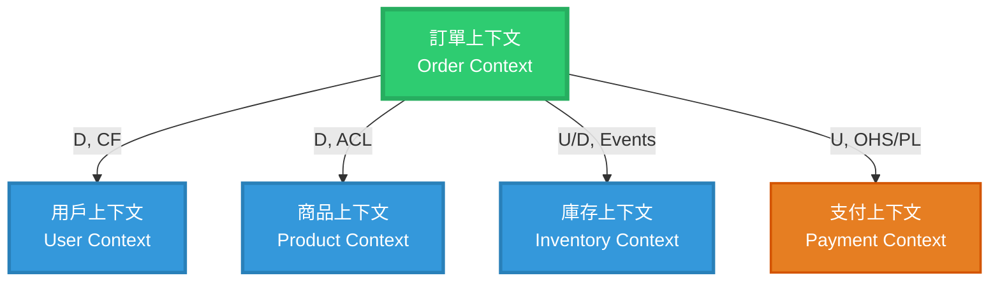

# [系統名稱] - 上下文地圖模板（Context Map）

## 📋 使用說明

本模板提供上下文地圖的標準結構，用於展示限界上下文之間的關係和集成模式。

**DDD 上下文關係模式**：
- **U (Upstream 上游) / D (Downstream 下游)**: 依賴方向
- **ACL (Anti-Corruption Layer 反腐敗層)**: 隔離外部變更
- **OHS (Open Host Service 開放主機服務)**: 提供標準化 API
- **PL (Published Language 發布語言)**: 定義良好的接口協議
- **SK (Shared Kernel 共享內核)**: 共享領域模型
- **CF (Conformist 服從者)**: 完全接受上游模型

---

## 🎨 Mermaid 模板

```mermaid
%% [系統名稱] - 上下文地圖
%% 展示限界上下文之間的關係和集成模式
%%
%% 最後更新: YYYY-MM-DD

graph TB
    %% ===================================
    %% 核心上下文（你的核心領域）
    %% ===================================

    CORE[<b>核心上下文名稱</b><br/>Core Context<br/>━━━━━━━━━━━━<br/>職責: [核心職責說明]<br/>聚合: [主要聚合]<br/>團隊: [負責團隊]]

    %% ===================================
    %% 相關上下文
    %% ===================================

    CONTEXT_A[<b>上下文A</b><br/>Context A<br/>━━━━━━━━━━━━<br/>職責: [職責說明]<br/>聚合: [主要聚合]<br/>團隊: [負責團隊]]

    CONTEXT_B[<b>上下文B</b><br/>Context B<br/>━━━━━━━━━━━━<br/>職責: [職責說明]<br/>聚合: [主要聚合]<br/>團隊: [負責團隊]]

    CONTEXT_C[<b>上下文C</b><br/>Context C<br/>━━━━━━━━━━━━<br/>職責: [職責說明]<br/>聚合: [主要聚合]<br/>團隊: [負責團隊]]

    %% ===================================
    %% 上下文關係與集成模式
    %% ===================================

    %% 示例1：下游關係，使用 ACL
    CORE -->|D, ACL<br/>查詢資料<br/>REST API| CONTEXT_A
    CONTEXT_A -.->|數據快照<br/>防止變更影響| CORE

    %% 示例2：上游關係，使用 OHS/PL
    CORE -->|U, OHS/PL<br/>發起請求<br/>REST API| CONTEXT_B
    CONTEXT_B -.->|回調通知<br/>Webhook| CORE

    %% 示例3：事件驅動通信
    CORE -.->|發布事件<br/>EventA, EventB<br/>Message Queue| CONTEXT_C
    CONTEXT_C -.->|訂閱事件<br/>執行動作| CORE

    %% ===================================
    %% 集成模式說明
    %% ===================================

    subgraph LEGEND[圖例說明]
        direction TB
        L1[實線箭頭: 同步調用 REST API]
        L2[虛線箭頭: 異步通信 Message Queue]
        L3[U: Upstream 上游 - 依賴該服務]
        L4[D: Downstream 下游 - 是數據消費者]
        L5[ACL: Anti-Corruption Layer 反腐敗層]
        L6[OHS: Open Host Service 開放主機服務]
        L7[PL: Published Language 發布語言]
        L8[CF: Conformist 服從者]
    end

    %% ===================================
    %% 關鍵集成點詳細說明
    %% ===================================

    subgraph INTEGRATION[關鍵集成點]
        direction TB

        INT1[<b>1. [集成點名稱]</b><br/>[集成說明]<br/>[技術方案]<br/>[容錯處理]]

        INT2[<b>2. [集成點名稱]</b><br/>[集成說明]<br/>[技術方案]<br/>[容錯處理]]

        INT3[<b>3. [集成點名稱]</b><br/>[集成說明]<br/>[技術方案]<br/>[容錯處理]]
    end

    %% ===================================
    %% 樣式定義
    %% ===================================

    %% 核心上下文（核心域）- 綠色
    classDef coreContext fill:#2ecc71,stroke:#27ae60,stroke-width:4px,color:#fff,font-weight:bold

    %% 支撐上下文 - 藍色
    classDef supportContext fill:#3498db,stroke:#2980b9,stroke-width:3px,color:#fff

    %% 通用上下文 - 灰色
    classDef genericContext fill:#95a5a6,stroke:#7f8c8d,stroke-width:2px,color:#fff

    %% 外部服務 - 橙色
    classDef externalContext fill:#e67e22,stroke:#d35400,stroke-width:2px,color:#fff

    %% 圖例 - 淺色
    classDef legendStyle fill:#ecf0f1,stroke:#bdc3c7,stroke-width:1px,color:#2c3e50

    %% 集成點 - 黃色
    classDef integrationStyle fill:#f39c12,stroke:#e67e22,stroke-width:2px,color:#fff

    %% 應用樣式
    class CORE coreContext
    class CONTEXT_A,CONTEXT_B supportContext
    class CONTEXT_C genericContext
    class LEGEND legendStyle
    class INT1,INT2,INT3 integrationStyle
```

---

## 🔖 模板使用指南

### 步驟 1：識別限界上下文

**列出系統中的所有限界上下文**：

1. **核心域（Core Domain）**：
   - 你的核心業務邏輯
   - 例如：訂單管理、支付處理

2. **支撐子域（Supporting Subdomain）**：
   - 支援核心業務的上下文
   - 例如：用戶管理、通知服務

3. **通用子域（Generic Subdomain）**：
   - 通用功能，可能使用第三方服務
   - 例如：郵件發送、短信通知

### 步驟 2：確定上下文關係

**對於每對上下文，確定**：

1. **依賴方向**：誰依賴誰？
   - 上游（Upstream）：被依賴的一方
   - 下游（Downstream）：依賴的一方

2. **集成模式**：
   - **ACL (反腐敗層)**：下游保護自己免受上游變更影響
   - **OHS/PL (開放主機服務/發布語言)**：上游提供標準化接口
   - **CF (服從者)**：下游完全接受上游模型
   - **SK (共享內核)**：雙方共享部分領域模型（需謹慎使用）

3. **通信方式**：
   - 同步調用：REST API, gRPC
   - 異步通信：Message Queue, Event Bus
   - 混合模式：請求-回調

### 步驟 3：繪製上下文地圖

**繪製步驟**：

1. 將核心上下文放在中心
2. 按依賴程度排列其他上下文
3. 使用箭頭標註依賴方向
4. 標註集成模式（ACL, OHS, PL, CF）
5. 說明通信方式（REST, Event, gRPC）

### 步驟 4：標註關鍵集成點

**為重要的集成點添加詳細說明**：
- 集成的業務目的
- 技術實現方案
- 容錯與重試機制
- 性能考量

### 步驟 5：應用樣式與顏色

使用顏色區分上下文類型：
- **綠色**：核心域
- **藍色**：支撐子域
- **灰色**：通用子域
- **橙色**：外部服務

---

## 💡 集成模式詳解

### ACL (Anti-Corruption Layer 反腐敗層)

**使用場景**：
- 依賴外部遺留系統
- 上游模型經常變更
- 需要隔離外部複雜性

**實現方式**：
```python
# 上游系統的複雜模型
class ExternalUserDTO:
    user_id: str
    full_name: str
    email_address: str
    # ... 30+ 個字段

# 你的領域模型（簡潔）
class User:
    id: UserId
    name: str
    email: Email

# ACL: 轉換層
class UserACL:
    def to_domain(self, dto: ExternalUserDTO) -> User:
        return User(
            id=UserId(dto.user_id),
            name=dto.full_name,
            email=Email(dto.email_address)
        )
```

---

### OHS (Open Host Service 開放主機服務)

**使用場景**：
- 你的服務被多個下游依賴
- 需要提供穩定的接口
- 希望減少下游的集成成本

**實現方式**：
- 提供 REST API 或 gRPC 接口
- 定義清晰的 API 契約
- 版本化管理（v1, v2）

---

### PL (Published Language 發布語言)

**使用場景**：
- 定義良好的領域模型
- 公開的數據格式（如：JSON Schema）
- 多方共同遵守的協議

**實現方式**：
```json
// Published Language: OrderCreated Event
{
  "eventType": "OrderCreated",
  "eventId": "uuid",
  "occurredAt": "2025-11-01T12:00:00Z",
  "data": {
    "orderId": "ORD-20251101-A3F7B2",
    "customerId": "CUST-12345",
    "totalAmount": {
      "amount": 100.00,
      "currency": "TWD"
    }
  }
}
```

---

## 📊 複雜場景範例

### 電商平台上下文地圖



---

## ✅ 完成檢查清單

完成上下文地圖後，請確認：

- [ ] 所有限界上下文都已識別
- [ ] 上下文職責清晰且不重疊
- [ ] 依賴方向明確（U/D）
- [ ] 集成模式選擇合理（ACL, OHS, PL, CF）
- [ ] 通信方式已標註（同步/異步）
- [ ] 關鍵集成點有詳細說明
- [ ] 顏色應用符合上下文類型
- [ ] 團隊組織結構與上下文邊界一致（Conway's Law）

---

## 📚 參考資源

- **完整範例**：`範例模型/訂單系統/context-map.mmd`
- **DDD 參考書籍**：Eric Evans《領域驅動設計》第14章
- **上下文映射模式**：Vaughn Vernon《實作領域驅動設計》第3章

---

## 🎓 設計原則

1. **最小化依賴**：
   - 上下文之間的依賴越少越好
   - 使用事件驅動減少直接依賴

2. **明確邊界**：
   - 每個上下文有清晰的職責範圍
   - 避免上下文職責重疊

3. **團隊自治**：
   - 上下文邊界應與團隊組織結構一致
   - 每個上下文由一個團隊負責

4. **演進式設計**：
   - 上下文地圖會隨著業務演進而調整
   - 定期審查和優化上下文劃分

---

**提示**：上下文地圖是戰略設計的核心工具，應該與團隊一起討論和演進。
