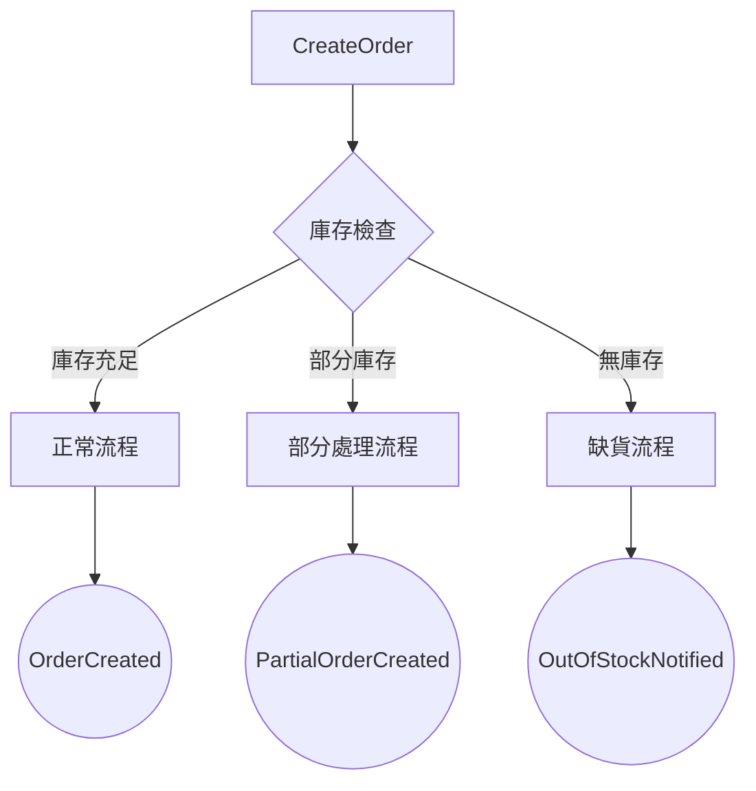
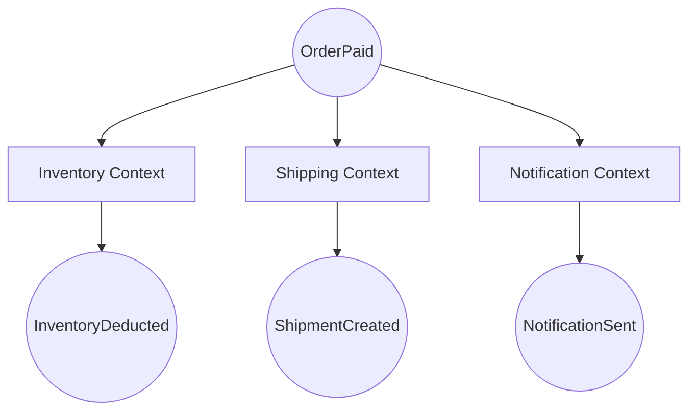

# [系統名稱] - 事件風暴圖模板（Event Storming）

## 📋 使用說明

本模板提供事件風暴圖的標準結構，使用 Mermaid Flowchart 繪製業務流程。

**圖例說明**：
- 🔵 **命令（Command）**：觸發業務流程的動作
- 🟠 **領域事件（Domain Event）**：業務流程中的關鍵事件
- 🟢 **聚合（Aggregate）**：處理業務邏輯的聚合根
- ⚪ **外部系統（External）**：外部上下文或第三方服務
- 🟡 **業務規則（Policy）**：決策點

---

## 🎨 Mermaid 模板

```mermaid
%% [系統名稱] - 事件風暴圖
%% 展示 [業務流程名稱] 的完整流程
%%
%% 最後更新: YYYY-MM-DD

graph TB
    %% ===================================
    %% 主流程：[流程名稱]
    %% ===================================

    Start([開始：用戶觸發動作])

    %% 命令1
    Start --> CMD1[Command1<br/>命令說明]

    %% 業務規則檢查
    CMD1 --> POL1{業務規則檢查<br/>檢查內容}
    POL1 -->|通過| AGG1{{Aggregate<br/>聚合名稱}}
    POL1 -->|失敗| ERR1[拋出異常:<br/>錯誤說明]

    %% 領域事件
    AGG1 --> EVT1((Event1<br/>事件說明))

    %% 外部系統調用
    EVT1 --> EXT1[External Context<br/>外部上下文說明]
    EVT1 --> WAIT1[等待狀態<br/>狀態說明]

    %% 後續流程
    WAIT1 --> CMD2[Command2<br/>命令說明]
    CMD2 --> AGG2{{Aggregate}}
    AGG2 --> EVT2((Event2<br/>事件說明))

    %% 結束
    EVT2 --> END1([流程結束])

    %% ===================================
    %% 異常流程：[異常場景名稱]
    %% ===================================

    WAIT1 --> POL2{超時檢查<br/>條件說明}
    POL2 -->|超時| CMD3[Auto-Cancel<br/>自動取消]
    CMD3 --> AGG3{{Aggregate}}
    AGG3 --> EVT3((EventCancelled<br/>取消事件))
    EVT3 --> END2([流程取消])

    %% ===================================
    %% 樣式定義
    %% ===================================

    %% 命令樣式（藍色）
    classDef commandStyle fill:#3498db,stroke:#2980b9,stroke-width:2px,color:#fff
    class CMD1,CMD2,CMD3 commandStyle

    %% 事件樣式（橙色）
    classDef eventStyle fill:#e67e22,stroke:#d35400,stroke-width:2px,color:#fff
    class EVT1,EVT2,EVT3 eventStyle

    %% 聚合樣式（綠色）
    classDef aggregateStyle fill:#2ecc71,stroke:#27ae60,stroke-width:3px,color:#fff
    class AGG1,AGG2,AGG3 aggregateStyle

    %% 外部系統樣式（灰色）
    classDef externalStyle fill:#95a5a6,stroke:#7f8c8d,stroke-width:2px,color:#fff
    class EXT1 externalStyle

    %% 業務規則樣式（黃色）
    classDef policyStyle fill:#f39c12,stroke:#e67e22,stroke-width:2px,color:#fff
    class POL1,POL2 policyStyle

    %% 等待狀態樣式（淺藍）
    classDef waitStyle fill:#ecf0f1,stroke:#bdc3c7,stroke-width:2px,color:#34495e
    class WAIT1 waitStyle

    %% 錯誤樣式（紅色）
    classDef errorStyle fill:#e74c3c,stroke:#c0392b,stroke-width:2px,color:#fff
    class ERR1 errorStyle

    %% 結束樣式（深綠）
    classDef endStyle fill:#16a085,stroke:#138d75,stroke-width:3px,color:#fff
    class END1,END2 endStyle
```

---

## 🔖 模板使用指南

### 步驟 1：替換佔位符

1. **系統名稱**：替換 `[系統名稱]` 為你的系統
2. **業務流程名稱**：替換 `[業務流程名稱]` 為實際流程（如：訂單創建流程）
3. **更新日期**：替換 `YYYY-MM-DD` 為當前日期

### 步驟 2：識別主流程

**按時間順序列出業務流程中的關鍵步驟**：

1. **開始節點**：用戶的觸發動作
2. **命令**：用戶執行的操作（如：CreateOrder）
3. **業務規則檢查**：決策點（如：檢查庫存）
4. **聚合**：處理業務邏輯的聚合根
5. **領域事件**：業務狀態變化（如：OrderCreated）
6. **外部系統**：調用其他上下文或第三方服務
7. **等待狀態**：異步等待或狀態轉換
8. **結束節點**：流程結束

### 步驟 3：添加異常流程

**識別可能的異常情況**：
- 超時處理
- 支付失敗
- 庫存不足
- 用戶取消

為每個異常情況繪製分支流程。

### 步驟 4：應用樣式

使用模板中的樣式定義，為不同類型的節點應用顏色：
- 命令：藍色
- 事件：橙色
- 聚合：綠色
- 外部系統：灰色
- 業務規則：黃色

### 步驟 5：驗證完整性

**檢查清單**：
- [ ] 所有命令都有對應的領域事件
- [ ] 所有決策點都有明確的業務規則
- [ ] 異常流程有清晰的處理路徑
- [ ] 外部系統調用已標記
- [ ] 事件觸發者和訂閱者已識別

---

## 💡 提示與最佳實踐

### 提示 1：命令與事件的命名

**命令**：使用動詞 + 名詞
- ✅ CreateOrder（創建訂單）
- ✅ PayOrder（支付訂單）
- ✅ CancelOrder（取消訂單）

**事件**：使用過去式
- ✅ OrderCreated（訂單已創建）
- ✅ OrderPaid（訂單已支付）
- ✅ OrderCancelled（訂單已取消）

### 提示 2：業務規則的標記

業務規則應該清晰標註判斷條件：

```mermaid
CMD --> POL{檢查庫存}
POL -->|庫存充足| AGG
POL -->|庫存不足| ERR[拋出異常: InsufficientStock]
```

### 提示 3：外部系統的標記

明確標記與外部系統的集成點：

```mermaid
EVT1 --> EXT1[Inventory Context<br/>調用: ReserveInventory API]
EVT2 --> EXT2[Payment Gateway<br/>調用: ProcessPayment API]
```

### 提示 4：時間軸的表示

如果需要表示時間維度（如：30分鐘超時），使用等待節點：

```mermaid
WAIT1[等待支付<br/>30分鐘超時] --> POL{超時檢查}
POL -->|未超時| ...
POL -->|已超時| AutoCancel
```

---

## 📊 複雜場景範例

### 多路徑分支



### 並行流程



---

## 📚 參考資源

- **完整範例**：`範例模型/訂單系統/event-storming.mmd`
- **Mermaid 文檔**：https://mermaid.js.org/
- **事件風暴**：Alberto Brandolini 的 Event Storming 方法論

---

## ✅ 完成檢查清單

使用此模板完成事件風暴圖後，請確認：

- [ ] 主流程完整（從開始到結束）
- [ ] 異常流程已識別並繪製
- [ ] 所有命令都有觸發者
- [ ] 所有事件都有訂閱者
- [ ] 業務規則決策點清晰
- [ ] 外部系統集成點已標記
- [ ] 樣式應用正確
- [ ] 圖表可讀性良好（不過於複雜）

---

**提示**：事件風暴圖應該講述一個完整的業務故事，讓任何人都能理解業務流程。
