# [系統名稱] - 領域模型設計模板（Domain Model Design）

## 📋 使用說明

本模板提供領域模型設計的標準結構，包含類圖設計和 Python 程式碼骨架。

**最後更新**: YYYY-MM-DD
**適用範圍**: [限界上下文名稱] Context

---

## 🎨 領域模型類圖（Mermaid）



---

## 💻 Python 程式碼骨架

### 1. 領域事件（Domain Events）

```python
"""
領域事件定義
"""

from dataclasses import dataclass, field
from datetime import datetime
from uuid import UUID, uuid4


@dataclass(frozen=True)
class DomainEvent:
    """Base class for all domain events"""
    event_id: UUID = field(default_factory=uuid4)
    occurred_at: datetime = field(default_factory=datetime.now)


@dataclass(frozen=True)
class Event1(DomainEvent):
    """[事件說明]"""
    aggregate_id: str
    # 添加事件特定的字段
    field1: str
    field2: int


@dataclass(frozen=True)
class Event2(DomainEvent):
    """[事件說明]"""
    aggregate_id: str
    # 添加事件特定的字段
```

---

### 2. 枚舉（Enums）

```python
"""
枚舉定義
"""

from enum import Enum


class EntityStatus(str, Enum):
    """[聚合狀態]"""
    STATUS_1 = "STATUS_1"
    STATUS_2 = "STATUS_2"
    STATUS_3 = "STATUS_3"


class SomeCategory(str, Enum):
    """[分類枚舉]"""
    CATEGORY_A = "CATEGORY_A"
    CATEGORY_B = "CATEGORY_B"
```

---

### 3. 值對象（Value Objects）

```python
"""
值對象定義
"""

from dataclasses import dataclass
from decimal import Decimal


@dataclass(frozen=True)
class ValueObject1:
    """
    [值對象說明]

    不變性原則：
    - 值對象是不可變的（frozen=True）
    - 所有操作返回新對象，而非修改當前對象
    - 兩個屬性完全相同的對象是可互換的
    """
    value: str

    def __post_init__(self):
        """驗證業務規則"""
        self._validate()

    def _validate(self) -> None:
        """驗證邏輯"""
        if not self.value:
            raise ValueError("value不能為空")
        # 添加更多驗證...

    def __str__(self) -> str:
        return self.value


@dataclass(frozen=True)
class ValueObject2:
    """
    [值對象說明，如：Money]

    支援運算的值對象範例
    """
    amount: Decimal
    currency: str

    def __post_init__(self):
        """驗證業務規則"""
        if self.amount < 0:
            raise ValueError("金額不能為負數")

        # Ensure amount has at most 2 decimal places
        quantized = self.amount.quantize(Decimal('0.01'))
        object.__setattr__(self, 'amount', quantized)

    def add(self, other: 'ValueObject2') -> 'ValueObject2':
        """加法運算 - 返回新對象"""
        if self.currency != other.currency:
            raise ValueError(f"不同幣種無法相加")
        return ValueObject2(self.amount + other.amount, self.currency)

    def subtract(self, other: 'ValueObject2') -> 'ValueObject2':
        """減法運算 - 返回新對象"""
        if self.currency != other.currency:
            raise ValueError(f"不同幣種無法相減")
        if self.amount < other.amount:
            raise ValueError("金額不足")
        return ValueObject2(self.amount - other.amount, self.currency)

    def __str__(self) -> str:
        return f"{self.currency} {self.amount:.2f}"
```

---

### 4. 實體（Entity）

```python
"""
實體定義
"""

from dataclasses import dataclass
from uuid import UUID, uuid4


@dataclass
class Entity1:
    """
    [實體說明]

    為什麼是實體而非值對象：
    - 有唯一標識（entity_id）
    - 可以單獨修改屬性
    - 即使屬性相同，不同ID的實體不相等
    """
    entity_id: UUID
    attribute_1: str
    attribute_2: int

    def __post_init__(self):
        """驗證業務規則"""
        if self.attribute_2 < 0:
            raise ValueError("attribute_2 必須 >= 0")

    def update_attribute(self, new_value: str) -> None:
        """更新屬性（實體可變）"""
        if not new_value:
            raise ValueError("新值不能為空")
        self.attribute_1 = new_value

    def __eq__(self, other: object) -> bool:
        """實體相等性：基於 ID"""
        if not isinstance(other, Entity1):
            return False
        return self.entity_id == other.entity_id

    def __hash__(self) -> int:
        """基於 ID 的哈希"""
        return hash(self.entity_id)
```

---

### 5. 聚合根（Aggregate Root）

```python
"""
聚合根定義
"""

from dataclasses import dataclass, field
from datetime import datetime
from typing import List, Optional
from uuid import UUID, uuid4


@dataclass
class AggregateRoot:
    """
    [聚合根說明]

    職責：
    - 維護聚合生命週期
    - 保護業務不變式
    - 發布領域事件
    - 控制聚合邊界

    不變式（Invariants）：
    - [不變式1]
    - [不變式2]
    """
    aggregate_id: str
    value_object_1: ValueObject1
    value_object_2: ValueObject2
    status: EntityStatus
    created_at: datetime
    updated_at: datetime
    entities: List[Entity1]

    # 領域事件列表
    _domain_events: List[DomainEvent] = field(
        default_factory=list,
        init=False,
        repr=False
    )

    # 可選字段
    optional_field: Optional[str] = None

    def __post_init__(self):
        """驗證聚合不變式"""
        self._check_invariants()

    def _check_invariants(self) -> None:
        """驗證業務不變式"""
        if not self.entities:
            raise ValueError("[聚合]至少需要一個[實體]")

        # 添加更多不變式檢查...

    # ========================================================================
    # 工廠方法（Factory Method）
    # ========================================================================

    @classmethod
    def create(cls, param1: str, param2: int) -> 'AggregateRoot':
        """
        工廠方法：創建新聚合

        這是聚合的唯一創建入口，確保：
        - 生成唯一聚合ID
        - 初始化狀態
        - 發布創建事件
        """
        now = datetime.now()
        aggregate = cls(
            aggregate_id=str(uuid4()),
            value_object_1=ValueObject1(value=param1),
            value_object_2=ValueObject2(amount=Decimal(param2), currency="TWD"),
            status=EntityStatus.STATUS_1,
            created_at=now,
            updated_at=now,
            entities=[]
        )

        # Publish domain event
        aggregate._add_domain_event(Event1(
            aggregate_id=aggregate.aggregate_id,
            field1=param1,
            field2=param2
        ))

        return aggregate

    # ========================================================================
    # 命令方法（Command Methods）
    # ========================================================================

    def command_method_1(self, param: str) -> None:
        """
        [命令說明]

        前置條件：
        - [條件1]
        - [條件2]

        後置條件：
        - [結果1]
        - [結果2]
        """
        # Check preconditions
        if self.status != EntityStatus.STATUS_1:
            raise ValueError(f"當前狀態無法執行此操作: {self.status}")

        # Update state
        self.status = EntityStatus.STATUS_2
        self.updated_at = datetime.now()

        # Check invariants
        self._check_invariants()

        # Publish event
        self._add_domain_event(Event2(
            aggregate_id=self.aggregate_id,
            # ... event data
        ))

    def command_method_2(self, entity: Entity1) -> None:
        """[命令說明]"""
        # Business logic...
        self.entities.append(entity)
        self._check_invariants()

    # ========================================================================
    # 查詢方法（Query Methods）
    # ========================================================================

    def is_valid(self) -> bool:
        """檢查聚合是否有效"""
        try:
            self._check_invariants()
            return True
        except ValueError:
            return False

    def query_method_1(self) -> int:
        """[查詢說明]"""
        return len(self.entities)

    # ========================================================================
    # 領域事件管理
    # ========================================================================

    def _add_domain_event(self, event: DomainEvent) -> None:
        """添加領域事件"""
        self._domain_events.append(event)

    def get_domain_events(self) -> List[DomainEvent]:
        """獲取所有領域事件"""
        return self._domain_events.copy()

    def clear_domain_events(self) -> None:
        """清除領域事件（通常在事件發布後調用）"""
        self._domain_events.clear()
```

---

### 6. 領域服務（Domain Services）

```python
"""
領域服務定義
"""


class DomainService1:
    """
    [領域服務說明]

    為什麼需要領域服務：
    - 業務邏輯涉及多個聚合
    - 不屬於任何單一聚合的職責
    - 需要調用外部上下文
    """

    @staticmethod
    def service_method(aggregate: AggregateRoot, param: str) -> None:
        """
        [服務方法說明]

        參數：
        - aggregate: [說明]
        - param: [說明]
        """
        # Business logic...
        pass


class DomainService2:
    """
    [領域服務說明]
    """

    def __init__(self, external_service):
        """依賴注入外部服務"""
        self.external_service = external_service

    def complex_operation(self, aggregate1: AggregateRoot,
                         aggregate2: AggregateRoot) -> None:
        """
        [複雜操作說明]

        跨聚合的業務邏輯
        """
        # Business logic...
        pass
```

---

## 🔖 模板使用指南

### 步驟 1：設計類圖

1. **識別聚合根**：
   - 什麼是聚合的入口？
   - 什麼需要保護不變式？

2. **識別實體與值對象**：
   - 有唯一標識 → 實體
   - 可互換 + 不可變 → 值對象

3. **設計領域事件**：
   - 什麼時候發布事件？
   - 事件包含哪些數據？

4. **繪製類圖**：
   - 使用 Mermaid 繪製
   - 標註關係（包含、繼承、發布）

### 步驟 2：實現程式碼

1. **從值對象開始**：
   - 值對象最簡單，先實現
   - 確保不可變性和驗證邏輯

2. **實現實體**：
   - 添加唯一標識
   - 實現相等性比較

3. **實現聚合根**：
   - 實現工廠方法
   - 實現命令方法
   - 添加不變式檢查
   - 發布領域事件

4. **實現領域服務**（如需要）：
   - 跨聚合的業務邏輯
   - 依賴外部服務的邏輯

### 步驟 3：測試

1. **值對象測試**：
   - 測試驗證邏輯
   - 測試不可變性
   - 測試運算（如有）

2. **聚合根測試**：
   - 測試工廠方法
   - 測試命令方法
   - 測試不變式保護
   - 測試領域事件發布

---

## ✅ 完成檢查清單

- [ ] 類圖完整（聚合根、實體、值對象、事件）
- [ ] 值對象是不可變的（frozen=True）
- [ ] 實體有唯一標識和相等性比較
- [ ] 聚合根有工廠方法
- [ ] 命令方法有前置條件檢查
- [ ] 不變式在每次修改後檢查
- [ ] 領域事件正確發布
- [ ] 程式碼有 type hints
- [ ] 程式碼有文檔字串

---

## 📚 參考資源

- **完整範例**：`範例模型/訂單系統/domain-model.py`
- **DDD 模式**：Eric Evans《領域驅動設計》
- **Python 實現**：Vaughn Vernon《實作領域驅動設計》

---

## 💡 設計原則

1. **Rich Domain Model（豐富領域模型）**：
   - 業務邏輯放在領域模型中，不是服務層
   - 聚合根應該有豐富的業務方法

2. **Tell, Don't Ask（告訴，不要詢問）**：
   - 調用聚合的命令方法，而不是取出數據自己處理
   - 例如：`order.pay()` 而非 `order.set_status(PAID)`

3. **Persistence Ignorance（持久化無關）**：
   - 領域模型不依賴持久化機制
   - 不使用 ORM 註解污染領域模型

4. **Ubiquitous Language（通用語言）**：
   - 類名、方法名使用業務術語
   - 與業務專家的語言一致

---

**提示**：領域模型是 DDD 的核心，應該反映業務邏輯，而非技術實現。
