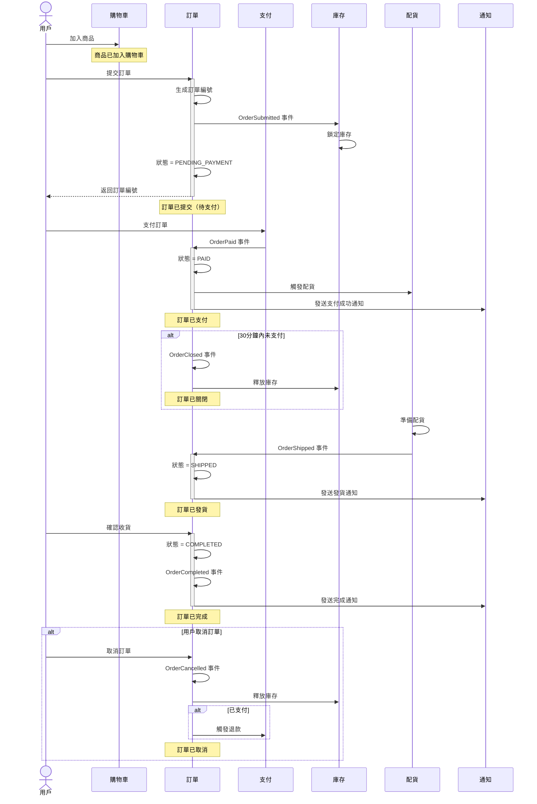
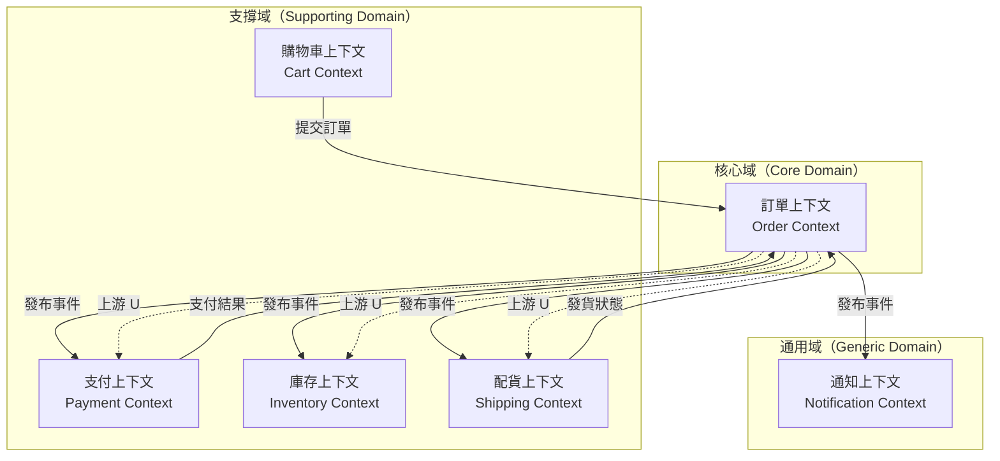
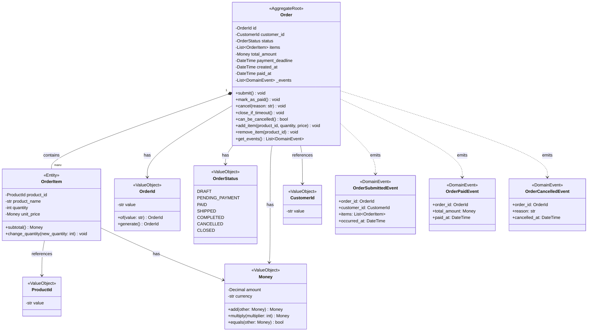

# 7.2 AI 輔助領域建模

## 📋 本章概述

**學習時長**：40 分鐘

**學習目標**：
- 掌握 AI 輔助 DDD 的完整工作流程
- 能用 AI 從業務描述提取通用語言
- 能用 AI 自動化事件風暴流程
- 能用 AI 設計領域模型並生成程式碼骨架
- 理解 AI 的能力邊界與局限性

**核心理念**：
> AI 不是取代 DDD，而是加速 DDD。
> 傳統 DDD 需要數天的團隊工作坊，AI 輔助可在 1-2 小時內完成 80% 的建模工作。
> AI 負責快速生成候選方案，人類負責驗證和決策。

---

## 🚨 傳統 DDD 的痛點

### 痛點 1：事件風暴需要整個團隊

**傳統事件風暴工作坊**：
```
準備階段（1-2 天）：
├─ 召集領域專家（產品、業務、開發、測試）
├─ 預定會議室
├─ 準備便利貼、白板
└─ 閱讀背景資料

工作坊（1-2 天）：
├─ 8:00-10:00：熱身與對齊目標
├─ 10:00-12:00：識別領域事件（橘色便利貼）
├─ 13:00-15:00：識別命令與角色（藍色、黃色便利貼）
├─ 15:00-17:00：識別聚合與限界上下文
└─ 17:00-18:00：整理與拍照

後續整理（2-3 天）：
├─ 把白板上的便利貼數位化
├─ 繪製正式的事件風暴圖
├─ 撰寫領域模型文檔
└─ 與團隊確認

總計：5-7 天，6-10 人參與
```

**問題**：
- ❌ 時間成本高（5-7 天）
- ❌ 人力成本高（6-10 人 × 5 天）
- ❌ 協調困難（很難湊齊所有專家）
- ❌ 容易跑偏（會議變成爭論大會）

### 痛點 2：通用語言提取困難

**傳統方式**：
```
步驟 1：閱讀大量業務文檔（需求文檔、使用者故事、會議記錄）
步驟 2：手動標記關鍵術語
步驟 3：與領域專家逐一確認
步驟 4：建立通用語言詞彙表
步驟 5：持續更新與維護

問題：
- 文檔分散在多處（Confluence、Jira、Email）
- 同一個概念有多種說法（訂單 vs Order vs 購買）
- 很難識別隱含的領域概念
```

### 痛點 3：領域模型設計需要經驗

**傳統方式**：
```
問題：如何劃分限界上下文？
├─ 新手：不知道怎麼劃分，全部放在一個大上下文
├─ 中階：過度劃分，每個實體都是一個上下文
└─ 專家：根據業務內聚性劃分，但需要多年經驗

問題：如何設計聚合邊界？
├─ 新手：聚合太大，包含太多實體
├─ 中階：聚合太小，失去一致性保證
└─ 專家：精確劃分，但需要深厚功力

結果：沒有 5-10 年經驗，很難設計出好的領域模型
```

---

## 🚀 AI 如何加速 DDD 流程

### 時間對比

| 階段 | 傳統 DDD | AI 輔助 DDD | 節省比例 |
|------|----------|-------------|---------|
| 通用語言提取 | 1-2 天 | 5-10 分鐘 | 95% |
| 事件風暴 | 1-2 天 | 15-30 分鐘 | 90% |
| 限界上下文識別 | 半天-1 天 | 10-20 分鐘 | 85% |
| 領域模型設計 | 1-2 天 | 20-40 分鐘 | 80% |
| 程式碼生成 | 2-3 天 | 10-20 分鐘 | 90% |
| **總計** | **5-7 天** | **1-2 小時** | **~70%** |

### AI 的優勢

**✅ AI 擅長的**：
1. **快速分析大量文本**
   - 同時處理數十份文檔
   - 識別重複出現的術語
   - 提取隱含的領域概念

2. **生成候選方案**
   - 提供多種限界上下文劃分方案
   - 列出不同聚合設計的優缺點
   - 生成程式碼骨架

3. **參考最佳實踐**
   - AI 訓練資料包含大量 DDD 範例
   - 能提供符合 DDD 原則的設計

4. **快速迭代**
   - 不滿意可以立刻重新生成
   - 嘗試不同方案的成本極低

**⚠️ AI 的局限**：
1. **無法理解業務意圖**
   - AI 只能基於你提供的描述
   - 無法判斷業務策略的優先級

2. **無法做戰略決策**
   - 限界上下文邊界涉及組織架構
   - AI 不了解團隊能力與資源限制

3. **需要人類驗證**
   - AI 生成的模型可能有邏輯漏洞
   - 必須由領域專家確認

4. **無法處理政治因素**
   - 遺留系統、組織慣性、利益衝突
   - 這些 AI 完全無感

---

## 🔄 AI 輔助 DDD 完整工作流程

### 流程總覽

```
輸入：業務需求與文檔
    ↓
【階段 1】通用語言提取（5-10 分鐘）
    ├─ 輸入：需求文檔、使用者故事、會議記錄
    ├─ AI 任務：提取領域術語、識別核心概念
    └─ 產出：通用語言詞彙表
    ↓
【階段 2】事件風暴自動化（15-30 分鐘）
    ├─ 輸入：業務流程描述
    ├─ AI 任務：識別領域事件、命令、查詢
    └─ 產出：事件風暴圖（Mermaid）
    ↓
【階段 3】限界上下文識別（10-20 分鐘）
    ├─ 輸入：事件風暴產出
    ├─ AI 任務：分析聚合邊界、識別上下文
    └─ 產出：上下文地圖（Context Map）
    ↓
【階段 4】領域模型設計（20-40 分鐘）
    ├─ 輸入：上下文地圖
    ├─ AI 任務：設計實體、值對象、聚合根
    └─ 產出：領域模型類圖 + 程式碼骨架
    ↓
【階段 5】程式碼生成與驗證（10-20 分鐘）
    ├─ 輸入：領域模型
    ├─ AI 任務：生成 Python/TypeScript 程式碼骨架
    └─ 產出：可執行的領域層程式碼
    ↓
輸出：完整領域模型與程式碼骨架
```

---

## 📝 階段 1：通用語言提取

### 目標

從業務文檔中提取關鍵術語，建立通用語言詞彙表。

### 輸入示例

**業務需求文檔**：
```
電商訂單系統需求

1. 用戶瀏覽商品後可以加入購物車
2. 購物車內的商品可以調整數量或移除
3. 用戶提交訂單後，系統生成訂單編號
4. 訂單提交後進入「待支付」狀態
5. 用戶在 30 分鐘內完成支付，訂單變為「已支付」
6. 如果 30 分鐘內未支付，訂單自動關閉
7. 已支付的訂單會進入配貨流程
8. 配貨完成後，訂單變為「已發貨」
9. 用戶確認收貨後，訂單變為「已完成」
10. 用戶可以在「待支付」或「已支付」狀態下取消訂單
11. 取消訂單後如果已支付，需要退款
```

### AI 對話範例

**提示詞**（Prompt）：
```
我需要為電商訂單系統建立 DDD 領域模型。
請從以下業務需求中提取通用語言（Ubiquitous Language）。

【要求】
1. 識別核心領域概念（名詞）
2. 識別關鍵業務行為（動詞）
3. 識別領域事件（過去式動詞）
4. 識別業務規則與約束
5. 用表格形式輸出，包含：術語、類型、定義、備註

【業務需求】
[貼上上面的需求文檔]

【輸出格式】
請用 Markdown 表格輸出。
```

**AI 輸出**：

#### 通用語言詞彙表

##### 核心領域概念（名詞）

| 術語 | 英文 | 類型 | 定義 | 備註 |
|------|------|------|------|------|
| 訂單 | Order | 聚合根 | 用戶的購買請求，包含商品清單與總金額 | 核心聚合 |
| 訂單項 | OrderItem | 實體 | 訂單內的單個商品項，包含商品、數量、價格 | 屬於訂單聚合 |
| 購物車 | ShoppingCart | 聚合根 | 用戶暫存的商品清單，未提交訂單前的狀態 | 獨立聚合 |
| 商品 | Product | 實體 | 可售賣的產品，包含名稱、價格、庫存 | 商品上下文 |
| 用戶 | Customer | 實體 | 購買商品的客戶 | 身份認證上下文 |
| 支付 | Payment | 聚合根 | 訂單的支付記錄 | 支付上下文 |
| 配貨單 | Shipment | 聚合根 | 訂單的配貨與發貨記錄 | 物流上下文 |
| 退款 | Refund | 實體 | 取消訂單後的退款記錄 | 支付上下文 |

##### 訂單狀態（值對象）

| 術語 | 英文 | 定義 |
|------|------|------|
| 待支付 | PENDING_PAYMENT | 訂單已提交，等待用戶支付 |
| 已支付 | PAID | 用戶已完成支付 |
| 已發貨 | SHIPPED | 訂單已發貨，等待用戶確認收貨 |
| 已完成 | COMPLETED | 用戶已確認收貨 |
| 已關閉 | CLOSED | 超時未支付，系統自動關閉 |
| 已取消 | CANCELLED | 用戶主動取消訂單 |

##### 關鍵業務行為（命令）

| 術語 | 英文 | 觸發者 | 定義 |
|------|------|--------|------|
| 加入購物車 | addToCart | 用戶 | 將商品加入購物車 |
| 提交訂單 | submitOrder | 用戶 | 從購物車生成訂單 |
| 支付訂單 | payOrder | 用戶 | 完成訂單支付 |
| 取消訂單 | cancelOrder | 用戶 | 取消待支付或已支付的訂單 |
| 確認收貨 | confirmReceipt | 用戶 | 確認已收到商品 |
| 關閉訂單 | closeOrder | 系統 | 超時未支付，自動關閉訂單 |
| 配貨 | prepareShipment | 系統 | 為已支付訂單準備配貨 |
| 發貨 | shipOrder | 系統 | 將訂單標記為已發貨 |
| 退款 | refund | 系統 | 處理取消訂單的退款 |

##### 領域事件（過去式）

| 術語 | 英文 | 定義 | 訂閱者 |
|------|------|------|--------|
| 訂單已提交 | OrderSubmitted | 用戶提交訂單後觸發 | 庫存系統（鎖定庫存）|
| 訂單已支付 | OrderPaid | 訂單支付成功後觸發 | 配貨系統、通知系統 |
| 訂單已取消 | OrderCancelled | 訂單被取消後觸發 | 庫存系統（釋放庫存）、支付系統（退款）|
| 訂單已關閉 | OrderClosed | 訂單超時關閉後觸發 | 庫存系統（釋放庫存）|
| 訂單已發貨 | OrderShipped | 訂單發貨後觸發 | 通知系統（發送物流訊息）|
| 訂單已完成 | OrderCompleted | 用戶確認收貨後觸發 | 積分系統、評價系統 |

##### 業務規則與約束

| 規則 ID | 描述 | 涉及概念 |
|---------|------|---------|
| BR-001 | 訂單提交後必須在 30 分鐘內支付，否則自動關閉 | 訂單、支付 |
| BR-002 | 只有「待支付」和「已支付」狀態的訂單可以取消 | 訂單狀態 |
| BR-003 | 取消「已支付」的訂單必須退款 | 訂單、退款 |
| BR-004 | 訂單項的數量必須大於 0 | 訂單項 |
| BR-005 | 購物車內的商品在提交訂單後會被清空 | 購物車、訂單 |
| BR-006 | 已發貨和已完成的訂單不能取消 | 訂單狀態 |

### 關鍵要點

**✅ AI 幫你做了什麼**：
1. 自動識別核心概念（訂單、購物車、支付...）
2. 分類術語（實體、值對象、命令、事件）
3. 建立初步的聚合候選（訂單聚合、支付聚合...）
4. 提取業務規則（30 分鐘內支付...）

**⚠️ 你需要驗證**：
1. 術語是否準確（與業務人員確認）
2. 聚合劃分是否合理（是否需要調整）
3. 業務規則是否完整（有無遺漏）

---

## 🎨 階段 2：事件風暴自動化

### 目標

識別領域事件、命令、查詢，繪製事件風暴圖。

### AI 對話範例

**提示詞**：
```
基於上面的通用語言詞彙表，請進行事件風暴分析。

【要求】
1. 識別完整的業務流程
2. 標記每個步驟的觸發者（用戶/系統）
3. 識別每個步驟產生的領域事件
4. 用 Mermaid 流程圖表示

【輸出格式】
請用 Mermaid sequence diagram 繪製。
```

**AI 輸出**：

#### 事件風暴圖



#### 事件流程表

| 階段 | 觸發者 | 命令 | 領域事件 | 副作用 |
|------|--------|------|---------|--------|
| 1. 加入購物車 | 用戶 | addToCart | CartItemAdded | 購物車更新 |
| 2. 提交訂單 | 用戶 | submitOrder | OrderSubmitted | 鎖定庫存、生成訂單 |
| 3. 支付訂單 | 用戶 | payOrder | OrderPaid | 觸發配貨、發送通知 |
| 4. 配貨 | 系統 | prepareShipment | - | 準備配貨 |
| 5. 發貨 | 系統 | shipOrder | OrderShipped | 發送物流通知 |
| 6. 確認收貨 | 用戶 | confirmReceipt | OrderCompleted | 增加積分、觸發評價 |
| 異常 1. 超時關閉 | 系統 | closeOrder | OrderClosed | 釋放庫存 |
| 異常 2. 取消訂單 | 用戶 | cancelOrder | OrderCancelled | 釋放庫存、退款 |

### 關鍵要點

**✅ AI 幫你做了什麼**：
1. 自動繪製事件流程圖（省去白板貼便利貼）
2. 識別完整的業務流程（包括異常流程）
3. 標記事件的觸發者與副作用
4. 生成可視化的 Mermaid 圖表

**⚠️ 你需要驗證**：
1. 流程是否完整（有無遺漏的邊緣情況）
2. 事件命名是否符合通用語言
3. 副作用是否正確（如退款邏輯）

---

## 🗺️ 階段 3：限界上下文識別

### 目標

基於事件風暴結果，識別限界上下文邊界。

### AI 對話範例

**提示詞**：
```
基於上面的事件風暴分析，請識別限界上下文（Bounded Context）。

【要求】
1. 根據業務內聚性劃分上下文
2. 說明每個上下文的職責
3. 識別上下文之間的關係（上游/下游、共享內核、防腐層）
4. 用 Mermaid C4 diagram 或文字描述

【輸出格式】
1. 上下文清單（表格）
2. 上下文地圖（Mermaid 或文字）
3. 每個上下文的核心聚合
```

**AI 輸出**：

#### 限界上下文劃分

| 上下文名稱 | 職責 | 核心聚合 | 關鍵實體 |
|-----------|------|---------|---------|
| 訂單上下文（Order Context） | 管理訂單生命週期 | Order 聚合 | Order, OrderItem |
| 購物車上下文（Cart Context） | 管理購物車操作 | ShoppingCart 聚合 | Cart, CartItem |
| 支付上下文（Payment Context） | 處理支付與退款 | Payment 聚合 | Payment, Refund |
| 庫存上下文（Inventory Context） | 管理商品庫存 | Inventory 聚合 | Stock, Product |
| 配貨上下文（Shipping Context） | 處理配貨與物流 | Shipment 聚合 | Shipment, DeliveryAddress |
| 通知上下文（Notification Context） | 發送各類通知 | Notification 聚合 | Email, SMS, Push |

#### 上下文地圖（Context Map）



#### 上下文關係詳解

| 上游上下文 | 下游上下文 | 關係類型 | 整合方式 | 說明 |
|-----------|-----------|---------|---------|------|
| 購物車 | 訂單 | 客戶-供應商（Customer-Supplier） | API 調用 | 購物車提交後生成訂單 |
| 訂單 | 支付 | 發布者-訂閱者（Publisher-Subscriber） | 領域事件 | 訂單發布 OrderPaid 事件 |
| 訂單 | 庫存 | 發布者-訂閱者 | 領域事件 | 訂單發布 OrderSubmitted/OrderCancelled 事件 |
| 訂單 | 配貨 | 發布者-訂閱者 | 領域事件 | 訂單發布 OrderPaid 事件觸發配貨 |
| 訂單 | 通知 | 發布者-訂閱者 | 領域事件 | 訂單狀態變更觸發通知 |

#### 每個上下文的核心聚合設計

**1. 訂單上下文（Order Context）**
```python
# 聚合根
class Order:
    id: OrderId  # 值對象
    customer_id: CustomerId
    status: OrderStatus  # 值對象
    items: List[OrderItem]  # 實體列表
    total_amount: Money  # 值對象
    payment_deadline: datetime

    # 業務方法
    def submit(self): ...
    def mark_as_paid(self): ...
    def cancel(self, reason: str): ...
    def close_if_timeout(self): ...
```

**2. 購物車上下文（Cart Context）**
```python
# 聚合根
class ShoppingCart:
    id: CartId
    customer_id: CustomerId
    items: List[CartItem]

    # 業務方法
    def add_item(self, product_id, quantity): ...
    def remove_item(self, product_id): ...
    def clear(self): ...
    def checkout(self) -> Order: ...
```

**3. 支付上下文（Payment Context）**
```python
# 聚合根
class Payment:
    id: PaymentId
    order_id: OrderId  # 引用訂單（不直接持有 Order 物件）
    amount: Money
    status: PaymentStatus
    payment_method: PaymentMethod

    # 業務方法
    def process(self): ...
    def refund(self, amount: Money): ...
```

### 關鍵要點

**✅ AI 幫你做了什麼**：
1. 基於業務內聚性自動劃分上下文
2. 識別上下文之間的依賴關係
3. 建議整合方式（API 調用、領域事件）
4. 生成上下文地圖可視化

**⚠️ 你需要決策**：
1. 是否接受 AI 的劃分方案（可能需要根據團隊結構調整）
2. 是否需要防腐層（如果整合外部遺留系統）
3. 上下文的優先級（核心域 vs 支撐域 vs 通用域）

**💡 劃分原則**：
- 高內聚：同一上下文內的概念緊密相關
- 低耦合：上下文之間通過事件或 API 通訊
- 業務導向：按業務功能劃分，而非技術層次

---

## 🏗️ 階段 4：領域模型設計

### 目標

為每個限界上下文設計詳細的領域模型（實體、值對象、聚合根）。

### AI 對話範例

**提示詞**：
```
請為「訂單上下文」設計詳細的領域模型。

【要求】
1. 設計 Order 聚合（聚合根、實體、值對象）
2. 定義所有值對象（OrderStatus, Money, OrderId...）
3. 設計業務方法（submit, cancel, mark_as_paid...）
4. 說明業務規則的實現方式
5. 用 Mermaid 類圖表示

【輸出格式】
1. 領域模型類圖（Mermaid）
2. 每個類的詳細設計（Python 程式碼骨架）
```

**AI 輸出**：

#### 訂單上下文領域模型類圖



#### Python 程式碼骨架

**值對象**：
```python
from dataclasses import dataclass
from decimal import Decimal
from enum import Enum
from typing import Optional
import uuid

# OrderId 值對象
@dataclass(frozen=True)
class OrderId:
    """訂單 ID（值對象）"""
    value: str

    @staticmethod
    def of(value: str) -> 'OrderId':
        """從字串創建"""
        if not value:
            raise ValueError("訂單 ID 不能為空")
        return OrderId(value)

    @staticmethod
    def generate() -> 'OrderId':
        """生成新的訂單 ID"""
        return OrderId(f"ORD-{uuid.uuid4().hex[:12].upper()}")

# Money 值對象
@dataclass(frozen=True)
class Money:
    """金額（值對象）"""
    amount: Decimal
    currency: str = "USD"

    def __post_init__(self):
        if self.amount < 0:
            raise ValueError("金額不能為負數")

    def __add__(self, other: 'Money') -> 'Money':
        """金額相加"""
        if self.currency != other.currency:
            raise ValueError(f"幣種不一致: {self.currency} vs {other.currency}")
        return Money(self.amount + other.amount, self.currency)

    def __mul__(self, multiplier: int) -> 'Money':
        """金額乘法"""
        return Money(self.amount * multiplier, self.currency)

    def __eq__(self, other) -> bool:
        if not isinstance(other, Money):
            return False
        return self.amount == other.amount and self.currency == other.currency

# OrderStatus 值對象
class OrderStatus(Enum):
    """訂單狀態（值對象）"""
    DRAFT = "draft"
    PENDING_PAYMENT = "pending_payment"
    PAID = "paid"
    SHIPPED = "shipped"
    COMPLETED = "completed"
    CANCELLED = "cancelled"
    CLOSED = "closed"
```

**實體**：
```python
from dataclasses import dataclass

@dataclass
class OrderItem:
    """訂單項（實體，屬於 Order 聚合）"""
    product_id: str
    product_name: str
    quantity: int
    unit_price: Money

    def __post_init__(self):
        if self.quantity <= 0:
            raise ValueError("商品數量必須大於 0")

    @property
    def subtotal(self) -> Money:
        """計算小計"""
        return self.unit_price * self.quantity

    def change_quantity(self, new_quantity: int):
        """修改數量"""
        if new_quantity <= 0:
            raise ValueError("商品數量必須大於 0")
        self.quantity = new_quantity
```

**領域事件**：
```python
from dataclasses import dataclass
from datetime import datetime
from typing import List

@dataclass
class OrderSubmittedEvent:
    """訂單已提交事件"""
    order_id: OrderId
    customer_id: str
    items: List[dict]
    occurred_at: datetime

@dataclass
class OrderPaidEvent:
    """訂單已支付事件"""
    order_id: OrderId
    total_amount: Money
    paid_at: datetime

@dataclass
class OrderCancelledEvent:
    """訂單已取消事件"""
    order_id: OrderId
    reason: str
    cancelled_at: datetime
```

**聚合根**：
```python
from typing import List, Optional
from datetime import datetime, timedelta

class Order:
    """訂單聚合根"""

    def __init__(self, order_id: OrderId, customer_id: str):
        self.id = order_id
        self.customer_id = customer_id
        self.status = OrderStatus.DRAFT
        self.items: List[OrderItem] = []
        self.payment_deadline: Optional[datetime] = None
        self.created_at = datetime.now()
        self.paid_at: Optional[datetime] = None
        self.cancelled_at: Optional[datetime] = None
        self.cancel_reason: Optional[str] = None
        self._events: List = []

    # ========== 業務方法 ==========

    def add_item(self, product_id: str, product_name: str, quantity: int, unit_price: Money):
        """新增訂單項"""
        if self.status != OrderStatus.DRAFT:
            raise InvalidOrderStateError("只有草稿狀態才能新增商品")

        # 檢查是否已存在
        existing_item = self._find_item(product_id)
        if existing_item:
            existing_item.change_quantity(existing_item.quantity + quantity)
        else:
            item = OrderItem(product_id, product_name, quantity, unit_price)
            self.items.append(item)

    def remove_item(self, product_id: str):
        """移除訂單項"""
        if self.status != OrderStatus.DRAFT:
            raise InvalidOrderStateError("只有草稿狀態才能移除商品")

        self.items = [item for item in self.items if item.product_id != product_id]

    def submit(self):
        """提交訂單"""
        if self.status != OrderStatus.DRAFT:
            raise InvalidOrderStateError("只有草稿狀態才能提交")

        if not self.items:
            raise ValueError("訂單必須包含至少一個商品")

        self.status = OrderStatus.PENDING_PAYMENT
        self.payment_deadline = datetime.now() + timedelta(minutes=30)

        # 發布領域事件
        self._events.append(OrderSubmittedEvent(
            order_id=self.id,
            customer_id=self.customer_id,
            items=[{
                'product_id': item.product_id,
                'quantity': item.quantity,
                'price': item.unit_price.amount
            } for item in self.items],
            occurred_at=datetime.now()
        ))

    def mark_as_paid(self):
        """標記為已支付"""
        if self.status != OrderStatus.PENDING_PAYMENT:
            raise InvalidOrderStateError("只有待支付訂單才能標記為已支付")

        self.status = OrderStatus.PAID
        self.paid_at = datetime.now()

        # 發布領域事件
        self._events.append(OrderPaidEvent(
            order_id=self.id,
            total_amount=self.total_amount,
            paid_at=self.paid_at
        ))

    def cancel(self, reason: str):
        """取消訂單"""
        if not self.can_be_cancelled():
            raise InvalidOrderStateError(
                f"訂單狀態為 {self.status.value} 時無法取消"
            )

        self.status = OrderStatus.CANCELLED
        self.cancelled_at = datetime.now()
        self.cancel_reason = reason

        # 發布領域事件
        self._events.append(OrderCancelledEvent(
            order_id=self.id,
            reason=reason,
            cancelled_at=self.cancelled_at
        ))

    def close_if_timeout(self):
        """超時關閉訂單"""
        if self.status != OrderStatus.PENDING_PAYMENT:
            return

        if datetime.now() > self.payment_deadline:
            self.status = OrderStatus.CLOSED
            # 發布事件...

    def can_be_cancelled(self) -> bool:
        """判斷是否可以取消"""
        return self.status in [
            OrderStatus.PENDING_PAYMENT,
            OrderStatus.PAID
        ]

    @property
    def total_amount(self) -> Money:
        """計算總金額"""
        if not self.items:
            return Money(Decimal(0))

        total = self.items[0].subtotal
        for item in self.items[1:]:
            total = total + item.subtotal
        return total

    def get_events(self) -> List:
        """獲取領域事件"""
        events = self._events.copy()
        self._events.clear()
        return events

    # ========== 私有方法 ==========

    def _find_item(self, product_id: str) -> Optional[OrderItem]:
        """查找訂單項"""
        return next(
            (item for item in self.items if item.product_id == product_id),
            None
        )

# 自定義異常
class InvalidOrderStateError(Exception):
    """訂單狀態錯誤"""
    pass
```

### 關鍵要點

**✅ AI 幫你做了什麼**：
1. 設計完整的聚合結構（聚合根、實體、值對象）
2. 生成可執行的程式碼骨架
3. 實現業務規則（如取消邏輯、金額計算）
4. 設計領域事件

**⚠️ 你需要完善**：
1. 補充更多業務規則（如折扣計算、優惠券）
2. 加入持久化邏輯（Repository）
3. 完善錯誤處理
4. 加入單元測試

---

## 🔄 階段 5：程式碼生成與驗證

### 目標

生成完整的領域層程式碼，並通過測試驗證。

### AI 對話範例

**提示詞**：
```
請為上面的 Order 聚合生成完整的 Python 程式碼檔案結構。

【要求】
1. 包含目錄結構
2. 每個檔案的完整程式碼
3. 包含單元測試範例
4. 包含 README 說明如何使用

【輸出格式】
```
order_context/
├── __init__.py
├── domain/
│   ├── __init__.py
│   ├── aggregates/
│   │   ├── __init__.py
│   │   └── order.py
│   ├── entities/
│   │   ├── __init__.py
│   │   └── order_item.py
│   ├── value_objects/
│   │   ├── __init__.py
│   │   ├── order_id.py
│   │   ├── money.py
│   │   └── order_status.py
│   └── events/
│       ├── __init__.py
│       └── order_events.py
├── tests/
│   ├── __init__.py
│   └── test_order_aggregate.py
└── README.md
```

（AI 會生成所有檔案的完整程式碼）
```

**AI 輸出**：

#### 檔案結構

```
order_context/
├── __init__.py
├── domain/
│   ├── __init__.py
│   ├── aggregates/
│   │   ├── __init__.py
│   │   └── order.py              # Order 聚合根
│   ├── entities/
│   │   ├── __init__.py
│   │   └── order_item.py         # OrderItem 實體
│   ├── value_objects/
│   │   ├── __init__.py
│   │   ├── order_id.py           # OrderId 值對象
│   │   ├── money.py              # Money 值對象
│   │   └── order_status.py       # OrderStatus 值對象
│   ├── events/
│   │   ├── __init__.py
│   │   └── order_events.py       # 領域事件
│   └── exceptions.py             # 自定義異常
├── tests/
│   ├── __init__.py
│   ├── test_order_aggregate.py   # Order 聚合測試
│   └── test_value_objects.py     # 值對象測試
└── README.md                     # 使用說明
```

#### 單元測試範例

**tests/test_order_aggregate.py**：
```python
import pytest
from decimal import Decimal
from datetime import datetime, timedelta

from domain.aggregates.order import Order
from domain.value_objects.order_id import OrderId
from domain.value_objects.money import Money
from domain.value_objects.order_status import OrderStatus
from domain.exceptions import InvalidOrderStateError


class TestOrderAggregate:
    """Order 聚合根測試"""

    def setup_method(self):
        """每個測試前的準備"""
        self.order_id = OrderId.generate()
        self.customer_id = "CUST001"
        self.order = Order(self.order_id, self.customer_id)

    def test_create_order(self):
        """測試創建訂單"""
        assert self.order.id == self.order_id
        assert self.order.customer_id == self.customer_id
        assert self.order.status == OrderStatus.DRAFT
        assert len(self.order.items) == 0

    def test_add_item(self):
        """測試新增訂單項"""
        self.order.add_item(
            product_id="PROD001",
            product_name="iPhone 15",
            quantity=2,
            unit_price=Money(Decimal("999.99"))
        )

        assert len(self.order.items) == 1
        assert self.order.items[0].product_id == "PROD001"
        assert self.order.items[0].quantity == 2

    def test_add_duplicate_item_increases_quantity(self):
        """測試新增重複商品會累加數量"""
        self.order.add_item("PROD001", "iPhone 15", 1, Money(Decimal("999.99")))
        self.order.add_item("PROD001", "iPhone 15", 2, Money(Decimal("999.99")))

        assert len(self.order.items) == 1
        assert self.order.items[0].quantity == 3

    def test_remove_item(self):
        """測試移除訂單項"""
        self.order.add_item("PROD001", "iPhone 15", 1, Money(Decimal("999.99")))
        self.order.remove_item("PROD001")

        assert len(self.order.items) == 0

    def test_calculate_total_amount(self):
        """測試計算總金額"""
        self.order.add_item("PROD001", "iPhone 15", 2, Money(Decimal("999.99")))
        self.order.add_item("PROD002", "AirPods", 1, Money(Decimal("199.99")))

        expected_total = Money(Decimal("2199.97"))
        assert self.order.total_amount == expected_total

    def test_submit_order(self):
        """測試提交訂單"""
        self.order.add_item("PROD001", "iPhone 15", 1, Money(Decimal("999.99")))
        self.order.submit()

        assert self.order.status == OrderStatus.PENDING_PAYMENT
        assert self.order.payment_deadline is not None

        # 檢查領域事件
        events = self.order.get_events()
        assert len(events) == 1
        assert events[0].__class__.__name__ == "OrderSubmittedEvent"

    def test_submit_empty_order_raises_error(self):
        """測試提交空訂單會拋出異常"""
        with pytest.raises(ValueError, match="訂單必須包含至少一個商品"):
            self.order.submit()

    def test_submit_non_draft_order_raises_error(self):
        """測試提交非草稿訂單會拋出異常"""
        self.order.add_item("PROD001", "iPhone 15", 1, Money(Decimal("999.99")))
        self.order.submit()

        with pytest.raises(InvalidOrderStateError, match="只有草稿狀態才能提交"):
            self.order.submit()

    def test_mark_as_paid(self):
        """測試標記為已支付"""
        self.order.add_item("PROD001", "iPhone 15", 1, Money(Decimal("999.99")))
        self.order.submit()
        self.order.mark_as_paid()

        assert self.order.status == OrderStatus.PAID
        assert self.order.paid_at is not None

    def test_cancel_pending_payment_order(self):
        """測試取消待支付訂單"""
        self.order.add_item("PROD001", "iPhone 15", 1, Money(Decimal("999.99")))
        self.order.submit()
        self.order.cancel("用戶要求取消")

        assert self.order.status == OrderStatus.CANCELLED
        assert self.order.cancel_reason == "用戶要求取消"

    def test_cancel_paid_order(self):
        """測試取消已支付訂單"""
        self.order.add_item("PROD001", "iPhone 15", 1, Money(Decimal("999.99")))
        self.order.submit()
        self.order.mark_as_paid()
        self.order.cancel("用戶要求取消")

        assert self.order.status == OrderStatus.CANCELLED

    def test_cannot_cancel_completed_order(self):
        """測試已完成訂單無法取消"""
        self.order.add_item("PROD001", "iPhone 15", 1, Money(Decimal("999.99")))
        self.order.submit()
        self.order.mark_as_paid()
        self.order.status = OrderStatus.COMPLETED  # 模擬已完成

        with pytest.raises(InvalidOrderStateError):
            self.order.cancel("用戶要求取消")

    def test_can_be_cancelled(self):
        """測試判斷是否可取消"""
        # 草稿狀態不能取消
        assert not self.order.can_be_cancelled()

        # 待支付可以取消
        self.order.add_item("PROD001", "iPhone 15", 1, Money(Decimal("999.99")))
        self.order.submit()
        assert self.order.can_be_cancelled()

        # 已支付可以取消
        self.order.mark_as_paid()
        assert self.order.can_be_cancelled()

        # 已發貨不能取消
        self.order.status = OrderStatus.SHIPPED
        assert not self.order.can_be_cancelled()
```

#### README.md

```markdown
# 訂單上下文（Order Context）

這是電商系統的訂單限界上下文，使用 DDD 模式設計。

## 核心概念

### 聚合根
- **Order**：訂單聚合根，管理訂單生命週期

### 實體
- **OrderItem**：訂單項（屬於 Order 聚合）

### 值對象
- **OrderId**：訂單 ID
- **Money**：金額
- **OrderStatus**：訂單狀態（枚舉）

### 領域事件
- **OrderSubmittedEvent**：訂單已提交
- **OrderPaidEvent**：訂單已支付
- **OrderCancelledEvent**：訂單已取消

## 使用範例

### 創建並提交訂單

\`\`\`python
from domain.aggregates.order import Order
from domain.value_objects.order_id import OrderId
from domain.value_objects.money import Money
from decimal import Decimal

# 創建訂單
order_id = OrderId.generate()
order = Order(order_id, customer_id="CUST001")

# 新增商品
order.add_item(
    product_id="PROD001",
    product_name="iPhone 15",
    quantity=2,
    unit_price=Money(Decimal("999.99"))
)

# 提交訂單
order.submit()

# 獲取總金額
print(order.total_amount)  # Money(amount=Decimal('1999.98'), currency='USD')

# 獲取領域事件
events = order.get_events()
for event in events:
    event_bus.publish(event)
\`\`\`

### 支付與取消

\`\`\`python
# 標記為已支付
order.mark_as_paid()

# 取消訂單
if order.can_be_cancelled():
    order.cancel(reason="用戶要求取消")
\`\`\`

## 執行測試

\`\`\`bash
pytest tests/
\`\`\`

## 業務規則

- BR-001：訂單提交後必須在 30 分鐘內支付
- BR-002：只有待支付和已支付狀態可以取消
- BR-003：取消已支付訂單需要退款
- BR-004：訂單項數量必須大於 0
```

### 關鍵要點

**✅ AI 幫你做了什麼**：
1. 生成完整的檔案結構
2. 實現所有業務邏輯
3. 撰寫單元測試（覆蓋核心場景）
4. 撰寫使用文檔

**⚠️ 你需要完善**：
1. 補充更多測試用例（邊緣情況）
2. 加入持久化層（Repository）
3. 整合到實際專案
4. 加入日誌與監控

---

## 📊 完整情境示範：訂單系統 DDD 建模

### 完整流程時間表

| 階段 | 任務 | 時間 | 累計 |
|------|------|------|------|
| 0 | 準備業務需求文檔 | 5 分鐘 | 5 分鐘 |
| 1 | 通用語言提取 | 10 分鐘 | 15 分鐘 |
| 2 | 事件風暴自動化 | 20 分鐘 | 35 分鐘 |
| 3 | 限界上下文識別 | 15 分鐘 | 50 分鐘 |
| 4 | 領域模型設計 | 30 分鐘 | 80 分鐘 |
| 5 | 程式碼生成與驗證 | 20 分鐘 | 100 分鐘 |

**總時間**：約 1.5-2 小時（傳統 DDD 需要 5-7 天）

### 產出清單

- ✅ 通用語言詞彙表（Markdown）
- ✅ 事件風暴圖（Mermaid）
- ✅ 上下文地圖（Mermaid）
- ✅ 領域模型類圖（Mermaid）
- ✅ 完整的 Python 程式碼骨架（~500 行）
- ✅ 單元測試（~200 行）
- ✅ 使用文檔（README.md）

---

## 🤖 AI Agent 選擇策略

### 不同階段建議的 AI Agent

| 階段 | 建議 Agent | 原因 |
|------|-----------|------|
| 通用語言提取 | `/agents:domain-expert` | 需要深入理解業務領域 |
| 事件風暴 | `/agents:architect` | 需要系統設計能力 |
| 限界上下文識別 | `/agents:architect` | 需要架構設計能力 |
| 領域模型設計 | `/agents:architect` | 需要設計模式知識 |
| 程式碼生成 | 一般模式（或 `/agents:python`） | 程式碼生成不需要特殊專長 |

### Agent 使用範例

```bash
# 階段 1：通用語言提取
/agents:domain-expert

請從以下業務需求中提取通用語言詞彙表...

# 階段 2-4：架構設計
/agents:architect

基於通用語言，請進行事件風暴分析...

# 階段 5：程式碼生成
/agents:python

請為上面的領域模型生成 Python 程式碼...
```

---

## ⚠️ AI 的能力邊界

### AI 能做的（80%）

**✅ 快速分析與生成**：
- 從文檔提取通用語言
- 識別領域事件與命令
- 建議限界上下文劃分
- 生成程式碼骨架
- 撰寫基礎測試

**✅ 參考最佳實踐**：
- DDD 經典模式
- 設計原則（SOLID、DRY）
- 命名約定

**✅ 快速迭代**：
- 嘗試多種方案
- 對比不同設計的優缺點

### AI 不能做的（20%）

**❌ 理解業務意圖**：
```
業務說：「VIP 用戶訂單優先處理」

AI 可能理解為：
- 技術實現：priority 欄位設為 1
- 但不知道「優先」的程度（快 1 小時？快 1 天？）
- 不知道優先級衝突時如何處理
```

**❌ 做戰略決策**：
```
問題：訂單上下文與支付上下文應該合併還是分離？

AI 會列出兩種方案的優缺點，但無法決定：
- 團隊技能：支付團隊是否獨立？
- 業務策略：支付是否要對接多個系統？
- 組織結構：兩個團隊的協作能力如何？
```

**❌ 處理遺留系統**：
```
現實：公司已有 10 年歷史的訂單系統（PHP）

AI 無法判斷：
- 是否應該重構（Big Bang）還是逐步遷移（Strangler Fig）
- 遺留系統的技術債有多嚴重
- 業務對穩定性的要求
```

### 正確的協作模式

```
【AI 負責】           【人類負責】
快速生成候選方案  →   選擇最符合實際的方案
列出優缺點        →   權衡取捨（業務、組織、技術）
生成程式碼骨架    →   補充業務細節與邏輯
撰寫基礎測試      →   補充邊緣情況測試
參考最佳實踐      →   適配到實際場景
```

---

## 💡 實用技巧

### 技巧 1：迭代式建模

不要期待一次就完美：
```
第 1 輪：快速生成初版（30 分鐘）
├─ 接受 AI 的建議
├─ 先跑起來
└─ 發現問題

第 2 輪：根據問題調整（30 分鐘）
├─ 修正聚合邊界
├─ 調整上下文劃分
└─ 補充業務規則

第 3 輪：優化與重構（30 分鐘）
└─ 消除重複
```

### 技巧 2：用測試驅動建模

```
步驟 1：先寫測試（描述業務場景）
def test_cancel_paid_order_should_trigger_refund():
    order = create_paid_order()
    order.cancel("用戶要求取消")

    assert order.status == OrderStatus.CANCELLED
    assert refund_service.has_refund_for(order.id)

步驟 2：讓 AI 實現業務邏輯
步驟 3：執行測試驗證
```

### 技巧 3：對比多種方案

```
提示詞：
「請提供兩種限界上下文劃分方案：
1. 細粒度（每個聚合一個上下文）
2. 粗粒度（多個聚合共享上下文）

對比兩種方案的優缺點。」
```

### 技巧 4：善用中間產出

每個階段的產出都是下一階段的輸入：
```
通用語言詞彙表 → 事件風暴圖 → 上下文地圖 → 領域模型 → 程式碼
     ↑              ↑             ↑            ↑          ↑
  隨時回來修正   隨時回來修正  隨時回來修正  隨時回來修正  隨時回來修正
```

---

## 📝 本章總結

### AI 輔助 DDD 的價值

**時間節省**：
- 傳統 DDD：5-7 天團隊工作坊
- AI 輔助：1-2 小時個人建模
- **節省比例：~70%**

**降低門檻**：
- 傳統：需要 5-10 年經驗
- AI 輔助：理解核心概念即可上手

**快速迭代**：
- 傳統：修改方案需要重新開會
- AI 輔助：幾分鐘內嘗試多種方案

### 完整工作流程回顧

```
1. 通用語言提取（10 分鐘）
   └─ 輸入：業務文檔  →  輸出：詞彙表

2. 事件風暴（20 分鐘）
   └─ 輸入：業務流程  →  輸出：事件流程圖

3. 限界上下文識別（15 分鐘）
   └─ 輸入：事件流程  →  輸出：上下文地圖

4. 領域模型設計（30 分鐘）
   └─ 輸入：上下文地圖  →  輸出：領域模型 + 類圖

5. 程式碼生成（20 分鐘）
   └─ 輸入：領域模型  →  輸出：程式碼骨架 + 測試

總計：1.5-2 小時（達到 80% 效果）
```

### 關鍵檢查點

- [ ] 能用 AI 從業務文檔提取通用語言（10 分鐘）
- [ ] 能用 AI 進行事件風暴分析（20 分鐘）
- [ ] 能用 AI 劃分限界上下文（15 分鐘）
- [ ] 能用 AI 設計領域模型並生成程式碼（30 分鐘）
- [ ] 理解 AI 的能力邊界（知道哪些需要人類決策）
- [ ] 能對 AI 生成的方案進行評估與優化

---

## 🚀 下一步

你已經掌握了 AI 輔助 DDD 的完整工作流程！

**接下來**：
1. **實戰練習**：完成情境題庫中的練習
   - 基礎級：單一領域建模（1 小時）
   - 組合級：複雜領域拆分（2 小時）

2. **應用到實際專案**：
   - 選擇一個真實業務場景
   - 用 AI 輔助建立領域模型
   - 對比傳統方法的時間差異

3. **深入學習**：
   - 閱讀 DDD 經典著作（Eric Evans、Vaughn Vernon）
   - 研究事件驅動架構（Event Sourcing、CQRS）
   - 應用到微服務設計（模組 12）

---

**文件版本**：v1.0
**最後更新**：2025-10-30
**預估閱讀時間**：40 分鐘
