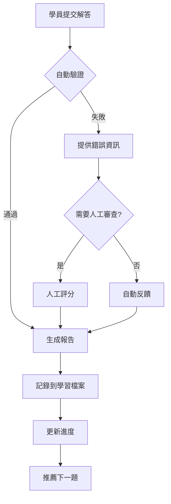

# 情境金字塔設計

## 📋 文檔概述

**文檔類型**：情境題庫設計規範
**適用對象**：內容開發者、題目設計師
**版本**：v1.0
**最後更新**：2025-01-30

---

## 🏔️ 金字塔架構總覽

### 三層金字塔模型

```
                    ▲
                   ╱ ╲
                  ╱   ╲
                 ╱ L3  ╲          Level 3: 複雜情境
                ╱───────╲         - 100 題 (33%)
               ╱         ╲        - 多步驟、多工具
              ╱───────────╲       - 企業級場景
             ╱             ╲
            ╱      L2       ╲     Level 2: 組合情境
           ╱─────────────────╲    - 150 題 (50%)
          ╱                   ╲   - 2-3 個工具組合
         ╱                     ╲  - 真實工作場景
        ╱───────────────────────╲
       ╱           L1            ╲ Level 1: 單一情境
      ╱─────────────────────────────╲ - 50 題 (17%)
     ╱_______________________________╲ - 單一指令/概念
                                       - 基礎能力建立

總計: 300 題情境
```

### 設計哲學

**1. 漸進式挑戰（Progressive Challenge）**
```
不是「簡單→困難」的線性增長
而是「單一→組合→複雜」的維度擴展

Level 1: 建立信心（快速成功）
Level 2: 建立能力（刻意練習）
Level 3: 建立系統思維（整合應用）
```

**2. 真實性優先（Authenticity First）**
```
所有情境都來自：
✓ 真實工作場景
✓ 開源專案實際問題
✓ 社群常見需求
✗ 為了教學而設計的假問題
```

**3. 可驗證性（Verifiability）**
```
每個情境必須有：
- 明確的成功標準
- 自動化驗證機制（優先）
- 人工評分標準（備選）
```

---

## 📊 Level 1：單一情境（50 題）

### 定位與目標

**認知負荷**：低
**完成時間**：5-15 分鐘/題
**通過率目標**：90%+
**核心目的**：建立信心與基礎

### 設計標準

**難度指標**：
```python
level_1_criteria = {
    "概念數量": 1,           # 只涉及一個核心概念
    "指令數量": 1,           # 只需要一個指令
    "技術棧": 1,            # 只涉及一種技術
    "除錯難度": "無/簡單",   # 幾乎不會出錯
    "提示級別": "完整提示"   # 提供詳細指引
}
```

### 題目分布

**模組分布**：
```yaml
Module 2 (CLI 基礎): 15 題
  - 指令基礎: 5 題
  - 檔案操作: 5 題
  - 搜尋與導航: 5 題

Module 3 (IDE 整合): 5 題
  - 基本配置: 3 題
  - 簡單整合: 2 題

Module 4 (TDD): 8 題
  - 測試撰寫: 4 題
  - 測試執行: 4 題

Module 5-8: 各 3-5 題

Module 9-10: 各 2-3 題

總計: 50 題
```

### 情境範例

**範例 1：檔案讀取（Module 2）**

```markdown
## 情境 L1-001：讀取 Python 檔案

### 📝 背景
你接手了一個新專案，需要先了解主程式的內容。

### 🎯 目標
使用 Claude Code 讀取專案中的 `main.py` 檔案。

### 📂 提供的檔案結構
```
project/
├── main.py
├── utils.py
└── config.py
```

### ✅ 成功標準
- [ ] 能看到 `main.py` 的完整內容
- [ ] 能解釋檔案的主要功能

### 💡 提示
使用 `/read` 指令來查看檔案內容。

### 🕒 建議時間
5 分鐘

### 🏷️ 標籤
#CLI #基礎指令 #檔案操作
```

**範例 2：變數重命名（Module 2）**

```markdown
## 情境 L1-002：重命名變數

### 📝 背景
你發現程式碼中有一個變數名稱 `x` 不夠清晰，想改為 `user_count`。

### 🎯 目標
將 `utils.py` 中所有的 `x` 重命名為 `user_count`。

### 📂 提供的程式碼
```python
# utils.py
def calculate():
    x = 10
    return x * 2

def process():
    x = get_users()
    print(f"Total: {x}")
```

### ✅ 成功標準
- [ ] 所有 `x` 都改為 `user_count`
- [ ] 程式碼仍能正常運行

### 💡 提示
使用 `/edit` 指令進行替換操作。

### 🕒 建議時間
10 分鐘

### 🏷️ 標籤
#CLI #編輯 #重構
```

**範例 3：執行測試（Module 4）**

```markdown
## 情境 L1-015：執行 pytest

### 📝 背景
你寫好了一個函數，想確認測試是否通過。

### 🎯 目標
執行專案中的 pytest 測試。

### 📂 提供的檔案
```python
# test_utils.py
def test_add():
    assert add(1, 2) == 3

def test_subtract():
    assert subtract(5, 3) == 2
```

### ✅ 成功標準
- [ ] 成功執行測試
- [ ] 能看到測試結果

### 💡 提示
使用 `/bash pytest` 指令執行測試。

### 🕒 建議時間
5 分鐘

### 🏷️ 標籤
#測試 #pytest #基礎操作
```

### 評分標準

```yaml
評分維度:
  操作正確性: 60%
    - 使用正確的指令
    - 達成目標結果

  理解深度: 25%
    - 能解釋為什麼這樣做
    - 理解指令的作用

  完成時間: 15%
    - 在建議時間內完成
    - 操作流暢度

通過標準:
  - 總分 >= 70%
  - 操作正確性必須 >= 80%
```

---

## 📊 Level 2：組合情境（150 題）

### 定位與目標

**認知負荷**：中等
**完成時間**：20-45 分鐘/題
**通過率目標**：70%+
**核心目的**：建立實戰能力

### 設計標準

**難度指標**：
```python
level_2_criteria = {
    "概念數量": 2-3,         # 需要整合多個概念
    "指令數量": 2-4,         # 需要組合多個指令
    "技術棧": 1-2,          # 可能跨技術棧
    "除錯難度": "中等",      # 可能遇到錯誤需要除錯
    "提示級別": "部分提示"   # 提供思考方向
}
```

### 題目分布

**模組分布**：
```yaml
Module 2 (CLI 進階): 45 題
  - 程式碼重構: 15 題
  - 上下文管理: 15 題
  - EPCV 工作流程: 15 題

Module 2.5 (進階整合): 30 題
  - 指令組合: 15 題
  - MCP 整合: 15 題

Module 4 (TDD/BDD): 20 題
  - TDD 流程: 10 題
  - BDD 實作: 10 題

Module 5 (CI/CD): 15 題
Module 6 (多 Agent): 20 題
Module 7 (DDD): 12 題
Module 8 (資料): 10 題
Module 9-10: 各 2-5 題

總計: 150 題
```

### 情境範例

**範例 1：API 重構（Module 2）**

```markdown
## 情境 L2-025：重構 FastAPI 端點

### 📝 背景
你接手了一個 FastAPI 專案，發現程式碼重複嚴重，需要重構。

### 🎯 目標
將 5 個 API 端點中的重複邏輯提取為共用函數。

### 📂 提供的程式碼
```python
# api.py
@app.get("/users")
def get_users():
    db = get_database_connection()
    result = db.query("SELECT * FROM users")
    db.close()
    return result

@app.get("/products")
def get_products():
    db = get_database_connection()
    result = db.query("SELECT * FROM products")
    db.close()
    return result

# ... 3 個類似端點
```

### ✅ 成功標準
- [ ] 提取出共用的資料庫連接邏輯
- [ ] 所有端點仍正常運作
- [ ] 程式碼行數減少 30% 以上
- [ ] 測試全部通過

### 💡 提示
考慮使用 context manager 或裝飾器模式。

### 🕒 建議時間
30 分鐘

### 🏷️ 標籤
#重構 #FastAPI #程式碼品質
```

**範例 2：TDD 開發新功能（Module 4）**

```markdown
## 情境 L2-048：用 TDD 開發用戶註冊功能

### 📝 背景
需要為系統新增用戶註冊功能，採用 TDD 模式開發。

### 🎯 目標
按照 TDD 流程（紅→綠→重構）完成用戶註冊功能。

### 📋 需求
1. 用戶可以用 email 和密碼註冊
2. email 必須是有效格式
3. 密碼長度至少 8 個字元
4. email 不能重複
5. 密碼需要加密存儲

### ✅ 成功標準
- [ ] 先寫測試（至少 5 個測試案例）
- [ ] 測試先失敗（紅燈）
- [ ] 實作程式碼讓測試通過（綠燈）
- [ ] 重構程式碼
- [ ] 測試覆蓋率 > 90%

### 💡 提示
1. 先列出需要測試的場景
2. 用 Claude Code 生成測試骨架
3. 一次只做一個測試案例

### 🕒 建議時間
45 分鐘

### 🏷️ 標籤
#TDD #測試驅動 #用戶註冊
```

**範例 3：多 Agent 協作（Module 6）**

```markdown
## 情境 L2-095：三 Agent 協作開發

### 📝 背景
需要開發一個小型 Web 應用，決定用多 Agent 協作模式。

### 🎯 目標
設計並執行 3 個 Agent 的協作流程。

### 📋 任務分工
- Agent A: 後端 API 開發
- Agent B: 前端頁面開發
- Agent C: 測試與整合

### ✅ 成功標準
- [ ] 設計清晰的 Agent 協作流程
- [ ] 定義各 Agent 的職責與接口
- [ ] 建立協作檢查點
- [ ] 成功整合三方成果
- [ ] 通過整合測試

### 💡 提示
1. 先定義 API 契約
2. 各 Agent 獨立開發
3. 用 MCP 整合溝通

### 🕒 建議時間
40 分鐘

### 🏷️ 標籤
#多Agent #協作 #系統整合
```

### 評分標準

```yaml
評分維度:
  功能完整性: 40%
    - 完成所有要求功能
    - 邊界情況處理

  程式碼品質: 30%
    - 可讀性
    - 可維護性
    - 遵循最佳實踐

  測試品質: 20%
    - 測試覆蓋率
    - 測試案例設計

  除錯能力: 10%
    - 遇到問題的處理方式
    - 解決問題的效率

通過標準:
  - 總分 >= 70%
  - 功能完整性必須 >= 80%
```

---

## 📊 Level 3：複雜情境（100 題）

### 定位與目標

**認知負荷**：高
**完成時間**：60-120 分鐘/題
**通過率目標**：60%+
**核心目的**：建立系統思維與整合能力

### 設計標準

**難度指標**：
```python
level_3_criteria = {
    "概念數量": 5+,          # 需要整合多個領域知識
    "指令數量": 5+,          # 複雜的指令組合
    "技術棧": 3+,           # 跨多個技術棧
    "除錯難度": "高",        # 複雜的問題診斷
    "提示級別": "無/最小提示" # 需要自主設計解決方案
}
```

### 題目分布

**模組分布**：
```yaml
Module 2.5 (進階整合): 20 題
  - 企業級整合: 10 題
  - 複雜 Agent 系統: 10 題

Module 6 (多 Agent): 12 題
  - 大規模協作: 12 題

Module 7 (DDD): 8 題
  - 領域建模: 8 題

Module 11 (綜合專案): 50 題
  - 完整專案情境: 30 題
  - 架構設計: 10 題
  - 效能優化: 10 題

Module 4, 5, 8: 各 3-5 題

總計: 100 題
```

### 情境範例

**範例 1：微服務重構（Module 11）**

```markdown
## 情境 L3-210：單體應用拆分為微服務

### 📝 背景
公司的電商平台是單體應用，效能瓶頸嚴重，需要拆分為微服務架構。

### 🎯 目標
將單體應用拆分為 3 個微服務：用戶服務、產品服務、訂單服務。

### 📂 現有架構
```python
# monolith/app.py
# 2000+ 行程式碼
# 包含所有業務邏輯
# 共用一個資料庫
```

### 📋 需求
1. **服務拆分**
   - 識別服務邊界（DDD）
   - 拆分資料庫
   - 定義服務間通訊協定

2. **資料一致性**
   - 設計分散式事務策略
   - 實作 Saga 模式或事件溯源

3. **部署與監控**
   - Docker Compose 編排
   - 服務健康檢查
   - 日誌聚合

4. **測試**
   - 單元測試（每個服務）
   - 整合測試（跨服務）
   - 端到端測試

### ✅ 成功標準
- [ ] 3 個服務獨立運行
- [ ] 服務間正確通訊
- [ ] 資料一致性保證
- [ ] 測試覆蓋率 > 80%
- [ ] API 回應時間 < 500ms
- [ ] 有完整文檔

### 💡 思考方向
1. 如何識別服務邊界？
2. 如何處理分散式事務？
3. 如何避免分散式系統的常見陷阱？

### 🕒 建議時間
120 分鐘

### 🏷️ 標籤
#微服務 #架構設計 #DDD #分散式系統
```

**範例 2：效能優化診斷（Module 11）**

```markdown
## 情境 L3-245：診斷並優化慢 API

### 📝 背景
生產環境中有個 API 端點回應時間超過 5 秒，用戶抱怨頻繁。

### 🎯 目標
診斷效能瓶頸並優化到 500ms 以下。

### 📂 提供的資訊
```python
# API 端點
@app.get("/dashboard")
def get_dashboard(user_id: int):
    user = get_user(user_id)
    orders = get_user_orders(user_id)
    recommendations = get_recommendations(user_id)
    stats = calculate_statistics(orders)
    return {
        "user": user,
        "orders": orders,
        "recommendations": recommendations,
        "stats": stats
    }
```

### 📋 任務步驟
1. **效能分析**
   - 使用 profiler 找出瓶頸
   - 分析資料庫查詢
   - 檢查外部 API 呼叫

2. **優化方案**
   - 資料庫查詢優化（索引、N+1 問題）
   - 快取策略（Redis）
   - 非同步處理（Celery）
   - 程式碼層優化

3. **驗證**
   - 壓力測試
   - 效能指標監控
   - A/B 測試

### ✅ 成功標準
- [ ] 找出至少 3 個效能瓶頸
- [ ] API 回應時間 < 500ms
- [ ] 通過壓力測試（1000 req/s）
- [ ] 沒有引入新 bug
- [ ] 有完整的效能報告

### 💡 思考方向
1. 先測量再優化
2. 找出最大的瓶頸
3. 權衡優化成本與收益

### 🕒 建議時間
90 分鐘

### 🏷️ 標籤
#效能優化 #診斷 #資料庫 #快取
```

**範例 3：複雜 Agent 系統（Module 2.5）**

```markdown
## 情境 L3-055：設計智能開發助手系統

### 📝 背景
需要建立一個智能開發助手系統，能自動化多種開發任務。

### 🎯 目標
設計並實作一個包含 5 個專門 Agent 的協作系統。

### 📋 Agent 角色
1. **架構師 Agent**
   - 分析需求
   - 設計系統架構
   - 生成技術文檔

2. **程式碼生成 Agent**
   - 根據架構生成程式碼骨架
   - 實作核心邏輯
   - 遵循最佳實踐

3. **測試 Agent**
   - 生成測試案例
   - 執行測試
   - 產生測試報告

4. **重構 Agent**
   - 分析程式碼品質
   - 執行自動重構
   - 優化效能

5. **文檔 Agent**
   - 生成 API 文檔
   - 撰寫 README
   - 產生架構圖

### 📋 系統要求
1. **協作機制**
   - 定義 Agent 間通訊協定
   - 建立工作流程引擎
   - 處理衝突與依賴

2. **品質保證**
   - 每個 Agent 的輸出驗證
   - 整體系統的一致性檢查
   - 錯誤處理與回滾

3. **可擴展性**
   - 能輕鬆新增新 Agent
   - 能客製化 Agent 行為
   - 能整合外部工具

### ✅ 成功標準
- [ ] 5 個 Agent 成功協作
- [ ] 能完成完整的開發流程
- [ ] 生成的程式碼品質高
- [ ] 測試覆蓋率 > 85%
- [ ] 有完整的系統文檔
- [ ] 展示一個端到端的案例

### 💡 思考方向
1. 如何定義 Agent 間的接口？
2. 如何處理 Agent 間的依賴？
3. 如何確保輸出的一致性？
4. 如何監控整個系統？

### 🕒 建議時間
120 分鐘

### 🏷️ 標籤
#複雜系統 #多Agent #協作架構 #自動化
```

### 評分標準

```yaml
評分維度:
  系統設計: 30%
    - 架構合理性
    - 可擴展性
    - 可維護性

  實作品質: 25%
    - 程式碼品質
    - 錯誤處理
    - 邊界情況

  測試品質: 20%
    - 測試策略
    - 覆蓋率
    - 測試品質

  問題解決: 15%
    - 診斷能力
    - 解決方案創新性
    - 優化效果

  文檔品質: 10%
    - 架構文檔
    - API 文檔
    - 部署指南

通過標準:
  - 總分 >= 60%
  - 系統設計必須 >= 70%
  - 實作品質必須 >= 60%
```

---

## 🔍 情境驗證機制

### 自動化驗證框架

**驗證架構**：
```python
class ScenarioValidator:
    """情境自動驗證器"""

    def __init__(self, scenario_id: str):
        self.scenario_id = scenario_id
        self.checks = []

    def validate_code_quality(self) -> bool:
        """驗證程式碼品質"""
        checks = [
            self.check_linting(),
            self.check_type_hints(),
            self.check_complexity(),
            self.check_duplications()
        ]
        return all(checks)

    def validate_tests(self) -> bool:
        """驗證測試品質"""
        checks = [
            self.run_tests(),
            self.check_coverage(threshold=0.8),
            self.check_test_quality()
        ]
        return all(checks)

    def validate_functionality(self) -> bool:
        """驗證功能正確性"""
        test_cases = self.load_test_cases()
        results = [self.run_test_case(tc) for tc in test_cases]
        return all(results)

    def validate_performance(self) -> bool:
        """驗證效能標準"""
        metrics = self.measure_performance()
        return (
            metrics['response_time'] < self.threshold['response_time'] and
            metrics['memory_usage'] < self.threshold['memory_usage']
        )

    def generate_report(self) -> Dict:
        """生成驗證報告"""
        return {
            "scenario_id": self.scenario_id,
            "code_quality": self.validate_code_quality(),
            "tests": self.validate_tests(),
            "functionality": self.validate_functionality(),
            "performance": self.validate_performance(),
            "score": self.calculate_score(),
            "feedback": self.generate_feedback()
        }
```

### 人工評分標準

**評分 Rubric 範本**：

```markdown
## 情境評分表：L2-025 API 重構

### 評分項目

#### 1. 功能完整性（40 分）
- [ ] 提取了共用邏輯（15 分）
- [ ] 所有端點正常運作（15 分）
- [ ] 錯誤處理完善（10 分）

#### 2. 程式碼品質（30 分）
- [ ] 程式碼可讀性高（10 分）
- [ ] 遵循 DRY 原則（10 分）
- [ ] 有適當的註解（10 分）

#### 3. 測試品質（20 分）
- [ ] 測試覆蓋率 > 80%（10 分）
- [ ] 測試案例設計合理（10 分）

#### 4. 重構技巧（10 分）
- [ ] 使用合適的設計模式（5 分）
- [ ] 重構步驟安全（5 分）

### 總分計算
- **總分範圍**：0-100 分
- **通過標準**：70 分
- **優秀標準**：85 分

### 反饋建議
- 如果 < 70 分：指出主要問題，提供改進方向
- 如果 70-84 分：肯定優點，指出進步空間
- 如果 >= 85 分：鼓勵挑戰更高難度
```

### 驗證流程



---

## 📊 情境品質監控

### 數據收集指標

```python
scenario_metrics = {
    "完成率": {
        "定義": "完成此情境的學員數 / 嘗試學員數",
        "目標": {
            "Level 1": "> 90%",
            "Level 2": "> 70%",
            "Level 3": "> 60%"
        }
    },
    "平均完成時間": {
        "定義": "所有完成學員的平均時間",
        "目標": "在建議時間的 80-120% 範圍內"
    },
    "首次通過率": {
        "定義": "第一次嘗試就成功的比例",
        "目標": {
            "Level 1": "> 80%",
            "Level 2": "> 50%",
            "Level 3": "> 30%"
        }
    },
    "平均分數": {
        "定義": "所有學員的平均得分",
        "目標": {
            "Level 1": "> 85",
            "Level 2": "> 75",
            "Level 3": "> 65"
        }
    },
    "常見錯誤": {
        "定義": "學員最常遇到的 5 個錯誤",
        "用途": "優化情境或增加提示"
    }
}
```

### 品質改進循環

```yaml
週期 1：數據收集（運行 1 個月）
  - 收集所有情境的指標
  - 識別問題情境

週期 2：分析問題（1 週）
  - 完成率過低：難度過高或描述不清
  - 完成率過高：難度過低
  - 時間異常：估計不準確
  - 分數分布異常：評分標準問題

週期 3：優化調整（2 週）
  - 調整難度
  - 改善描述
  - 增加提示
  - 修正評分標準

週期 4：驗證效果（1 個月）
  - 重新收集數據
  - 比較改善效果
  - 決定是否需要進一步調整
```

---

## 🎯 情境推薦演算法

### 個人化推薦系統

```python
class ScenarioRecommender:
    """情境推薦引擎"""

    def recommend_next(self, learner_profile: Dict) -> List[str]:
        """推薦下一個情境"""

        # 1. 分析學習者能力
        current_level = self.assess_level(learner_profile)

        # 2. 識別弱點
        weak_areas = self.identify_weak_areas(learner_profile)

        # 3. 考慮學習進度
        progress = learner_profile['completed_scenarios']

        # 4. 生成推薦列表
        candidates = []

        # 優先推薦弱點相關的情境
        for area in weak_areas:
            scenarios = self.find_scenarios_for_area(area, current_level)
            candidates.extend(scenarios)

        # 混合新概念的情境
        new_concepts = self.find_unexplored_concepts(learner_profile)
        for concept in new_concepts[:3]:
            scenarios = self.find_scenarios_for_concept(concept)
            candidates.extend(scenarios)

        # 根據學習曲線調整難度
        if self.is_on_plateau(learner_profile):
            # 停滯期：降低難度建立信心
            difficulty_range = (current_level - 0.5, current_level)
        else:
            # 成長期：適度挑戰
            difficulty_range = (current_level, current_level + 0.5)

        # 過濾並排序
        recommended = self.filter_and_rank(
            candidates,
            difficulty_range,
            learner_profile
        )

        return recommended[:5]

    def assess_level(self, profile: Dict) -> float:
        """評估學習者當前程度"""
        recent_scores = profile['recent_scores'][-10:]
        avg_score = sum(recent_scores) / len(recent_scores)

        if avg_score >= 85:
            return profile['current_level'] + 0.5
        elif avg_score >= 70:
            return profile['current_level']
        else:
            return max(1.0, profile['current_level'] - 0.5)
```

### 學習路徑規劃

**標準路徑**：
```yaml
Week 1 路徑:
  Day 1-2: Level 1 情境（10-15 題）
    目標: 建立信心，熟悉基礎指令

  Day 3-5: Level 2 情境（15-20 題）
    目標: 學習指令組合，解決真實問題

  Day 6-7: Level 2-3 混合（10 題）
    目標: 挑戰更高難度，評估進度

Week 2 路徑:
  Day 8-12: Level 2 深化（30 題）
    目標: 建立各領域能力

  Day 13-14: Level 3 嘗試（5 題）
    目標: 整合應用，診斷弱點

Week 3 路徑:
  Day 15-19: Level 3 集中（10-15 題）
    目標: 挑戰複雜問題

  Day 20-21: 自選複習 + 新挑戰
    目標: 鞏固與突破
```

**快速路徑（有經驗者）**：
```yaml
跳過 Level 1，直接進入 Level 2
完成 Level 2 的 60% 即可進入 Level 3
專注於 Level 3 的深度學習
```

**舒適路徑（新手）**：
```yaml
在 Level 1 停留更久（完成 100%）
Level 2 分批進行，每批 10 題
每完成一批 Level 2 就複習 Level 1
謹慎進入 Level 3
```

---

## 📚 情境設計模板

### 標準情境模板

```markdown
## 情境 [ID]：[簡短標題]

### 📝 背景
[1-2 句話說明情境背景，為什麼需要解決這個問題]

### 🎯 目標
[明確的目標陳述，學員完成後應達到的狀態]

### 📂 提供的資源
[程式碼片段、檔案結構、API 文檔等]

### 📋 需求清單（可選，用於複雜情境）
1. [需求 1]
2. [需求 2]
...

### ✅ 成功標準
- [ ] [可驗證的標準 1]
- [ ] [可驗證的標準 2]
...

### 💡 提示
[Level 1: 完整步驟]
[Level 2: 思考方向]
[Level 3: 最小或無提示]

### 🕒 建議時間
[X] 分鐘

### 🏷️ 標籤
#標籤1 #標籤2 #標籤3

### 📊 難度指標（內部使用）
- 認知負荷：[低/中/高]
- 指令數量：[X]
- 技術棧：[列出]
- 除錯難度：[低/中/高]

### 🎓 學習目標（內部使用）
[這個情境主要訓練哪些能力]

### 🔗 相關情境
- 前置：[情境 ID]
- 後續：[情境 ID]
```

---

## 🚀 實施計劃

### 情境開發優先級

**Phase 1：核心情境（前 100 題）**
```yaml
優先級 P0 (4 週):
  - Level 1 全部 (50 題)
  - Level 2 核心 (40 題)
  - Level 3 示範 (10 題)

目標:
  - 完成基礎情境庫
  - 建立設計模式
  - 驗證評分機制
```

**Phase 2：擴展情境（中 150 題）**
```yaml
優先級 P1 (6 週):
  - Level 2 完善 (110 題)
  - Level 3 擴展 (40 題)

目標:
  - 覆蓋所有模組
  - 多樣化情境類型
  - 收集使用數據
```

**Phase 3：優化與新增（後 50 題）**
```yaml
優先級 P2 (持續):
  - Level 3 深化 (50 題)
  - 基於反饋調整現有情境
  - 新增社群貢獻情境

目標:
  - 達到 300 題目標
  - 建立社群貢獻機制
  - 持續優化品質
```

---

**建立日期**：2025-01-30
**負責人**：課程設計團隊
**下一步**：開始情境題目開發

