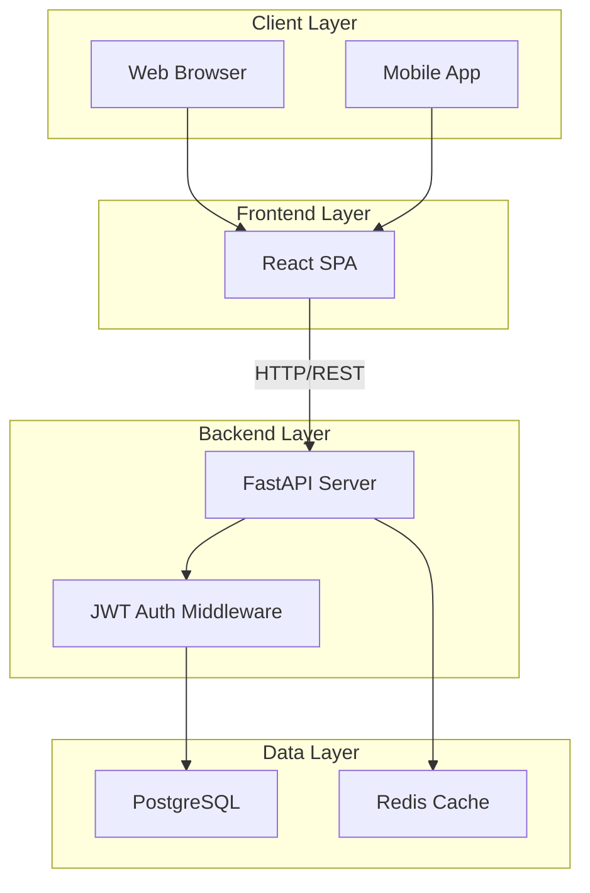
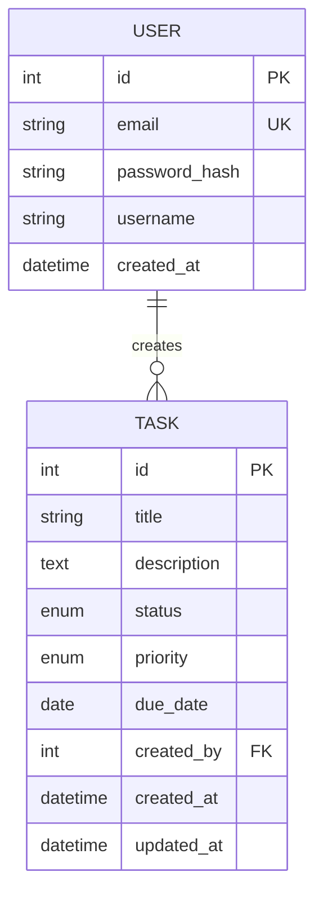
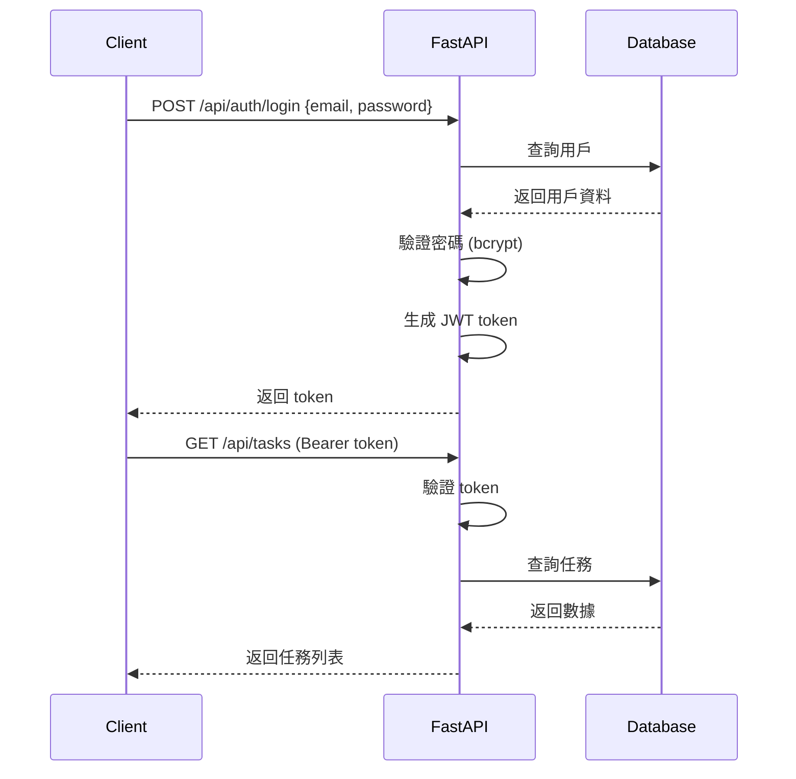

# 階段 5: 文檔與交付 (Documentation & Delivery)
# Complete Documentation & Final Delivery

**預計時間**: 20 分鐘
**難度**: ★☆☆☆☆ (簡單)
**前置要求**: 完成階段 1-4
**核心技能**: 技術寫作、API 文檔生成、專案打包

---

## 📋 階段目標

完成這個階段後,你將擁有:

✅ **API 文檔** - 自動生成的 OpenAPI/Swagger 文檔
✅ **README.md** - 清晰的專案介紹與使用指南
✅ **部署文檔** - 詳細的部署步驟
✅ **架構文檔** - 系統架構圖與技術棧說明
✅ **開發者文檔** - 本地開發環境設置指南

**成功標準**:
- 新開發者能在 10 分鐘內看懂專案
- 能根據文檔在 30 分鐘內設置開發環境
- API 文檔完整可用 (Swagger UI 可互動測試)
- 所有文檔都是最新的 (與代碼同步)

---

## 🎯 為什麼文檔很重要？

### 類比：產品說明書

**沒有文檔的專案**:
```
新同事加入
    ↓
看代碼猜功能
    ↓
問原作者 (如果還在的話)
    ↓
花費數天理解專案
```

**有完整文檔的專案**:
```
新同事加入
    ↓
閱讀 README (10 分鐘)
    ↓
按照指南設置環境 (30 分鐘)
    ↓
開始貢獻代碼 (1 小時內)
```

### 文檔的核心價值

1. **降低協作成本** - 新成員快速上手
2. **知識傳承** - 即使原作者離開,專案仍可維護
3. **專業形象** - 提升專案可信度
4. **自我提醒** - 3 個月後你也會忘記細節

---

## 🏗️ 文檔架構總覽

```
task-management-system/
├── README.md                   # ⭐ 專案總覽 (最重要)
├── docs/
│   ├── architecture.md         # 系統架構
│   ├── api.md                  # API 參考 (補充說明)
│   ├── deployment.md           # 部署指南
│   ├── development.md          # 開發者指南
│   └── security.md             # 安全性考量
│
├── backend/
│   └── README.md               # 後端特定文檔
│
└── frontend/
    └── README.md               # 前端特定文檔
```

---

## ⏱️ 時間分配建議

```
總時間: 20 分鐘

子階段 5.1: API 文檔生成 (5 min)
   ├─ 5.1.1 配置 OpenAPI (2 min)
   └─ 5.1.2 驗證 Swagger UI (3 min)

子階段 5.2: 核心文檔撰寫 (10 min)
   ├─ 5.2.1 README.md (5 min)
   ├─ 5.2.2 架構文檔 (3 min)
   └─ 5.2.3 部署文檔 (2 min)

子階段 5.3: 最終檢查與打包 (5 min)
   ├─ 5.3.1 文檔完整性檢查 (2 min)
   ├─ 5.3.2 Demo 演示準備 (2 min)
   └─ 5.3.3 交付清單確認 (1 min)
```

---

## 📝 詳細實作步驟

### 子階段 5.1: API 文檔生成 (5 min)

#### 5.1.1 配置 OpenAPI 元數據 (2 min)

**檔案**: `backend/app/main.py`

**AI 協作提示詞**:
```
完善 FastAPI 應用的 OpenAPI 配置，檔案 backend/app/main.py

要求:
1. 添加完整的 API 元數據:
   - title: "Task Management System API"
   - description: 簡短描述
   - version: "1.0.0"
   - contact 資訊
   - license 資訊

2. 配置 tags (為不同的 router 分組):
   - auth - 認證相關
   - tasks - 任務管理
   - dashboard - 統計資訊

3. 配置全局安全方案 (JWT Bearer)

提供完整配置代碼。
```

**預期產出**:
```python
from fastapi import FastAPI
from fastapi.openapi.utils import get_openapi

app = FastAPI(
    title="Task Management System API",
    description="""
    任務管理系統 RESTful API

    ## 功能特性
    * **用戶認證**: JWT token 身份驗證
    * **任務管理**: 完整的 CRUD 操作
    * **數據統計**: Dashboard 統計資訊

    ## 技術棧
    * FastAPI + SQLAlchemy
    * PostgreSQL
    * JWT Authentication
    """,
    version="1.0.0",
    contact={
        "name": "Your Name",
        "email": "your.email@example.com",
        "url": "https://github.com/yourusername/task-management-system"
    },
    license_info={
        "name": "MIT License",
        "url": "https://opensource.org/licenses/MIT"
    },
    openapi_tags=[
        {
            "name": "auth",
            "description": "用戶認證相關操作 (註冊、登入)"
        },
        {
            "name": "tasks",
            "description": "任務管理 CRUD 操作"
        },
        {
            "name": "dashboard",
            "description": "統計資訊與數據分析"
        }
    ]
)

# 自定義 OpenAPI schema (可選,進階用法)
def custom_openapi():
    if app.openapi_schema:
        return app.openapi_schema

    openapi_schema = get_openapi(
        title=app.title,
        version=app.version,
        description=app.description,
        routes=app.routes,
    )

    # 添加全局安全方案
    openapi_schema["components"]["securitySchemes"] = {
        "Bearer": {
            "type": "http",
            "scheme": "bearer",
            "bearerFormat": "JWT",
            "description": "輸入 JWT token (從 /api/auth/login 獲得)"
        }
    }

    app.openapi_schema = openapi_schema
    return app.openapi_schema

app.openapi = custom_openapi
```

**在 router 中使用 tags**:
```python
# app/routers/auth.py
from fastapi import APIRouter

router = APIRouter(prefix="/auth", tags=["auth"])

@router.post("/register", summary="用戶註冊")
async def register(...):
    """
    註冊新用戶

    - **email**: 有效的 email 地址 (唯一)
    - **password**: 至少 8 字元
    - **username**: 顯示名稱
    """
    ...

# app/routers/tasks.py
router = APIRouter(prefix="/tasks", tags=["tasks"])

@router.post("/", summary="創建任務")
async def create_task(...):
    """
    創建新任務

    需要認證。創建者自動設置為當前用戶。
    """
    ...
```

---

#### 5.1.2 驗證 Swagger UI (3 min)

**Step 1: 啟動後端**

```bash
cd backend
uvicorn app.main:app --reload
```

**Step 2: 訪問 Swagger UI**

瀏覽器打開: `http://localhost:8000/docs`

**檢查清單**:
- [ ] 所有 API endpoints 都顯示
- [ ] 每個 endpoint 有清晰的 summary 和 description
- [ ] Request body 和 Response 的 schema 完整
- [ ] 能在 Swagger UI 中測試 API (點擊 "Try it out")
- [ ] 認證相關 endpoints 有 "Authorize" 按鈕

**Step 3: 測試認證流程**

1. 點擊 `/api/auth/register` → Try it out
2. 輸入測試數據,執行
3. 複製返回的 token
4. 點擊右上角 "Authorize" 按鈕
5. 輸入 `Bearer <token>`
6. 測試需要認證的 endpoint (如 `/api/tasks`)

**ReDoc 替代方案**:

FastAPI 也提供 ReDoc 文檔: `http://localhost:8000/redoc`
(更美觀,但不能互動測試)

---

### 子階段 5.2: 核心文檔撰寫 (10 min)

#### 5.2.1 根目錄 README.md (5 min)

**檔案**: `README.md`

**AI 協作提示詞**:
```
創建專案 README.md,路徑根目錄 README.md

包含以下章節:
1. 專案標題與簡介
   - 一句話描述
   - 主要功能列表
   - 技術棧

2. 快速開始
   - 前置要求
   - 安裝步驟
   - 運行指令

3. 功能特性
   - 用戶認證
   - 任務管理
   - Dashboard 統計

4. API 文檔
   - Swagger UI 連結
   - 主要 endpoints 列表

5. 開發指南
   - 本地開發環境設置
   - 測試運行
   - 代碼風格

6. 部署
   - Docker 部署
   - 環境變數配置

7. 授權與貢獻
   - MIT License
   - 如何貢獻

使用 Markdown,包含適當的 badges (CI status, coverage, license)

提供完整 README.md 內容。
```

**預期產出**:
````markdown
# Task Management System 🎯

> 一個基於 FastAPI + React 的現代化任務管理系統,適合團隊協作與個人任務追蹤。

[](https://github.com/yourusername/task-management-system/actions)
[](https://codecov.io/gh/yourusername/task-management-system)
[](LICENSE)

---

## ✨ 功能特性

- ✅ **用戶認證** - JWT token 身份驗證,密碼加密存儲
- ✅ **任務管理** - 完整的 CRUD 操作,支援狀態追蹤
- ✅ **優先級管理** - 4 個優先級別,顏色標示
- ✅ **Dashboard** - 即時統計,數據視覺化
- ✅ **篩選排序** - 多維度篩選與排序
- ✅ **響應式設計** - 支援桌面與行動裝置

---

## 🚀 快速開始

### 前置要求

- Python 3.10+
- Node.js 18+ (如果運行前端)
- Docker & Docker Compose
- PostgreSQL 14+ (或使用 Docker)

### 使用 Docker Compose (推薦)

```bash
# 1. Clone 專案
git clone https://github.com/yourusername/task-management-system.git
cd task-management-system

# 2. 創建環境變數檔案
cp .env.example .env
# 編輯 .env,修改敏感資訊

# 3. 啟動所有服務
docker-compose up -d

# 4. 訪問應用
# Backend API: http://localhost:8000
# Swagger UI: http://localhost:8000/docs
# Frontend: http://localhost:3000 (如果啟用)
```

### 本地開發

**後端**:
```bash
cd backend

# 安裝依賴
poetry install

# 啟動數據庫 (Docker)
docker-compose up -d postgres

# 運行數據庫遷移
poetry run alembic upgrade head

# 啟動開發服務器
poetry run uvicorn app.main:app --reload

# API 訪問: http://localhost:8000
# Swagger 文檔: http://localhost:8000/docs
```

**前端**:
```bash
cd frontend

# 安裝依賴
npm install

# 啟動開發服務器
npm run dev

# 訪問: http://localhost:5173
```

---

## 📖 API 文檔

完整的 API 文檔自動生成,訪問: **http://localhost:8000/docs**

### 主要 Endpoints

| 方法 | 端點 | 功能 | 認證 |
|-----|-----|-----|-----|
| POST | `/api/auth/register` | 用戶註冊 | ❌ |
| POST | `/api/auth/login` | 用戶登入 | ❌ |
| GET | `/api/auth/me` | 獲取當前用戶 | ✅ |
| POST | `/api/tasks` | 創建任務 | ✅ |
| GET | `/api/tasks` | 任務列表 | ✅ |
| GET | `/api/tasks/{id}` | 任務詳情 | ✅ |
| PUT | `/api/tasks/{id}` | 更新任務 | ✅ |
| DELETE | `/api/tasks/{id}` | 刪除任務 | ✅ |
| GET | `/api/dashboard/stats` | 統計數據 | ✅ |

---

## 🛠️ 技術棧

### 後端
- **框架**: FastAPI 0.104+
- **ORM**: SQLAlchemy 2.0+
- **數據庫**: PostgreSQL 14+
- **認證**: JWT (PyJWT)
- **測試**: Pytest + Coverage

### 前端
- **框架**: React 18+
- **構建工具**: Vite
- **樣式**: Tailwind CSS
- **HTTP**: Axios
- **路由**: React Router

### DevOps
- **容器化**: Docker + Docker Compose
- **CI/CD**: GitHub Actions
- **安全掃描**: Bandit + Safety

---

## 🧪 測試

```bash
# 後端測試
cd backend
poetry run pytest --cov=app --cov-report=html

# 查看覆蓋率報告
open htmlcov/index.html

# 前端測試 (如果配置了)
cd frontend
npm run test
```

當前測試覆蓋率: **80%+**

---

## 🔒 安全性

- ✅ 密碼使用 bcrypt 加密 (cost factor: 12)
- ✅ JWT token 有效期 7 天
- ✅ 所有敏感資訊使用環境變數
- ✅ SQL injection 防護 (SQLAlchemy ORM)
- ✅ XSS 防護 (Pydantic 輸入驗證)
- ✅ CORS 配置

查看詳細安全性說明: [docs/security.md](docs/security.md)

---

## 📦 部署

### Docker 部署 (推薦)

```bash
# 生產環境建置
docker-compose -f docker-compose.prod.yml up -d

# 查看日誌
docker-compose logs -f
```

### 雲平台部署

支援一鍵部署到:
- **Railway** - 後端 + 數據庫
- **Render** - 後端服務
- **Vercel** - 前端靜態網站
- **Fly.io** - 全棧應用

詳細步驟: [docs/deployment.md](docs/deployment.md)

---

## 🤝 貢獻指南

歡迎貢獻! 請遵循以下步驟:

1. Fork 本專案
2. 創建 feature 分支 (`git checkout -b feature/amazing-feature`)
3. 提交變更 (`git commit -m 'Add amazing feature'`)
4. Push 到分支 (`git push origin feature/amazing-feature`)
5. 開啟 Pull Request

**代碼規範**:
- Python: PEP 8 (使用 `black` 格式化)
- JavaScript: ESLint + Prettier
- Commit 訊息: Conventional Commits

---

## 📄 授權

本專案採用 [MIT License](LICENSE) 授權。

---

## 🙋 常見問題

**Q: 如何重置數據庫?**
```bash
docker-compose down -v  # 刪除 volumes
docker-compose up -d
poetry run alembic upgrade head
```

**Q: 忘記 admin 密碼?**
```bash
# 使用 API 重新註冊或直接修改數據庫
poetry run python scripts/reset_password.py <email>
```

查看更多: [docs/faq.md](docs/faq.md)

---

## 📧 聯絡方式

- **作者**: Your Name
- **Email**: your.email@example.com
- **GitHub**: [@yourusername](https://github.com/yourusername)

---

**⭐ 如果這個專案對你有幫助,請給個 Star!**
````

---

#### 5.2.2 架構文檔 (3 min)

**檔案**: `docs/architecture.md`

**AI 協作提示詞**:
```
創建系統架構文檔,路徑 docs/architecture.md

包含:
1. 系統架構圖 (使用 Mermaid diagram)
2. 技術棧說明
3. 數據模型 (User, Task 關聯關係)
4. API 設計原則 (RESTful)
5. 安全架構 (JWT 認證流程)
6. 部署架構 (Docker容器結構)

使用 Markdown + Mermaid 圖表

提供完整內容。
```

**預期產出** (部分示例):
````markdown
# 系統架構文檔

## 1. 整體架構



## 2. 數據模型



## 3. JWT 認證流程



...
````

---

#### 5.2.3 部署文檔 (2 min)

**檔案**: `docs/deployment.md`

**AI 協作提示詞**:
```
創建部署指南,路徑 docs/deployment.md

包含:
1. 環境變數配置清單
2. Docker 部署步驟
3. Railway 部署步驟 (後端)
4. Vercel 部署步驟 (前端)
5. 健康檢查驗證
6. 故障排除

提供完整 Markdown 內容。
```

---

### 子階段 5.3: 最終檢查與打包 (5 min)

#### 5.3.1 文檔完整性檢查 (2 min)

**檢查清單**:

```markdown
## 必備文檔
- [ ] README.md (根目錄)
- [ ] LICENSE
- [ ] .gitignore
- [ ] .env.example
- [ ] backend/README.md
- [ ] docs/architecture.md
- [ ] docs/deployment.md

## API 文檔
- [ ] Swagger UI 可訪問 (/docs)
- [ ] 所有 endpoints 有 summary
- [ ] Request/Response schemas 完整

## 代碼註解
- [ ] 關鍵函數有 docstring
- [ ] 複雜邏輯有註解
- [ ] TODO/FIXME 已清理

## 版本資訊
- [ ] CHANGELOG.md (可選,記錄版本變更)
- [ ] 版本號一致 (pyproject.toml, package.json, API)
```

---

#### 5.3.2 Demo 演示準備 (2 min)

**創建演示腳本**:

**檔案**: `scripts/demo_setup.sh`

```bash
#!/bin/bash
# Demo 環境快速設置腳本

echo "🚀 設置 Demo 環境..."

# 1. 清理舊數據
docker-compose down -v

# 2. 啟動服務
docker-compose up -d

# 3. 等待服務就緒
echo "⏳ 等待數據庫啟動..."
sleep 5

# 4. 創建演示數據
echo "📊 創建演示數據..."
poetry run python scripts/seed_demo_data.py

echo "✅ Demo 環境就緒!"
echo ""
echo "訪問:"
echo "  Backend API: http://localhost:8000"
echo "  Swagger UI:  http://localhost:8000/docs"
echo "  Frontend:    http://localhost:3000"
echo ""
echo "演示帳號:"
echo "  Email:    demo@example.com"
echo "  Password: Demo123456"
```

**檔案**: `backend/scripts/seed_demo_data.py`

```python
"""創建演示數據"""
import asyncio
from app.database import SessionLocal
from app.models.user import User
from app.models.task import Task
from app.utils.security import get_password_hash

async def seed_demo_data():
    db = SessionLocal()

    # 創建演示用戶
    demo_user = User(
        email="demo@example.com",
        password_hash=get_password_hash("Demo123456"),
        username="Demo User"
    )
    db.add(demo_user)
    db.commit()

    # 創建演示任務
    tasks_data = [
        {"title": "完成專案文檔", "priority": "HIGH", "status": "IN_PROGRESS"},
        {"title": "Code Review", "priority": "MEDIUM", "status": "TODO"},
        {"title": "部署到生產環境", "priority": "URGENT", "status": "TODO"},
        {"title": "撰寫測試", "priority": "HIGH", "status": "DONE"},
    ]

    for data in tasks_data:
        task = Task(**data, created_by=demo_user.id)
        db.add(task)

    db.commit()
    print("✅ Demo 數據創建成功!")

if __name__ == "__main__":
    asyncio.run(seed_demo_data())
```

---

#### 5.3.3 交付清單確認 (1 min)

**最終交付清單**:

```markdown
## 代碼
- [ ] 所有 feature 分支已合併到 main
- [ ] 無未提交的變更 (git status clean)
- [ ] 所有測試通過 (CI 綠燈)
- [ ] 無 security warnings

## 文檔
- [ ] README.md 完整
- [ ] API 文檔可訪問
- [ ] 部署指南清晰
- [ ] 架構圖準確

## 功能
- [ ] 所有 PRD 需求實現
- [ ] 用戶能完成完整流程
- [ ] 無阻塞性 bug

## 部署
- [ ] Docker image 建置成功
- [ ] 環境變數配置文檔完整
- [ ] 健康檢查正常

## Demo
- [ ] Demo 環境可正常運行
- [ ] 演示數據已準備
- [ ] 演示腳本測試通過
```

---

## ✅ 階段完成檢查清單

### 文檔完整性
- [ ] README.md 包含所有必要章節
- [ ] API 文檔自動生成且可互動
- [ ] 架構文檔清晰 (包含圖表)
- [ ] 部署文檔詳細 (含故障排除)
- [ ] 所有敏感資訊已移除 (無硬編碼密碼)

### 可用性
- [ ] 新開發者能根據 README 設置環境
- [ ] Swagger UI 能測試所有 API
- [ ] Demo 腳本能一鍵運行

### 專業性
- [ ] 使用適當的 badges (CI, Coverage, License)
- [ ] 圖表清晰 (Mermaid diagrams)
- [ ] 代碼範例可執行
- [ ] 文字無明顯錯別字

---

## 🎉 專案完成!

恭喜你完成整個任務管理系統的開發!

### 你學到了什麼?

✅ **完整的開發流程** - 從需求到交付的全過程
✅ **TDD 開發方法** - 測試驅動開發實踐
✅ **CI/CD 自動化** - GitHub Actions 持續整合
✅ **容器化部署** - Docker 最佳實踐
✅ **API 設計** - RESTful 原則應用
✅ **技術文檔撰寫** - 清晰的溝通能力

### 接下來可以做什麼?

**1. 部署到雲端** (30 分鐘)
   - Railway: 後端 + 數據庫
   - Vercel: 前端
   - 獲得可分享的 URL

**2. 添加進階功能** (2-6 小時)
   - Email 通知
   - 任務評論
   - 檔案上傳
   - 查看 `../進階擴展/README.md`

**3. 優化與重構** (1-2 小時)
   - 效能優化 (數據庫查詢)
   - UI/UX 改進
   - 代碼重構

**4. 分享你的成果**
   - 寫部落格文章
   - 錄製 Demo 影片
   - 加入你的 Portfolio

---

## 📚 延伸資源

### 技術寫作
- [寫好 README 的藝術](https://github.com/matiassingers/awesome-readme)
- [API 文檔最佳實踐](https://swagger.io/blog/api-documentation/best-practices-in-api-documentation/)
- [Mermaid 圖表語法](https://mermaid.js.org/)

### 專案展示
- [GitHub Profile README](https://docs.github.com/en/account-and-profile/setting-up-and-managing-your-github-profile/customizing-your-profile/managing-your-profile-readme)
- [Portfolio 專案展示技巧](https://www.freecodecamp.org/news/how-to-build-a-developer-portfolio-website/)

---

**記住**: 好的文檔是專案成功的一半,花時間寫文檔是值得的投資!
