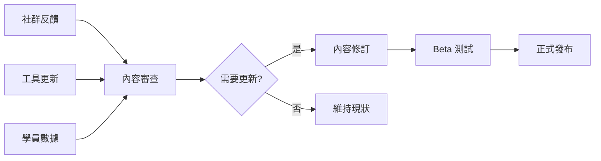

# 模組結構規劃

## 📋 文檔概述

**文檔類型**：課程架構設計
**適用對象**：課程設計師、內容開發者
**版本**：v1.0
**最後更新**：2025-01-30

---

## 🎯 模組設計哲學

### 設計原則

**1. 漸進式揭露（Progressive Disclosure）**
```
不是一開始就教所有功能，而是：
- 先解決一個問題
- 學會一個工具
- 理解一個概念
- 再進入下一層
```

**2. 實戰優先（Practice First）**
```
模組結構：
20% 理論 → 30% 示範 → 50% 實作

而非傳統的：
50% 理論 → 30% 示範 → 20% 實作
```

**3. 螺旋式深化（Spiral Deepening）**
```
同一個概念在不同模組中反覆出現，但深度不同：

Module 2：認識 Claude Code 基礎指令
Module 4：用 Claude Code 做 TDD
Module 6：用 Claude Code 做多 Agent 協作
Module 11：用 Claude Code 完成企業級專案
```

---

## 📚 13 個模組完整結構

### 模組架構總覽

```
┌─────────────────────────────────────────────┐
│  Module 0: 情境驅動學習法入門                   │  (前置準備)
└─────────────────────────────────────────────┘
                    ↓
┌─────────────────────────────────────────────┐
│  Module 1: AI 編程基礎認知                     │  (思維轉變)
└─────────────────────────────────────────────┘
                    ↓
┌─────────────────────────────────────────────┐
│  Module 2: CLI 工具精通                        │  (核心技能)
│  Module 2.5: 進階指令整合應用                   │
└─────────────────────────────────────────────┘
                    ↓
        ┌───────────┴───────────┐
        ↓                       ↓
┌───────────────┐      ┌───────────────┐
│  Module 3:    │      │  Module 4:    │  (技能擴展)
│  IDE 整合     │      │  TDD/BDD      │
└───────────────┘      └───────────────┘
        ↓                       ↓
┌───────────────┐      ┌───────────────┐
│  Module 5:    │      │  Module 6:    │  (進階整合)
│  CI/CD        │      │  多 Agent     │
└───────────────┘      └───────────────┘
                    ↓
        ┌───────────┴───────────┐
        ↓                       ↓
┌───────────────┐      ┌───────────────┐
│  Module 7:    │      │  Module 8:    │  (架構思維)
│  DDD + AI     │      │  資料工作流   │
└───────────────┘      └───────────────┘
                    ↓
┌─────────────────────────────────────────────┐
│  Module 9: 工具差異比較                        │  (橫向比較)
│  Module 10: 安全與最佳實踐                     │
└─────────────────────────────────────────────┘
                    ↓
┌─────────────────────────────────────────────┐
│  Module 11: 實戰綜合項目                       │  (整合應用)
└─────────────────────────────────────────────┘
                    ↓
┌─────────────────────────────────────────────┐
│  Module 12: 未來展望與持續學習                  │  (延伸發展)
└─────────────────────────────────────────────┘
```

---

## 📖 各模組詳細規劃

### Module 0：情境驅動學習法入門

**時長**：2 小時
**定位**：前置準備，建立學習方法論

**學習目標**：
- 理解為什麼情境驅動學習更有效
- 掌握 Linux 學習法類比
- 建立 Anki 記憶系統
- 完成第一個熱身情境

**內容結構**：
```yaml
理論內容:
  - 0.1_為什麼情境驅動學習更有效.md (30分鐘)
  - 0.2_Linux學習類比法.md (30分鐘)
  - 0.3_記憶科學與Anki系統.md (30分鐘)

實作練習:
  - 熱身情境_Hello_World進化 (30分鐘)
    目標: 感受「問題驅動」vs「教程驅動」的差異

配套資源:
  - 學習路徑地圖.pdf
  - Anki 安裝指南
```

**成功標準**：
- [ ] 能解釋情境驅動學習的核心原則
- [ ] 能舉例說明 Linux 學習法的應用
- [ ] 成功安裝並配置 Anki
- [ ] 完成熱身情境

**關鍵概念**：情境驅動、間隔重複、刻意練習

---

### Module 1：AI 編程基礎認知

**時長**：3 小時
**定位**：思維轉變，理解 AI 編程的本質

**學習目標**：
- 理解 AI 輔助開發的範式轉變
- 掌握三大工具（Claude Code, Copilot, Gemini）的哲學差異
- 建立上下文工程思維
- 建立個人化的 CLAUDE.md 模板

**內容結構**：
```yaml
理論基礎:
  - 1.1_AI輔助開發現狀解析.md (45分鐘)
    核心觀點: AI 不是「更快的 StackOverflow」，而是「協作夥伴」

  - 1.2_三大工具哲學對比.md (45分鐘)
    對比維度:
      - Claude Code: Agent 思維，指令組合
      - Copilot: 補全思維，即時輔助
      - Gemini: 對話思維，探索式學習

  - 1.3_上下文工程第一性原理.md (45分鐘)
    核心原理: 好的上下文 = 好的輸出

實作練習:
  - 練習1_分析AI生成程式碼 (30分鐘)
    任務: 評估 3 段 AI 生成的程式碼品質

  - 練習2_建立CLAUDE.md模板 (15分鐘)
    任務: 為自己的專案建立上下文配置

配套資源:
  - 三大工具對比速查表
  - CLAUDE.md 範例集
  - 上下文工程 Checklist
```

**成功標準**：
- [ ] 能解釋 AI 編程與傳統編程的本質差異
- [ ] 能選擇適合場景的 AI 工具
- [ ] 能建立有效的上下文配置
- [ ] 能評估 AI 生成程式碼的品質

**關鍵概念**：Agent 思維、上下文工程、工具選擇決策樹

**模組間依賴**：
- 前置：Module 0（學習方法論）
- 後續：Module 2（具體工具使用）

---

### Module 2：CLI 工具精通

**時長**：6 小時
**定位**：核心技能，Claude Code 深度掌握

**學習目標**：
- 精通 Claude Code 所有核心指令
- 掌握上下文管理與記憶系統
- 能進行程式碼庫分析與重構
- 熟練運用 EPCV 工作流程

**內容結構**：
```yaml
理論內容:
  - 2.1_Claude_Code安裝與配置.md (30分鐘)
    涵蓋: Windows/macOS/Linux 安裝、環境配置、常見問題

  - 2.2_上下文管理與記憶系統.md (1.5小時)
    核心內容:
      - 上下文視窗限制與策略
      - 記憶系統（短期/長期記憶）
      - .claudeignore 配置
      - 上下文優化技巧

  - 2.3_程式碼庫分析與重構.md (1.5小時)
    核心內容:
      - 程式碼結構分析
      - 依賴關係梳理
      - 批次重構技巧
      - 重構安全檢查

  - 2.4_EPCV工作流程深度解析.md (1小時)
    EPCV = Explore → Plan → Code → Verify
    每個階段的指令組合與最佳實踐

實作練習:
  - 練習1_上下文管理實戰 (45分鐘)
    任務: 在大型程式碼庫中進行高效導航

  - 練習2_API重構實戰 (45分鐘)
    任務: 重構一個包含 5 個端點的 FastAPI 專案

情境題庫:
  - 基礎級情境 (15題): 單一指令應用
  - 組合級情境 (45題): 2-3 個指令組合
  - 複雜級情境 (30題): 完整工作流程

配套資源:
  - Claude_Code指令速查表.md
  - EPCV工作流程圖
  - 重構 Checklist
```

**成功標準**：
- [ ] 能流暢使用 10+ 個 Claude Code 指令
- [ ] 能在 30 分鐘內分析一個中型程式碼庫
- [ ] 能安全地執行批次重構
- [ ] 能完成至少 30 個情境題

**關鍵概念**：上下文管理、EPCV 工作流程、批次重構

**模組間依賴**：
- 前置：Module 1（理解 AI 思維）
- 後續：Module 2.5（進階整合）

---

### Module 2.5：進階指令整合應用

**時長**：5 小時
**定位**：重新定位 Claude Code 為 AI Agent 平台

**學習目標**：
- 理解 Claude Code 的 AI Agent 本質
- 掌握指令整合思維模型
- 能設計跨領域應用場景
- 能進行多 Agent 協作

**內容結構**：
```yaml
核心理論:
  - 2.5.1_AI_Agent平台本質.md (1.5小時)
    核心觀點: Claude Code 不只是「寫程式的工具」
    而是「可程式化的 AI 協作平台」

  - 2.5.2_指令整合思維模型.md (1.5小時)
    思維模型:
      - 單指令思維 (初學者)
      - 管道思維 (中階)
      - 編排思維 (專家)

  - 2.5.3_跨領域應用場景.md (1小時)
    場景:
      - 非程式領域: 文檔處理、資料分析、自動化
      - 程式領域: DevOps、測試、部署
      - 整合領域: MCP 伺服器、外部工具

實作練習:
  - 練習1_多Agent協作流程 (45分鐘)
    任務: 設計一個 3-Agent 協作系統

  - 練習2_MCP多工具整合 (45分鐘)
    任務: 整合 GitHub + Database + FileSystem

  - 練習3_客製化輸出風格 (30分鐘)
    任務: 建立個人化的輸出模板

情境題庫:
  - 基礎級情境 (10題): Agent 概念應用
  - 組合級情境 (30題): 多工具整合
  - 複雜級情境 (20題): 企業級整合
  - 非程式應用案例 (10題): 跨領域應用

配套資源:
  - 指令整合模式速查表
  - MCP 伺服器配置範例
  - Agent 協作架構圖
```

**成功標準**：
- [ ] 能解釋 Agent 思維與傳統腳本的差異
- [ ] 能設計 3 層以上的指令組合
- [ ] 能整合至少 2 個 MCP 伺服器
- [ ] 能應用到非程式領域

**關鍵概念**：Agent 思維、指令編排、跨領域整合

**模組間依賴**：
- 前置：Module 2（CLI 基礎）
- 後續：Module 6（多 Agent 協作）

---

### Module 3：IDE 整合

**時長**：2 小時
**定位**：工具互補，混合開發模式

**學習目標**：
- 掌握 Cursor/VS Code 與 Claude Code 的整合
- 理解 CLI 與 IDE 的使用場景
- 建立混合開發工作流程

**內容結構**：
```yaml
理論內容:
  - 3.1_Cursor_VS_Code整合配置.md (45分鐘)
  - 3.2_CLI與IDE的使用場景決策.md (45分鐘)

實作練習:
  - 練習1_混合開發實戰 (30分鐘)
    任務: 用 CLI 做重構，用 IDE 做編輯

情境題庫:
  - 基礎級情境 (5題)
  - 組合級情境 (10題)
  - 複雜級情境 (5題)

配套資源:
  - IDE 整合配置指南
  - 使用場景決策樹
```

**成功標準**：
- [ ] 能在 CLI 與 IDE 之間流暢切換
- [ ] 能選擇合適的工具處理不同任務
- [ ] 能設計混合開發工作流程

**關鍵概念**：工具互補、場景決策

**模組間依賴**：
- 前置：Module 2（CLI 精通）
- 後續：Module 4（TDD 實作）

---

### Module 4：TDD/BDD 實作

**時長**：4 小時
**定位**：測試驅動開發 + AI 範式

**學習目標**：
- 理解 TDD/BDD 與 AI 的結合
- 掌握 pytest 與 Claude Code 整合
- 能用 TDD 模式開發新功能
- 能用 BDD 描述業務需求

**內容結構**：
```yaml
理論內容:
  - 4.1_測試驅動開發_AI範式轉變.md (1小時)
    核心觀點: AI 讓 TDD 變得更實用

  - 4.2_pytest與Claude_Code整合.md (1小時)
    技術整合: 自動生成測試、執行測試、分析失敗

  - 4.3_Behave_Cucumber與AI整合.md (45分鐘)
    BDD 實踐: 用自然語言描述測試

實作練習:
  - 練習1_為現有程式碼補測試 (45分鐘)
  - 練習2_TDD模式開發新功能 (45分鐘)
  - 練習3_BDD開發用戶故事 (45分鐘)

情境題庫:
  - 基礎級情境 (8題): 基本測試撰寫
  - 組合級情境 (20題): TDD 流程
  - 複雜級情境 (12題): BDD 整合

配套資源:
  - TDD 工作流程圖
  - pytest 速查表
  - BDD 場景模板
```

**成功標準**：
- [ ] 能用 TDD 模式開發功能
- [ ] 測試覆蓋率 > 80%
- [ ] 能用 BDD 描述業務需求
- [ ] 能自動生成測試案例

**關鍵概念**：TDD、BDD、測試自動化

**模組間依賴**：
- 前置：Module 2, 3（開發基礎）
- 後續：Module 5（CI/CD）

---

### Module 5：CI/CD 自動化

**時長**：3 小時
**定位**：自動化管線建立

**學習目標**：
- 掌握 GitHub Actions 與 AI 工具鏈
- 建立完整 CI/CD 管線
- 整合自動化測試與部署

**內容結構**：
```yaml
理論內容:
  - 5.1_GitHub_Actions與AI工具鏈.md (1小時)
  - 5.2_自動化測試與品質檢查.md (1小時)

實作練習:
  - 練習1_建立CI_CD管線 (1小時)
    任務: 從零建立完整管線

情境題庫:
  - 基礎級情境 (5題)
  - 組合級情境 (15題)
  - 複雜級情境 (10題)

配套資源:
  - GitHub Actions 模板
  - CI/CD 最佳實踐
```

**成功標準**：
- [ ] 能建立完整 CI/CD 管線
- [ ] 能整合自動化測試
- [ ] 能配置自動部署

**關鍵概念**：CI/CD、自動化、DevOps

**模組間依賴**：
- 前置：Module 4（測試）
- 後續：Module 11（綜合專案）

---

### Module 6：多代理人協作

**時長**：4 小時
**定位**：Agent 協作架構

**學習目標**：
- 理解 Agent 協作模式
- 掌握 MCP (Model Context Protocol)
- 設計多 Agent 系統
- 整合外部工具與服務

**內容結構**：
```yaml
理論內容:
  - 6.1_Agent協作架構設計.md (1.5小時)
    架構模式: 主從式、平等式、階層式

  - 6.2_MCP深度解析.md (1.5小時)
    協定細節、自訂 MCP 伺服器

實作練習:
  - 練習1_多Agent協作開發 (1小時)
    任務: 3 個 Agent 分別處理後端/前端/測試

情境題庫:
  - 基礎級情境 (8題)
  - 組合級情境 (20題)
  - 複雜級情境 (12題)

配套資源:
  - Agent 協作模式速查表
  - MCP 伺服器範例
```

**成功標準**：
- [ ] 能設計多 Agent 協作系統
- [ ] 能開發自訂 MCP 伺服器
- [ ] 能整合外部工具

**關鍵概念**：Agent 協作、MCP、系統整合

**模組間依賴**：
- 前置：Module 2.5（Agent 思維）
- 後續：Module 11（綜合應用）

---

### Module 7：DDD 與 AI

**時長**：3 小時
**定位**：架構設計思維

**學習目標**：
- 掌握領域驅動設計核心概念
- 能用 AI 輔助設計領域模型
- 實作 DDD 分層架構

**內容結構**：
```yaml
理論內容:
  - 7.1_領域驅動設計核心概念.md (1小時)
  - 7.2_用AI輔助設計領域模型.md (1小時)

實作練習:
  - 練習1_設計電商系統領域模型 (1小時)

情境題庫:
  - 基礎級情境 (5題)
  - 組合級情境 (12題)
  - 複雜級情境 (8題)

配套資源:
  - DDD 速查表
  - 領域模型模板
```

**成功標準**：
- [ ] 能用 DDD 思維設計系統
- [ ] 能識別領域邊界
- [ ] 能實作分層架構

**關鍵概念**：DDD、領域模型、架構分層

**模組間依賴**：
- 前置：Module 4-6（開發實踐）
- 後續：Module 11（綜合專案）

---

### Module 8：進階資料工作流

**時長**：2 小時
**定位**：資料處理與 AI 整合

**學習目標**：
- 掌握資料處理與 AI 整合
- 能用 AI 處理 CSV/JSON 資料
- 建立 ETL 管線

**內容結構**：
```yaml
理論內容:
  - 8.1_資料處理與AI整合.md (1小時)

實作練習:
  - 練習1_用AI處理CSV_JSON資料 (30分鐘)
  - 練習2_建立ETL管線 (30分鐘)

情境題庫:
  - 基礎級情境 (5題)
  - 組合級情境 (10題)
  - 複雜級情境 (5題)

配套資源:
  - 資料處理模式速查表
```

**成功標準**：
- [ ] 能用 AI 處理各種資料格式
- [ ] 能建立 ETL 管線
- [ ] 能處理大型資料集

**關鍵概念**：ETL、資料處理、自動化

**模組間依賴**：
- 前置：Module 2（CLI 精通）
- 後續：Module 11（綜合應用）

---

### Module 9：工具差異比較

**時長**：2 小時
**定位**：橫向比較，工具選擇

**學習目標**：
- 理解三大工具的差異
- 能根據場景選擇工具
- 建立工具選擇決策樹

**內容結構**：
```yaml
理論內容:
  - 9.1_Claude_Code_vs_Copilot_vs_Gemini.md (1小時)
    對比維度:
      - 技術架構
      - 使用場景
      - 優缺點分析
      - 成本考量

實作練習:
  - 練習1_用不同工具解決同一問題 (1小時)

情境題庫:
  - 比較分析情境 (10題)

配套資源:
  - 工具選擇決策樹
  - 對比速查表
```

**成功標準**：
- [ ] 能解釋三大工具的本質差異
- [ ] 能根據場景選擇工具
- [ ] 能建立混合工作流程

**關鍵概念**：工具選擇、場景決策

**模組間依賴**：
- 前置：Module 1-8（實踐經驗）
- 後續：Module 10（最佳實踐）

---

### Module 10：安全與最佳實踐

**時長**：2 小時
**定位**：安全審查與品質保證

**學習目標**：
- 掌握 AI 生成程式碼的安全審查
- 理解敏感資訊保護
- 建立最佳實踐清單

**內容結構**：
```yaml
理論內容:
  - 10.1_AI生成程式碼的安全審查.md (1小時)
  - 10.2_敏感資訊保護.md (30分鐘)

實作練習:
  - 練習1_安全審查與修復 (30分鐘)

情境題庫:
  - 安全審查情境 (10題)

配套資源:
  - 安全審查 Checklist
  - 最佳實踐清單
```

**成功標準**：
- [ ] 能識別常見安全問題
- [ ] 能保護敏感資訊
- [ ] 能建立安全審查流程

**關鍵概念**：安全審查、敏感資訊保護

**模組間依賴**：
- 前置：Module 1-9（完整技能）
- 後續：Module 11（實戰應用）

---

### Module 11：實戰綜合項目

**時長**：12 小時（分散在 3 天）
**定位**：整合應用，能力驗證

**學習目標**：
- 獨立完成企業級專案
- 整合所有學習技能
- 建立個人作品集

**內容結構**：
```yaml
專案選擇:
  - 選項A: 任務管理系統
  - 選項B: 個人知識管理系統
  - 選項C: 微服務架構示範

專案要求:
  - 完整的功能實作
  - 測試覆蓋率 > 80%
  - CI/CD 管線
  - Docker 部署
  - 完整文檔

評分標準:
  - 功能完整性 (30%)
  - 程式碼品質 (25%)
  - 測試品質 (20%)
  - 文檔完整性 (15%)
  - 創新性 (10%)

配套資源:
  - 專案模板
  - 評分 Rubric
  - 參考解答
```

**成功標準**：
- [ ] 完成專案 80% 以上功能
- [ ] 測試覆蓋率 > 80%
- [ ] 通過 CI/CD 部署
- [ ] 有完整文檔

**關鍵概念**：綜合應用、專案交付

**模組間依賴**：
- 前置：Module 1-10（所有技能）
- 後續：Module 12（未來展望）

---

### Module 12：未來展望與持續學習

**時長**：2 小時
**定位**：課程總結，持續發展

**學習目標**：
- 理解 AI 編程的未來趨勢
- 規劃持續學習路徑
- 建立個人品牌

**內容結構**：
```yaml
理論內容:
  - 12.1_AI編程的未來趨勢.md (1小時)
    趨勢分析:
      - AI Agent 的演進
      - 新工具與平台
      - 職業發展方向

  - 12.2_持續學習路徑規劃.md (1小時)
    路徑規劃:
      - 短期 (1-3 個月)
      - 中期 (3-6 個月)
      - 長期 (6-12 個月)

實作練習:
  - 建立個人學習計劃

配套資源:
  - 學習資源清單
  - 社群與論壇
  - 進階課程推薦
```

**成功標準**：
- [ ] 理解未來趨勢
- [ ] 建立學習計劃
- [ ] 加入學習社群

**關鍵概念**：持續學習、職業發展

**模組間依賴**：
- 前置：Module 11（實戰經驗）
- 後續：個人持續發展

---

## 📊 模組間依賴關係圖

### 依賴關係矩陣

```
       M0 M1 M2 2.5 M3 M4 M5 M6 M7 M8 M9 M10 M11 M12
M0     -  ✓  -   -   -  -  -  -  -  -  -   -   -   -
M1     ✓  -  ✓   -   -  -  -  -  -  -  -   -   -   -
M2     -  ✓  -   ✓   ✓  ✓  -  -  -  ✓  -   -   -   -
M2.5   -  -  ✓   -   -  -  -  ✓  -  -  -   -   -   -
M3     -  -  ✓   -   -  ✓  -  -  -  -  -   -   -   -
M4     -  -  ✓   -   ✓  -  ✓  -  -  -  -   -   -   -
M5     -  -  -   -   -  ✓  -  -  -  -  -   -   ✓   -
M6     -  -  -   ✓   -  -  -  -  -  -  -   -   ✓   -
M7     -  -  -   -   -  ✓  ✓  ✓  -  -  -   -   ✓   -
M8     -  -  ✓   -   -  -  -  -  -  -  -   -   ✓   -
M9     -  ✓  ✓   ✓   ✓  ✓  ✓  ✓  ✓  ✓  -   -   -   -
M10    -  -  ✓   -   -  ✓  ✓  ✓  ✓  ✓  ✓   -   ✓   -
M11    -  -  ✓   ✓   ✓  ✓  ✓  ✓  ✓  ✓  -   ✓   -   ✓
M12    -  -  -   -   -  -  -  -  -  -  -   -   ✓   -

圖例: ✓ = 必須先完成，- = 無直接依賴
```

### 關鍵路徑（Critical Path）

```
必修路徑:
M0 → M1 → M2 → M2.5 → M4 → M5 → M11 → M12

選修路徑 A (前端開發者):
M0 → M1 → M2 → M3 → M4 → M11 → M12

選修路徑 B (架構師):
M0 → M1 → M2 → M2.5 → M6 → M7 → M11 → M12

選修路徑 C (資料工程師):
M0 → M1 → M2 → M8 → M11 → M12
```

---

## ⏱️ 時間分配優化

### 總時長分配

```
總時長: 50 小時（15 小時核心 + 35 小時實戰）

分配原則:
- 理論學習: 20% (10 小時)
- 實作練習: 30% (15 小時)
- 情境實戰: 35% (17.5 小時)
- 綜合專案: 15% (7.5 小時)
```

### 各模組時間分配

| 模組 | 理論 | 實作 | 情境 | 總計 | 占比 |
|-----|------|------|------|------|------|
| M0  | 1.5h | 0.5h | -    | 2h   | 4%   |
| M1  | 2h   | 1h   | -    | 3h   | 6%   |
| M2  | 3h   | 1.5h | 1.5h | 6h   | 12%  |
| M2.5| 2.5h | 1.5h | 1h   | 5h   | 10%  |
| M3  | 1h   | 0.5h | 0.5h | 2h   | 4%   |
| M4  | 2h   | 1h   | 1h   | 4h   | 8%   |
| M5  | 1.5h | 0.5h | 1h   | 3h   | 6%   |
| M6  | 2h   | 1h   | 1h   | 4h   | 8%   |
| M7  | 1.5h | 0.5h | 1h   | 3h   | 6%   |
| M8  | 1h   | 0.5h | 0.5h | 2h   | 4%   |
| M9  | 1h   | 0.5h | 0.5h | 2h   | 4%   |
| M10 | 1h   | 0.5h | 0.5h | 2h   | 4%   |
| M11 | 1h   | 6h   | 5h   | 12h  | 24%  |
| M12 | 1.5h | 0.5h | -    | 2h   | 4%   |
| **總計** | **22h** | **16h** | **14h** | **52h** | **100%** |

### 學習節奏建議

**標準節奏（3 週）**：
```
Week 1: M0, M1, M2, M2.5, M3 (18h / 2.5h per day)
Week 2: M4, M5, M6, M7, M8 (18h / 2.5h per day)
Week 3: M9, M10, M11, M12 (16h / 2.3h per day)
```

**密集節奏（2 週）**：
```
Week 1: M0-M6 (28h / 4h per day)
Week 2: M7-M12 (24h / 3.5h per day)
```

**舒適節奏（4 週）**：
```
Week 1: M0, M1, M2 (11h / 1.5h per day)
Week 2: M2.5, M3, M4, M5 (14h / 2h per day)
Week 3: M6, M7, M8, M9 (11h / 1.5h per day)
Week 4: M10, M11, M12 (16h / 2.3h per day)
```

---

## 🎯 學習目標定義

### 認知層次（Bloom's Taxonomy）

每個模組的學習目標按認知層次設計：

**Level 1: 記憶（Remember）**
- Module 0-1: 記住核心概念與術語

**Level 2: 理解（Understand）**
- Module 1-2: 解釋 AI 編程的原理

**Level 3: 應用（Apply）**
- Module 2-5: 在標準情境中使用工具

**Level 4: 分析（Analyze）**
- Module 6-9: 分析問題並選擇解決方案

**Level 5: 評估（Evaluate）**
- Module 9-10: 評估程式碼品質與安全性

**Level 6: 創造（Create）**
- Module 11-12: 創造新專案與解決方案

### SMART 目標範例

**Module 2 學習目標（SMART 格式）**：

```yaml
Specific (具體):
  "能使用 Claude Code 的 10 個核心指令完成程式碼重構任務"

Measurable (可衡量):
  "在 30 分鐘內重構一個包含 5 個 API 端點的 FastAPI 專案"

Achievable (可達成):
  "完成至少 30 個情境題（80% 通過率）"

Relevant (相關):
  "這些技能直接應用於 Module 11 的綜合專案"

Time-bound (有時限):
  "在 Day 3-5（3 天內）完成 Module 2"
```

---

## 📚 教材資源清單

### 各模組配套資源

```yaml
Module 0:
  - 學習路徑地圖.pdf
  - Anki 安裝指南.md
  - 熱身情境範例

Module 1:
  - 三大工具對比速查表.pdf
  - CLAUDE.md 範例集
  - 上下文工程 Checklist

Module 2:
  - Claude_Code指令速查表.md
  - EPCV工作流程圖.pdf
  - 重構 Checklist.md
  - 情境題庫 (90 題)

Module 2.5:
  - 指令整合模式速查表.pdf
  - MCP 伺服器配置範例
  - Agent 協作架構圖.pdf

Module 3-8:
  - 各模組專屬速查表
  - 實作範例程式碼
  - 情境題庫

Module 9:
  - 工具選擇決策樹.pdf
  - 對比分析表.xlsx

Module 10:
  - 安全審查 Checklist.md
  - 最佳實踐清單.md

Module 11:
  - 專案模板 (3 種)
  - 評分 Rubric.pdf
  - 參考解答

Module 12:
  - 學習資源清單.md
  - 社群與論壇列表
  - 進階課程推薦
```

---

## 🔄 持續更新機制

### 版本管理策略

```yaml
主版本更新 (Major):
  觸發條件:
    - 工具重大更新（如 Claude Code 2.0）
    - 架構重新設計
  週期: 每年一次

次版本更新 (Minor):
  觸發條件:
    - 新增模組
    - 情境題庫擴充
  週期: 每季一次

修訂更新 (Patch):
  觸發條件:
    - 錯誤修正
    - 內容優化
  週期: 每月一次
```

### 內容審查流程



---

**建立日期**：2025-01-30
**負責人**：課程設計團隊
**下一步**：情境金字塔設計

