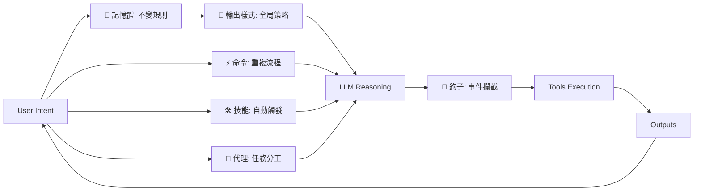

# 六大原語完整對照表和實戰應用指南

**最後更新**: 2025-01-09
**適用範圍**: 所有 AI Copilot IDE 平台
**核心理念**: 不變的規則上收，驗證的機制下放

---

## 🎯 六大原語核心概念

### 一句話總結
**把 AI Copilot IDE 當成「可程式化的助理系統」來設計——先定義用途與輸出契約，再用 記憶體/樣式/技能/命令/代理/鉤子 這六個原語去組裝控制迴路。**

### 控制迴路架構


---

## 📋 六大原語完整對照表

| 原語 | 核心問題 | Claude Code | Cursor | Windsurf | 其他 IDE | 通用概念 |
|------|----------|-------------|---------|----------|----------|----------|
| **🧠 記憶體** | 每次都要遵守的專案規範 | `CLAUDE.md` | `.cursorrules` | `.windsurfrules` | Project Instructions | 常駐上下文 |
| **🎨 輸出樣式** | 讓系統整體換一套人格 | Output Style | System Prompt | Agent Mode | Custom Persona | 全局行為策略 |
| **⚡ 命令** | 把常用流程變成可重複執行 | Slash Commands | Custom Commands | Code Actions | Macro/Templates | 人觸發的模組 |
| **🛠️ 技能** | 讓AI自動在適當時機套用專業流程 | Skills | Auto-triggers | Smart Actions | Context-aware | AI觸發的模組 |
| **👥 代理** | 把任務分工到獨立上下文與工具權限 | Subagents | Chat Modes | Role Switching | Isolated Context | 隔離工作環境 |
| **🔗 鉤子** | 在關鍵事件點跑腳本或做批准/阻擋 | Hooks | Extensions | Event Triggers | Plugins/Scripts | 事件驅動控管 |

---

## 🔧 實戰配置指南

### 階段1: 記憶體建立 (所有專案必須)
```markdown
# CLAUDE.md 基礎模板

## 🏗️ 專案資訊
**專案名稱**: [專案名稱]
**專案類型**: [React SPA/Node.js API/Python Script...]
**開發階段**: [MVP/Production/Maintenance...]

## ⚙️ 技術棧規範
- [主要技術] + [版本要求]
- [必須遵守的編碼標準]
- [禁止使用的技術或模式]

## 🚫 限制與禁止
- ❌ [明確的技術禁令]
- ❌ [安全性要求]
- ❌ [效能底線]

## 🤖 AI 協作規則
### 溝通偏好
- [語言偏好: 繁體中文/英文]
- [輸出風格: 簡潔/詳細/教學式]

### 工作流程
- [每個功能的標準流程]
- [錯誤處理的標準程序]
```

### 階段2: 輸出樣式配置 (依專案性質)
```json
// .claude/output-styles/項目風格.json

// 快速原型模式
{
  "name": "快速原型模式",
  "systemPrompt": "專注於MVP快速實現，優先功能完成度過於代碼完美性。提供簡潔可用的實現方案。"
}

// 企業級開發模式
{
  "name": "企業級開發",
  "systemPrompt": "嚴格遵循企業開發規範，重視代碼品質、安全性、可維護性。每個建議都需考慮長期影響。"
}

// 學習教學模式
{
  "name": "學習教學模式",
  "systemPrompt": "以教學為導向，詳細解釋每個決策的原因，提供多種解決方案的比較。"
}
```

### 階段3: 命令標準化 (常用流程)
```markdown
# .claude/commands/setup.md
---
name: Quick Setup
description: 快速初始化專案環境
---
!npm create vite@latest $1 -- --template react-ts
!cd $1 && npm install
!echo "專案 $1 初始化完成"

# .claude/commands/deploy.md
---
name: Deploy Check
description: 部署前完整檢查
---
!npm run build
!npm run lint
!npm run test
!echo "部署檢查完成，可以發佈"
```

### 階段4: 技能自動化 (專業領域)
```markdown
# .claude/skills/react-expert.md
---
name: React Development Expert
description: 當用戶提到React組件、hooks、狀態管理時自動啟動
tools: [Read, Write, Edit]
---

你是React開發專家，擅長：
1. 設計組件化架構
2. 實現高效的狀態管理
3. 優化性能與用戶體驗
4. 遵循React最佳實務

始終遵循TypeScript最佳實務、使用函式式組件，並提供可維護的代碼。

# .claude/skills/security-auditor.md
---
name: Security Auditor
description: 當提到安全、認證、權限、SQL注入、XSS時自動啟動
tools: [Read, Grep, Bash]
---

你是安全審計專家，專門檢查：
1. 認證與授權漏洞
2. 輸入驗證問題
3. 常見的網路安全威脅
4. 依賴套件的安全風險

對每個安全建議提供具體的修復方案。
```

### 階段5: 代理任務分工 (複雜專案)
```yaml
# .claude/agents/code-reviewer.yaml
name: Code Reviewer
systemPrompt: "你是資深代碼審查專家，專門檢查代碼品質、性能與安全性。"
tools: [Read, Grep, Bash]
context: fork

# .claude/agents/ui-tester.yaml
name: UI Tester
systemPrompt: "你是UI/UX測試專家，專門測試用戶交互、響應式設計與無障礙性。"
tools: [Read, WebFetch, Bash]
context: fork

# .claude/agents/deployment-expert.yaml
name: Deployment Expert
systemPrompt: "你是部署專家，專門處理CI/CD、容器化、雲端部署。"
tools: [Bash, Read, Write]
context: fork
```

### 階段6: 鉤子事件控制 (品質把關)
```json
// .claude/settings.json
{
  "hooks": {
    "PreToolUse": [
      {
        "pattern": "Bash:*rm -rf*|*sudo*|*production*",
        "action": "block",
        "message": "危險操作已阻擋，需要人工確認"
      }
    ],
    "PostToolUse": [
      {
        "pattern": "Edit:*.tsx|*.ts|*.js",
        "command": "npm run lint --silent || echo 'Lint檢查失敗'",
        "onFailure": "warn"
      },
      {
        "pattern": "Write:package.json",
        "prompt": "新增了哪些依賴？請確認安全性。"
      }
    ],
    "Stop": [
      {
        "prompt": "任務完成檢查清單：\n1. 功能是否完整？\n2. 代碼是否通過lint？\n3. 測試是否通過？\n4. 是否需要更新文檔？"
      }
    ]
  }
}
```

---

## 🎯 應用場景指南

### 場景1: 新專案啟動
```bash
# 1分鐘完成原語系統初始化
mkdir .claude
echo "建立記憶體配置..."  # CLAUDE.md
echo "設定輸出樣式..."   # output-styles/
echo "準備常用命令..."   # commands/
echo "配置技能模組..."   # skills/
echo "建立代理系統..."   # agents/
echo "設置安全鉤子..."   # settings.json
```

### 場景2: 加入現有團隊
```bash
# 學習現有原語配置
claude /analyze-project    # 分析專案原語結構
claude /adopt-standards    # 採用團隊標準
claude /sync-primitives    # 同步配置到本地
```

### 場景3: 跨平台遷移
```bash
# Cursor → Claude Code
cursor-rules → CLAUDE.md
extensions → skills/
macros → commands/
```

---

## 🚀 進階應用模式

### 模式1: 原語組合創新
```markdown
# 🧠+🛠️+🔗 組合：智能文檔系統
記憶體規範 + 自動觸發的文檔技能 + PostToolUse鉤子自動更新文檔

# 🎨+👥+⚡ 組合：多風格代碼審查
不同輸出樣式 + 專業審查代理 + 一鍵審查命令

# 全原語組合：企業級 AI 開發系統
6個原語全部整合，形成完整的 AI 協作生態系統
```

### 模式2: 團隊標準化
```markdown
# 團隊共享原語配置
- 統一的 CLAUDE.md 規範
- 標準化的 skills 庫
- 共同的 commands 集合
- 一致的安全 hooks 政策
```

### 模式3: 個人品牌建立
```markdown
# 個人原語簽名系統
- 獨特的輸出樣式設計
- 專業領域的技能庫
- 個人化的工作流命令
- 品質保證的鉤子系統
```

---

## 📊 效果評估指標

### 技術指標
- **配置時間**: < 5分鐘完成基礎設置
- **重複任務自動化率**: > 80%
- **錯誤攔截成功率**: > 95%
- **跨專案配置復用率**: > 70%

### 效率指標
- **開發速度提升**: 3-5倍
- **代碼品質保持**: 維持或改善
- **學習新專案時間**: 減少50%
- **團隊協作一致性**: 顯著提升

### 職涯指標
- **從工具使用者 → 系統架構師**
- **個人技術品牌建立**
- **跨平台原語能力**
- **AI協作領域專業地位**

---

## 🎓 學習路徑建議

### 初學者路徑 (1-2週)
1. 建立第一個 CLAUDE.md
2. 嘗試3-5個基本命令
3. 設置安全鉤子
4. 體驗原語組合的威力

### 進階者路徑 (1個月)
1. 設計自己的技能庫
2. 創建多個專業代理
3. 建立跨專案配置模板
4. 發展個人原語風格

### 專家級路徑 (持續)
1. 創新原語組合模式
2. 貢獻開源原語庫
3. 建立團隊標準化體系
4. 成為原語時代的意見領袖

---

## 💡 最佳實務總結

### 設計原則
- **不變的規則上收**: 專案規範、安全要求放記憶體
- **驗證的機制下放**: 動態檢查用鉤子處理
- **重複的流程固化**: 常用操作做成命令
- **專業的知識模組化**: 領域專長設計成技能
- **複雜的任務分工**: 不同context用代理隔離
- **全局的行為風格化**: 輸出策略統一管理

### 常見陷阱
- ❌ 把所有東西都放在記憶體裡
- ❌ 技能描述太模糊，無法正確觸發
- ❌ 命令設計過於複雜，失去簡潔性
- ❌ 鉤子設置過於嚴格，影響開發效率
- ❌ 代理權限設置不當，造成安全風險

### 成功要素
- ✅ 根據實際需求設計，不追求完美
- ✅ 從簡單開始，逐步演化完善
- ✅ 定期檢討和優化配置
- ✅ 與團隊分享最佳配置
- ✅ 保持學習新原語應用模式

---

**🎯 最終目標**: 掌握六大原語，成為 AI 時代的系統架構師，而非單純的工具使用者。

**🚀 下一步行動**: 選擇一個現有專案，用一小時時間建立完整的六大原語配置，體驗系統化 AI 協作的威力！

---

*© 桑尼資料科學 版權所有，翻譯必究*
*Vibe Coding 課程投影片系統 - 六大原語完整指南 v2.0*