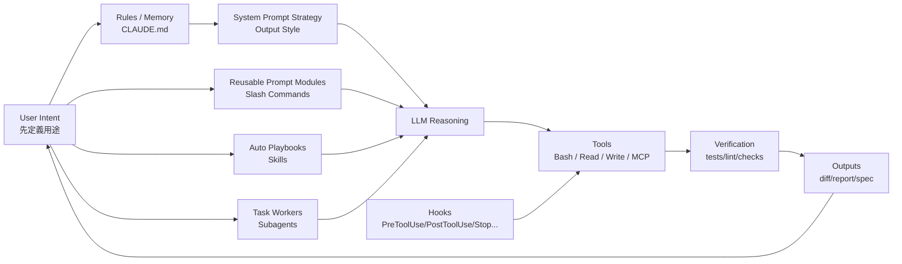

一句話結論：**把 AI Copilot IDE 當成「可程式化的助理系統」來設計——先定義用途與輸出契約，再用 *記憶體/樣式/技能/命令/代理/鉤子* 這幾個原語去組裝控制迴路。**

---

## 0) 第一性原理：所有 AI Copilot IDE 的底層都是同一件事

不管是 Claude Code、Cursor、Copilot、JetBrains AI…你其實都在做這個公式：

> **LLM（會猜） + 工具（會做） + 規則（要守） + 觸發（何時做） + 輸出格式（怎麼講）**

真正能「整合應用」的關鍵不是模型多強，而是你把它**變成可預期的系統**：

* **把不變的要求**放在「永遠會被讀到」的地方
* **把重複流程**變成「一鍵可重現」
* **把風險行為**交給「可攔截/可驗證」的鉤子與腳本
* **把不穩定的推理**變成「有輸出契約的產物」

---

## 1) 先定義用途：你要的是哪一種「幫忙」？

你可以用這個最小分類（夠通用、也夠落地）：

1. **Explain（解釋/教學）**：我要你用固定方式講清楚
2. **Decide（評估/審查）**：我要你做判斷、給結論與依據
3. **Generate（產出）**：我要你產 PRD/SDD/測試/程式碼/文件
4. **Execute（執行）**：我要你跑指令、改檔、驗證、回報結果
5. **Enforce（約束/合規）**：我要你不能做某些事，或必做檢查

> 你會發現：**整合不是「把功能都打開」**，而是「用途 → 選對原語 → 組成控制迴路」。

---

## 2) Claude Code 的六個原語（同時也是泛化到所有 Copilot IDE 的骨架）

下面用 Claude Code 名詞講，但右欄就是你要的「泛化模型」。

| Claude Code 元件                 | 它解決的核心問題                     | 泛化到所有 Copilot IDE 的概念                                                                |
| ------------------------------ | ---------------------------- | ------------------------------------------------------------------------------------ |
| **CLAUDE.md（記憶體）**             | 每次都要遵守的專案規範、常用命令、架構脈絡        | *Project Instructions / Rules file / Team conventions*（常駐上下文） ([code.claude.com][1]) |
| **Output Style（輸出樣式）**         | 讓「系統提示」整體換一套人格/輸出策略          | *System-prompt preset / Mode / Persona*（全局輸出策略） ([code.claude.com][2])               |
| **Skills（技能）**                 | 讓 Claude「自動」在適當時機套用一段專門流程/知識 | *Auto-trigger playbook / latent prompt module*（模型觸發的模組） ([code.claude.com][3])       |
| **Slash Commands（斜線命令）**       | 把常用提示變成可重複、可參數化的命令           | *Prompt macros / Commands palette templates*（人觸發的模組） ([code.claude.com][4])          |
| **Agents / Subagents（代理/子代理）** | 把任務分工到「獨立上下文」與「不同工具權限」       | *Task workers / Modes with isolated context*（隔離上下文的工人） ([code.claude.com][5])        |
| **Hooks（鉤子）**                  | 在關鍵事件點跑腳本或做批准/阻擋決策           | *Event triggers / Guardrails / Policy enforcement*（事件驅動控管） ([code.claude.com][6])    |

---

## 3) 這六個原語怎麼串成「可控系統」？

### 3.1 最穩的設計心法：**「不變的放上層、會變的放下層」**

* **不變（Invariants）**：風格、禁忌、必跑的測試、repo 常用指令
  → 放在 **CLAUDE.md**（啟動自動載入、分層）([code.claude.com][1])
* **全局行為（Global strategy）**：你要它偏教育？偏簡潔？偏協作？
  → 用 **Output Style**（直接改系統提示，且可專案保存）([code.claude.com][2])
* **可重複流程（Reusable flows）**：例如「寫 commit」「review PR」「產 UAT」
  → 用 **Slash Commands**（`.claude/commands/`、支援參數與 bash context）([code.claude.com][4])
* **自動套用的專長（Auto expertise）**：例如「看到 error log 就用固定 debug SOP」
  → 用 **Skills**（模型自己決定何時套用；description 很關鍵）([code.claude.com][3])
* **隔離上下文（Context hygiene）**：例如「code review 不要污染主線對話」
  → 用 **Subagents**（獨立 context window、可控工具權限）([code.claude.com][5])
* **強制與驗證（Determinism）**：例如「改檔後一定跑 lint」「危險 bash 直接擋」
  → 用 **Hooks**（PreToolUse/PostToolUse/Stop…事件點）([code.claude.com][6])

---

## 4) 你要的關聯架構：用「控制迴路」一張圖看穿

這張圖也能直接套到任何 Copilot IDE：

* 有的 IDE 沒有 Hooks？你就用 **pre-commit + CI + file watcher** 自己補「事件點」。
* 沒有 Skills？就用 **命令模板 + 關鍵字路由**，把「自動」改成「半自動」。

---

## 5) 回到 Claude Code：每個元件的「最根本用法」長什麼樣？

### 5.1 CLAUDE.md：把專案變成「可被讀懂的機器」

Claude Code 有分層記憶體位置（企業/專案/使用者…），而且啟動會自動載入，高層優先([code.claude.com][1])。
它還支援 `@path/to/import` 匯入其他檔案，取代過去 `.local` 的用途([code.claude.com][1])。

> 核心用途：**放「不做會死人」的規矩**，以及 build/test/lint 常用命令，避免每次重問。([code.claude.com][1])

---

### 5.2 Output Style：把「輸出策略」升級成系統層

Output styles 會**直接修改 Claude Code 的系統提示**，等於換一套全局行為策略([code.claude.com][2])。
你可以用 `/output-style` 切換，並保存到 `.claude/settings.local.json`（專案級）([code.claude.com][2])；自訂樣式可放在 `~/.claude/output-styles` 或 `.claude/output-styles`([code.claude.com][2])。

> 核心用途：**決定它「怎麼講」與「優先行為」**，例如偏教學、偏協作、偏產出。

---

### 5.3 Skills：讓 Claude「自動套用」你的 SOP

Skills 是 markdown（`SKILL.md` + YAML metadata），Claude 只先載入 name/description，用 description 來判斷要不要啟用，再載入完整內容([code.claude.com][3])。
Skills 有 scope（`~/.claude/skills/` 個人、`.claude/skills/` 專案共享）([code.claude.com][3])，也能限制工具、指定模型、甚至 fork 到子代理 context（`context: fork` + `agent:`）([code.claude.com][3])。

> 核心用途：**把「專家流程」變成自動觸發模組**（例如：Log triage SOP、PR review checklist、SPEC 產生規格）。

---

### 5.4 Slash Commands：把常用流程變「一鍵可重現」

自訂命令放在 `.claude/commands/`（專案共享）([code.claude.com][4])，支援 `$ARGUMENTS` / `$1` 等參數([code.claude.com][4])。
還能在命令裡用 `!` 先跑 bash，把輸出塞進 context（需 `allowed-tools` 允許 Bash pattern）([code.claude.com][4])；也能用 `@` 引入檔案內容([code.claude.com][4])。

> 核心用途：**把「重複流程」固化**，讓你每次跑出來的 context 結構一致（這會大幅降低 LLM 發散）。

---

### 5.5 Subagents：分工 + 隔離上下文 + 權限控制

Subagent 有自己的 context window、可設定允許的 tools、也有獨立 system prompt([code.claude.com][5])。
儲存位置：`.claude/agents/`（專案）或 `~/.claude/agents/`（個人）([code.claude.com][5])。
CLI 也可用 `--agent` 或 `--agents` 動態指定([code.claude.com][7])。

> 核心用途：**把「評審者」「測試跑者」「除錯者」變成工人**，主對話只保留目標與決策。

---

### 5.6 Hooks：把「必做檢查」從 prompt 拉到事件層

Hooks 在 settings files 設定（`~/.claude/settings.json`、`.claude/settings.json`、`.claude/settings.local.json`）([code.claude.com][6])，可針對事件（PreToolUse、PostToolUse、Stop…）掛上 command 或 prompt hook([code.claude.com][6])。
而且 hooks 也能寫在 Skills / Agents / Slash Commands 的 frontmatter，變成「元件生命週期內」的 scoped hooks([code.claude.com][6])。

> 核心用途：**把「必然性」交給腳本/規則，不要拜託模型記得**。模型會忘，hooks 不會。

---

## 6) 你的「先定義用途 → 再思考整合」最小 SOP（可套任何 IDE）

1. **定義輸出契約（Output contract）**

   * 產物是什麼？（PRD / diff / 測試報告 / checklist）
   * 格式長什麼樣？（章節、表格、JSON、Mermaid）
2. **把不變規則上收**

   * 放進 CLAUDE.md / Rules file（含常用命令、禁忌、repo 地圖）([code.claude.com][1])
3. **把重複流程固化**

   * 用 Slash Command：同一套 prompt skeleton + 可參數化([code.claude.com][4])
4. **把專家流程模組化**

   * 用 Skills：自動觸發（description 寫成「使用者會講的話」）([code.claude.com][3])
5. **把風險與驗證下放到事件層**

   * 用 Hooks：PreToolUse 擋危險、PostToolUse 跑 lint/test、Stop 檢查是否完成([code.claude.com][6])
6. **把任務分工隔離**

   * 用 Subagents：review/debug/test 各自 context，不污染主線([code.claude.com][5])

---

## 心法內化（五歲小孩版本）

你可以把它想成：你在養一隻很聰明但會分心的小狗。

* **CLAUDE.md** 是「家規貼在牆上」
* **Output style** 是「今天牠要用哪種語氣說話」
* **Commands** 是「口令：坐下、握手、一鍵流程」
* **Skills** 是「牠學會看到某種情況就自動做對的事」
* **Agents** 是「叫不同專長的小幫手來做事」
* **Hooks** 是「門口的柵欄：危險就擋，做完就檢查」

---

## 口訣記憶（三個重點）

1. **先用途，再原語**（你要它幹嘛，才知道用哪個零件）
2. **規則上收，驗證下放**（CLAUDE.md 放不變；Hooks/腳本做必然）
3. **流程固化，分工隔離**（Commands 讓流程可重現；Agents 讓上下文乾淨）

---

如果你願意，我可以用你常見的 3 個用途（例如：**產規格、做 code review、跑測試修錯**）各寫一套「最小可用」的：

* `CLAUDE.md` 骨架
* 3 個 `/commands`
* 2 個 Skills（含 metadata）
* 1 組 hooks（PreToolUse/PostToolUse/Stop）
  讓你直接貼進 repo 就能跑。

[1]: https://code.claude.com/docs/zh-TW/memory "管理 Claude 的記憶體 - Claude Code Docs"
[2]: https://code.claude.com/docs/zh-TW/output-styles "輸出樣式 - Claude Code Docs"
[3]: https://code.claude.com/docs/en/skills "Agent Skills - Claude Code Docs"
[4]: https://code.claude.com/docs/en/slash-commands "Slash commands - Claude Code Docs"
[5]: https://code.claude.com/docs/en/sub-agents "Subagents - Claude Code Docs"
[6]: https://code.claude.com/docs/en/hooks "Hooks reference - Claude Code Docs"
[7]: https://code.claude.com/docs/en/cli-reference "CLI reference - Claude Code Docs"
